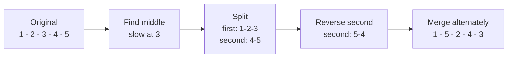

# Reorder List

| Meta | Value |
|------|-------|
| Source | LeetCode #143 |
| Difficulty | Medium (FAANG favorite) |
| Topics | Linked List, Two Pointers, Reversal, Merge |
| Link | https://leetcode.com/problems/reorder-list/ |

---

## Problem Statement
Given the head of a singly linked list $L_0 \rightarrow L_1 \rightarrow \dots \rightarrow L_{n-1} \rightarrow L_n$,
reorder it **in place** to:

$$L_0 \rightarrow L_n \rightarrow L_1 \rightarrow L_{n-1} \rightarrow L_2 \rightarrow L_{n-2} \rightarrow \dots$$

You may not modify the node values — only rearrange the `next` pointers.

**Example**
```
Input:  1 -> 2 -> 3 -> 4 -> 5 -> null
Output: 1 -> 5 -> 2 -> 4 -> 3 -> null

Input:  1 -> 2 -> 3 -> 4 -> null
Output: 1 -> 4 -> 2 -> 3 -> null
```

---

## The Why — Three Classic Sub-Routines

The reorder pattern is exactly: take the **first half in forward order** and weave it with the
**second half in reverse order**. If we had a doubly linked list (or an array of pointers) this
would be trivial with two pointers from both ends. With a singly linked list we cannot walk
backward — so we manufacture that backward walk by physically reversing the second half.

The full algorithm is three well-known building blocks chained together:

1. **Find the middle** with slow/fast pointers (tortoise & hare). After the loop `slow` sits at
   the start of the second half.
2. **Reverse the second half** in place (the three-pointer reversal).
3. **Interleave-merge** the two halves, alternating one node from each.

### Why slow/fast lands on the right middle
`fast` moves 2 steps for every 1 step of `slow`. When `fast` reaches the end, `slow` has covered
half the distance. Using the condition `while fast and fast.next` makes `slow` stop at the
**second** middle for even lengths, which conveniently makes the **first half length ≥ second
half length** — exactly what the interleave merge expects (the first list "leads").

For $n = 5$: halves are `1 -> 2 -> 3` and `4 -> 5`. After reversing the second half it becomes
`5 -> 4`, and merging gives `1 -> 5 -> 2 -> 4 -> 3`. ✔

### Why we must split the link at the middle
Before reversing, we cut `slow.next... ` cleanly by setting the first half's tail `next = null`.
Otherwise the two halves still share nodes and the merge creates a cycle.

---

## Step 1 — Find the Middle (slow / fast)

```python
def find_middle(head):
    slow = fast = head
    while fast and fast.next:   # stop so slow lands on 2nd-half start
        slow = slow.next        # 1 step
        fast = fast.next.next   # 2 steps
    return slow                 # head of the second half
```

```cpp
ListNode* findMiddle(ListNode* head) {
    ListNode* slow = head;
    ListNode* fast = head;
    while (fast && fast->next) {   // stop so slow lands on 2nd-half start
        slow = slow->next;         // 1 step
        fast = fast->next->next;   // 2 steps
    }
    return slow;                   // head of the second half
}
```

---

## Step 2 — Reverse the Second Half

```python
def reverse(head):
    prev = None
    curr = head
    while curr:
        nxt = curr.next     # save next
        curr.next = prev    # flip link backward
        prev = curr         # advance prev
        curr = nxt          # advance curr
    return prev             # new head of reversed list
```

```cpp
ListNode* reverse(ListNode* head) {
    ListNode* prev = nullptr;
    ListNode* curr = head;
    while (curr) {
        ListNode* nxt = curr->next;   // save next
        curr->next = prev;            // flip link backward
        prev = curr;                  // advance prev
        curr = nxt;                   // advance curr
    }
    return prev;                      // new head of reversed list
}
```

---

## Step 3 — Interleave-Merge the Two Halves

The first half `first` is at least as long as the second half `second`. We alternately splice a
node from `second` between consecutive nodes of `first`.

```python
def merge(first, second):
    # first is >= second in length
    while second:
        n1 = first.next      # remember first's continuation
        n2 = second.next     # remember second's continuation
        first.next = second  # first -> second
        second.next = n1     # second -> first's old next
        first = n1           # advance into first half
        second = n2          # advance into second half
```

```cpp
void merge(ListNode* first, ListNode* second) {
    // first is >= second in length
    while (second) {
        ListNode* n1 = first->next;    // remember first's continuation
        ListNode* n2 = second->next;   // remember second's continuation
        first->next = second;          // first -> second
        second->next = n1;             // second -> first's old next
        first = n1;                    // advance into first half
        second = n2;                   // advance into second half
    }
}
```

---

## Full Solution

```python
class ListNode:
    def __init__(self, val=0, next=None):
        self.val = val
        self.next = next

def reorderList(head):
    if not head or not head.next:
        return

    # 1. find middle (slow lands on 2nd-half start)
    slow = fast = head
    while fast and fast.next:
        slow = slow.next
        fast = fast.next.next

    # 2. split and reverse the second half
    second = slow.next
    slow.next = None            # cut the list into two independent halves
    prev = None
    while second:
        nxt = second.next
        second.next = prev
        prev = second
        second = nxt
    second = prev               # head of reversed second half

    # 3. interleave-merge the two halves
    first = head
    while second:
        n1 = first.next
        n2 = second.next
        first.next = second
        second.next = n1
        first = n1
        second = n2
```

```cpp
struct ListNode {
    int val;
    ListNode* next;
    ListNode(int x) : val(x), next(nullptr) {}
};

void reorderList(ListNode* head) {
    if (!head || !head->next) return;

    // 1. find middle (slow lands on 2nd-half start)
    ListNode* slow = head;
    ListNode* fast = head;
    while (fast && fast->next) {
        slow = slow->next;
        fast = fast->next->next;
    }

    // 2. split and reverse the second half
    ListNode* second = slow->next;
    slow->next = nullptr;          // cut the list into two independent halves
    ListNode* prev = nullptr;
    while (second) {
        ListNode* nxt = second->next;
        second->next = prev;
        prev = second;
        second = nxt;
    }
    second = prev;                 // head of reversed second half

    // 3. interleave-merge the two halves
    ListNode* first = head;
    while (second) {
        ListNode* n1 = first->next;
        ListNode* n2 = second->next;
        first->next = second;
        second->next = n1;
        first = n1;
        second = n2;
    }
}
```

---

## Iteration Trace — Merge Phase on `1 -> 2 -> 3 -> 4 -> 5`

After step 1+2 the halves are:
- `first  = 1 -> 2 -> 3 -> null`
- `second = 5 -> 4 -> null`

| Step | `first` | `second` | `n1` | `n2` | Result list so far |
|------|---------|----------|------|------|--------------------|
| start | 1 | 5 | — | — | `1 -> 2 -> 3` , `5 -> 4` |
| 1 | 1 | 5 | 2 | 4 | `1 -> 5 -> 2 -> 3`, then advance |
| 2 | 2 | 4 | 3 | null | `1 -> 5 -> 2 -> 4 -> 3` |
| 3 | 3 | null | — | — | loop ends (`second` is null) |

Final: `1 -> 5 -> 2 -> 4 -> 3 -> null` ✔

---

## Pointer Flow Diagram



---

## Complexity

| Approach | Time | Space |
|----------|------|-------|
| Slow/Fast + Reverse + Merge | $O(n)$ | $O(1)$ |
| Store nodes in array, two-pointer rebuild | $O(n)$ | $O(n)$ |

The optimal approach makes three linear passes — find middle, reverse, merge — so total work is
$3n = O(n)$ with only a handful of pointer variables, giving $O(1)$ extra space.

---

## Takeaway
Reorder List is a **composition problem**: it is not one trick but three canonical linked-list
routines glued together — *find middle (slow/fast)*, *reverse a sublist*, and *interleave merge*.
The two pitfalls that fail interviews are (1) forgetting to **cut** `slow.next = None`, which
leaves the halves sharing nodes and forms a cycle, and (2) using the wrong loop condition so
`slow` lands on the wrong middle for even-length lists. Master these three building blocks
independently and many "hard-looking" linked-list problems collapse into easy combinations.
