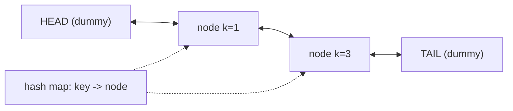

# LRU Cache

| Meta | Value |
|------|-------|
| Source | LeetCode #146 |
| Difficulty | Medium |
| Topics | Hash Map, Doubly Linked List, Design |
| Link | https://leetcode.com/problems/lru-cache/ |

---

## Problem Statement
Design a data structure for a **Least Recently Used (LRU) cache** with capacity `c`, supporting
both operations in **O(1)**:
- `get(key)` — return the value if present (and mark it most-recently used), else `-1`.
- `put(key, value)` — insert/update; if over capacity, **evict the least recently used** entry.

**Example**
```
LRUCache(2)
put(1,1); put(2,2)
get(1) -> 1          // 1 is now most recent; order: [2, 1]
put(3,3)             // capacity full -> evict LRU (key 2); order: [1, 3]
get(2) -> -1         // evicted
```

---

## Why Hash Map + Doubly Linked List

We need two things in O(1):
1. **Lookup by key** → hash map (`key -> node`).
2. **Reorder / evict by recency** → a **doubly linked list** where the head is most-recent and
   the tail is least-recent. Doubly linked because removing an arbitrary node needs O(1) splicing
   (we must reach both neighbors).



- **Access** a node → unlink it and move it right behind HEAD (most-recent).
- **Evict** → remove the node just before TAIL (least-recent) and delete its map entry.

Dummy `HEAD`/`TAIL` sentinels remove all null-edge-case branching.

```python
class Node:
    __slots__ = ('key', 'val', 'prev', 'next')
    def __init__(self, key=0, val=0):
        self.key, self.val = key, val
        self.prev = self.next = None

class LRUCache:
    def __init__(self, capacity):
        self.cap = capacity
        self.map = {}                       # key -> Node
        self.head = Node()                  # dummy most-recent side
        self.tail = Node()                  # dummy least-recent side
        self.head.next = self.tail
        self.tail.prev = self.head

    def _remove(self, node):                # unlink node from list
        node.prev.next = node.next
        node.next.prev = node.prev

    def _insert_front(self, node):          # place right after head (most recent)
        node.next = self.head.next
        node.prev = self.head
        self.head.next.prev = node
        self.head.next = node

    def get(self, key):
        if key not in self.map:
            return -1
        node = self.map[key]
        self._remove(node)                  # move to front
        self._insert_front(node)
        return node.val

    def put(self, key, value):
        if key in self.map:
            self._remove(self.map[key])     # will re-insert at front
        node = Node(key, value)
        self.map[key] = node
        self._insert_front(node)
        if len(self.map) > self.cap:
            lru = self.tail.prev            # least-recently used
            self._remove(lru)
            del self.map[lru.key]
```

```cpp
#include <unordered_map>
using namespace std;

class LRUCache {
    struct Node {
        int key, val;
        Node* prev;
        Node* next;
        Node(int k = 0, int v = 0) : key(k), val(v), prev(nullptr), next(nullptr) {}
    };

    int cap;
    unordered_map<int, Node*> map;          // key -> Node
    Node* head;                             // dummy most-recent side
    Node* tail;                             // dummy least-recent side

    void _remove(Node* node) {              // unlink node from list
        node->prev->next = node->next;
        node->next->prev = node->prev;
    }

    void _insert_front(Node* node) {        // place right after head (most recent)
        node->next = head->next;
        node->prev = head;
        head->next->prev = node;
        head->next = node;
    }

public:
    LRUCache(int capacity) : cap(capacity) {
        head = new Node();                  // dummy most-recent side
        tail = new Node();                  // dummy least-recent side
        head->next = tail;
        tail->prev = head;
    }

    int get(int key) {
        if (map.find(key) == map.end())
            return -1;
        Node* node = map[key];
        _remove(node);                      // move to front
        _insert_front(node);
        return node->val;
    }

    void put(int key, int value) {
        if (map.find(key) != map.end())
            _remove(map[key]);              // will re-insert at front
        Node* node = new Node(key, value);
        map[key] = node;
        _insert_front(node);
        if ((int)map.size() > cap) {
            Node* lru = tail->prev;         // least-recently used
            _remove(lru);
            map.erase(lru->key);
            delete lru;
        }
    }
};
```

---

## Trace — capacity 2

| Operation | List (head→tail) | Map keys | Result |
|-----------|------------------|----------|--------|
| put(1,1) | [1] | {1} | — |
| put(2,2) | [2, 1] | {1,2} | — |
| get(1) | [1, 2] | {1,2} | **1** (moved to front) |
| put(3,3) | [3, 1] | {1,3} | evict key 2 (was tail) |
| get(2) | [3, 1] | {1,3} | **−1** |
| put(4,4) | [4, 3] | {3,4} | evict key 1 |
| get(1) | [4, 3] | {3,4} | **−1** |
| get(3) | [3, 4] | {3,4} | **3** |
| get(4) | [4, 3] | {3,4} | **4** |

Every access splices the touched node to the front; every overflow removes the node before TAIL.

---

## Complexity

| Operation | Time | Space |
|-----------|------|-------|
| get | O(1) | — |
| put | O(1) | — |
| Total structure | — | O(capacity) |

---

## Alternatives & Notes
- **`collections.OrderedDict`** gives the same behavior with `move_to_end` / `popitem(last=False)`
  — fewer lines, but the explicit DLL version shows what's happening underneath (and is what
  interviewers usually want).
- **LFU Cache** (LeetCode 460) extends this with frequency buckets, each a DLL.

## Takeaway
LRU = **hash map for O(1) lookup** + **doubly linked list for O(1) recency reordering/eviction**.
Dummy head/tail sentinels eliminate edge cases. This hash-map-plus-linked-list combo is a
recurring design pattern (LFU, insertion-order maps, MRU caches).
