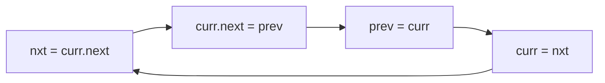

# Reverse Linked List

| Meta | Value |
|------|-------|
| Source | LeetCode #206 |
| Difficulty | Easy (fundamental) |
| Topics | Linked List, Recursion, Two Pointers |
| Link | https://leetcode.com/problems/reverse-linked-list/ |

---

## Problem Statement
Reverse a singly linked list and return the new head.

**Example**
```
Input:  1 -> 2 -> 3 -> 4 -> 5 -> null
Output: 5 -> 4 -> 3 -> 2 -> 1 -> null
```

---

## Iterative — Three Pointers, O(1) Space

We walk the list once, flipping each node's `next` pointer to point **backward**. Three
pointers keep us from losing the chain:
- `prev` — the already-reversed portion's head (starts `null`).
- `curr` — the node we're currently flipping.
- `nxt`  — saved reference to `curr.next` **before** we overwrite it.

### The critical ordering
Before doing `curr.next = prev`, we MUST save `curr.next` into `nxt`; otherwise we lose the rest
of the list forever.

```python
def reverse_list(head):
    prev = None
    curr = head
    while curr:
        nxt = curr.next      # 1. save next
        curr.next = prev     # 2. reverse the link
        prev = curr          # 3. advance prev
        curr = nxt           # 4. advance curr
    return prev              # prev is the new head
```

```cpp
ListNode* reverseList(ListNode* head) {
    ListNode* prev = nullptr;
    ListNode* curr = head;
    while (curr) {
        ListNode* nxt = curr->next;   // 1. save next
        curr->next = prev;            // 2. reverse the link
        prev = curr;                  // 3. advance prev
        curr = nxt;                   // 4. advance curr
    }
    return prev;                      // prev is the new head
}
```



---

## Iteration Trace — `1 -> 2 -> 3 -> null`

| step | prev | curr | nxt | list state |
|------|------|------|-----|-----------|
| init | null | 1 | — | 1→2→3 |
| 1 | 1 | 2 | 2 | 1→null, 2→3 (prev chain: 1→null) |
| 2 | 2 | 3 | 3 | 2→1→null, curr=3 |
| 3 | 3 | null | null | 3→2→1→null |

Loop ends (`curr == null`); return `prev = 3`. Final: `3 -> 2 -> 1 -> null`. ✓

Watch how `prev` accumulates the reversed list one node at a time, while `curr` consumes the
original list from the front.

---

## Recursive — O(n) Space

Recurse to the end, then rewire on the way back up.

```python
def reverse_list_rec(head):
    if head is None or head.next is None:
        return head                  # base: empty or last node = new head
    new_head = reverse_list_rec(head.next)
    head.next.next = head            # make the next node point back to us
    head.next = None                 # sever our old forward link
    return new_head
```

```cpp
ListNode* reverseListRec(ListNode* head) {
    if (head == nullptr || head->next == nullptr)
        return head;                 // base: empty or last node = new head
    ListNode* new_head = reverseListRec(head->next);
    head->next->next = head;         // make the next node point back to us
    head->next = nullptr;            // sever our old forward link
    return new_head;
}
```

### How the recursion rewires
At each frame, `head.next` is the node *after* us. After the recursive call has reversed
everything beyond, we set `head.next.next = head` (next node now points back) and
`head.next = None`. The deepest call returns the original tail, which bubbles up as the new head.

```
reverse(1->2->3):
  reverse(2->3):
    reverse(3) -> returns 3 (base)
    3.next = 2 ; 2.next = null   => 3->2
  returns 3
  2.next = 1 ; 1.next = null     => 3->2->1
returns 3
```

---

## Complexity

| Approach | Time | Space |
|----------|------|-------|
| **Iterative** | O(n) | **O(1)** |
| Recursive | O(n) | O(n) (call stack) |

Prefer iterative in interviews — O(1) space and no stack-overflow risk on long lists.

---

## Edge Cases
- Empty list (`head == null`) → return `null`.
- Single node → returns itself unchanged.

## Takeaway
The **three-pointer reversal** is the single most important linked-list manipulation. It's a
building block for *reverse in k-groups*, *palindrome list checking*, and *reorder list*. Memorize
the save-next-before-rewire ordering.
