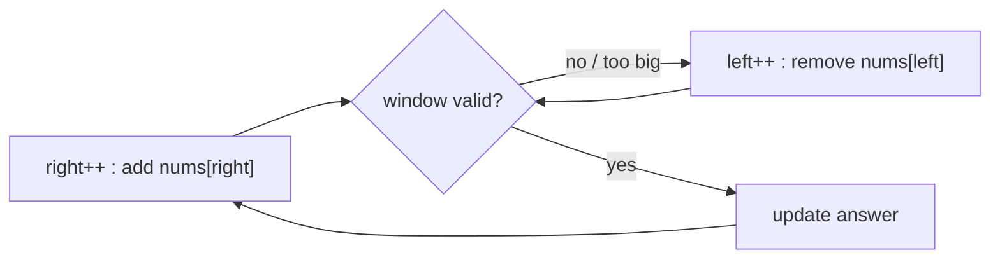

# Sliding Window — Complete Guide (Beginner → Advanced)

> The sliding window turns problems about **contiguous subarrays/substrings** from O(n²) (or
> worse) into O(n) by reusing work as a window expands and contracts.

---

## Table of Contents
1. [The Core Idea](#1-the-core-idea)
2. [Fixed-Size Window](#2-fixed-size-window)
3. [Variable-Size Window](#3-variable-size-window)
4. [The General Template](#4-the-general-template)
5. [When Sliding Window Applies](#5-when-sliding-window-applies)
6. [Advanced: Monotonic Deque Windows](#6-advanced-monotonic-deque-windows)
7. [Cheat Sheet](#7-cheat-sheet)

---

## 1. The Core Idea

A "window" is a contiguous range `[left, right]`. Instead of recomputing a property (sum,
count, distinct chars) for every subarray from scratch, we **incrementally update** it as the
window's edges move:

- **Expand** (move `right`): add the new element's contribution.
- **Contract** (move `left`): remove the old element's contribution.

Because each element enters the window once and leaves once, the pointers each travel at most
`n` steps → **O(n)** total.



---

## 2. Fixed-Size Window

The window length `k` is constant. Slide it one step at a time, adding the entering element and
subtracting the leaving one.

**Max sum of any subarray of size k:**
```python
def max_sum_k(nums, k):
    window = sum(nums[:k])
    best = window
    for right in range(k, len(nums)):
        window += nums[right] - nums[right - k]   # add new, drop old
        best = max(best, window)
    return best
```

```cpp
long long max_sum_k(const vector<long long>& nums, int k) {
    long long window = 0;
    for (int i = 0; i < k; ++i) window += nums[i];   // first window
    long long best = window;
    for (int right = k; right < (int)nums.size(); ++right) {
        window += nums[right] - nums[right - k];     // add new, drop old
        best = max(best, window);
    }
    return best;
}
```

The `+ nums[right] - nums[right-k]` update is O(1) — no re-summing the whole window.

---

## 3. Variable-Size Window

The window grows and shrinks based on a **constraint** (sum ≤ target, ≤ k distinct chars, no
repeats). Typically:
1. Expand `right` to include more.
2. While the window **violates** the constraint, contract `left`.
3. Record the best valid window.

**Longest substring without repeating characters:**
```python
def longest_unique(s):
    seen = {}              # char -> last index
    left = 0
    best = 0
    for right, c in enumerate(s):
        if c in seen and seen[c] >= left:
            left = seen[c] + 1      # jump left past the duplicate
        seen[c] = right
        best = max(best, right - left + 1)
    return best
```

```cpp
int longest_unique(const string& s) {
    unordered_map<char, int> seen;     // char -> last index
    int left = 0;
    int best = 0;
    for (int right = 0; right < (int)s.size(); ++right) {
        char c = s[right];
        auto it = seen.find(c);
        if (it != seen.end() && it->second >= left)
            left = it->second + 1;     // jump left past the duplicate
        seen[c] = right;
        best = max(best, right - left + 1);
    }
    return best;
}
```

---

## 4. The General Template

```python
def sliding_window(s):
    left = 0
    state = init_state()
    answer = init_answer()
    for right in range(len(s)):
        add s[right] to state               # expand
        while window_is_invalid(state):
            remove s[left] from state        # contract
            left += 1
        answer = update(answer, right - left + 1)
    return answer
```

```cpp
int sliding_window(const string& s) {
    int left = 0;
    State state = init_state();
    int answer = init_answer();
    for (int right = 0; right < (int)s.size(); ++right) {
        add s[right] to state;               // expand
        while (window_is_invalid(state)) {
            remove s[left] from state;       // contract
            left += 1;
        }
        answer = update(answer, right - left + 1);
    }
    return answer;
}
```

The two questions that define any sliding-window problem:
1. **What state** summarizes the window? (running sum, char counts, distinct count…)
2. **What makes the window invalid**, triggering contraction?

---

## 5. When Sliding Window Applies

✅ Works when:
- You want a **contiguous** subarray/substring.
- The validity is **monotonic**: if a window is valid, any smaller window inside it is also
  valid (or vice-versa). This guarantees `left` only moves forward.

❌ Does **not** work when negatives break monotonicity (e.g. "subarray sum = k" with negatives
→ use prefix-sum + hash instead).

### Monotonicity, formally
For "longest window with sum ≤ T" on **non-negative** numbers: extending the window can only
*increase* the sum, so once it exceeds `T` we must shrink. Removing from the left only
*decreases* the sum. This monotonic behavior is what lets `left` advance without backtracking.

---

## 6. Advanced: Monotonic Deque Windows

For **sliding window maximum/minimum**, maintain a **deque of indices** whose values are
monotonic. The front always holds the current extreme. Each index is pushed and popped once →
O(n) for the whole sweep (see the problem file).

```
Maintain decreasing deque -> front = window maximum
On new element, pop smaller tails; pop front if it left the window.
```

---

## 7. Cheat Sheet

```
Fixed window:    add entering, subtract leaving; O(1) update per slide
Variable window: expand right; while invalid, shrink left; track best
State options:   running sum, hash-map counts, distinct counter, deque
Applies when:    contiguous range + monotonic validity
Does NOT apply:  non-monotonic (negatives) -> prefix sum + hash

Time:  O(n)   Space: O(1) or O(k) for the state
```

> **Mental model:** A caterpillar crawling along the array — its head (right) reaches forward,
> its tail (left) catches up only when needed. Each cell is touched twice at most.
