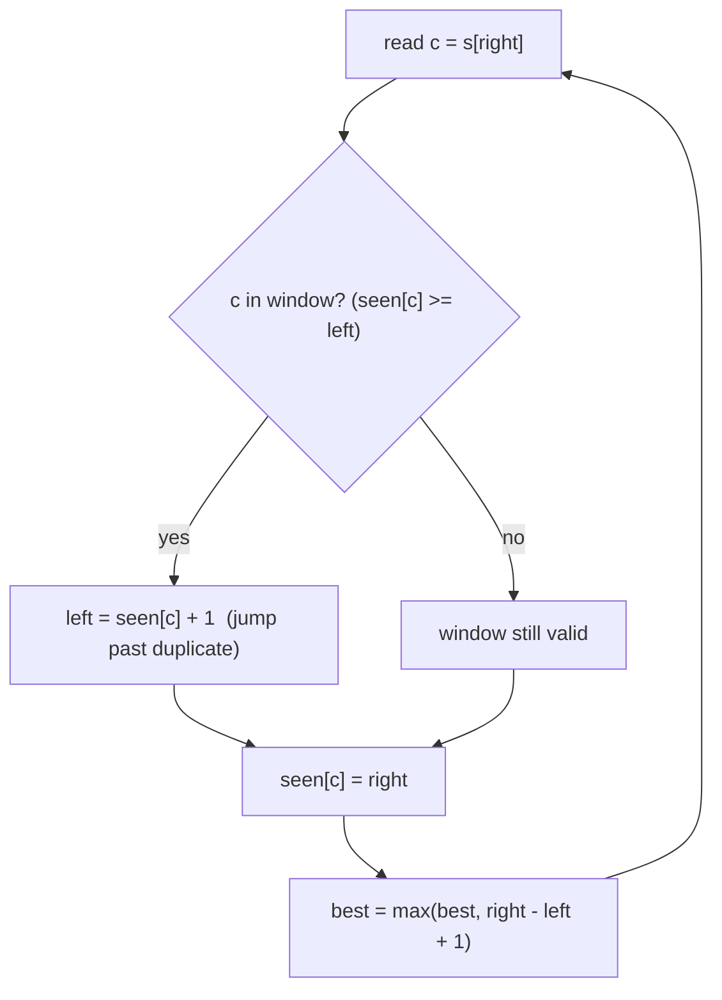

# Longest Substring Without Repeating Characters

| Meta | Value |
|------|-------|
| Source | LeetCode #3 |
| Difficulty | Medium |
| Topics | Sliding Window, Hash Map, String |
| Link | https://leetcode.com/problems/longest-substring-without-repeating-characters/ |

---

## Problem Statement
Given a string `s`, find the length of the **longest substring** without repeating characters.

**Example**
```
Input:  s = "abcabcbb"
Output: 3        // "abc"
```

---

## Approach — Variable Sliding Window

Maintain a window `[left, right]` that always contains **distinct** characters. Expand `right`
one character at a time. When the incoming character is already inside the window, slide `left`
forward to just past its previous occurrence, restoring the no-repeat invariant.

We store each character's **last seen index** in a hash map so the jump is O(1).



---

## Code

```python
def length_of_longest_substring(s):
    seen = {}            # char -> most recent index
    left = 0
    best = 0
    for right, c in enumerate(s):
        if c in seen and seen[c] >= left:
            left = seen[c] + 1        # shrink window past the repeat
        seen[c] = right               # update last-seen
        best = max(best, right - left + 1)
    return best
```

```cpp
int length_of_longest_substring(const string& s) {
    unordered_map<char, int> seen;    // char -> most recent index
    int left = 0;
    int best = 0;
    for (int right = 0; right < (int)s.size(); ++right) {
        char c = s[right];
        auto it = seen.find(c);
        if (it != seen.end() && it->second >= left)
            left = it->second + 1;    // shrink window past the repeat
        seen[c] = right;              // update last-seen
        best = max(best, right - left + 1);
    }
    return best;
}
```

### The crucial `seen[c] >= left` check
A character may exist in the map from *before* the current window. We only treat it as a repeat
if its last index is **inside** the current window (`>= left`). Otherwise it's stale and
ignored.

---

## Iteration Trace — `s = "abcabcbb"`

| right | c | seen[c] (prev) | inside window? | left | window | length | best |
|-------|---|----------------|----------------|------|--------|--------|------|
| 0 | a | — | no | 0 | "a" | 1 | 1 |
| 1 | b | — | no | 0 | "ab" | 2 | 2 |
| 2 | c | — | no | 0 | "abc" | 3 | 3 |
| 3 | a | 0 | yes (0≥0) | 1 | "bca" | 3 | 3 |
| 4 | b | 1 | yes (1≥1) | 2 | "cab" | 3 | 3 |
| 5 | c | 2 | yes (2≥2) | 3 | "abc" | 3 | 3 |
| 6 | b | 4 | yes (4≥3) | 5 | "cb" | 2 | 3 |
| 7 | b | 6 | yes (6≥5) | 7 | "b" | 1 | 3 |

Answer = **3**.

Watch `left` jump at right=3: `a` was last at index 0, which is ≥ left(0), so we move
`left = 1`, dropping the old `a` and keeping the window repeat-free.

---

## Complexity

| Approach | Time | Space |
|----------|------|-------|
| Brute force (check all substrings) | O(n³) | O(n) |
| Sliding window + set (step left by 1) | O(n) (each char in/out once) | O(min(n, alphabet)) |
| **Sliding window + last-index map (jump)** | **O(n)** | O(min(n, alphabet)) |

Both windowed versions are O(n); the last-index map lets `left` *jump* instead of stepping,
which is slightly faster in practice.

---

## Edge Cases
- Empty string → 0.
- All identical (`"bbbb"`) → 1.
- All distinct (`"abcdef"`) → full length.

## Takeaway
This is the archetypal **variable-size sliding window**: expand to include, shrink to restore an
invariant ("all distinct"), track the best width. The "last seen index" map is a recurring
optimization for jump-on-duplicate windows.
