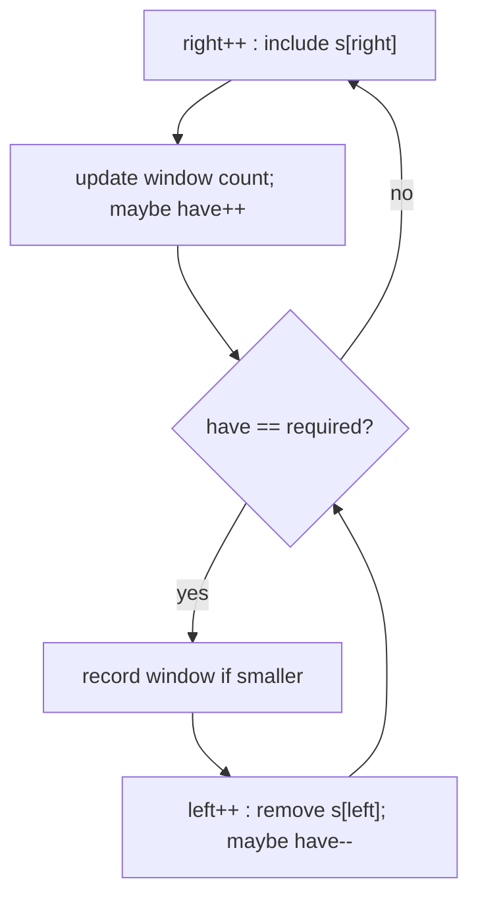

# Minimum Window Substring

| Meta | Value |
|------|-------|
| Source | LeetCode #76 |
| Difficulty | Hard |
| Topics | Sliding Window, Hash Map, String |
| Link | https://leetcode.com/problems/minimum-window-substring/ |

---

## Problem Statement
Given strings `s` and `t`, return the **smallest substring** of `s` that contains every
character of `t` (including multiplicities). If none exists, return `""`.

**Example**
```
Input:  s = "ADOBECODEBANC", t = "ABC"
Output: "BANC"
```

---

## Strategy — Expand to Satisfy, Contract to Minimize

This is a variable window with a twist: we grow `right` until the window contains all required
characters, then shrink `left` as much as possible while still valid, recording the smallest
such window. Repeat.

### State
- `need`: frequency map of characters required by `t`.
- `have`: how many *distinct* required characters are currently satisfied (count met).
- `required = len(need)`: number of distinct chars we must satisfy.

When `have == required`, the window is **valid** — try to shrink.



---

## Code

```python
from collections import Counter

def min_window(s, t):
    if not s or not t:
        return ""
    need = Counter(t)
    required = len(need)          # distinct chars to satisfy
    window = {}
    have = 0
    best_len = float('inf')
    best = (0, 0)
    left = 0
    for right, c in enumerate(s):
        window[c] = window.get(c, 0) + 1
        if c in need and window[c] == need[c]:
            have += 1             # this char fully satisfied
        while have == required:   # valid -> try to shrink
            if right - left + 1 < best_len:
                best_len = right - left + 1
                best = (left, right)
            lc = s[left]
            window[lc] -= 1
            if lc in need and window[lc] < need[lc]:
                have -= 1         # broke satisfaction for lc
            left += 1
    l, r = best
    return s[l:r + 1] if best_len != float('inf') else ""
```

```cpp
string min_window(const string& s, const string& t) {
    if (s.empty() || t.empty())
        return "";
    unordered_map<char, int> need;
    for (char c : t) need[c]++;
    int required = (int)need.size();      // distinct chars to satisfy
    unordered_map<char, int> window;
    int have = 0;
    int best_len = INT_MAX;
    int best_l = 0, best_r = 0;
    int left = 0;
    for (int right = 0; right < (int)s.size(); ++right) {
        char c = s[right];
        window[c]++;
        if (need.count(c) && window[c] == need[c])
            have += 1;                    // this char fully satisfied
        while (have == required) {         // valid -> try to shrink
            if (right - left + 1 < best_len) {
                best_len = right - left + 1;
                best_l = left;
                best_r = right;
            }
            char lc = s[left];
            window[lc]--;
            if (need.count(lc) && window[lc] < need[lc])
                have -= 1;                // broke satisfaction for lc
            left += 1;
        }
    }
    return best_len != INT_MAX ? s.substr(best_l, best_r - best_l + 1) : "";
}
```

---

## Iteration Highlights — `s = "ADOBECODEBANC"`, `t = "ABC"`

`need = {A:1, B:1, C:1}`, `required = 3`.

| step | window range | substring | have | action |
|------|--------------|-----------|------|--------|
| right reaches first C (idx 5) | [0,5] | "ADOBEC" | 3 | valid → record len 6; shrink left to 'D' (idx1) until invalid |
| expand to idx 10 ('A') | [1,10] | "DOBECODEBA" → valid windows | 3 | shrink → "ODEBANC"? record smaller |
| right reaches C (idx 12) | [9,12] | "BANC" | 3 | valid → record **len 4** (new best) |

The algorithm finds `"ADOBEC"` (6), then improves to `"BANC"` (4). Final answer **"BANC"**.

### Why `have` counts distinct, not total
Incrementing `have` only when `window[c] == need[c]` (exact match) ensures we count each
required character's satisfaction **once**. Over-counting a character (e.g. extra 'A') doesn't
bump `have` again, and dropping below `need` decrements it — keeping `have == required`
equivalent to "window covers all of `t`."

---

## Complexity

| Metric | Value |
|--------|-------|
| Time   | O(\|s\| + \|t\|) — each character of `s` enters and leaves the window once |
| Space  | O(\|t\| + alphabet) for the maps |

Even though there's a nested `while`, `left` only ever moves forward across the whole string, so
total left-moves ≤ `|s|`. Hence linear, not quadratic.

---

## Edge Cases
- `t` longer than `s`, or impossible to cover → `""`.
- Duplicate chars in `t` (`t = "AABC"`) → multiplicities handled by exact-count comparison.

## Takeaway
The **"expand to become valid, contract to optimize"** template solves minimum-window problems.
The key engineering detail is an O(1) validity check via the `have == required` counter rather
than re-scanning the window each time.
