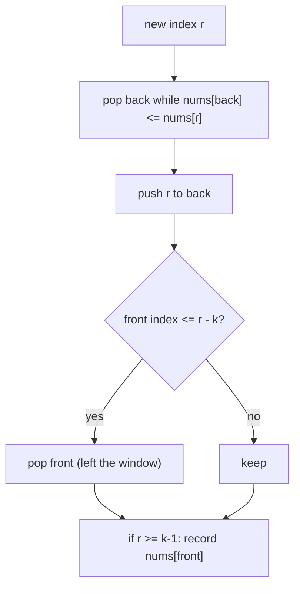

# Sliding Window Maximum

| Meta | Value |
|------|-------|
| Source | LeetCode #239 |
| Difficulty | Hard |
| Topics | Sliding Window, Monotonic Deque, Heap |
| Link | https://leetcode.com/problems/sliding-window-maximum/ |

---

## Problem Statement
Given `nums` and window size `k`, return an array of the **maximum** of each contiguous window
of size `k` as it slides from left to right.

**Example**
```
Input:  nums = [1,3,-1,-3,5,3,6,7], k = 3
Output: [3, 3, 5, 5, 6, 7]
```

```
[1  3  -1] -3  5  3  6  7   -> 3
 1 [3  -1  -3] 5  3  6  7   -> 3
 1  3 [-1  -3  5] 3  6  7   -> 5
 ...                        -> 5, 6, 7
```

---

## Why Not Just Re-scan or Use a Heap?

- **Re-scan each window:** O(n·k). Too slow.
- **Max-heap of (value, index):** O(n log k) — works, lazily discard out-of-window entries.
- **Monotonic deque:** **O(n)** — optimal, the intended solution.

---

## Monotonic Deque — O(n)

Keep a **deque of indices** whose corresponding values are in **decreasing** order. Then:
- The **front** of the deque is always the index of the current window's maximum.
- Before adding a new index, pop all **smaller** values from the back — they can never be the
  max while the new larger element is in the window.
- Pop the **front** if it has slid out of the window (`index <= right - k`).



---

## Code

```python
from collections import deque

def max_sliding_window(nums, k):
    dq = deque()         # holds indices, values decreasing front->back
    res = []
    for r, x in enumerate(nums):
        # 1. maintain decreasing order: pop smaller tail values
        while dq and nums[dq[-1]] <= x:
            dq.pop()
        dq.append(r)
        # 2. drop front if it's outside the window
        if dq[0] <= r - k:
            dq.popleft()
        # 3. record max once first window is complete
        if r >= k - 1:
            res.append(nums[dq[0]])
    return res
```

```cpp
vector<int> max_sliding_window(const vector<int>& nums, int k) {
    deque<int> dq;       // holds indices, values decreasing front->back
    vector<int> res;
    for (int r = 0; r < (int)nums.size(); ++r) {
        int x = nums[r];
        // 1. maintain decreasing order: pop smaller tail values
        while (!dq.empty() && nums[dq.back()] <= x)
            dq.pop_back();
        dq.push_back(r);
        // 2. drop front if it's outside the window
        if (dq.front() <= r - k)
            dq.pop_front();
        // 3. record max once first window is complete
        if (r >= k - 1)
            res.push_back(nums[dq.front()]);
    }
    return res;
}
```

---

## Iteration Trace — `nums = [1,3,-1,-3,5,3,6,7]`, `k = 3`

| r | x | pop tail (≤ x) | deque (indices→vals) | drop front? | record |
|---|----|----------------|----------------------|-------------|--------|
| 0 | 1  | — | [0→1] | no | — (window incomplete) |
| 1 | 3  | pop 0(1) | [1→3] | no | — |
| 2 | -1 | — | [1→3, 2→-1] | no | nums[1]=**3** |
| 3 | -3 | — | [1→3, 2→-1, 3→-3] | front 1 ≤ 0? no | nums[1]=**3** |
| 4 | 5  | pop 3,2,1 (all ≤5) | [4→5] | no | nums[4]=**5** |
| 5 | 3  | — | [4→5, 5→3] | no | nums[4]=**5** |
| 6 | 6  | pop 5(3),4(5) | [6→6] | no | nums[6]=**6** |
| 7 | 7  | pop 6(6) | [7→7] | no | nums[7]=**7** |

Output: `[3, 3, 5, 5, 6, 7]` ✓

Notice at r=4 the value 5 evicts the entire deque — every earlier element is smaller and now
useless, because 5 will dominate as long as it's in any window.

---

## Why It's O(n)

Each index is **pushed exactly once** and **popped at most once** across the whole run. The
inner `while` loop's total iterations over the entire algorithm is bounded by `n`. So despite
the nested loop, the amortized cost is **O(n)**.

$$
\text{total pushes} + \text{total pops} \le 2n = O(n)
$$

---

## Complexity

| Approach | Time | Space |
|----------|------|-------|
| Re-scan | O(n·k) | O(1) |
| Max-heap | O(n log k) | O(k) |
| **Monotonic deque** | **O(n)** | O(k) |

## Takeaway
A **monotonic deque** maintains "candidates that could still be the answer" in sorted order,
discarding dominated elements immediately. This pattern also solves "shortest subarray with sum
≥ K" and many DP-with-window optimizations.
