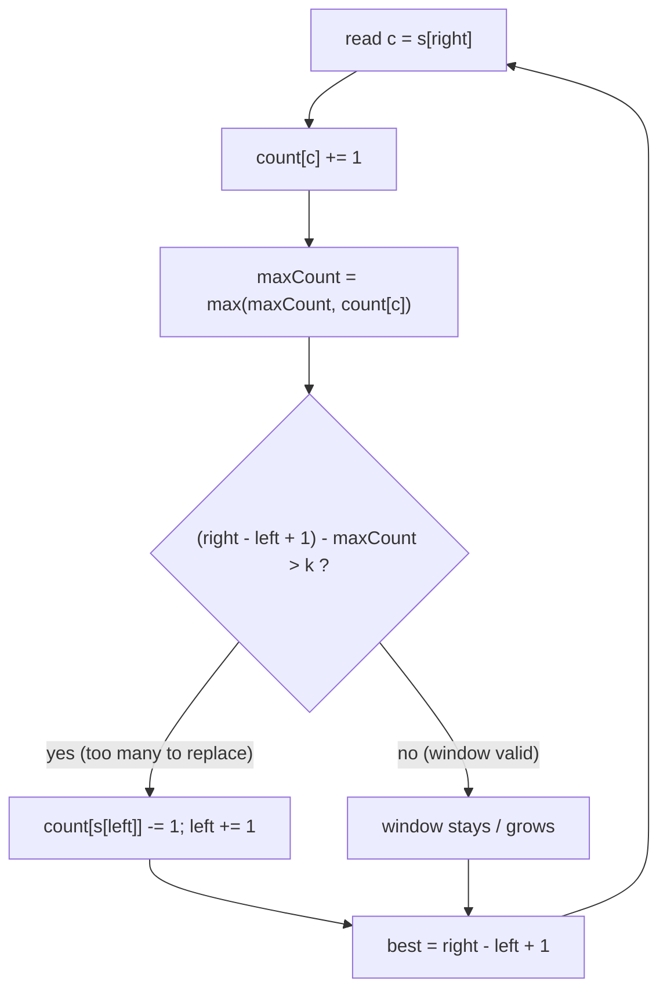

# Longest Repeating Character Replacement

| Meta | Value |
|------|-------|
| Source | LeetCode #424 |
| Difficulty | Medium |
| Topics | Sliding Window, Hash Map / Frequency Array, String, Greedy |
| Link | https://leetcode.com/problems/longest-repeating-character-replacement/ |

---

## Problem Statement

You are given a string `s` (uppercase English letters) and an integer `k`. You may choose **at
most `k`** characters in the string and replace each of them with **any** uppercase English
letter. Return the length of the **longest substring** containing the **same letter** you can
obtain after performing at most `k` replacements.

**Example**
```
Input:  s = "AABABBA", k = 1
Output: 4

Explanation:
  Take the window "ABBA" (indices 3..6 also work; here indices 0..3 -> "AABA").
  Best concrete window: "AABA" -> replace the single 'B' (k = 1) -> "AAAA"  => length 4.
  You cannot get length 5: "AABAB" has 3 A's and 2 B's; to make all equal you must
  replace 2 characters, but k = 1.
```

---

## Approach — Variable Sliding Window + Most-Frequent Count

Slide a window `[left, right]` over `s`, keeping a frequency array `count[26]` of the letters
inside the window. Let `window_len = right - left + 1` and let `maxCount` be the frequency of
the **most common** letter currently in the window.

### The validity invariant

A window can be turned into one repeated letter (keeping the majority letter and replacing the
rest) using exactly `window_len - maxCount` replacements. So the window is **valid** iff:

$$\text{window\_len} - \text{maxCount} \le k$$

That is, the number of "minority" characters we must overwrite never exceeds the budget `k`.
We always keep the most frequent letter and replace the others, which is optimal — replacing the
majority letter could only increase the work.

We expand `right` every step. If the window becomes invalid
($\text{window\_len} - \text{maxCount} > k$) we advance `left` by one to shrink it back.

### Why we never need to *recompute / shrink* `maxCount`

This is the famous subtle insight. `maxCount` is allowed to be **stale** — it may be larger than
the true max frequency after we slide `left`. That is fine and does **not** break correctness:

- The answer we care about is the **largest valid window ever seen**.
- A window only grows the answer when it gets **longer**. For a *longer* window to be valid, it
  must contain a letter with frequency **strictly greater** than the previous `maxCount`.
- So `maxCount` only ever needs to increase to unlock a bigger answer. If it is stale-high, the
  validity test $\text{window\_len} - \text{maxCount} \le k$ simply keeps the window the same
  size (we slide `left` and `right` together), never reporting a wrong, larger length.

Because the window length is monotonic non-decreasing, the final answer equals the maximum window
length reached, which we can read directly as `right - left + 1`.



---

## Code

```python
def character_replacement(s: str, k: int) -> int:
    count = [0] * 26          # frequency of each letter in the current window
    left = 0
    max_count = 0             # freq of the most common letter seen (may be stale)
    best = 0
    for right, ch in enumerate(s):
        idx = ord(ch) - ord('A')
        count[idx] += 1                       # add incoming char
        max_count = max(max_count, count[idx])  # update running majority count
        # window invalid: more than k chars would need replacing -> shrink by one
        if (right - left + 1) - max_count > k:
            count[ord(s[left]) - ord('A')] -= 1   # drop the left char
            left += 1                              # slide left forward
        # window is valid here; its length is a candidate answer
        best = max(best, right - left + 1)
    return best
```

```cpp
int characterReplacement(const string& s, int k) {
    vector<int> count(26, 0);     // frequency of each letter in the current window
    int left = 0;
    int maxCount = 0;             // freq of the most common letter seen (may be stale)
    int best = 0;
    for (int right = 0; right < (int)s.size(); ++right) {
        int idx = s[right] - 'A';
        count[idx] += 1;                            // add incoming char
        maxCount = max(maxCount, count[idx]);       // update running majority count
        // window invalid: more than k chars would need replacing -> shrink by one
        if ((right - left + 1) - maxCount > k) {
            count[s[left] - 'A'] -= 1;              // drop the left char
            left += 1;                              // slide left forward
        }
        // window is valid here; its length is a candidate answer
        best = max(best, right - left + 1);
    }
    return best;
}
```

Note both versions use a single `if` (not a `while`) to shrink. Because the window can grow by at
most one per step, it only ever needs to slide by one to stay valid — keeping the loop strictly
O(n).

---

## Iteration Trace

Tracing `s = "AABABBA"`, `k = 1`. `len = right - left + 1`, `need = len - maxCount`.

| right | ch | left | count(A,B) | maxCount | len | need = len-maxCount | shrink? | best |
|-------|----|------|-----------|----------|-----|---------------------|---------|------|
| 0 | A | 0 | (1,0) | 1 | 1 | 0 | no | 1 |
| 1 | A | 0 | (2,0) | 2 | 2 | 0 | no | 2 |
| 2 | B | 0 | (2,1) | 2 | 3 | 1 | no (1 ≤ 1) | 3 |
| 3 | A | 0 | (3,1) | 3 | 4 | 1 | no (1 ≤ 1) | 4 |
| 4 | B | 0 | (3,2) | 3 | 5 | 2 | yes → left=1, drop A → (2,2) | 4 |
| 5 | B | 1 | (2,3) | 3 | 5 | 2 | yes → left=2, drop A → (1,3) | 4 |
| 6 | A | 2 | (2,3) | 3 | 5 | 2 | yes → left=3, drop B → (2,2)... | 4 |

Final answer: **4**. Notice `maxCount` stays at 3 even after the true window max drops — the stale
value never inflates `best` because the window length stops growing.

---

## Complexity

| Approach | Time | Space |
|----------|------|-------|
| Sliding window + freq array | $O(n)$ | $O(1)$ — fixed `count[26]` |

Each index is visited by `right` once and by `left` at most once, so total work is linear. The
frequency table is a constant 26 slots regardless of input size.

---

## Takeaway

- The window is valid exactly when $\text{window\_len} - \text{maxCount} \le k$: keep the most
  frequent letter, replace the rest, and that must fit the budget `k`.
- You **never** need to recompute `maxCount` after shrinking. A stale-high `maxCount` only blocks
  the window from growing — it can never produce a falsely larger answer, because a longer valid
  window requires a genuinely higher frequency.
- Using a single `if` to slide `left` by one (instead of a `while`) keeps the window length
  monotonic and the algorithm clean O(n). This "max-frequency window" pattern reappears in many
  replacement / "at most k changes" problems.
