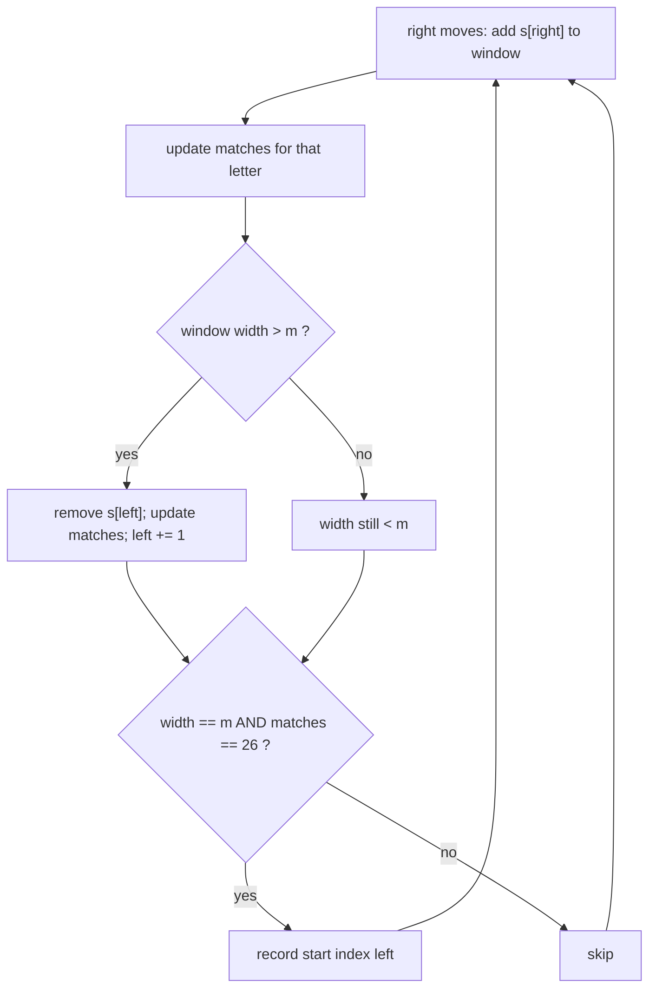

# Find All Anagrams in a String

| Meta | Value |
|------|-------|
| Source | LeetCode #438 |
| Difficulty | Medium |
| Topics | Sliding Window, Hash Map / Frequency Array, String |
| Link | https://leetcode.com/problems/find-all-anagrams-in-a-string/ |

---

## Problem Statement

Given two strings `s` and `p`, return an array of **all the start indices** of `p`'s **anagrams**
in `s`. You may return the answer in any order. An anagram is a rearrangement of the same
multiset of letters (same characters with the same counts).

**Example**
```
Input:  s = "cbaebabacd", p = "abc"
Output: [0, 6]

Explanation:
  index 0 -> "cba"  is an anagram of "abc"
  index 6 -> "bac"  is an anagram of "abc"
  (other length-3 windows like "bae", "eba", ... are not anagrams)
```

---

## Approach — Fixed-Size Sliding Window + Frequency Match

Every anagram of `p` has exactly `len(p)` characters with the **same letter counts** as `p`. So
we only need to inspect windows of `s` of fixed width `m = len(p)` and check whether each window's
letter histogram equals `p`'s histogram.

### Mechanics

1. Build `need[26]`, the frequency of each letter in `p`.
2. Slide a fixed window of width `m` across `s`, maintaining `window[26]`.
3. At each step add the entering character on the right and (once the window exceeds width `m`)
   remove the leaving character on the left — an **O(1)** incremental update.
4. Whenever the window has width exactly `m` and `window == need`, record `left` as a start index.

### Making the comparison O(1) with a `matches` counter

Comparing two 26-length arrays each step is $O(26)$. We can do **O(1)** amortized work by tracking
a single integer `matches` = the number of letters (out of 26) whose window count currently equals
the needed count. Each add/remove touches one letter and adjusts `matches` by at most one. The
window is an anagram exactly when `matches == 26`.

The window is valid (an anagram of `p`) iff:

$$\forall c \in \{A \dots Z\}:\; \text{window}[c] = \text{need}[c] \iff \text{matches} = 26$$



---

## Code

### Solution 1 — Array compare (clear and simple)

```python
def find_anagrams(s: str, p: str):
    m, n = len(p), len(s)
    if m > n:
        return []
    need = [0] * 26          # target letter counts from p
    window = [0] * 26        # letter counts in the current window
    for ch in p:
        need[ord(ch) - ord('A')] += 1
    res = []
    for right in range(n):
        window[ord(s[right]) - ord('A')] += 1     # add entering char
        if right >= m:                            # window too wide -> drop left char
            window[ord(s[right - m]) - ord('A')] -= 1
        if right >= m - 1 and window == need:     # full-width window matches p
            res.append(right - m + 1)             # start index of this window
    return res
```

```cpp
vector<int> findAnagrams(const string& s, const string& p) {
    int m = (int)p.size(), n = (int)s.size();
    if (m > n) return {};
    vector<int> need(26, 0);     // target letter counts from p
    vector<int> window(26, 0);   // letter counts in the current window
    for (char ch : p) need[ch - 'A'] += 1;
    vector<int> res;
    for (int right = 0; right < n; ++right) {
        window[s[right] - 'A'] += 1;              // add entering char
        if (right >= m)                           // window too wide -> drop left char
            window[s[right - m] - 'A'] -= 1;
        if (right >= m - 1 && window == need)     // full-width window matches p
            res.push_back(right - m + 1);         // start index of this window
    }
    return res;
}
```

### Solution 2 — O(1) `matches` counter (optimal constant factor)

```python
def find_anagrams(s: str, p: str):
    m, n = len(p), len(s)
    if m > n:
        return []
    need = [0] * 26
    window = [0] * 26
    for ch in p:
        need[ord(ch) - ord('A')] += 1
    # matches = number of letters whose window count already equals need count
    matches = sum(1 for c in range(26) if window[c] == need[c])  # starts at 26 (all zero)
    res = []
    for right in range(n):
        c = ord(s[right]) - ord('A')
        if window[c] == need[c]:                  # this letter was matched, will break it
            matches -= 1
        window[c] += 1                            # add entering char
        if window[c] == need[c]:                  # newly matched
            matches += 1
        if right >= m:                            # remove leaving char
            d = ord(s[right - m]) - ord('A')
            if window[d] == need[d]:              # was matched, will break it
                matches -= 1
            window[d] -= 1
            if window[d] == need[d]:              # newly matched
                matches += 1
        if right >= m - 1 and matches == 26:      # every letter count agrees -> anagram
            res.append(right - m + 1)
    return res
```

```cpp
vector<int> findAnagrams(const string& s, const string& p) {
    int m = (int)p.size(), n = (int)s.size();
    if (m > n) return {};
    vector<int> need(26, 0), window(26, 0);
    for (char ch : p) need[ch - 'A'] += 1;
    // matches = number of letters whose window count already equals need count
    int matches = 0;
    for (int c = 0; c < 26; ++c) if (window[c] == need[c]) matches++;  // starts at 26
    vector<int> res;
    for (int right = 0; right < n; ++right) {
        int c = s[right] - 'A';
        if (window[c] == need[c]) matches--;      // this letter was matched, will break it
        window[c] += 1;                           // add entering char
        if (window[c] == need[c]) matches++;      // newly matched
        if (right >= m) {                         // remove leaving char
            int d = s[right - m] - 'A';
            if (window[d] == need[d]) matches--;  // was matched, will break it
            window[d] -= 1;
            if (window[d] == need[d]) matches++;  // newly matched
        }
        if (right >= m - 1 && matches == 26)      // every letter count agrees -> anagram
            res.push_back(right - m + 1);
    }
    return res;
}
```

---

## Iteration Trace

Tracing Solution 1 on `s = "cbaebabacd"`, `p = "abc"` so `m = 3`, `need = {a:1, b:1, c:1}`.
`left = right - m + 1` once the window is full.

| right | s[right] | drop s[right-m] | window (a,b,c,...) | full? left | window==need? | res |
|-------|----------|-----------------|--------------------|-----------|---------------|-----|
| 0 | c | — | c:1 | no | — | [] |
| 1 | b | — | b:1,c:1 | no | — | [] |
| 2 | a | — | a:1,b:1,c:1 | left=0 | **yes** | [0] |
| 3 | e | drop c | a:1,b:1,e:1 | left=1 | no | [0] |
| 4 | b | drop b | a:1,b:1,e:1 | left=2 | no | [0] |
| 5 | a | drop a | a:1,b:1,e:1 | left=3 | no | [0] |
| 6 | b | drop e | a:1,b:2 | left=4 | no | [0] |
| 7 | a | drop b | a:2,b:1 | left=5 | no | [0] |
| 8 | c | drop a | a:1,b:1,c:1 | left=6 | **yes** | [0,6] |
| 9 | d | drop b | a:1,c:1,d:1 | left=7 | no | [0,6] |

Final answer: **[0, 6]**.

---

## Complexity

| Approach | Time | Space |
|----------|------|-------|
| Fixed window + array compare | $O(n \cdot 26) = O(n)$ | $O(1)$ — two `[26]` arrays |
| Fixed window + `matches` counter | $O(n)$ | $O(1)$ — two `[26]` arrays |

Both are linear in `n = len(s)`. The array-compare version hides a constant factor of 26 per
step; the `matches` counter removes it for strictly O(1) work per character.

---

## Takeaway

- Anagram detection reduces to **comparing letter histograms** — order does not matter, only
  counts do.
- Because every anagram of `p` has length exactly `len(p)`, use a **fixed-width** sliding window:
  add the entering char, drop the char that falls out the left, and update counts incrementally
  in O(1).
- Replace the per-step array comparison with a single `matches` counter (number of letters whose
  counts agree) to reach optimal $O(1)$ work per character; a window is an anagram exactly when
  `matches == 26`. This fixed-window + histogram-match pattern also solves "permutation in
  string" (LeetCode #567).
