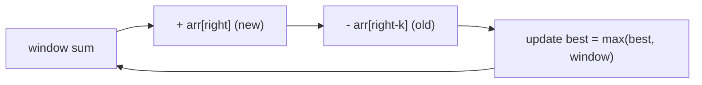

# Max Consecutive Sum of Size K & Max-Sum Window (AtCoder/Codeforces)

| Meta | Value |
|------|-------|
| Source | AtCoder / Codeforces classic fixed-window problems |
| Difficulty | Easy–Medium |
| Topics | Fixed Sliding Window, Prefix Sum |
| Link | https://atcoder.jp/contests/abc (recurring pattern) |

---

## Problem Statement
Given an array of `n` integers and an integer `k`, find the **maximum sum** of any contiguous
subarray of **exactly** length `k`. (Values may be negative.)

**Example**
```
arr = [1, -2, 3, 4, -1, 2], k = 3
Output: 6      // subarray [3, 4, -1] = 6
```

---

## Fixed-Size Sliding Window — O(n)

For a window of constant size `k`, recomputing each window's sum from scratch is O(n·k). Instead,
slide by **adding the entering element and subtracting the leaving one** — an O(1) update per
step.

$$
\text{sum}_{[i-k+1,\, i]} = \text{sum}_{[i-k,\, i-1]} + arr[i] - arr[i-k]
$$



```python
def max_sum_window_k(arr, k):
    window = sum(arr[:k])              # first window
    best = window
    for right in range(k, len(arr)):
        window += arr[right] - arr[right - k]   # slide by one: add new, drop old
        best = max(best, window)
    return best
```

```cpp
long long max_sum_window_k(const vector<long long>& arr, int k) {
    long long window = 0;
    for (int i = 0; i < k; ++i) window += arr[i];   // first window
    long long best = window;
    for (int right = k; right < (int)arr.size(); ++right) {
        window += arr[right] - arr[right - k];       // slide by one: add new, drop old
        best = max(best, window);
    }
    return best;
}
```

---

## Trace — `arr = [1, -2, 3, 4, -1, 2]`, `k = 3`

Initial window `[1, -2, 3]` → sum = `2`, best = `2`.

| right | arr[right] (new) | arr[right−k] (old) | window update | window | best |
|-------|------------------|--------------------|----------------|--------|------|
| 3 | 4 | arr[0]=1 | 2 + 4 − 1 | 5 | 5 |
| 4 | -1 | arr[1]=−2 | 5 + (−1) − (−2) | 6 | **6** |
| 5 | 2 | arr[2]=3 | 6 + 2 − 3 | 5 | 6 |

Maximum is **6** from window `[3, 4, −1]` (indices 2–4). Each slide is a single add + subtract,
no re-summation.

---

## Prefix-Sum Alternative
Precompute prefix sums `P`, then any window sum is `P[i+1] − P[i+1−k]` in O(1):

```python
def max_sum_window_prefix(arr, k):
    P = [0]
    for v in arr:
        P.append(P[-1] + v)
    best = float('-inf')
    for i in range(k, len(P)):
        best = max(best, P[i] - P[i - k])
    return best
```

```cpp
long long max_sum_window_prefix(const vector<long long>& arr, int k) {
    vector<long long> P;
    P.push_back(0);
    for (long long v : arr)
        P.push_back(P.back() + v);                  // prefix sums
    long long best = LLONG_MIN;
    for (int i = k; i < (int)P.size(); ++i)
        best = max(best, P[i] - P[i - k]);
    return best;
}
```

Both are O(n); the rolling-window version uses O(1) extra space, the prefix version O(n).

---

## Variants Built on the Same Skeleton
| Problem | Tweak |
|---------|-------|
| Max **average** of size k (LeetCode 643) | divide best by k |
| Count windows with sum ≥ T | compare each window sum |
| Max sum with **at most** k (variable) | switch to Kadane or variable window |
| Min sum of size k | track minimum instead |
| Number of subarrays of size k meeting a condition | evaluate per window |

---

## Complexity

| Approach | Time | Space |
|----------|------|-------|
| Recompute each window | O(n·k) | O(1) |
| **Rolling fixed window** | **O(n)** | O(1) |
| Prefix sum | O(n) | O(n) |

---

## Common Pitfall — Negative Values
With negatives, you **cannot** prune by "stop when sum drops" (that's for positive variable
windows). For a **fixed** size `k`, just slide the whole window and track the max — the size
constraint keeps it simple regardless of signs.

## Takeaway
A **fixed-size window** updates in O(1) by adding the new element and removing the old. It's the
simplest sliding-window form and the building block for moving averages, max/min windows, and
streaming statistics.
