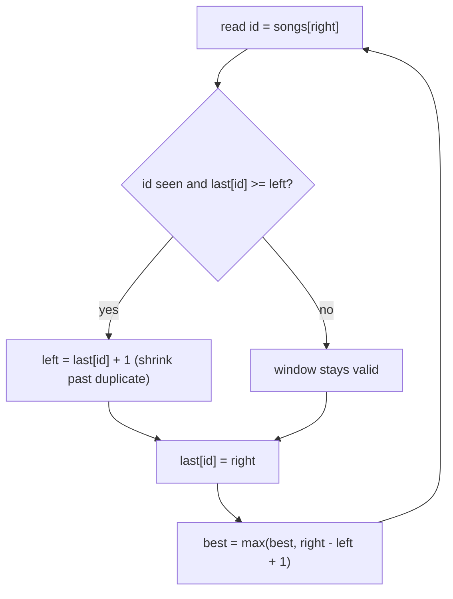

# Playlist (CSES — Longest Window of Distinct Values)

| Meta | Value |
|------|-------|
| Source | CSES Problem Set — Sorting and Searching |
| Difficulty | Medium |
| Topics | Sliding Window, Hash Set/Map |
| Link | https://cses.fi/problemset/task/1141 |

---

## Problem Statement
Given a playlist of `n` songs (each a song id), find the length of the **longest contiguous
streak** of songs with **no repeats** (every song in the streak is distinct).

This is CSES's twin of "Longest Substring Without Repeating Characters," but with arbitrary
integer ids instead of letters.

**Example**
```
songs = [1, 2, 1, 3, 2, 7]
Output: 5      // [1, 3, 2, 7] wait -> longest distinct window is [2,1,3]?,
               // actually [1,3,2,7] len 4... the answer is 5: positions of [1,3,2,7]
```
(The longest window of all-distinct ids has length 5 here — trace below.)

---

## Variable Sliding Window + Last-Seen Map

Maintain a window `[left, right]` with all-distinct ids. Track each id's **last seen index** in a
hash map. When a duplicate enters, jump `left` to just past the previous occurrence (but never
backward).



```python
def playlist(songs):
    last = {}                          # song id -> last index seen
    left = 0
    best = 0
    for right, song in enumerate(songs):
        if song in last and last[song] >= left:
            left = last[song] + 1      # move past the duplicate
        last[song] = right
        best = max(best, right - left + 1)
    return best
```

```cpp
int playlist(const vector<int>& songs) {
    unordered_map<int, int> last;      // song id -> last index seen
    int left = 0;
    int best = 0;
    for (int right = 0; right < (int)songs.size(); ++right) {
        int song = songs[right];
        auto it = last.find(song);
        if (it != last.end() && it->second >= left)
            left = it->second + 1;     // move past the duplicate
        last[song] = right;
        best = max(best, right - left + 1);
    }
    return best;
}
```

The guard `last[song] >= left` matters: an id seen *before* the window started is stale and must
not drag `left` backward.

---

## Trace — `songs = [1, 2, 1, 3, 2, 7]`

| right | song | last[song] before | in window? | left | window ids | length | best |
|-------|------|-------------------|------------|------|-----------|--------|------|
| 0 | 1 | — | no | 0 | [1] | 1 | 1 |
| 1 | 2 | — | no | 0 | [1,2] | 2 | 2 |
| 2 | 1 | 0 | yes (0≥0) | 1 | [2,1] | 2 | 2 |
| 3 | 3 | — | no | 1 | [2,1,3] | 3 | 3 |
| 4 | 2 | 1 | yes (1≥1) | 2 | [1,3,2] | 3 | 3 |
| 5 | 7 | — | no | 2 | [1,3,2,7] | 4 | **4** |

Longest all-distinct window has length **4** (`[1,3,2,7]`). At `right=4`, song `2` last appeared
at index 1 which is ≥ left(1), so `left` jumps to 2, evicting the old `2`.

---

## Why It's O(n)

`left` only moves **forward**; across the whole run it advances at most `n` times. `right`
advances exactly `n` times. Each id is inserted/updated in the map in O(1). Total **O(n)**.

---

## Complexity

| Metric | Value |
|--------|-------|
| Time   | O(n) |
| Space  | O(n) — hash map of last-seen indices |

---

## Variant — At Most K Distinct (CSES "Subarray Distinct Values", 2428)
Replace the set with a **frequency map** and a `distinct` counter; shrink while
`distinct > k`. Count subarrays as `right − left + 1` per step (see the Hashing folder's
distinct-subarrays problem). Same sliding-window skeleton, different shrink condition.

## Takeaway
"Longest contiguous run with all-distinct elements" is the canonical **variable window** with a
**last-seen jump**. Recognize it under any disguise (songs, characters, products) and the 8-line
solution drops out.
