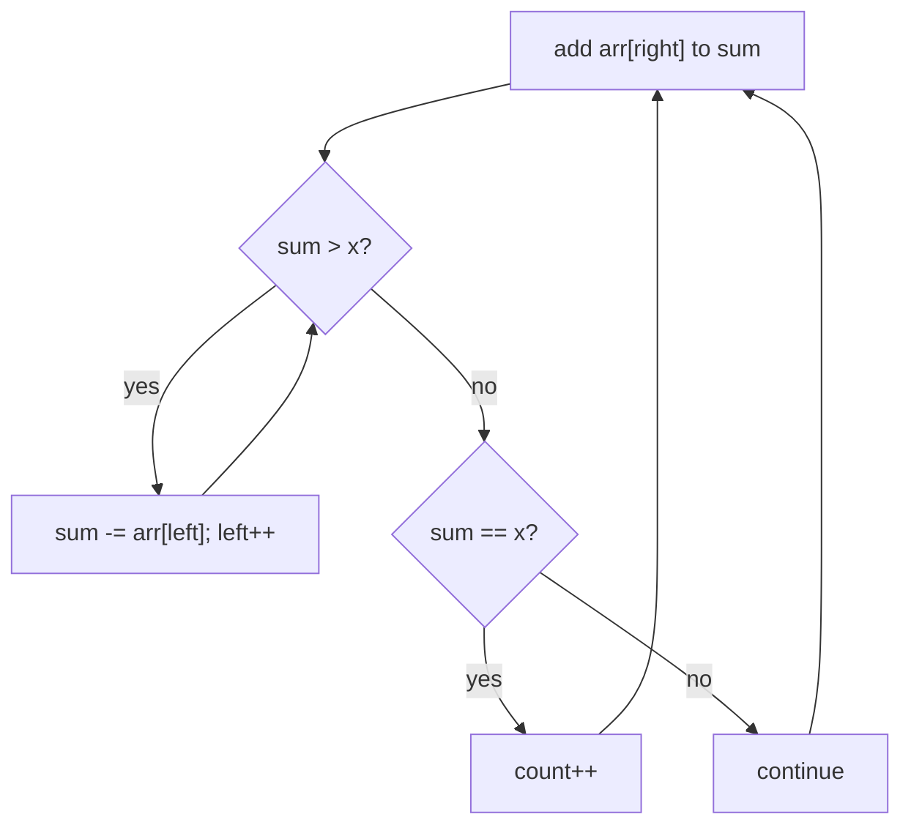

# Subarray Sums I (CSES — Fixed-Target Window on Positives)

| Meta | Value |
|------|-------|
| Source | CSES Problem Set — Sorting and Searching |
| Difficulty | Easy–Medium |
| Topics | Sliding Window, Two Pointers, Prefix Sum |
| Link | https://cses.fi/problemset/task/1660 |

---

## Problem Statement
Given an array of `n` **positive** integers, count the number of contiguous subarrays whose sum
equals exactly `x`.

**Example**
```
arr = [2, 4, 1, 2, 7], x = 7
Output: 3      // [2,4,1], [7], and [2,... ] -> subarrays summing to 7
```

---

## Why Sliding Window Works Here (Positives!)

Because all values are **positive**, the running window sum is **monotonic**:
- Extending the window (move `right`) **strictly increases** the sum.
- Shrinking it (move `left`) **strictly decreases** the sum.

This monotonicity gives a clean rule:
- If the window sum is **too big**, shrink from the left.
- If it's **too small**, extend to the right.
- If it **equals** `x`, count it, then shrink to look for the next.

> Contrast with "Subarray Sums II" (negatives allowed) where this monotonicity breaks and you
> must use prefix-sum + hash map instead.



```python
def subarray_sums_i(arr, x):
    left = 0
    cur = 0
    count = 0
    for right, v in enumerate(arr):
        cur += v
        while cur > x:                 # shrink while too big (positives guarantee progress)
            cur -= arr[left]
            left += 1
        if cur == x:
            count += 1
    return count
```

```cpp
long long subarray_sums_i(const vector<long long>& arr, long long x) {
    int left = 0;
    long long cur = 0;
    long long count = 0;
    for (int right = 0; right < (int)arr.size(); ++right) {
        cur += arr[right];
        while (cur > x) {              // shrink while too big (positives guarantee progress)
            cur -= arr[left];
            left += 1;
        }
        if (cur == x)
            count += 1;
    }
    return count;
}
```

---

## Trace — `arr = [2, 4, 1, 2, 7]`, `x = 7`

| right | v | cur after add | shrink (cur>7) | window | cur==7? | count |
|-------|---|---------------|----------------|--------|---------|-------|
| 0 | 2 | 2 | no | [2] | no | 0 |
| 1 | 4 | 6 | no | [2,4] | no | 0 |
| 2 | 1 | 7 | no | [2,4,1] | **yes** | 1 |
| 3 | 2 | 9 | drop 2→7? 9−2=7 (left=1) | [4,1,2] | **yes** | 2 |
| 4 | 7 | 14 | drop 4→10, drop1→9, drop2→7 (left=4) | [7] | **yes** | 3 |

Result **3** subarrays: `[2,4,1]`, `[4,1,2]`, `[7]`. Each time the sum overshoots, the `while`
peels elements off the left until it's ≤ x, then we check for equality.

---

## Why O(n)

Both pointers move only **forward**. `right` advances `n` times; `left` advances at most `n`
times total across all iterations of the inner `while`. So the combined work is **O(n)** — even
though there's a nested loop, it's amortized linear.

---

## Complexity

| Approach | Time | Space |
|----------|------|-------|
| Brute force (all subarrays) | O(n²) | O(1) |
| **Sliding window (positives)** | **O(n)** | O(1) |
| Prefix sum + hash (works with negatives too) | O(n) | O(n) |

---

## Decision Guide — Window vs Prefix-Hash

| Situation | Use |
|-----------|-----|
| All values **positive**, want count/length | sliding window, O(1) space |
| Values can be **negative/zero** | prefix sum + hash map |
| Need count divisible by k | prefix residue + hash map |

## Takeaway
On **positive-only** arrays, a target-sum subarray count is a textbook **two-pointer window**
because the sum is monotonic. The moment negatives appear, abandon the window and switch to
prefix-sum hashing — recognizing which regime you're in is the key insight.
