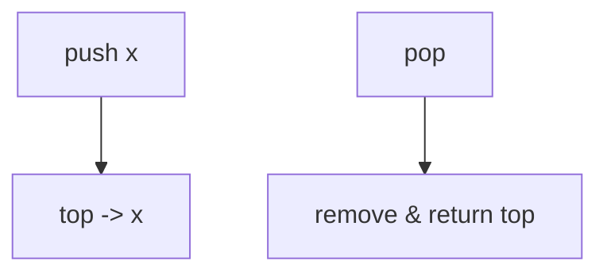
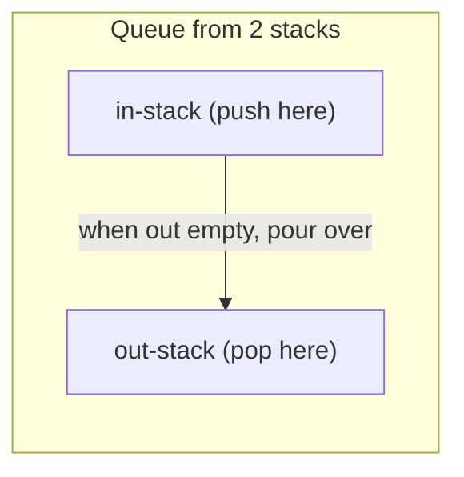

# Stacks & Queues — Complete Guide (Beginner → Advanced)

> Stacks (LIFO) and Queues (FIFO) are simple *access-discipline* structures, but they unlock
> elegant solutions for parsing, traversal, scheduling, and "next greater element" problems.

---

## Table of Contents
1. [Stack — LIFO](#1-stack--lifo)
2. [Queue — FIFO](#2-queue--fifo)
3. [Deque — Double-Ended](#3-deque--double-ended)
4. [Implementations](#4-implementations)
5. [Where They Show Up](#5-where-they-show-up)
6. [Monotonic Stack/Queue (Advanced)](#6-monotonic-stackqueue-advanced)
7. [Cheat Sheet](#7-cheat-sheet)

---

## 1. Stack — LIFO

A **stack** allows insertion and removal only at one end (the "top"). **L**ast **I**n,
**F**irst **O**ut — like a stack of plates.

```
push 3 -> push 7 -> push 1     pop -> returns 1
   top:                            top:
   | 1 |                           | 7 |
   | 7 |                           | 3 |
   | 3 |                           +---+
```

| Operation | Time |
|-----------|------|
| push (add to top) | O(1) |
| pop (remove top) | O(1) |
| peek/top | O(1) |
| search | O(n) |



---

## 2. Queue — FIFO

A **queue** inserts at the back (enqueue) and removes from the front (dequeue). **F**irst
**I**n, **F**irst **O**ut — like a line at a counter.

```
enqueue: 3, 7, 1
front -> [3, 7, 1] <- back
dequeue -> returns 3
```

| Operation | Time |
|-----------|------|
| enqueue (add back) | O(1) |
| dequeue (remove front) | O(1) |
| peek front | O(1) |

> Implementing a queue on a plain dynamic array makes dequeue O(n) (shifting). Use a **linked
> list**, a **circular buffer**, or a **deque** for O(1) on both ends.

---

## 3. Deque — Double-Ended

A **deque** (double-ended queue) supports O(1) push/pop at **both** ends. It generalizes both
stack and queue and is the backbone of sliding-window-maximum and 0-1 BFS.

```
push_front / pop_front   <-> [ ... ] <->   push_back / pop_back
```

---

## 4. Implementations

### Stack
- Dynamic array (append/pop end) — most common.
- Singly linked list (push/pop head).

### Queue
- **Circular buffer:** fixed array with `head`/`tail` indices wrapping via modulo:
  $$ \text{next}(i) = (i + 1) \bmod \text{capacity} $$
- Linked list with head & tail pointers.
- **Two stacks** trick: `in` stack for enqueue, `out` stack for dequeue; amortized O(1).



---

## 5. Where They Show Up

| Use case | Structure |
|----------|-----------|
| Function call stack / recursion | Stack |
| Undo/redo | Stack |
| Balanced parentheses / expression parsing | Stack |
| DFS (iterative) | Stack |
| BFS / level-order traversal | Queue |
| Task scheduling, buffering | Queue |
| Next greater/smaller element | Monotonic stack |
| Sliding window max/min | Monotonic deque |

---

## 6. Monotonic Stack/Queue (Advanced)

A **monotonic stack** keeps its elements sorted (increasing or decreasing). It answers
"**next greater element**", "**previous smaller element**", histogram area, and stock-span
problems in **O(n)** — because each element is pushed and popped **at most once**.

### Next Greater Element idea
Scan right to left; pop everything `<=` current (they're blocked by current), then the top is
the next greater. Push current.

$$
\text{amortized cost} = \frac{\text{total pushes + pops}}{n} = O(1) \text{ per element}
$$

A **monotonic deque** extends this to windows where elements also expire from the front.

---

## 7. Cheat Sheet

```
Stack (LIFO):  push/pop/peek O(1)  -> recursion, parsing, DFS, undo
Queue (FIFO):  enqueue/dequeue O(1) -> BFS, scheduling, buffering
Deque:         O(1) both ends       -> window max, 0-1 BFS
Circular buf:  next = (i+1) % cap
Two-stack queue: amortized O(1) dequeue

Monotonic stack -> next greater/smaller, histogram, span  (O(n))
Monotonic deque -> sliding window max/min                  (O(n))
```

> **Mental model:** Pick the structure by *which end you need*. Need the most recent thing? Stack.
> Need the oldest thing? Queue. Need both ends or to discard dominated candidates? Deque.
