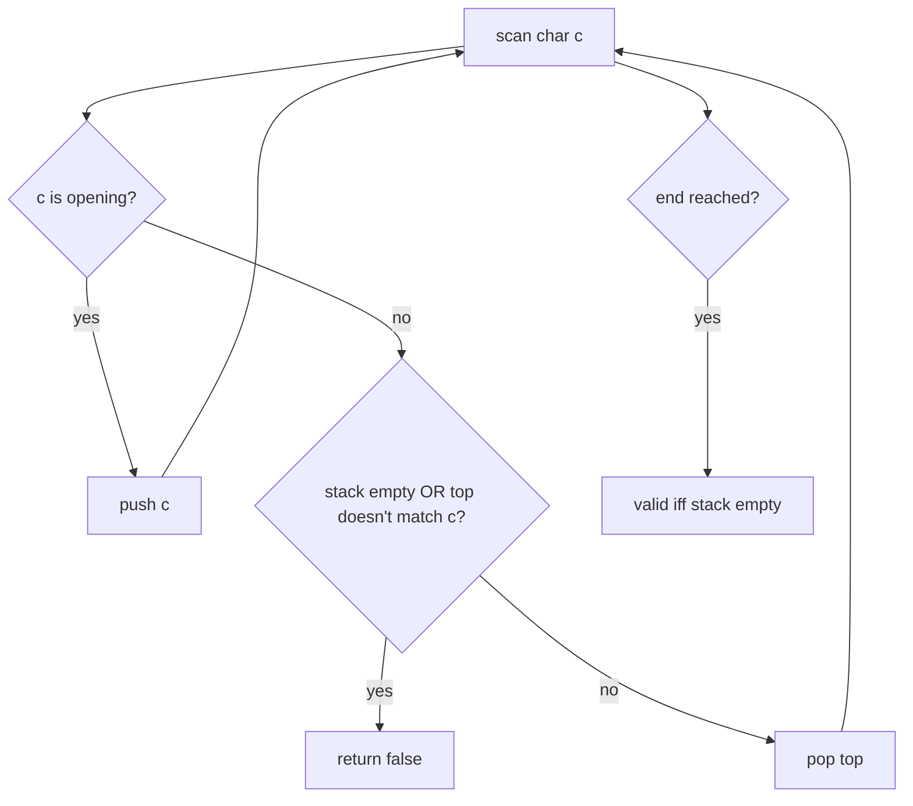

# Valid Parentheses

| Meta | Value |
|------|-------|
| Source | LeetCode #20 |
| Difficulty | Easy |
| Topics | Stack, String |
| Link | https://leetcode.com/problems/valid-parentheses/ |

---

## Problem Statement
Given a string of just `()[]{}`, determine if the brackets are **validly matched** — every
opening bracket is closed by the same type, in the correct order.

**Example**
```
"()[]{}"  -> true
"(]"      -> false
"([)]"    -> false      // wrong nesting order
"{[]}"    -> true
```

---

## Why a Stack?

Brackets must close in **reverse order** of opening — the *most recently* opened bracket must be
closed first. That "most recent first" rule is exactly **LIFO**, so a stack is the natural fit.

- See an **opening** bracket → push it (we owe a matching close).
- See a **closing** bracket → it must match the bracket on **top** of the stack.



---

## Code

```python
def is_valid(s):
    pairs = {')': '(', ']': '[', '}': '{'}   # close -> open
    stack = []
    for c in s:
        if c in pairs:                       # c is a closing bracket
            if not stack or stack[-1] != pairs[c]:
                return False                 # nothing to match / wrong type
            stack.pop()
        else:                                # opening bracket
            stack.append(c)
    return not stack                         # all matched <=> empty
```

```cpp
bool is_valid(const string& s) {
    unordered_map<char, char> pairs = {{')', '('}, {']', '['}, {'}', '{'}};  // close -> open
    stack<char> st;
    for (char c : s) {
        if (pairs.count(c)) {                    // c is a closing bracket
            if (st.empty() || st.top() != pairs[c])
                return false;                    // nothing to match / wrong type
            st.pop();
        } else {                                 // opening bracket
            st.push(c);
        }
    }
    return st.empty();                           // all matched <=> empty
}
```

---

## Iteration Trace — `s = "{[]}"`

| char | type | action | stack after |
|------|------|--------|-------------|
| `{`  | open | push | `['{']` |
| `[`  | open | push | `['{', '[']` |
| `]`  | close, needs `[` | top is `[` ✓ → pop | `['{']` |
| `}`  | close, needs `{` | top is `{` ✓ → pop | `[]` |

Stack empty at end → **true**. ✓

### Trace of a failure — `s = "([)]"`

| char | action | stack |
|------|--------|-------|
| `(`  | push | `['(']` |
| `[`  | push | `['(', '[']` |
| `)`  | close needs `(`, but top is `[` → mismatch | **return false** |

The stack catches the *incorrect nesting order* immediately.

---

## Two Failure Conditions + One Final Check

1. **Mismatch:** closing bracket's required opener ≠ current top → invalid.
2. **Unmatched close:** stack empty when a closing bracket arrives → invalid.
3. **Unmatched open:** stack non-empty at the end (leftover openers) → invalid.

All three are covered by the code above.

---

## Complexity

| Metric | Value |
|--------|-------|
| Time   | O(n) — single pass |
| Space  | O(n) — worst case all openers (e.g. `"((((("`) |

---

## Edge Cases
- Empty string → valid (`true`).
- Odd length → must be invalid (a leftover will remain), naturally handled.
- Single bracket → invalid.

## Takeaway
Whenever validity depends on **matching the most recent unresolved item**, reach for a stack.
This generalizes to expression evaluation, the decoding of nested structures, and HTML/XML tag
matching.
