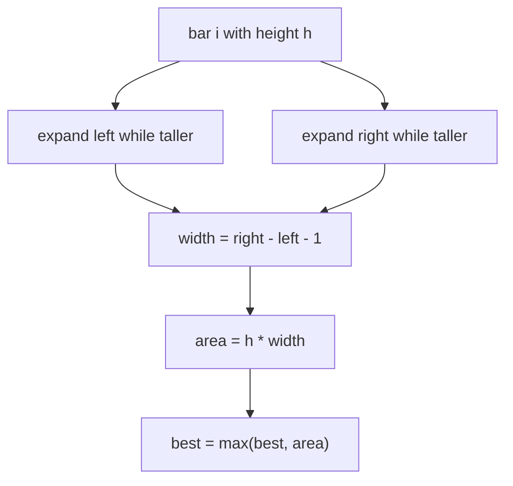

# Largest Rectangle in Histogram

| Meta | Value |
|------|-------|
| Source | LeetCode #84 / CSES "Advertisement" (1142) |
| Difficulty | Hard |
| Topics | Monotonic Stack, Array |
| Links | https://leetcode.com/problems/largest-rectangle-in-histogram/ , https://cses.fi/problemset/task/1142 |

---

## Problem Statement
Given bar heights of a histogram (each bar width 1), find the area of the **largest rectangle**
that fits entirely within the histogram.

**Example**
```
heights = [2, 1, 5, 6, 2, 3]
Output: 10        // bars [5, 6] -> height 5, width 2 ... actually 5*2=10
```

```
      █
    █ █
    █ █   █
█   █ █ █ █
█ █ █ █ █ █
2 1 5 6 2 3   -> largest = 10 (heights 5 and 6, width 2, limited to height 5)
```

---

## Key Insight — For Each Bar, How Wide Can It Extend?

A rectangle of height `heights[i]` can extend **left** until it hits a shorter bar, and
**right** until it hits a shorter bar. If `left[i]` and `right[i]` are the nearest **strictly
smaller** bars on each side, the maximal rectangle with bar `i` as the limiting height is:

$$
\text{area}_i = heights[i] \times (right[i] - left[i] - 1)
$$

The answer is `max` over all `i`. Finding nearest-smaller on both sides is a **monotonic stack**
job — and we can do it in a **single pass**.



---

## One-Pass Monotonic Stack Solution

Keep a stack of indices with **increasing** heights. When a bar shorter than the stack top
arrives, the top bar can't extend further right — so we **pop and finalize** its rectangle. The
popped bar's left boundary is the new stack top; its right boundary is the current index.

```python
def largest_rectangle_area(heights):
    stack = []                         # indices, heights increasing
    best = 0
    n = len(heights)
    for i in range(n + 1):
        # sentinel height 0 at the end forces all bars to be flushed
        h = heights[i] if i < n else 0
        while stack and heights[stack[-1]] >= h:
            height = heights[stack.pop()]
            # width spans from after the new top to just before i
            left = stack[-1] if stack else -1
            width = i - left - 1
            best = max(best, height * width)
        stack.append(i)
    return best
```

```cpp
long long largest_rectangle_area(const vector<long long>& heights) {
    stack<int> stk;                        // indices, heights increasing
    long long best = 0;
    int n = heights.size();
    for (int i = 0; i <= n; i++) {
        // sentinel height 0 at the end forces all bars to be flushed
        long long h = (i < n) ? heights[i] : 0;
        while (!stk.empty() && heights[stk.top()] >= h) {
            long long height = heights[stk.top()];
            stk.pop();
            // width spans from after the new top to just before i
            int left = stk.empty() ? -1 : stk.top();
            long long width = i - left - 1;
            best = max(best, height * width);
        }
        stk.push(i);
    }
    return best;
}
```

The trailing **sentinel** (`h = 0` at `i = n`) guarantees every remaining bar gets popped and
measured.

---

## Trace — `heights = [2, 1, 5, 6, 2, 3]`

| i | h | pop (top ≥ h) → finalize | width = i−left−1 | area | best | stack after |
|---|---|--------------------------|------------------|------|------|-------------|
| 0 | 2 | — | — | — | 0 | [0] |
| 1 | 1 | pop 0(h=2): left=−1, w=1−(−1)−1=1 | 1 | 2 | 2 | [1] |
| 2 | 5 | — | — | — | 2 | [1,2] |
| 3 | 6 | — | — | — | 2 | [1,2,3] |
| 4 | 2 | pop 3(h=6): left=2,w=4−2−1=1→6; pop 2(h=5): left=1,w=4−1−1=2→**10** | — | 10 | **10** | [1,4] |
| 5 | 3 | — | — | — | 10 | [1,4,5] |
| 6 | 0 | pop 5(h=3):w=6−4−1=1→3; pop 4(h=2):w=6−1−1=4→8; pop 1(h=1):w=6→6 | — | — | 10 | [6] |

Largest area = **10** (bars of height 5 and 6, limited to height 5, width 2). The decisive
moment is `i=4`: popping bar 2 (height 5) gives width 2 → area 10.

---

## Why O(n)

Each index is pushed once and popped once → at most `2n` stack operations. The single pass with
amortized O(1) work per bar gives **O(n)** total.

---

## Complexity

| Approach | Time | Space |
|----------|------|-------|
| Brute (expand each bar) | O(n²) | O(1) |
| Divide & conquer (segment tree min) | O(n log n) | O(n) |
| **Monotonic stack** | **O(n)** | O(n) |

---

## Connected Problems (same engine)
- **Maximal Rectangle** (LeetCode 85): run this per row over a histogram of consecutive 1s.
- **CSES Advertisement** (1142): identical histogram problem.
- **Trapping Rain Water**: complementary monotonic-stack/two-pointer idea.

## Takeaway
"Largest rectangle limited by the shortest bar in a range" reduces to **nearest smaller element
on both sides**, computed in a single monotonic-stack pass. The sentinel-flush trick is a clean
way to finalize all pending bars.
