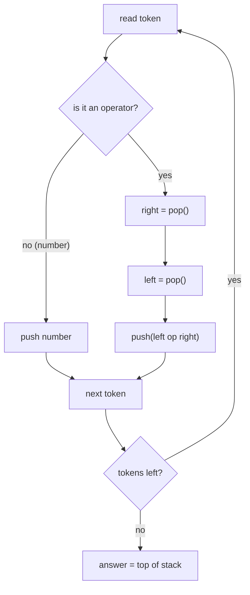

# Evaluate Reverse Polish Notation (Postfix Stack)

| Meta | Value |
|------|-------|
| Source | LeetCode #150 |
| Difficulty | Medium |
| Topics | Stack, Math, Postfix Expression |
| Link | https://leetcode.com/problems/evaluate-reverse-polish-notation/ |

---

## Problem Statement

You are given an array `tokens` representing an arithmetic expression in **Reverse Polish
Notation** (RPN, a.k.a. *postfix*). Evaluate it and return the integer result.

Rules:
- Valid operators are `+`, `-`, `*`, `/`.
- Each operand is an integer or another expression.
- Division between two integers **truncates toward zero**.
- The input is always a valid RPN expression; no division by zero.

**Example**
```
tokens = ["2", "1", "+", "3", "*"]
meaning: ((2 + 1) * 3) = 9
Output: 9

tokens = ["4", "13", "5", "/", "+"]
meaning: (4 + (13 / 5)) = 4 + 2 = 6
Output: 6
```

In infix the second example is $4 + \left\lfloor \tfrac{13}{5} \right\rfloor_{\text{toward }0} = 6$.

---

## Why a Stack Fits Postfix Perfectly

In postfix notation, **operands come before their operator**. Reading left to right:

- When you see a **number**, you don't yet know what to do with it — so you **push** it and wait.
- When you see an **operator**, its two operands are exactly the **two most recently seen values**
  — the top two on the stack. Pop them, apply the operator, push the result back.

This LIFO behavior is precisely what a stack provides. After consuming all tokens, exactly one
value remains: the answer.

### Operand popping order (critical!)

For `+` and `*` order doesn't matter (commutative). For `-` and `/` it **does**. The operand
pushed **first** (deeper in the stack) is the **left** operand; the operand pushed **last** (on
top) is the **right** operand. So you must pop `right` first, then `left`:

$$\text{result} = \text{left} \,\;\square\;\, \text{right}$$

```
... pushed a, then b      stack: [ ..., a, b ]   (b on top)
operator "-"  ->  b = pop(),  a = pop(),  push(a - b)
```

Getting this backwards silently breaks `-` and `/`.



---

## The Division Truncation Subtlety

The problem requires division to **truncate toward zero** (drop the fractional part), e.g.
$\tfrac{-7}{2} = -3$, **not** $-4$.

- **Python**: the `//` operator does **floor** division, so `-7 // 2 == -4` — *wrong* for this
  problem. Instead use `int(left / right)`. Python's `/` produces a float and `int(...)`
  truncates **toward zero**, giving `int(-7 / 2) == int(-3.5) == -3`. ✅
- **C++**: integer division with `/` already truncates **toward zero** for `int` operands (since
  C++11), so `-7 / 2 == -3` directly — no adjustment needed. ✅

This is why the Python code below uses `int(a / b)` rather than `a // b`, and the C++ code can use
the plain `/` operator and still match.

| Expression | `floor` (`//`) | truncate-toward-zero (required) |
|------------|----------------|---------------------------------|
| `7 / 2`    | 3              | 3                               |
| `-7 / 2`   | -4             | **-3**                          |
| `7 / -2`   | -4             | **-3**                          |
| `-7 / -2`  | 3              | 3                               |

---

## Solution

```python
class Solution:
    def evalRPN(self, tokens: list[str]) -> int:
        stack = []
        ops = {"+", "-", "*", "/"}

        for tok in tokens:
            if tok in ops:
                # operator: the two operands are the top two values
                right = stack.pop()   # pushed last  -> right operand
                left = stack.pop()    # pushed first -> left operand
                if tok == "+":
                    stack.append(left + right)
                elif tok == "-":
                    stack.append(left - right)
                elif tok == "*":
                    stack.append(left * right)
                else:  # "/" must truncate toward zero, NOT floor
                    # int(left / right) truncates toward zero; left // right would floor
                    stack.append(int(left / right))
            else:
                # number: defer the work, push and wait
                stack.append(int(tok))

        # exactly one value remains: the result
        return stack[-1]
```

```cpp
#include <vector>
#include <string>
#include <stack>
using namespace std;

class Solution {
public:
    int evalRPN(vector<string>& tokens) {
        stack<int> st;

        for (const string& tok : tokens) {
            if (tok == "+" || tok == "-" || tok == "*" || tok == "/") {
                // operator: the two operands are the top two values
                int right = st.top(); st.pop();   // pushed last  -> right operand
                int left  = st.top(); st.pop();   // pushed first -> left operand
                if (tok == "+")
                    st.push(left + right);
                else if (tok == "-")
                    st.push(left - right);
                else if (tok == "*")
                    st.push(left * right);
                else
                    // C++ integer '/' already truncates toward zero, matching int(left/right)
                    st.push(left / right);
            } else {
                // number: defer the work, push and wait
                st.push(stoi(tok));
            }
        }

        // exactly one value remains: the result
        return st.top();
    }
};
```

---

## Iteration Trace

Tokens: `["4", "13", "5", "/", "+"]`. The stack grows to the right; the rightmost element is the
top.

| Step | Token | Action                                   | `stack` (bottom → top) |
|------|-------|------------------------------------------|------------------------|
| 1    | `4`   | push 4                                   | `[4]`                  |
| 2    | `13`  | push 13                                  | `[4, 13]`              |
| 3    | `5`   | push 5                                   | `[4, 13, 5]`           |
| 4    | `/`   | right=5, left=13 → push `int(13/5)`=2    | `[4, 2]`               |
| 5    | `+`   | right=2, left=4 → push `4 + 2`=6         | `[6]`                  |

Final answer: **6**. Note at step 4 how `right` (`5`, the top) and `left` (`13`, below it) are
ordered correctly so `13 / 5` — not `5 / 13` — is computed.

---

## Complexity

Let $n$ be the number of tokens.

| Aspect | Cost   | Why                                            |
|--------|--------|------------------------------------------------|
| Time   | $O(n)$ | each token is pushed/popped a constant number of times |
| Space  | $O(n)$ | the stack holds up to $O(n)$ operands          |

---

## Takeaway

- Postfix (RPN) evaluation is the canonical stack problem: **push operands, and on each operator
  pop two, apply, push the result.**
- **Popping order matters** for non-commutative `-` and `/`: pop `right` first (top), then `left`.
  Compute `left op right`.
- Mind division semantics: the problem wants **truncation toward zero**. In Python use
  `int(left / right)` (not `//`, which floors); C++ `/` on `int` already truncates toward zero,
  so the two implementations agree.
- A single value left on the stack at the end is your result — if more remain, the input wasn't a
  valid expression.
