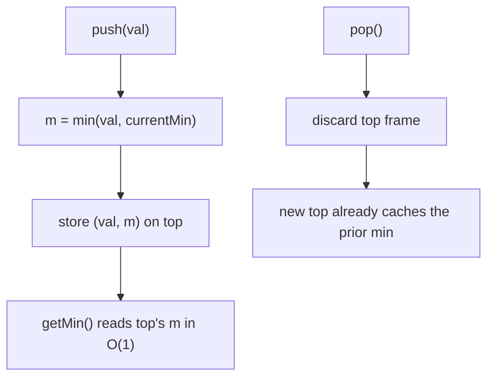

# Min Stack (O(1) getMin Design)

| Meta | Value |
|------|-------|
| Source | LeetCode #155 |
| Difficulty | Medium |
| Topics | Stack, Design, Amortized O(1) |
| Link | https://leetcode.com/problems/min-stack/ |

---

## Problem Statement

Design a stack that supports `push`, `pop`, `top`, and retrieving the minimum element — **all in
$O(1)$ time**.

- `push(val)` — push `val` onto the stack.
- `pop()` — remove the element on top of the stack.
- `top()` — get the top element.
- `getMin()` — retrieve the minimum element in the stack.

The challenge is `getMin()`: a naive scan is $O(n)$. We need it in $O(1)$.

**Example**
```
MinStack st;
st.push(-2);
st.push(0);
st.push(-3);
st.getMin();   // -> -3   (min of {-2, 0, -3})
st.pop();      // removes -3
st.top();      // ->  0
st.getMin();   // -> -2   (min of {-2, 0})
```

---

## The Core Insight

A plain stack already gives $O(1)$ `push`/`pop`/`top`. The only hard part is remembering the
minimum **as it was at each level of the stack**. The key realization:

> The minimum is **monotonic with respect to stack depth**. When you push, the new minimum is
> $\min(\text{newValue}, \text{previousMin})$. When you pop, the minimum simply **reverts** to
> whatever it was *before* that element was pushed.

So if every stack frame can recall "the min of everything at or below me," `getMin()` is just
reading the top frame. Two common ways to store that recollection:

### Approach A — Stack of `(value, currentMin)` pairs

Each entry stores the value **and** the running minimum at the moment it was pushed:

$$\text{min}_i = \min(v_i,\ \text{min}_{i-1}), \qquad \text{min}_0 = v_0$$

`getMin()` returns the second field of the top pair. Because each frame caches its own min,
popping automatically exposes the previous frame's correct min — no recomputation needed.

### Approach B — Two stacks (main + auxiliary min stack)

Keep a second `minStack` that mirrors the running minimum. On every `push`, push
$\min(\text{val}, \text{minStack.top})$ onto `minStack`. On every `pop`, pop **both** stacks
together. `minStack.top` is always the current global minimum.

Both are $O(1)$ for every operation and $O(n)$ extra space. Approach A keeps everything in one
container; Approach B keeps the two concerns separated. A space optimization on B only pushes to
`minStack` when a value is `<=` the current min (and pops when the popped value equals
`minStack.top`), trading simplicity for fewer entries.

---

## Why `getMin` is O(1)

Because we never *search* for the minimum — we **precompute and cache** it on the way in. Each
push does a single comparison and stores the result; each pop discards one cached value. Reading
the minimum is a constant-time peek at the top cached value. No traversal ever happens.



---

## Approach A — Pairs

```python
class MinStack:
    def __init__(self):
        # each entry is (value, min_so_far)
        self.stack = []

    def push(self, val: int) -> None:
        # current min is the smaller of val and the previous min
        cur_min = val if not self.stack else min(val, self.stack[-1][1])
        self.stack.append((val, cur_min))

    def pop(self) -> None:
        # dropping the top frame restores the previous min automatically
        self.stack.pop()

    def top(self) -> int:
        return self.stack[-1][0]

    def getMin(self) -> int:
        # the cached min at the top is the global min in O(1)
        return self.stack[-1][1]
```

```cpp
#include <stack>
#include <algorithm>
using namespace std;

class MinStack {
    // each entry is (value, min_so_far)
    stack<pair<int,int>> st;
public:
    MinStack() {}

    void push(int val) {
        // current min is the smaller of val and the previous min
        int curMin = st.empty() ? val : min(val, st.top().second);
        st.push({val, curMin});
    }

    void pop() {
        // dropping the top frame restores the previous min automatically
        st.pop();
    }

    int top() {
        return st.top().first;
    }

    int getMin() {
        // the cached min at the top is the global min in O(1)
        return st.top().second;
    }
};
```

---

## Approach B — Two Stacks

```python
class MinStack:
    def __init__(self):
        self.stack = []      # the real values
        self.min_stack = []  # running minimum, parallel to stack

    def push(self, val: int) -> None:
        self.stack.append(val)
        # mirror the new running minimum
        if not self.min_stack:
            self.min_stack.append(val)
        else:
            self.min_stack.append(min(val, self.min_stack[-1]))

    def pop(self) -> None:
        # pop both stacks together to stay in sync
        self.stack.pop()
        self.min_stack.pop()

    def top(self) -> int:
        return self.stack[-1]

    def getMin(self) -> int:
        # top of min_stack is always the current global min
        return self.min_stack[-1]
```

```cpp
#include <stack>
#include <algorithm>
using namespace std;

class MinStack {
    stack<int> st;       // the real values
    stack<int> minSt;    // running minimum, parallel to st
public:
    MinStack() {}

    void push(int val) {
        st.push(val);
        // mirror the new running minimum
        if (minSt.empty())
            minSt.push(val);
        else
            minSt.push(min(val, minSt.top()));
    }

    void pop() {
        // pop both stacks together to stay in sync
        st.pop();
        minSt.pop();
    }

    int top() {
        return st.top();
    }

    int getMin() {
        // top of minSt is always the current global min
        return minSt.top();
    }
};
```

---

## Iteration Trace

Operations on the example, showing both stacks (Approach B). The stack grows to the right; the
rightmost element is the top.

| Step | Operation  | `stack` (bottom → top) | `min_stack` (bottom → top) | `getMin()` |
|------|------------|------------------------|----------------------------|------------|
| 1    | push(-2)   | `[-2]`                 | `[-2]`                     | —          |
| 2    | push(0)    | `[-2, 0]`              | `[-2, -2]`                 | —          |
| 3    | push(-3)   | `[-2, 0, -3]`          | `[-2, -2, -3]`             | —          |
| 4    | getMin()   | `[-2, 0, -3]`          | `[-2, -2, -3]`             | **-3**     |
| 5    | pop()      | `[-2, 0]`              | `[-2, -2]`                 | —          |
| 6    | top()      | `[-2, 0]`              | `[-2, -2]`                 | top = 0    |
| 7    | getMin()   | `[-2, 0]`              | `[-2, -2]`                 | **-2**     |

Notice how at step 5 the pop "rewinds" `min_stack` from `-3` back to `-2` for free — exactly the
monotonic-revert property described above.

---

## Complexity

| Operation  | Time   | Space (total) |
|------------|--------|---------------|
| `push`     | $O(1)$ | $O(n)$        |
| `pop`      | $O(1)$ | —             |
| `top`      | $O(1)$ | —             |
| `getMin`   | $O(1)$ | —             |

Every operation is worst-case $O(1)$ (not just amortized), and the structure uses $O(n)$ extra
space for the cached minima.

---

## Takeaway

- The minimum over a stack is **monotonic with depth**: pushing can only lower it, and popping
  simply restores the previous level's minimum.
- Exploit that by **caching the running min at each frame** — either inline as `(value, min)`
  pairs (Approach A) or in a parallel `min_stack` (Approach B).
- Never *search* for the min; precompute it on `push` so `getMin` is a constant-time peek.
- The same "carry an auxiliary monotonic value alongside the stack" pattern generalizes to
  Max Stack and to monotonic-stack problems.
