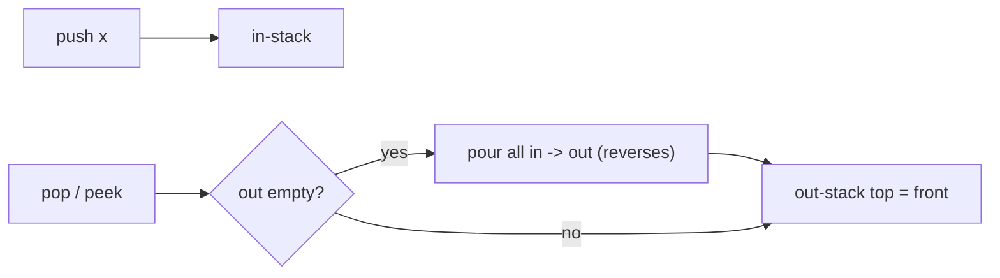

# Implement Queue using Stacks

| Meta | Value |
|------|-------|
| Source | LeetCode #232 |
| Difficulty | Easy (concept is deeper than it looks) |
| Topics | Stack, Queue, Amortized Analysis, Design |
| Link | https://leetcode.com/problems/implement-queue-using-stacks/ |

---

## Problem Statement
Implement a FIFO **queue** using only two **stacks**. Support `push(x)`, `pop()`, `peek()`,
`empty()`.

The challenge: a stack is LIFO, but a queue is FIFO — opposite orders. How do we reverse?

---

## Key Insight — Reverse Twice = Original Order

Pushing items onto a stack reverses their order. Pouring that stack into a **second** stack
reverses them **again**, restoring the original (FIFO) order. So:

- **`in` stack:** receives new pushes (top = newest).
- **`out` stack:** when we need the front, if `out` is empty, pour all of `in` into `out`. Now
  the oldest element sits on top of `out`.

```
push 1,2,3:  in = [1,2,3] (3 on top)
pour to out: out = [3,2,1] (1 on top)  <- 1 is the FIFO front!
```



---

## Code

```python
class MyQueue:
    def __init__(self):
        self.in_stack = []
        self.out_stack = []

    def push(self, x):
        self.in_stack.append(x)          # O(1)

    def _transfer(self):
        if not self.out_stack:           # only refill when empty
            while self.in_stack:
                self.out_stack.append(self.in_stack.pop())

    def pop(self):
        self._transfer()
        return self.out_stack.pop()      # amortized O(1)

    def peek(self):
        self._transfer()
        return self.out_stack[-1]

    def empty(self):
        return not self.in_stack and not self.out_stack
```

```cpp
class MyQueue {
    stack<int> in_stack;
    stack<int> out_stack;

    void _transfer() {
        if (out_stack.empty()) {          // only refill when empty
            while (!in_stack.empty()) {
                out_stack.push(in_stack.top());
                in_stack.pop();
            }
        }
    }

public:
    void push(int x) {
        in_stack.push(x);                 // O(1)
    }

    int pop() {
        _transfer();
        int x = out_stack.top();          // amortized O(1)
        out_stack.pop();
        return x;
    }

    int peek() {
        _transfer();
        return out_stack.top();
    }

    bool empty() {
        return in_stack.empty() && out_stack.empty();
    }
};
```

---

## Operation Trace

```
push(1)            in=[1]        out=[]
push(2)            in=[1,2]      out=[]
peek()  -> 1       transfer: out=[2,1]; top=1     in=[]  out=[2,1]
pop()   -> 1                                       in=[]  out=[2]
push(3)            in=[3]        out=[2]
pop()   -> 2       out not empty, just pop         in=[3] out=[]
pop()   -> 3       transfer: out=[3]; pop -> 3     in=[]  out=[]
```

The element `2` was pushed before `3` and correctly comes out first — FIFO preserved.

---

## Amortized Analysis — Why `pop` is O(1) Amortized

A single `pop` might trigger a transfer that moves `k` elements (O(k)). But **each element is
moved from `in` to `out` exactly once** in its lifetime. Over `n` operations, total transfer
work is at most `n`. So:

$$
\text{amortized cost per op} = \frac{O(n) \text{ total transfers}}{n \text{ ops}} = O(1)
$$

This is the **aggregate method** of amortized analysis. The worst *single* `pop` is O(n), but
the *average* over a sequence is O(1).

---

## Complexity

| Operation | Worst case | Amortized |
|-----------|-----------|-----------|
| push  | O(1) | O(1) |
| pop   | O(n) | **O(1)** |
| peek  | O(n) | **O(1)** |
| empty | O(1) | O(1) |
| Space | O(n) | |

---

## Common Mistake
Transferring on **every** pop (even when `out` is non-empty) breaks FIFO order and wastes work.
Only refill `out` when it is **empty** — this preserves the "each element moved once" guarantee.

## Takeaway
**Two reversals cancel out.** This design pattern (lazy transfer between two LIFO buffers) is a
clean illustration of **amortized O(1)** and appears in functional queues and undo/redo systems.
