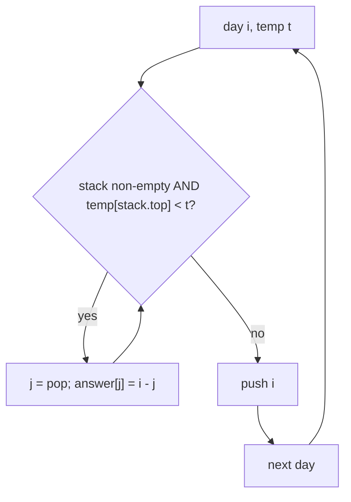

# Daily Temperatures (Next Greater Element)

| Meta | Value |
|------|-------|
| Source | LeetCode #739 |
| Difficulty | Medium |
| Topics | Monotonic Stack, Array |
| Link | https://leetcode.com/problems/daily-temperatures/ |

---

## Problem Statement
Given `temperatures[]`, return `answer[]` where `answer[i]` is the number of days you must wait
after day `i` to get a **warmer** temperature. If none, `answer[i] = 0`.

**Example**
```
Input:  temperatures = [73, 74, 75, 71, 69, 72, 76, 73]
Output: [1, 1, 4, 2, 1, 1, 0, 0]
```

---

## The "Next Greater Element" Pattern

For each day we want the **next day with a higher value**. Brute force scans forward from each
day → O(n²). A **monotonic decreasing stack** does it in O(n).

### Idea
Keep a stack of **indices** of days that are still "waiting" for a warmer day. The temperatures
of stacked indices are in **decreasing** order (top = coldest waiting day). When a warmer day
arrives, it resolves **all** colder waiting days on top of the stack.



---

## Code

```python
def daily_temperatures(temperatures):
    n = len(temperatures)
    answer = [0] * n
    stack = []                       # indices, temps decreasing
    for i, t in enumerate(temperatures):
        while stack and temperatures[stack[-1]] < t:
            j = stack.pop()
            answer[j] = i - j        # i is the first warmer day for j
        stack.append(i)
    return answer
```

```cpp
vector<int> daily_temperatures(const vector<int>& temperatures) {
    int n = temperatures.size();
    vector<int> answer(n, 0);
    stack<int> stk;                  // indices, temps decreasing
    for (int i = 0; i < n; i++) {
        int t = temperatures[i];
        while (!stk.empty() && temperatures[stk.top()] < t) {
            int j = stk.top();
            stk.pop();
            answer[j] = i - j;       // i is the first warmer day for j
        }
        stk.push(i);
    }
    return answer;
}
```

---

## Iteration Trace — `[73, 74, 75, 71, 69, 72, 76, 73]`

| i | t | pop while top temp < t | resolved answers | stack (indices→temps) |
|---|----|------------------------|------------------|------------------------|
| 0 | 73 | — | — | [0→73] |
| 1 | 74 | pop 0 (73<74) → ans[0]=1 | ans[0]=1 | [1→74] |
| 2 | 75 | pop 1 (74<75) → ans[1]=1 | ans[1]=1 | [2→75] |
| 3 | 71 | 75<71? no | — | [2→75, 3→71] |
| 4 | 69 | 71<69? no | — | [2,3,4] |
| 5 | 72 | pop 4(69),3(71) → ans[4]=1, ans[3]=2 | ans[3]=2, ans[4]=1 | [2→75, 5→72] |
| 6 | 76 | pop 5(72),2(75) → ans[5]=1, ans[2]=4 | ans[2]=4, ans[5]=1 | [6→76] |
| 7 | 73 | 76<73? no | — | [6, 7] |

Leftover indices 6,7 never get a warmer day → `answer = 0` (already initialized).
Result: `[1, 1, 4, 2, 1, 1, 0, 0]` ✓

Notice day 2 (temp 75) waits the longest — it stays on the stack until day 6 finally exceeds it,
giving `answer[2] = 6 − 2 = 4`.

---

## Why O(n) Despite the Inner Loop

Each index is **pushed once** and **popped at most once**. The total number of `while`-loop
iterations across the entire run is bounded by `n`. So the amortized cost per element is O(1):

$$
\text{total pops} \le n \;\Rightarrow\; \text{total work} = O(n)
$$

---

## Complexity

| Approach | Time | Space |
|----------|------|-------|
| Brute force | O(n²) | O(1) |
| **Monotonic stack** | **O(n)** | O(n) |

---

## Variants Using the Same Pattern
- **Next Greater Element I/II** (LeetCode 496/503) — circular version uses `i % n`.
- **Largest Rectangle in Histogram** (84) — monotonic increasing stack.
- **Stock Span** — previous greater element.

## Takeaway
A **monotonic stack** resolves "next/previous greater/smaller" queries in O(n) by storing only
*unresolved candidates*. When a new element arrives, it settles every dominated candidate at once.
