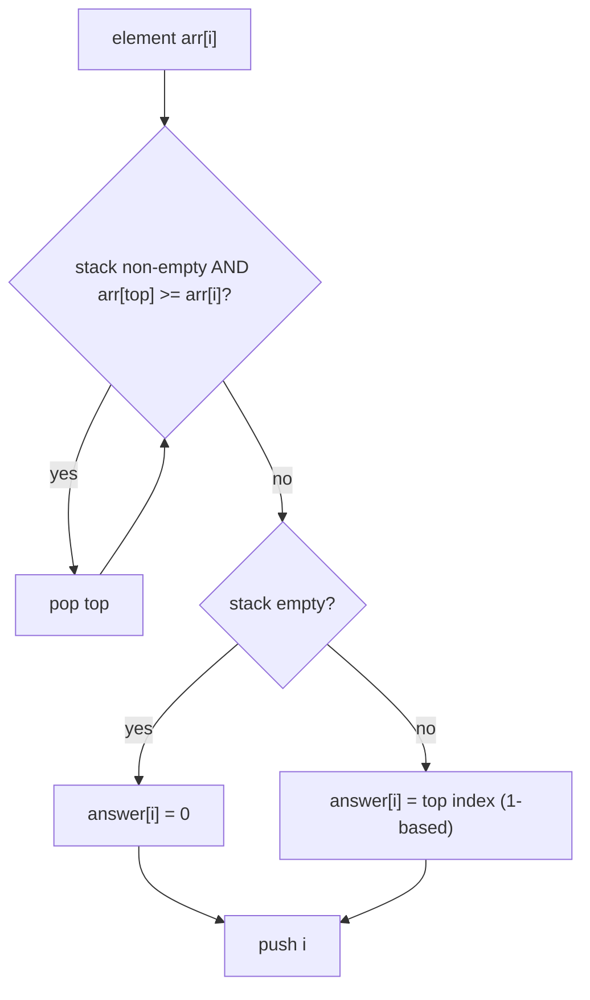

# Nearest Smaller Values (CSES — Monotonic Stack)

| Meta | Value |
|------|-------|
| Source | CSES Problem Set — Sorting and Searching |
| Difficulty | Medium |
| Topics | Monotonic Stack |
| Link | https://cses.fi/problemset/task/1645 |

---

## Problem Statement
For each position `i` in an array, find the **nearest position to its left** that holds a
**strictly smaller** value. Output that position (1-indexed), or `0` if none exists.

**Example**
```
arr = [2, 5, 1, 4, 8, 3, 2, 5]
ans = [0, 1, 0, 3, 4, 3, 0, 7]
       (for arr[1]=5, nearest smaller left is arr[0]=2 at position 1, etc.)
```

---

## Monotonic Increasing Stack

Maintain a stack of indices whose values are **strictly increasing** from bottom to top. For each
new element `arr[i]`:

1. **Pop** all stack entries with value `>= arr[i]` — they can never be the "nearest smaller" for
   `i` or for any later element (they're blocked by the smaller `arr[i]`).
2. After popping, the stack's **top** (if any) is exactly the nearest smaller value to the left.
3. **Push** `i`.



```python
def nearest_smaller_values(arr):
    n = len(arr)
    answer = [0] * n
    stack = []                         # indices, values strictly increasing
    for i in range(n):
        while stack and arr[stack[-1]] >= arr[i]:
            stack.pop()                # too big -> never the answer
        answer[i] = (stack[-1] + 1) if stack else 0   # 1-based
        stack.append(i)
    return answer
```

```cpp
vector<int> nearest_smaller_values(const vector<int>& arr) {
    int n = arr.size();
    vector<int> answer(n, 0);
    stack<int> stk;                        // indices, values strictly increasing
    for (int i = 0; i < n; i++) {
        while (!stk.empty() && arr[stk.top()] >= arr[i])
            stk.pop();                     // too big -> never the answer
        answer[i] = stk.empty() ? 0 : (stk.top() + 1);   // 1-based
        stk.push(i);
    }
    return answer;
}
```

---

## Trace — `arr = [2, 5, 1, 4, 8, 3, 2, 5]`

| i | arr[i] | pop while top ≥ arr[i] | stack (indices→vals) | answer[i] |
|---|--------|------------------------|----------------------|-----------|
| 0 | 2 | — | [0→2] | 0 |
| 1 | 5 | 2<5, keep | [0→2, 1→5] | pos of 0 → 1 |
| 2 | 1 | pop 5,pop 2 (both ≥1) | [2→1] | 0 (empty) |
| 3 | 4 | 1<4, keep | [2→1, 3→4] | pos of 2 → 3 |
| 4 | 8 | 4<8, keep | [...,4→8] | pos of 3 → 4 |
| 5 | 3 | pop 8,pop 4 (≥3) | [2→1, 5→3] | pos of 2 → 3 |
| 6 | 2 | pop 3 (≥2) | [2→1, 6→2] | pos of 2 → 3? wait top is 2→1 |
| 7 | 5 | 2<5, keep | [...,7→5] | pos of 6 → 7 |

(For `i=6`: after popping `arr[5]=3`, top is index 2 (value 1 < 2) → answer = position 3.)
Final: `[0, 1, 0, 3, 4, 3, 3, 7]` — positions of the nearest strictly-smaller-to-the-left.

---

## Why O(n) Amortized

Each index is **pushed once** and **popped at most once** over the entire run. The total number
of `while`-loop iterations is bounded by `n`. So the algorithm is **O(n)** despite the nested
loop — the same amortized argument behind all monotonic-stack solutions.

$$
\text{total pushes} + \text{total pops} \le 2n = O(n)
$$

---

## Complexity

| Metric | Value |
|--------|-------|
| Time   | O(n) |
| Space  | O(n) — the stack |

---

## The Monotonic-Stack Family
| Query | Stack monotonicity | Pop condition |
|-------|--------------------|---------------|
| Nearest smaller to left | increasing | `top >= cur` |
| Nearest greater to left | decreasing | `top <= cur` |
| Nearest smaller to right | increasing (scan right→left) | `top >= cur` |
| Next greater to right | decreasing | `top <= cur` |

Direction of scan + monotonic direction selects which neighbor you find.

## Takeaway
The **monotonic stack** answers all four "nearest smaller/greater on the left/right" queries in
O(n). It's the foundation for histogram area, stock span, and trapping-rain-water — once you see
the "pop dominated candidates" mechanic, they all become the same problem.
