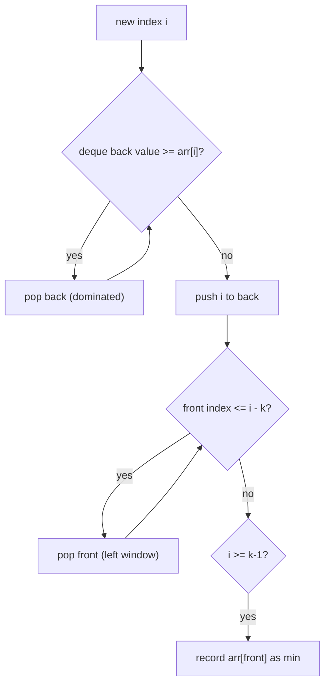

# Sliding Window Minimum (Monotonic Deque / Min-Queue)

| Meta | Value |
|------|-------|
| Source | Classic CP (Codeforces / AtCoder / CSES-style) |
| Difficulty | Medium |
| Topics | Monotonic Deque, Sliding Window, Queue |
| Link | https://codeforces.com (recurring), https://leetcode.com/problems/sliding-window-maximum/ |

---

## Problem Statement
Given an array and a window size `k`, output the **minimum** of every contiguous window of size
`k` as it slides left to right. (The maximum variant is symmetric.)

**Example**
```
arr = [3, 1, 4, 1, 5, 9, 2, 6], k = 3
windows: [3,1,4]=1, [1,4,1]=1, [4,1,5]=1, [1,5,9]=1, [5,9,2]=2, [9,2,6]=2
Output: [1, 1, 1, 1, 2, 2]
```

---

## Monotonic Deque — the Min-Queue

Maintain a **deque of indices** whose values are **increasing** front→back. The front always
holds the index of the current window's minimum. Two rules per step:

1. **Pop back** while the back's value is `>= arr[i]` — those values are dominated and can never
   be a future minimum (the smaller, newer `arr[i]` outlives them).
2. **Pop front** if it has slid out of the window (`front <= i - k`).
3. Push `i`; once `i >= k-1`, record `arr[front]` as the window minimum.



```python
from collections import deque

def sliding_window_min(arr, k):
    dq = deque()                       # indices, values increasing front->back
    out = []
    for i, v in enumerate(arr):
        while dq and arr[dq[-1]] >= v:  # remove dominated tails
            dq.pop()
        dq.append(i)
        if dq[0] <= i - k:              # front fell out of window
            dq.popleft()
        if i >= k - 1:
            out.append(arr[dq[0]])      # front = window minimum
    return out
```

```cpp
vector<int> sliding_window_min(const vector<int>& arr, int k) {
    deque<int> dq;                     // indices, values increasing front->back
    vector<int> out;
    for (int i = 0; i < (int)arr.size(); i++) {
        int v = arr[i];
        while (!dq.empty() && arr[dq.back()] >= v)  // remove dominated tails
            dq.pop_back();
        dq.push_back(i);
        if (dq.front() <= i - k)        // front fell out of window
            dq.pop_front();
        if (i >= k - 1)
            out.push_back(arr[dq.front()]);  // front = window minimum
    }
    return out;
}
```

---

## Trace — `arr = [3, 1, 4, 1, 5, 9, 2, 6]`, `k = 3`

| i | v | pop back (≥v) | push | pop front (≤i−k) | deque (idx→val) | record min |
|---|---|---------------|------|------------------|------------------|------------|
| 0 | 3 | — | 0 | — | [0→3] | — |
| 1 | 1 | pop 0(3≥1) | 1 | — | [1→1] | — |
| 2 | 4 | — | 2 | — | [1→1, 2→4] | front=1 → **1** |
| 3 | 1 | pop 2(4≥1),pop 1(1≥1) | 3 | — | [3→1] | **1** |
| 4 | 5 | — | 4 | — | [3→1, 4→5] | **1** |
| 5 | 9 | — | 5 | front 3≤5−3=2 → pop | [4→5, 5→9] | **1**? front=4→5 |
| 6 | 2 | pop 5(9≥2),pop 4(5≥2) | 6 | — | [6→2] | **2** |
| 7 | 6 | — | 7 | — | [6→2, 7→6] | **2** |

Output `[1, 1, 1, 1, 2, 2]`. The deque front is always the minimum of the current window; dominated
larger values are discarded from the back the moment a smaller value arrives.

> Note on `i=5`: after popping the out-of-window front (index 3), the new front is index 4
> (value 5), giving window `[1,5,9]` min = 1 — wait, index 3 (value 1) is at position 3 which is
> still inside window `[3,4,5]`? Window for i=5 covers indices 3,4,5. Since `front=3` and
> `i-k = 2`, `3 <= 2` is **false**, so index 3 stays → min remains **1**. (The table's pop is only
> when strictly `front <= i-k`.) This boundary check is the subtle part — get the inequality right.

---

## Why It's a "Queue"

This structure supports **enqueue** (push right), **dequeue** (pop left as window slides), and
**get-min** (peek front) — all in **amortized O(1)**. That's a **monotonic min-queue**, the
queue analogue of a min-stack.

---

## Complexity

| Approach | Time | Space |
|----------|------|-------|
| Recompute each window | O(n·k) | O(1) |
| Heap of (value, index), lazy delete | O(n log n) | O(k) |
| **Monotonic deque** | **O(n)** | O(k) |

Each index enters and leaves the deque exactly once → O(n) amortized.

---

## Min-Stack → Min-Queue
A **min-stack** tracks the min with each pushed element. A **min-queue** can be built from two
min-stacks (in/out), or — as here — directly with a monotonic deque. Both keep min queries O(1).

## Takeaway
The **monotonic deque** is the canonical O(n) tool for sliding-window min/max. Discard dominated
elements from the back, evict out-of-window elements from the front, and the front is always your
answer. Master the boundary inequality (`front <= i - k`) — it's the usual source of off-by-one
bugs.
