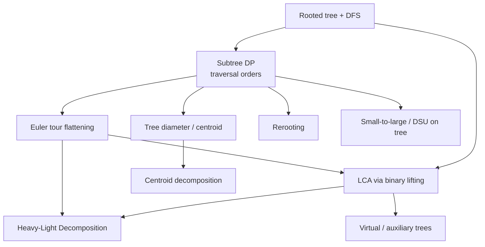

# Trees

Tree data structures and **advanced tree algorithms** for interviews and competitive
programming. The foundational guide covers binary trees, BST, balancing, traversals, and tree
DP. The numbered guides go deeper into **rooted-tree algorithms** used in contests, each with a
**complete guide** plus **curated problems** solved in **both Python and C++**.

## Structure

```
Trees/
├── guide/      # foundational complete guide + numbered advanced topic guides
└── problems/   # one file per curated problem (Python + C++, traces, diagrams, math)
```

## Foundational guide

- [Trees-Complete-Guide.md](guide/Trees-Complete-Guide.md) — terminology, binary trees,
  traversals (DFS/BFS), BST, balanced trees, tree DP, specialized trees, cheat sheet.

## Advanced topics & guides

| # | Concept | Guide | Key problems |
|---|---------|-------|--------------|
| 1 | Subtree DP / traversal orders | [01-subtree-dp-traversal-orders.md](guide/01-subtree-dp-traversal-orders.md) | Subordinates, Tree Matching, Max-weight independent set |
| 2 | Tree diameter / centroid | [02-tree-diameter-centroid.md](guide/02-tree-diameter-centroid.md) | Tree Diameter, Minimum Height Trees, Find centroid |
| 3 | LCA via binary lifting | [03-lca-binary-lifting.md](guide/03-lca-binary-lifting.md) | Company Queries II, Distance Queries, Kth Ancestor |
| 4 | Euler tour flattening | [04-euler-tour-flattening.md](guide/04-euler-tour-flattening.md) | Subtree Queries, Path Queries |
| 5 | Small-to-large / DSU on tree | [05-small-to-large-dsu-on-tree.md](guide/05-small-to-large-dsu-on-tree.md) | Lomsat gelral, Distinct colors in subtree |
| 6 | Rerooting technique | [06-rerooting.md](guide/06-rerooting.md) | Tree Distances I & II, Sum of Distances in Tree |
| 7 | Heavy-Light Decomposition | [07-heavy-light-decomposition.md](guide/07-heavy-light-decomposition.md) | QTREE path max, Path sum / path add |
| 8 | Centroid decomposition | [08-centroid-decomposition.md](guide/08-centroid-decomposition.md) | IOI Race, Count paths of length K |
| 9 | Virtual / auxiliary trees | [09-virtual-auxiliary-trees.md](guide/09-virtual-auxiliary-trees.md) | Kingdom and its Cities, Steiner tree on a tree |

## How the pieces fit together



## Recommended study order

1. **Subtree DP / traversal orders** (1) — the foundation: root, DFS, pre/post order, subtree aggregates.
2. **Tree diameter / centroid** (2) — classic two-pass and centroid finding.
3. **Euler tour flattening** (4) — subtree as a contiguous range; pairs with Fenwick/segment trees.
4. **LCA via binary lifting** (3) — ancestor jumps, distances; prerequisite for HLD and virtual trees.
5. **Rerooting** (6) — answer for every root in $O(n)$.
6. **Small-to-large / DSU on tree** (5) — subtree multiset queries in $O(n \log n)$.
7. **Heavy-Light Decomposition** (7) — path queries/updates in $O(\log^2 n)$.
8. **Centroid decomposition** (8) — aggregate over all paths.
9. **Virtual / auxiliary trees** (9) — compressed trees for many small query sets, the capstone.

## Complexity cheat sheet

| Technique | Preprocess | Query / step | Notes |
|-----------|-----------|--------------|-------|
| Subtree DP | $O(n)$ | $O(1)$ amortized | one DFS, postorder combine |
| Tree diameter (2 BFS) | — | $O(n)$ | farthest-from-farthest |
| Tree centroid | $O(n)$ | — | all components $\le n/2$ |
| LCA binary lifting | $O(n \log n)$ | $O(\log n)$ | $k$-th ancestor, distance |
| Euler tour + BIT | $O(n)$ | $O(\log n)$ | subtree = `[tin, tout]` |
| Rerooting | $O(n)$ | $O(1)$ per node | prefix/suffix over children |
| Small-to-large / DSU on tree | $O(n \log n)$ | — | subtree multiset queries |
| Heavy-Light Decomposition | $O(n)$ | $O(\log^2 n)$ | path/subtree query + update |
| Centroid decomposition | $O(n \log n)$ | — | $O(\log n)$ centroid-tree height |
| Virtual tree | $O(n \log n)$ base | $O(k \log k)$ per query | compressed marked-node tree |

---

> Every code sample appears in **both Python and C++**. Problem files follow the repo format:
> meta table → statement → approaches → Python + C++ → iteration trace → Mermaid → math →
> complexity → takeaway. Guides follow: TOC → concepts → paired code → Mermaid → math →
> complexity → pitfalls → patterns.
