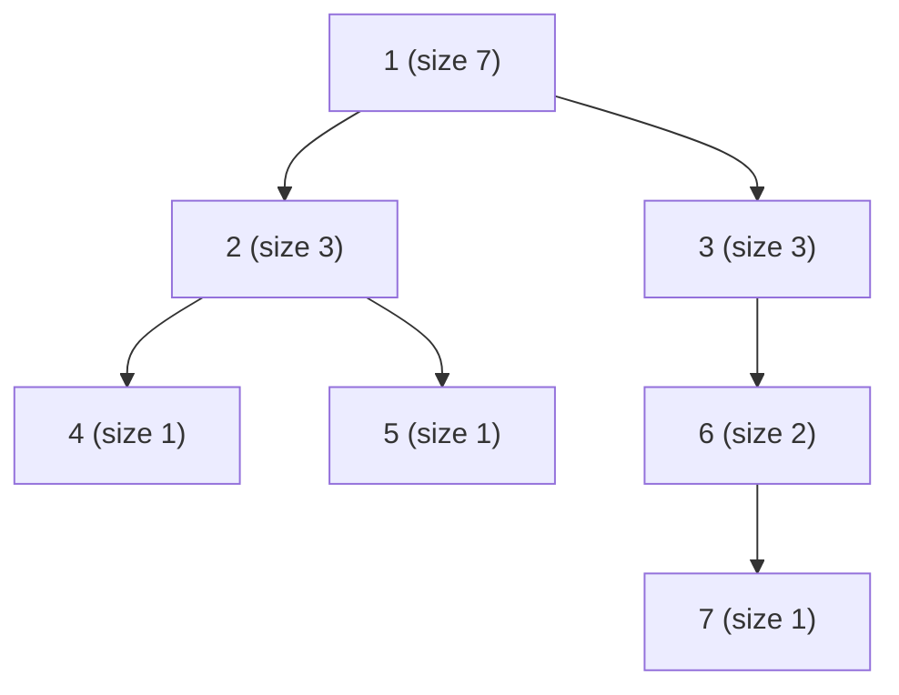

# Subtree DP and Traversal Orders

Rooted-tree dynamic programming is the workhorse of competitive tree problems. Once a tree is
**rooted** at some node, every other node has a well-defined *parent* and a set of *children*, and
the subtree of a node `v` is the node itself together with everything reachable downward through
its children. A huge family of quantities — subtree sizes, subtree sums, maximum depth, number of
leaves, best matching, maximum-weight independent set — share the same shape: the answer for `v`
is some **combination of the already-computed answers of its children**, plus a contribution from
`v` itself. The job of subtree DP is to compute those child answers *before* the parent needs
them.

That ordering is exactly what a **postorder** traversal provides. In a depth-first search we can
mark the moment we *enter* a node (preorder / "in time") and the moment we *finish* it after all
descendants are done (postorder / "out time"). Aggregating information up the tree requires the
postorder moment, because only then are all children finalized. Preorder, by contrast, is useful
for *pushing* information down (root-to-leaf accumulation) or for assigning Euler entry timestamps
that flatten the tree into an array.

This guide builds the toolkit from the ground up: how to store a general rooted tree, how to root
it with a single DFS, why postorder is the natural order for aggregation, the "return one value,
accumulate another" pattern that powers most tree DP, and an **iterative** postorder DFS that
survives trees with up to $2 \times 10^5$ nodes without blowing the call stack. Every code block
appears in paired Python and C++.

## Table of Contents
1. [Adjacency Representation of a Rooted Tree](#adjacency-representation-of-a-rooted-tree)
2. [Rooting via DFS](#rooting-via-dfs)
3. [Preorder vs Postorder (and Why Postorder Aggregates)](#preorder-vs-postorder-and-why-postorder-aggregates)
4. [Computing Subtree Size and Subtree Sum](#computing-subtree-size-and-subtree-sum)
5. [The "Return One Value, Accumulate Another" Pattern](#the-return-one-value-accumulate-another-pattern)
6. [In/Out Times (Euler Entry/Exit) — A Preview](#inout-times-euler-entryexit--a-preview)
7. [Iterative Postorder DFS for Large n](#iterative-postorder-dfs-for-large-n)
8. [Mermaid](#mermaid)
9. [Complexity Summary](#complexity-summary)
10. [Common Pitfalls](#common-pitfalls)
11. [Patterns](#patterns)

---

## Adjacency Representation of a Rooted Tree

A tree on `n` nodes has `n - 1` edges. We read those edges and store, for every node, the list of
its neighbors. At input time the edges are **undirected** — we discover the parent/child direction
later when we root the tree, so each edge is added in both directions.

```python
import sys
input_data = sys.stdin.buffer.read().split()

def read_tree(n, tokens, idx):
    adj = [[] for _ in range(n + 1)]   # 1-indexed nodes
    for _ in range(n - 1):
        a = int(tokens[idx]); b = int(tokens[idx + 1]); idx += 2
        adj[a].append(b)
        adj[b].append(a)               # undirected until rooted
    return adj, idx
```

```cpp
#include <bits/stdc++.h>
using namespace std;

vector<vector<int>> read_tree(int n) {
    vector<vector<int>> adj(n + 1);    // 1-indexed nodes
    for (int e = 0; e < n - 1; ++e) {
        int a, b;
        cin >> a >> b;
        adj[a].push_back(b);
        adj[b].push_back(a);           // undirected until rooted
    }
    return adj;
}
```

For trees given as a parent array (each node names its parent), the children lists can be built
directly, which is even simpler:

```python
def children_from_parents(n, parent):
    # parent[v] = direct parent of v, with parent[root] = 0 (or -1)
    children = [[] for _ in range(n + 1)]
    for v in range(1, n + 1):
        p = parent[v]
        if p != 0:
            children[p].append(v)
    return children
```

```cpp
vector<vector<int>> children_from_parents(int n, const vector<int>& parent) {
    // parent[v] = direct parent of v, with parent[root] = 0
    vector<vector<int>> children(n + 1);
    for (int v = 1; v <= n; ++v) {
        int p = parent[v];
        if (p != 0)
            children[p].push_back(v);
    }
    return children;
}
```

---

## Rooting via DFS

To root an undirected adjacency list at node `1`, we DFS and treat the node we *came from* as the
parent; every other neighbor is a child. This gives each node a parent pointer and an ordered list
of children, which downstream DP relies on.

```python
def root_tree(n, adj, root=1):
    parent = [0] * (n + 1)
    order = []                          # preorder sequence
    stack = [root]
    parent[root] = -1                   # sentinel: root has no parent
    seen = [False] * (n + 1)
    seen[root] = True
    while stack:
        node = stack.pop()
        order.append(node)
        for nxt in adj[node]:
            if not seen[nxt]:
                seen[nxt] = True
                parent[nxt] = node
                stack.append(nxt)
    return parent, order
```

```cpp
pair<vector<int>, vector<int>> root_tree(int n, const vector<vector<int>>& adj, int root = 1) {
    vector<int> parent(n + 1, 0);
    vector<int> order;                  // preorder sequence
    vector<int> stk = {root};
    parent[root] = -1;                  // sentinel: root has no parent
    vector<char> seen(n + 1, 0);
    seen[root] = 1;
    while (!stk.empty()) {
        int node = stk.back();
        stk.pop_back();
        order.push_back(node);
        for (int nxt : adj[node]) {
            if (!seen[nxt]) {
                seen[nxt] = 1;
                parent[nxt] = node;
                stk.push_back(nxt);
            }
        }
    }
    return {parent, order};
}
```

Using a `seen`/parent check instead of recursion means this rooting step already handles
$n = 2 \times 10^5$ without any recursion-depth worry.

---

## Preorder vs Postorder (and Why Postorder Aggregates)

- **Preorder**: visit a node *before* its children. Natural for propagating information **down**
  (e.g., depth from the root, prefix value along the root path).
- **Postorder**: visit a node *after* all its children are completely processed. Natural for
  combining information **up** (subtree size, subtree sum, subtree max).

The key invariant: a node's subtree aggregate depends on its children's aggregates, so the
children must be finalized first. Postorder guarantees that ordering. If `order` is a valid
preorder sequence, then **reversed preorder is a valid postorder** for aggregation, because a
parent always appears before its children in preorder, hence after them when reversed.

```python
def postorder_from_preorder(order):
    # order is a DFS preorder list; reversing yields a valid bottom-up order
    return list(reversed(order))
```

```cpp
vector<int> postorder_from_preorder(const vector<int>& order) {
    // order is a DFS preorder list; reversing yields a valid bottom-up order
    vector<int> rev(order.rbegin(), order.rend());
    return rev;
}
```

---

## Computing Subtree Size and Subtree Sum

With a bottom-up order in hand, subtree size and subtree sum are one-liners inside the loop. Define
`size[v]` as the number of nodes in `v`'s subtree and `subsum[v]` as the sum of node values in that
subtree:

$$
size[v] = 1 + \sum_{c \in \text{children}(v)} size[c], \qquad
subsum[v] = val[v] + \sum_{c \in \text{children}(v)} subsum[c].
$$

```python
def subtree_size_and_sum(n, parent, order, val):
    size = [1] * (n + 1)
    subsum = [0] * (n + 1)
    for v in range(1, n + 1):
        subsum[v] = val[v]
    for node in reversed(order):        # bottom-up: children before parent
        p = parent[node]
        if p != -1:
            size[p] += size[node]
            subsum[p] += subsum[node]
    return size, subsum
```

```cpp
pair<vector<long long>, vector<long long>>
subtree_size_and_sum(int n, const vector<int>& parent,
                     const vector<int>& order, const vector<long long>& val) {
    vector<long long> size(n + 1, 1);
    vector<long long> subsum(n + 1, 0);
    for (int v = 1; v <= n; ++v)
        subsum[v] = val[v];
    for (int i = (int)order.size() - 1; i >= 0; --i) {  // bottom-up
        int node = order[i];
        int p = parent[node];
        if (p != -1) {
            size[p] += size[node];
            subsum[p] += subsum[node];
        }
    }
    return {size, subsum};
}
```

---

## The "Return One Value, Accumulate Another" Pattern

Many tree-DP problems carry **two** kinds of state at each node: a value the parent needs (the
"return") and a value collected globally as a side effect (the "accumulate"). For example, when
finding the longest path through any node (tree diameter), each node *returns* its longest
downward chain to its parent, while we *accumulate* a global maximum over the two longest chains
that meet at the node.

```python
def diameter(n, adj, root=1):
    # returns (down[v], best) where down[v] = longest edge-chain going down from v,
    # and best = global diameter (max edges on any path)
    parent = [0] * (n + 1)
    order, stack = [], [root]
    parent[root] = -1
    seen = [False] * (n + 1); seen[root] = True
    while stack:
        node = stack.pop(); order.append(node)
        for nxt in adj[node]:
            if not seen[nxt]:
                seen[nxt] = True; parent[nxt] = node; stack.append(nxt)

    down = [0] * (n + 1)
    best = 0
    for node in reversed(order):        # postorder aggregation
        best1 = best2 = 0               # two longest child chains
        for nxt in adj[node]:
            if nxt != parent[node]:
                cand = down[nxt] + 1
                if cand > best1:
                    best2 = best1; best1 = cand
                elif cand > best2:
                    best2 = cand
        down[node] = best1              # return to parent
        if best1 + best2 > best:        # accumulate globally
            best = best1 + best2
    return best
```

```cpp
long long diameter(int n, const vector<vector<int>>& adj, int root = 1) {
    // down[v] = longest edge-chain going down from v; best = global diameter
    vector<int> parent(n + 1, 0), order, stk = {root};
    parent[root] = -1;
    vector<char> seen(n + 1, 0); seen[root] = 1;
    while (!stk.empty()) {
        int node = stk.back(); stk.pop_back(); order.push_back(node);
        for (int nxt : adj[node]) {
            if (!seen[nxt]) { seen[nxt] = 1; parent[nxt] = node; stk.push_back(nxt); }
        }
    }

    vector<long long> down(n + 1, 0);
    long long best = 0;
    for (int i = (int)order.size() - 1; i >= 0; --i) {  // postorder
        int node = order[i];
        long long best1 = 0, best2 = 0;  // two longest child chains
        for (int nxt : adj[node]) {
            if (nxt != parent[node]) {
                long long cand = down[nxt] + 1;
                if (cand > best1) { best2 = best1; best1 = cand; }
                else if (cand > best2) { best2 = cand; }
            }
        }
        down[node] = best1;              // return to parent
        if (best1 + best2 > best)        // accumulate globally
            best = best1 + best2;
    }
    return best;
}
```

This split — a *return value* and a *global accumulator* — is the mental template for nearly every
non-trivial tree DP.

---

## In/Out Times (Euler Entry/Exit) — A Preview

If we stamp each node with an **entry time** when we first reach it (preorder index) and an **exit
time** when we finish it, then the subtree of `v` occupies the contiguous index range
`[tin[v], tout[v]]`. This flattening turns "subtree" queries into "range" queries, unlocking
Fenwick/segment-tree techniques later.

```python
def euler_times(n, adj, root=1):
    tin = [0] * (n + 1)
    tout = [0] * (n + 1)
    timer = 0
    # iterative DFS with a state flag so we can stamp tout on the way back up
    stack = [(root, -1, False)]
    while stack:
        node, par, processed = stack.pop()
        if processed:
            tout[node] = timer; timer += 1
            continue
        tin[node] = timer; timer += 1
        stack.append((node, par, True))   # revisit to set tout
        for nxt in adj[node]:
            if nxt != par:
                stack.append((nxt, node, False))
    return tin, tout
```

```cpp
pair<vector<int>, vector<int>> euler_times(int n, const vector<vector<int>>& adj, int root = 1) {
    vector<int> tin(n + 1, 0), tout(n + 1, 0);
    int timer = 0;
    // iterative DFS with a state flag so we can stamp tout on the way back up
    vector<tuple<int,int,bool>> stk = {{root, -1, false}};
    while (!stk.empty()) {
        auto [node, par, processed] = stk.back();
        stk.pop_back();
        if (processed) {
            tout[node] = timer++;
            continue;
        }
        tin[node] = timer++;
        stk.push_back({node, par, true});     // revisit to set tout
        for (int nxt : adj[node]) {
            if (nxt != par)
                stk.push_back({nxt, node, false});
        }
    }
    return {tin, tout};
}
```

We only preview this here; range-structure queries on Euler tours are covered in the advanced data
structures guides.

---

## Iterative Postorder DFS for Large n

Recursion depth in Python defaults to about 1000, and a chain of $2 \times 10^5$ nodes will crash
it; C++ can segfault from stack overflow on equally deep recursion. The robust pattern is an
**explicit stack** with a `processed` flag: push a node, push its children, and only aggregate when
the node is popped the *second* time (after its children). The snippet below computes subtree sizes
this way.

```python
def subtree_sizes_iterative(n, children, root=1):
    size = [1] * (n + 1)
    stack = [(root, False)]
    while stack:
        node, processed = stack.pop()
        if processed:
            for c in children[node]:
                size[node] += size[c]     # children already finalized
        else:
            stack.append((node, True))    # revisit after children
            for c in children[node]:
                stack.append((c, False))
    return size
```

```cpp
vector<long long> subtree_sizes_iterative(int n, const vector<vector<int>>& children, int root = 1) {
    vector<long long> size(n + 1, 1);
    vector<pair<int,bool>> stk = {{root, false}};
    while (!stk.empty()) {
        auto [node, processed] = stk.back();
        stk.pop_back();
        if (processed) {
            for (int c : children[node])
                size[node] += size[c];    // children already finalized
        } else {
            stk.push_back({node, true});  // revisit after children
            for (int c : children[node])
                stk.push_back({c, false});
        }
    }
    return size;
}
```

> Recursion-depth caveat: if you prefer recursive DFS in Python, call
> `sys.setrecursionlimit(300000)` and run the search in a thread with a larger stack; in C++,
> recursion up to a few $\times 10^5$ usually works only after raising the stack limit. The
> iterative version above avoids the issue entirely and is the safe default for $n \le 2 \times 10^5$.

---

## Mermaid

A small rooted tree (root `1`) annotated with subtree sizes. Each node's size is `1` plus the sum
of its children's sizes, finalized in postorder.



Postorder visit (one valid order): `4, 5, 2, 7, 6, 3, 1`. Leaves finalize first; the root is last,
summing everything beneath it.

---

## Complexity Summary

| Operation | Time | Space |
|-----------|------|-------|
| Build adjacency / children | $O(n)$ | $O(n)$ |
| Root via DFS | $O(n)$ | $O(n)$ |
| Subtree size / sum (postorder) | $O(n)$ | $O(n)$ |
| Euler in/out times | $O(n)$ | $O(n)$ |
| Generic subtree DP (constant states) | $O(n)$ | $O(n)$ |

Every node and every edge is visited a constant number of times, so the entire pipeline is linear.

---

## Common Pitfalls

- **Recursion overflow**: deep chains crash recursive DFS. Use the iterative postorder stack or
  raise limits deliberately.
- **Forgetting the parent guard**: when iterating neighbors of an undirected adjacency list, skip
  the parent (`if nxt != parent`) or you will recurse back up and loop forever.
- **Aggregating in preorder**: subtree aggregates need children done first; doing the combine in
  preorder reads uninitialized child values.
- **Integer overflow in C++**: subtree sums can exceed 32-bit range; use `long long` and
  `const long long INF = 1e18` for sentinels.
- **1-indexed vs 0-indexed mismatch**: tree inputs are usually 1-indexed; size arrays of length
  `n + 1` avoid off-by-one bugs.
- **Reusing `sum`/`max`/`list` as variable names** in Python, or `size` shadowing in C++: rename
  locals that clash with keywords or library names.

## Patterns

- **Postorder aggregation**: `agg[v] = f(v, {agg[c] : c child})` — size, sum, max depth, leaf count.
- **Return one, accumulate another**: child returns a chain/value; a global variable collects the
  best combination at each node (diameter, max path sum).
- **Include/Exclude states**: each node stores DP for "node taken" vs "node not taken" (independent
  set, tree matching).
- **Euler flattening**: stamp `tin`/`tout` so a subtree becomes a contiguous range for range data
  structures.
- **Reverse-preorder trick**: a reversed preorder list is a ready-made bottom-up processing order,
  avoiding an explicit second traversal.
