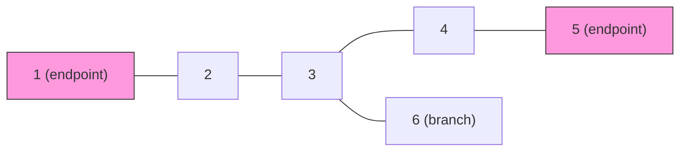
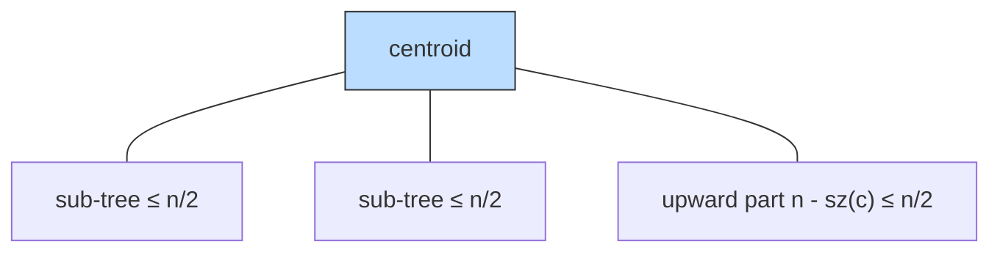
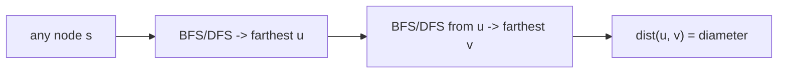

# Tree Diameter & Tree Centroid — Complete Guide

Two of the most important structural facts about a tree are its **diameter** (the longest simple
path) and its **centroid** (a "balancing" node whose removal splits the tree into small pieces).
These two concepts unlock a huge family of problems: longest-path queries, tree DP roots, and the
divide-and-conquer technique known as *centroid decomposition*.

This guide builds both ideas from scratch with **paired Python and C++** implementations, careful
proofs of *why* the algorithms work, and Mermaid diagrams to make the geometry concrete.

> The repository already contains a dedicated problem file for computing the diameter on CSES —
> see [cses-1131-tree-diameter.md](../problems/cses-1131-tree-diameter.md). This guide references it
> but focuses on the broader theory and the centroid.

---

## Table of Contents
1. [Definitions & Notation](#definitions--notation)
2. [Diameter via Two BFS/DFS Passes](#diameter-via-two-bfsdfs-passes)
3. [Why the Farthest Node Is a Diameter Endpoint](#why-the-farthest-node-is-a-diameter-endpoint)
4. [Diameter via Tree DP (Two Longest Downward Paths)](#diameter-via-tree-dp-two-longest-downward-paths)
5. [Weighted Diameter](#weighted-diameter)
6. [The Tree Centroid](#the-tree-centroid)
7. [Proof: A Tree Has 1 or 2 Centroids](#proof-a-tree-has-1-or-2-centroids)
8. [Finding the Centroid(s) via Subtree Sizes](#finding-the-centroids-via-subtree-sizes)
9. [Mermaid](#mermaid)
10. [Complexity Summary](#complexity-summary)
11. [Common Pitfalls](#common-pitfalls)
12. [Patterns](#patterns)

---

## Definitions & Notation
A **tree** is a connected, acyclic, undirected graph with $n$ nodes and $n-1$ edges. Between any two
nodes there is exactly **one** simple path — this uniqueness is the engine behind every proof below.

- $\text{dist}(u, v)$ — number of edges (or sum of edge weights) on the unique path $u \to v$.
- **Diameter** — $\max_{u,v} \text{dist}(u, v)$, i.e. the longest path in the tree. A pair $(u, v)$
  achieving the maximum are **diameter endpoints**.
- **Eccentricity** of $v$ — $\text{ecc}(v) = \max_{u} \text{dist}(v, u)$, the distance to the
  farthest node.
- **Centroid** — a node whose removal leaves every remaining component with at most $\lfloor n/2 \rfloor$
  nodes. Equivalently, the node minimizing the size of its largest "branch".

We store the tree as an adjacency list. For $n$ up to $2 \times 10^5$ we use **iterative** DFS/BFS to
avoid recursion-stack overflow.

---

## Diameter via Two BFS/DFS Passes
The simplest correct algorithm for an unweighted tree (or one with non-negative weights):

1. Pick **any** start node $s$. BFS/DFS to find the farthest node $u$.
2. BFS/DFS from $u$ to find the farthest node $v$.
3. $\text{dist}(u, v)$ is the diameter.

```python
from collections import deque

def diameter_two_bfs(n, adj):
    def bfs(start):
        dist = [-1] * (n + 1)
        dist[start] = 0
        q = deque([start])
        far_node, far_dist = start, 0
        while q:
            x = q.popleft()
            for y in adj[x]:
                if dist[y] == -1:
                    dist[y] = dist[x] + 1
                    if dist[y] > far_dist:
                        far_dist, far_node = dist[y], y
                    q.append(y)
        return far_node, far_dist

    u, _ = bfs(1)            # farthest from an arbitrary start
    v, diam = bfs(u)         # farthest from u -> the diameter
    return u, v, diam
```

```cpp
#include <bits/stdc++.h>
using namespace std;

tuple<int,int,int> diameter_two_bfs(int n, const vector<vector<int>>& adj) {
    auto bfs = [&](int start) -> pair<int,int> {
        vector<int> dist(n + 1, -1);
        dist[start] = 0;
        queue<int> q;
        q.push(start);
        int far_node = start, far_dist = 0;
        while (!q.empty()) {
            int x = q.front(); q.pop();
            for (int y : adj[x]) {
                if (dist[y] == -1) {
                    dist[y] = dist[x] + 1;
                    if (dist[y] > far_dist) {
                        far_dist = dist[y];
                        far_node = y;
                    }
                    q.push(y);
                }
            }
        }
        return {far_node, far_dist};
    };

    int u = bfs(1).first;            // farthest from an arbitrary start
    auto [v, diam] = bfs(u);         // farthest from u -> the diameter
    return {u, v, diam};
}
```

---

## Why the Farthest Node Is a Diameter Endpoint
This is the claim the two-pass method relies on:

> **Claim.** For any start node $s$, the node $u$ farthest from $s$ is an endpoint of *some* diameter.

**Proof sketch.** Let $(a, b)$ be a true diameter and let $u$ be the farthest node from $s$. Let the
path $s \to u$ first meet the diameter path $a \to b$ at node $x$ (in a tree these unique paths must
share a contiguous segment if they intersect, and they do because the diameter spans the tree's
extremes). Assume without loss of generality $\text{dist}(x, a) \ge \text{dist}(x, b)$.

Because $u$ is farthest from $s$, we have $\text{dist}(s, u) \ge \text{dist}(s, b)$, and both routes
go through $x$, so $\text{dist}(x, u) \ge \text{dist}(x, b)$. Then:

$$
\text{dist}(a, u) = \text{dist}(a, x) + \text{dist}(x, u) \ge \text{dist}(a, x) + \text{dist}(x, b) = \text{dist}(a, b).
$$

So $\text{dist}(a, u)$ is at least the diameter — hence equal to it, and $u$ is a valid diameter
endpoint. The argument uses the **uniqueness of paths** in a tree: there are no cycles to provide a
shortcut, so distances add along the meeting node $x$. $\blacksquare$

> This proof breaks on general graphs and on trees with **negative** edge weights (where "farthest"
> can mislead). For trees with non-negative weights it is exact.

---

## Diameter via Tree DP (Two Longest Downward Paths)
Root the tree anywhere. For each node $v$, let $\text{down}(v)$ be the length of the longest path
going strictly *downward* from $v$. A diameter that "turns" at $v$ uses the **two deepest** child
branches. The answer is the maximum such turn over all nodes:

$$
\text{diameter} = \max_{v}\bigl(\text{down}_1(v) + \text{down}_2(v)\bigr),
\qquad
\text{down}(v) = 1 + \max_{c \in \text{children}(v)} \text{down}(c).
$$

We compute it with one iterative post-order traversal.

```python
def diameter_tree_dp(n, adj):
    parent = [0] * (n + 1)
    order = []
    visited = [False] * (n + 1)
    st = [1]
    visited[1] = True
    while st:                          # iterative DFS to fix a post-order
        x = st.pop()
        order.append(x)
        for y in adj[x]:
            if not visited[y]:
                visited[y] = True
                parent[y] = x
                st.append(y)

    depth = [0] * (n + 1)
    best = 0
    for x in reversed(order):          # children processed before parents
        d1 = d2 = 0
        for y in adj[x]:
            if y != parent[x]:
                d = depth[y] + 1
                if d > d1:
                    d2, d1 = d1, d
                elif d > d2:
                    d2 = d
        depth[x] = d1
        if d1 + d2 > best:
            best = d1 + d2             # path turning at x
    return best
```

```cpp
#include <bits/stdc++.h>
using namespace std;

int diameter_tree_dp(int n, const vector<vector<int>>& adj) {
    vector<int> parent(n + 1, 0);
    vector<int> order;
    vector<char> visited(n + 1, false);
    vector<int> st = {1};
    visited[1] = true;
    while (!st.empty()) {              // iterative DFS to fix a post-order
        int x = st.back(); st.pop_back();
        order.push_back(x);
        for (int y : adj[x]) {
            if (!visited[y]) {
                visited[y] = true;
                parent[y] = x;
                st.push_back(y);
            }
        }
    }

    vector<int> depth(n + 1, 0);
    int best = 0;
    for (int i = (int)order.size() - 1; i >= 0; --i) {  // children before parents
        int x = order[i];
        int d1 = 0, d2 = 0;
        for (int y : adj[x]) {
            if (y != parent[x]) {
                int d = depth[y] + 1;
                if (d > d1) {
                    d2 = d1; d1 = d;
                } else if (d > d2) {
                    d2 = d;
                }
            }
        }
        depth[x] = d1;
        if (d1 + d2 > best) best = d1 + d2;             // path turning at x
    }
    return best;
}
```

The DP version generalizes cleanly to weights, negative-free or not, because it never relies on the
"farthest node" shortcut — it explicitly considers every turning point.

---

## Weighted Diameter
When edges carry weights $w(u, v)$, replace "+1" with "+ weight". The two-pass BFS becomes a
**weighted BFS over a tree** (still $O(n)$ because there are no alternative routes — a stack/queue
DFS suffices), and the DP replaces $\text{depth}[y] + 1$ with $\text{depth}[y] + w(x, y)$.

Use `long long` for accumulated distances since weights up to $10^9$ across $2\times10^5$ edges
overflow 32-bit integers.

```python
def weighted_diameter_dp(n, adj):       # adj[x] = list of (y, w)
    parent = [0] * (n + 1)
    pw = [0] * (n + 1)                   # weight of edge to parent
    order = []
    visited = [False] * (n + 1)
    st = [1]
    visited[1] = True
    while st:
        x = st.pop()
        order.append(x)
        for y, w in adj[x]:
            if not visited[y]:
                visited[y] = True
                parent[y] = x
                pw[y] = w
                st.append(y)

    depth = [0] * (n + 1)
    best = 0
    for x in reversed(order):
        d1 = d2 = 0
        for y, w in adj[x]:
            if y != parent[x]:
                d = depth[y] + w
                if d > d1:
                    d2, d1 = d1, d
                elif d > d2:
                    d2 = d
        depth[x] = d1
        if d1 + d2 > best:
            best = d1 + d2
    return best
```

```cpp
#include <bits/stdc++.h>
using namespace std;

long long weighted_diameter_dp(int n, const vector<vector<pair<int,long long>>>& adj) {
    vector<int> parent(n + 1, 0);
    vector<int> order;
    vector<char> visited(n + 1, false);
    vector<int> st = {1};
    visited[1] = true;
    while (!st.empty()) {
        int x = st.back(); st.pop_back();
        order.push_back(x);
        for (auto [y, w] : adj[x]) {
            if (!visited[y]) {
                visited[y] = true;
                parent[y] = x;
                st.push_back(y);
            }
        }
    }

    vector<long long> depth(n + 1, 0);
    long long best = 0;
    for (int i = (int)order.size() - 1; i >= 0; --i) {
        int x = order[i];
        long long d1 = 0, d2 = 0;
        for (auto [y, w] : adj[x]) {
            if (y != parent[x]) {
                long long d = depth[y] + w;
                if (d > d1) {
                    d2 = d1; d1 = d;
                } else if (d > d2) {
                    d2 = d;
                }
            }
        }
        depth[x] = d1;
        if (d1 + d2 > best) best = d1 + d2;
    }
    return best;
}
```

---

## The Tree Centroid
A **centroid** is a node $c$ such that, when removed, every resulting component has at most
$\lfloor n/2 \rfloor$ nodes. Intuitively it sits at the tree's "center of mass."

Root the tree at node $r$ and compute subtree sizes $\text{sz}(v)$. When we remove node $v$, the
components are:
- each child subtree, of size $\text{sz}(\text{child})$, and
- the "upward" component, of size $n - \text{sz}(v)$.

So $v$ is a centroid **iff** its largest branch is at most $\lfloor n/2 \rfloor$:

$$
\max\!\left(\, n - \text{sz}(v),\ \max_{c \in \text{children}(v)} \text{sz}(c) \,\right) \le \left\lfloor \tfrac{n}{2} \right\rfloor.
$$

The centroid is central to **centroid decomposition**, which builds a balanced auxiliary tree of
depth $O(\log n)$ for path/distance queries.

---

## Proof: A Tree Has 1 or 2 Centroids
**Existence + bound.** Start at any node and repeatedly move toward the *heaviest* adjacent branch
(the neighbor whose component has more than $n/2$ nodes). Each move strictly increases the size of
the component you just left, so the process cannot cycle and must stop — at a node with no branch
exceeding $\lfloor n/2 \rfloor$. That node is a centroid, so at least one exists.

**At most two.** Suppose $u$ and $v$ are both centroids. If they were non-adjacent, take a node $x$
strictly between them on the path $u \to v$. Removing $u$, the component containing $v$ has size
$\ge \text{sz}_u(v\text{-side})$; the balance conditions at $u$ and $v$ then force the in-between
node $x$ to have an even smaller maximum branch — contradicting that $u, v$ are the minimizers.
Working through the inequalities shows two centroids can only occur **adjacent** to each other, and
exactly when $n$ is **even**, splitting the tree into two halves of size $n/2$ across the shared
edge. Hence there are **1 centroid** (odd-shaped balance) or **2 adjacent centroids** (perfect even
split), never more. $\blacksquare$

A clean way to see the "two adjacent" case: if edge $(u, v)$ splits the tree into two parts each of
size exactly $n/2$, then both $u$ and $v$ satisfy the centroid condition and they are neighbors.

---

## Finding the Centroid(s) via Subtree Sizes
One iterative post-order pass computes all subtree sizes; a second linear scan checks the balance
condition for every node. Any node passing the check is a centroid (there will be one or two).

```python
def find_centroids(n, adj):
    parent = [0] * (n + 1)
    order = []
    visited = [False] * (n + 1)
    st = [1]
    visited[1] = True
    while st:
        x = st.pop()
        order.append(x)
        for y in adj[x]:
            if not visited[y]:
                visited[y] = True
                parent[y] = x
                st.append(y)

    sz = [1] * (n + 1)
    for x in reversed(order):           # children before parents
        if parent[x]:
            sz[parent[x]] += sz[x]

    centroids = []
    for x in range(1, n + 1):
        biggest = n - sz[x]             # the upward component
        for y in adj[x]:
            if y != parent[x]:
                biggest = max(biggest, sz[y])
        if biggest <= n // 2:
            centroids.append(x)
    return centroids
```

```cpp
#include <bits/stdc++.h>
using namespace std;

vector<int> find_centroids(int n, const vector<vector<int>>& adj) {
    vector<int> parent(n + 1, 0);
    vector<int> order;
    vector<char> visited(n + 1, false);
    vector<int> st = {1};
    visited[1] = true;
    while (!st.empty()) {
        int x = st.back(); st.pop_back();
        order.push_back(x);
        for (int y : adj[x]) {
            if (!visited[y]) {
                visited[y] = true;
                parent[y] = x;
                st.push_back(y);
            }
        }
    }

    vector<int> sz(n + 1, 1);
    for (int i = (int)order.size() - 1; i >= 0; --i) {   // children before parents
        int x = order[i];
        if (parent[x]) sz[parent[x]] += sz[x];
    }

    vector<int> centroids;
    for (int x = 1; x <= n; ++x) {
        int biggest = n - sz[x];        // the upward component
        for (int y : adj[x]) {
            if (y != parent[x]) biggest = max(biggest, sz[y]);
        }
        if (biggest <= n / 2) centroids.push_back(x);
    }
    return centroids;
}
```

---

## Mermaid

### Diameter endpoints
The longest path runs between two leaves; the highlighted nodes are diameter **endpoints**.



### Centroid balancing
Removing the centroid leaves every component with $\le \lfloor n/2 \rfloor$ nodes.



### Two-pass diameter pipeline



---

## Complexity Summary

| Task | Method | Time | Space |
|------|--------|------|-------|
| Unweighted diameter | Two BFS/DFS | $O(n)$ | $O(n)$ |
| Diameter (any tree) | Tree DP, one pass | $O(n)$ | $O(n)$ |
| Weighted diameter | DP with `long long` | $O(n)$ | $O(n)$ |
| Centroid(s) | Subtree sizes, two passes | $O(n)$ | $O(n)$ |
| Centroid decomposition | Recursive centroid | $O(n \log n)$ | $O(n \log n)$ |

---

## Common Pitfalls
- **Recursion depth.** A path-shaped tree of $2\times10^5$ nodes overflows the default recursion
  stack. Use the **iterative** DFS/BFS shown above.
- **Counting edges vs. nodes.** The diameter here counts *edges*. Some problems want the number of
  *nodes* on the longest path, which is `edges + 1`.
- **Negative weights + two-pass.** The "farthest node is an endpoint" property fails with negative
  weights; use the DP method or treat carefully.
- **Overflow.** Weighted distances need `long long` / `const long long INF = 1e18`, not `int`.
- **Off-by-one in the centroid test.** Use $\le \lfloor n/2 \rfloor$ (integer division). Forgetting
  the **upward** component $n - \text{sz}(v)$ is the most common bug.
- **Disconnected input.** These algorithms assume a single tree. Validate $m = n - 1$ edges and
  connectivity if unsure.

---

## Patterns
- **"Longest path in a tree"** → diameter (two-pass or DP).
- **"Minimize the maximum distance to all nodes"** → the center lies on the diameter at its
  midpoint; eccentricity is minimized there.
- **"Balance / divide the tree"** → centroid, then recurse → centroid decomposition.
- **"Re-rooting / answer for every root"** → the DP that tracks two best downward branches is the
  template for re-rooting techniques.
- **"Distance queries between many pairs"** → centroid decomposition gives $O(\log n)$ depth.

See also: [cses-1131-tree-diameter.md](../problems/cses-1131-tree-diameter.md),
[0310-minimum-height-trees.md](../problems/0310-minimum-height-trees.md),
[weighted-tree-diameter.md](../problems/weighted-tree-diameter.md),
[find-tree-centroid.md](../problems/find-tree-centroid.md).
