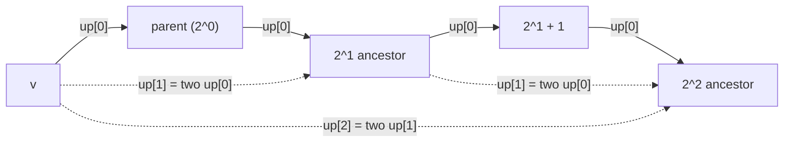
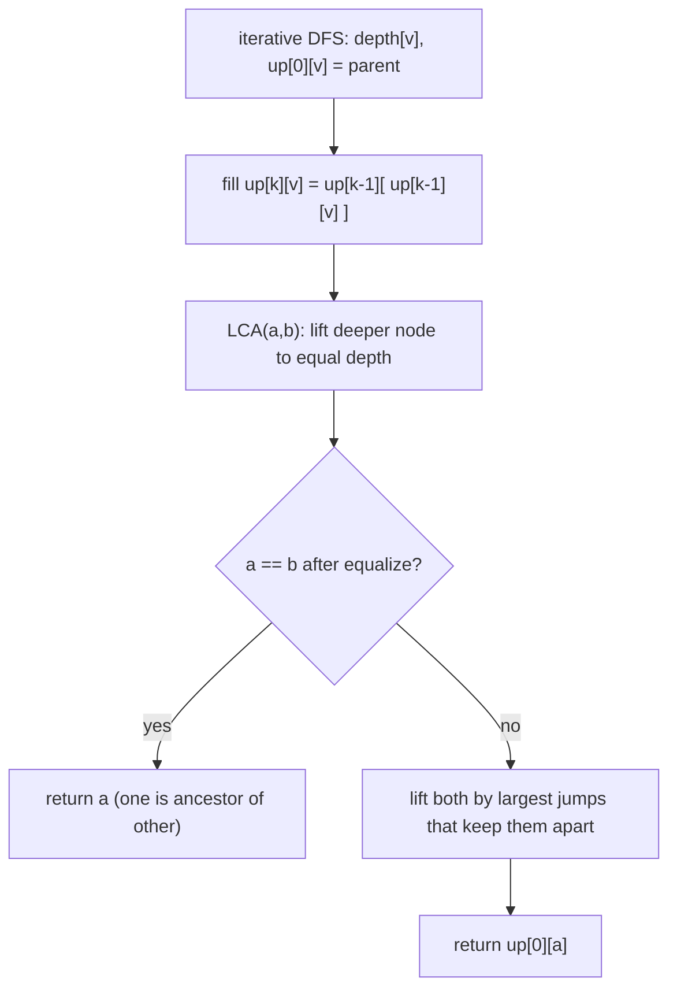

# LCA via Binary Lifting

The **Lowest Common Ancestor (LCA)** of two nodes `u` and `v` in a rooted tree is the deepest node
that is an ancestor of **both**. Binary lifting answers LCA — and the closely related *k-th
ancestor* and *tree distance* queries — in **O(log n)** each, after an **O(n log n)** preprocessing
step. The trick is to precompute, for every node, its ancestor at every **power-of-two** height, so
any vertical jump can be assembled from the **set bits** of the jump height.

> **Note:** A worked CSES example already lives at
> [cses-1688-company-queries-ii-lca.md](../problems/cses-1688-company-queries-ii-lca.md). This guide
> develops the technique in general; that file applies it to Company Queries II.

---

## Table of Contents
1. [The Up-Table `up[k][v]`](#the-up-table-upkv)
2. [Building the Table from `up[0]`](#building-the-table-from-up0)
3. [The k-th Ancestor Query](#the-k-th-ancestor-query)
4. [The LCA Query](#the-lca-query)
5. [Distance Between Two Nodes](#distance-between-two-nodes)
6. [Mermaid — Jump-Pointer Doubling](#mermaid--jump-pointer-doubling)
7. [Complexity Summary](#complexity-summary)
8. [Common Pitfalls](#common-pitfalls)
9. [Patterns](#patterns)

---

## The Up-Table `up[k][v]`

Define `up[k][v]` = the **`2^k`-th ancestor** of node `v`. That is:

- `up[0][v]` = the **direct parent** of `v` (the `2^0 = 1`-st ancestor).
- `up[1][v]` = the **grandparent** of `v` (the `2^1 = 2`-nd ancestor).
- `up[2][v]` = the **`4`-th ancestor** of `v`, and so on.

We only need `k` up to $\lceil \log_2 n \rceil$, because no ancestor jump exceeds `n`. Any height
`h` decomposes into powers of two by its binary representation, so jumping height `h` becomes a
sequence of `up[k]` jumps over the **set bits** of `h`:

$$
h = \sum_{k\,:\,\text{bit } k \text{ of } h \text{ is } 1} 2^{k}
$$

For the root we use a **sentinel**: `up[k][root] = root` (the root is its own ancestor). This keeps
queries branch-free and safe when a jump would "fall off the top" of the tree.

---

## Building the Table from `up[0]`

First compute `up[0][v]` (parent) and `depth[v]` with an **iterative** DFS — a recursive DFS risks a
stack overflow for `n` up to `2e5`. Then fill higher levels with the doubling recurrence: a `2^k`
jump is just **two** `2^{k-1}` jumps stacked.

$$
up[k][v] = up[k-1]\bigl(up[k-1][v]\bigr)
$$

```python
import sys

def precompute(n, adj, root=1):
    """adj: 1-indexed adjacency list. Returns up table, depth array, LOG."""
    LOG = max(1, (n).bit_length())
    up = [[root] * (n + 1) for _ in range(LOG)]
    depth = [0] * (n + 1)
    visited = [False] * (n + 1)

    # iterative DFS to set up[0] = parent and depth (no recursion limit issues)
    up[0][root] = root            # root's parent is itself (sentinel)
    visited[root] = True
    stack = [root]
    while stack:
        v = stack.pop()
        for w in adj[v]:
            if not visited[w]:
                visited[w] = True
                up[0][w] = v
                depth[w] = depth[v] + 1
                stack.append(w)

    # doubling: a 2^k jump = two 2^(k-1) jumps
    for k in range(1, LOG):
        upk, upk1 = up[k], up[k - 1]
        for v in range(1, n + 1):
            upk[v] = upk1[upk1[v]]
    return up, depth, LOG
```

```cpp
#include <bits/stdc++.h>
using namespace std;

// adj: 1-indexed adjacency list. Fills up, depth; returns LOG.
int precompute(int n, const vector<vector<int>>& adj,
               vector<vector<int>>& up, vector<int>& depth, int root = 1) {
    int LOG = max(1, (int)(32 - __builtin_clz((unsigned)n)));
    up.assign(LOG, vector<int>(n + 1, root));
    depth.assign(n + 1, 0);
    vector<char> visited(n + 1, false);

    // iterative DFS to set up[0] = parent and depth (no recursion overflow)
    up[0][root] = root;           // root's parent is itself (sentinel)
    visited[root] = true;
    stack<int> st;
    st.push(root);
    while (!st.empty()) {
        int v = st.top(); st.pop();
        for (int w : adj[v]) {
            if (!visited[w]) {
                visited[w] = true;
                up[0][w] = v;
                depth[w] = depth[v] + 1;
                st.push(w);
            }
        }
    }

    // doubling: a 2^k jump = two 2^(k-1) jumps
    for (int k = 1; k < LOG; ++k)
        for (int v = 1; v <= n; ++v)
            up[k][v] = up[k - 1][up[k - 1][v]];
    return LOG;
}
```

---

## The k-th Ancestor Query

To find the `k`-th ancestor of `v`, walk over the **set bits** of `k` and apply the corresponding
jump. With the root sentinel, jumping past the root lands on the root (or you can detect overflow by
tracking remaining depth and return a "no such ancestor" marker).

```python
def kth_ancestor(v, k, up, depth, LOG):
    """Return the k-th ancestor of v, or 0 if it does not exist."""
    if k > depth[v]:
        return 0                 # would climb above the root: no such ancestor
    for j in range(LOG):
        if k & (1 << j):
            v = up[j][v]
    return v
```

```cpp
// Return the k-th ancestor of v, or 0 if it does not exist.
int kth_ancestor(int v, long long k, const vector<vector<int>>& up,
                 const vector<int>& depth, int LOG) {
    if (k > (long long)depth[v])
        return 0;                // would climb above the root: no such ancestor
    for (int j = 0; j < LOG; ++j)
        if (k & (1LL << j))
            v = up[j][v];
    return v;
}
```

---

## The LCA Query

LCA runs in two phases:

1. **Equalize depth.** Lift the **deeper** node up by `depth[a] - depth[b]` (decomposed into
   power-of-two jumps over the difference's set bits). Now `a` and `b` sit at the same depth.
2. **Lift together.** From the **highest** power down, jump **both** nodes up only when their
   ancestors at that height **differ**. This stops them **just below** the LCA, so the answer is
   their common parent `up[0][a]`.

If after Phase 1 the two nodes coincide, one was an ancestor of the other and that node is the LCA.

```python
def lca(a, b, up, depth, LOG):
    if depth[a] < depth[b]:
        a, b = b, a                      # a is the deeper node
    diff = depth[a] - depth[b]
    for k in range(LOG):                 # Phase 1: lift a to b's depth
        if diff & (1 << k):
            a = up[k][a]
    if a == b:
        return a                         # b was an ancestor of a
    for k in range(LOG - 1, -1, -1):     # Phase 2: lift both while ancestors differ
        if up[k][a] != up[k][b]:
            a = up[k][a]
            b = up[k][b]
    return up[0][a]                      # parent of where they meet
```

```cpp
int lca(int a, int b, const vector<vector<int>>& up,
        const vector<int>& depth, int LOG) {
    if (depth[a] < depth[b])
        swap(a, b);                      // a is the deeper node
    int diff = depth[a] - depth[b];
    for (int k = 0; k < LOG; ++k)        // Phase 1: lift a to b's depth
        if (diff & (1 << k))
            a = up[k][a];
    if (a == b)
        return a;                        // b was an ancestor of a
    for (int k = LOG - 1; k >= 0; --k)   // Phase 2: lift both while ancestors differ
        if (up[k][a] != up[k][b]) {
            a = up[k][a];
            b = up[k][b];
        }
    return up[0][a];                     // parent of where they meet
}
```

---

## Distance Between Two Nodes

The number of edges on the unique path `u → v` is the sum of the two vertical drops from `u` and `v`
to their LCA:

$$
\operatorname{dist}(u, v) = depth[u] + depth[v] - 2 \cdot depth[\operatorname{lca}(u, v)]
$$

```python
def distance(u, v, up, depth, LOG):
    w = lca(u, v, up, depth, LOG)
    return depth[u] + depth[v] - 2 * depth[w]
```

```cpp
long long distance_uv(int u, int v, const vector<vector<int>>& up,
                      const vector<int>& depth, int LOG) {
    int w = lca(u, v, up, depth, LOG);
    return (long long)depth[u] + depth[v] - 2LL * depth[w];
}
```

---

## Mermaid — Jump-Pointer Doubling

Each level of the table doubles the reach of the previous one: `up[k]` is built by following two
`up[k-1]` pointers. The diagram shows how `up[2][v]` (the `4`-th ancestor) is assembled from two
`up[1]` (grandparent) jumps, which are themselves two `up[0]` (parent) jumps.





---

## Complexity Summary

| Operation | Time | Space |
|-----------|------|-------|
| Build `up` table | $O(n \log n)$ | $O(n \log n)$ |
| k-th ancestor query | $O(\log n)$ | — |
| LCA query | $O(\log n)$ | — |
| Distance query | $O(\log n)$ | — |
| `q` queries total | $O((n + q) \log n)$ | $O(n \log n)$ |

For `n` up to `2e5`, `LOG` is about `18`, so the table holds roughly `3.6` million ints — comfortably
within memory limits.

---

## Common Pitfalls

- **Recursive DFS overflow.** For `n` up to `2e5`, a recursive depth-first traversal can blow the
  call stack (a path graph has depth `n`). Always use an **iterative** DFS/BFS for the precompute, as
  shown above.
- **Wrong `LOG`.** If `LOG` is too small, deep jumps silently truncate and queries return wrong
  ancestors. Use `LOG = ceil(log2(n))` (e.g. `(n).bit_length()` in Python, `32 - __builtin_clz(n)` in
  C++) and never less than `1`.
- **Missing root sentinel.** Set `up[k][root] = root` so a jump past the root stays at the root
  instead of indexing out of bounds.
- **Phase 2 direction.** The "lift together" loop must run from the **highest** power **down** to
  `0`. Going low-to-high overshoots and lands on or above the LCA.
- **Off-by-one in distance.** `dist` counts **edges**; multiply the LCA depth by `2`, not the sum.
- **Overflow on weighted variants.** When accumulating path *weights* (not edge counts), use
  `long long` — sums over `2e5` edges with large weights overflow 32-bit ints.

---

## Patterns

- **Equalize-then-lift.** The two-phase LCA (align depths, then jump both nodes together) is the core
  pattern; reuse it verbatim across problems.
- **Set-bit decomposition.** Any vertical jump of height `h` = apply `up[k]` for each set bit `k` of
  `h`. This single idea powers k-th ancestor, depth alignment, and "level ancestor" queries.
- **LCA as a distance primitive.** `dist(u,v) = depth[u] + depth[v] - 2*depth[lca]` turns path-length
  questions into one LCA call (see
  [cses-1135-distance-queries.md](../problems/cses-1135-distance-queries.md)).
- **Augmented tables.** Alongside `up[k][v]`, store a combined value (min/max/sum of edge weights over
  the `2^k` jump) to answer **path aggregate** queries in the same `O(log n)`.
- **Offline alternative.** When all queries are known in advance, Tarjan's offline LCA with DSU runs
  in near-linear time — but binary lifting is simpler and supports **online** queries.
