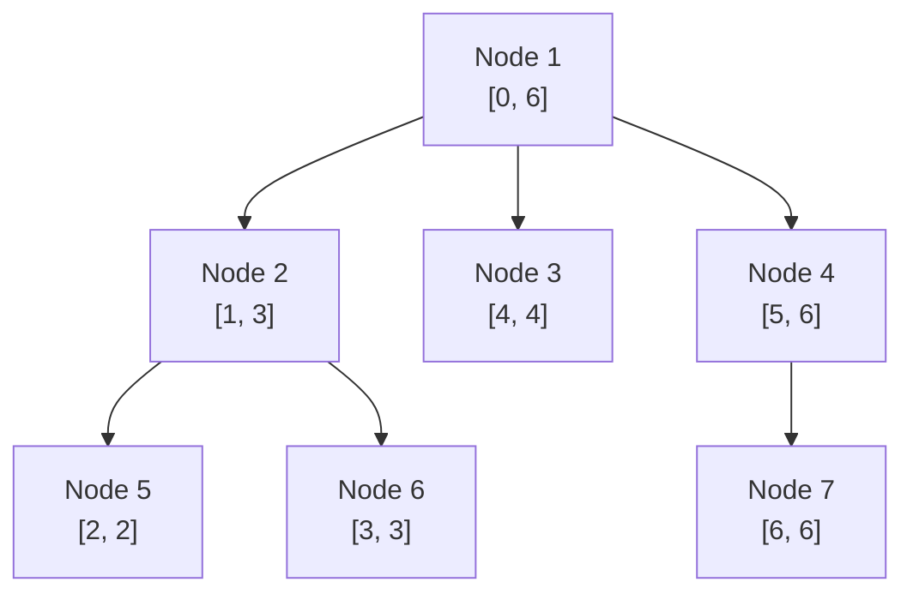
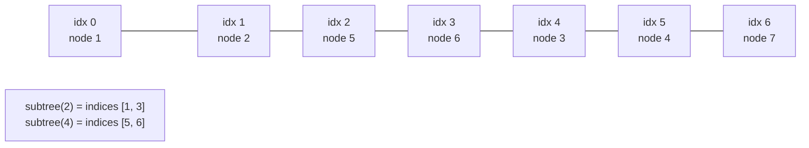

# Euler Tour Flattening of Trees

**Euler tour flattening** turns a rooted tree into a flat array so that *tree* questions become
*array* questions. The single most useful fact is this: if you record the **entry time**
`tin[v]` and **exit time** `tout[v]` of every node during a DFS, then the **subtree of `v`** is
exactly the **contiguous interval** $[\,tin[v],\, tout[v]\,]$ of that array. Once a subtree is a
range, every range data structure you already know — a **Fenwick/BIT** or a **segment tree** —
instantly supports subtree updates and subtree queries in $O(\log n)$.

There are two flavours of the tour, and this guide covers both:

- **Entry/exit (tin/tout) flattening** — each node is written **once**; a subtree is one range.
- **Node-appears-twice Euler tour** — each node is written on the way **in** and again on the way
  **out**; this powers **root-to-node path sums** (the "+1 on enter / −1 on exit" trick) and the
  **LCA-by-RMQ** technique.

---

## Table of Contents
1. [tin / tout: Entry and Exit Times](#tin--tout-entry-and-exit-times)
2. [Why a Subtree Is a Contiguous Interval](#why-a-subtree-is-a-contiguous-interval)
3. [Computing tin/tout Iteratively](#computing-tintout-iteratively)
4. [Subtree Update + Subtree Query via BIT](#subtree-update--subtree-query-via-bit)
5. [Point Update + Root-Path Query: the +1/−1 Trick](#point-update--root-path-query-the-11-trick)
6. [The Node-Appears-Twice Euler Tour](#the-node-appears-twice-euler-tour)
7. [LCA by RMQ — a Preview](#lca-by-rmq--a-preview)
8. [Mermaid](#mermaid)
9. [Complexity Summary](#complexity-summary)
10. [Common Pitfalls](#common-pitfalls)
11. [Patterns](#patterns)

---

## tin / tout: Entry and Exit Times

Run a DFS from the root. Keep a global counter `timer` that starts at `0`. The moment you **enter**
a node `v`, assign `tin[v] = timer` and increment `timer`. After you have fully explored every
descendant of `v` and are about to **leave** it, assign `tout[v] = timer - 1` (the last position
that belongs to `v`'s subtree).

With this convention each node owns **exactly one** slot in a flat array of length `n`, indexed by
`tin`. The order of nodes in that array is the **preorder** of the DFS.

Consider this tree rooted at `1`:

```
        1
      / | \
     2  3  4
    / \      \
   5   6      7
```

A DFS visiting children in increasing order produces:

| node `v` | 1 | 2 | 5 | 6 | 3 | 4 | 7 |
|----------|---|---|---|---|---|---|---|
| `tin[v]` | 0 | 1 | 2 | 3 | 4 | 5 | 6 |
| `tout[v]`| 6 | 3 | 2 | 3 | 4 | 6 | 6 |

Reading nodes by entry time gives the **flattened array order**: `1, 2, 5, 6, 3, 4, 7`.

---

## Why a Subtree Is a Contiguous Interval

The key insight is about **how DFS visits time**. When DFS enters `v` it stamps `tin[v]`, then it
recurses into **all** descendants of `v` *before* it can return and stamp `tout[v]`. Crucially, a
DFS never "interleaves" subtrees: it finishes one child's entire subtree before starting the next.

So between the instant we enter `v` and the instant we leave `v`, the only nodes that receive an
entry time are `v` itself and its descendants — **nobody else**. Therefore:

$$u \in \text{subtree}(v) \iff tin[v] \le tin[u] \le tout[v].$$

Every descendant's entry time lands inside $[tin[v], tout[v]]$, and every non-descendant's entry
time lands strictly outside it. That is the entire trick: **subtree membership becomes an interval
test**, and the descendants occupy a *contiguous* block because no foreign node can sneak a
timestamp in between.

A handy corollary: the subtree of `v` has exactly `tout[v] - tin[v] + 1` nodes.

---

## Computing tin/tout Iteratively

For competitive constraints (`n` up to $2 \cdot 10^5$), a recursive DFS risks a **stack overflow**
(Python's default recursion limit, and the OS stack in C++). Use an **explicit stack**. The trick
for assigning `tout` correctly is to push each node twice, or to push a `(node, child_index)`
state, or — cleanest — push the node, and on the *second* time we pop a marker, stamp `tout`.

Below, we push `(v, parent, visited_flag)`. The first time we see `v` we stamp `tin` and re-push it
as "visited" *after* its children; when we pop the "visited" copy we stamp `tout`.

```python
import sys

def euler_tin_tout(n: int, adj: list[list[int]], root: int = 0):
    tin = [0] * n
    tout = [0] * n
    timer = 0
    # stack holds (node, parent, is_exit)
    stack = [(root, -1, False)]
    while stack:
        v, parent, is_exit = stack.pop()
        if is_exit:
            tout[v] = timer - 1
            continue
        tin[v] = timer
        timer += 1
        # schedule the exit stamp, then push children (reverse for natural order)
        stack.append((v, parent, True))
        for u in reversed(adj[v]):
            if u != parent:
                stack.append((u, v, False))
    return tin, tout
```

```cpp
#include <bits/stdc++.h>
using namespace std;

void euler_tin_tout(int n, const vector<vector<int>>& adj, int root,
                    vector<int>& tin, vector<int>& tout) {
    tin.assign(n, 0);
    tout.assign(n, 0);
    int timer = 0;
    // stack holds (node, parent, is_exit)
    struct Frame { int v, parent; bool is_exit; };
    vector<Frame> stack;
    stack.push_back({root, -1, false});
    while (!stack.empty()) {
        Frame f = stack.back();
        stack.pop_back();
        if (f.is_exit) {
            tout[f.v] = timer - 1;
            continue;
        }
        tin[f.v] = timer;
        timer += 1;
        // schedule the exit stamp, then push children (reverse for natural order)
        stack.push_back({f.v, f.parent, true});
        for (auto it = adj[f.v].rbegin(); it != adj[f.v].rend(); ++it) {
            if (*it != f.parent) stack.push_back({*it, f.v, false});
        }
    }
}
```

---

## Subtree Update + Subtree Query via BIT

Now flatten the node values into an array `flat` of length `n`, where `flat[tin[v]] = value[v]`.
Because the subtree of `v` is the range $[tin[v], tout[v]]$:

- **Subtree sum query** = range-sum over $[tin[v], tout[v]]$.
- **Point update of one node** = point update at index `tin[v]`.

A single **Fenwick tree** (BIT) over `flat` handles point update + prefix sum, and a range sum is
two prefix sums. This is exactly the CSES *Subtree Queries* setup.

```python
class BIT:
    def __init__(self, n: int):
        self.n = n
        self.tree = [0] * (n + 1)  # 1-indexed

    def update(self, i: int, delta: int) -> None:
        i += 1  # shift 0-indexed position to 1-indexed
        while i <= self.n:
            self.tree[i] += delta
            i += i & (-i)

    def prefix(self, i: int) -> int:
        # sum of flat[0..i] inclusive, i is 0-indexed
        i += 1
        s = 0
        while i > 0:
            s += self.tree[i]
            i -= i & (-i)
        return s

    def range_sum(self, l: int, r: int) -> int:
        # inclusive [l, r], both 0-indexed
        return self.prefix(r) - (self.prefix(l - 1) if l > 0 else 0)


def subtree_sum(bit: BIT, tin: list[int], tout: list[int], v: int) -> int:
    return bit.range_sum(tin[v], tout[v])
```

```cpp
#include <bits/stdc++.h>
using namespace std;

struct BIT {
    int n;
    vector<long long> tree;  // 1-indexed
    BIT(int n) : n(n), tree(n + 1, 0) {}

    void update(int i, long long delta) {
        i += 1;  // shift 0-indexed position to 1-indexed
        for (; i <= n; i += i & (-i)) tree[i] += delta;
    }

    long long prefix(int i) {
        // sum of flat[0..i] inclusive, i is 0-indexed
        i += 1;
        long long s = 0;
        for (; i > 0; i -= i & (-i)) s += tree[i];
        return s;
    }

    long long range_sum(int l, int r) {
        // inclusive [l, r], both 0-indexed
        return prefix(r) - (l > 0 ? prefix(l - 1) : 0LL);
    }
};

long long subtree_sum(BIT& bit, const vector<int>& tin,
                      const vector<int>& tout, int v) {
    return bit.range_sum(tin[v], tout[v]);
}
```

To **change a node's value** from `old` to `new`, do `bit.update(tin[v], new - old)`. Subtree sums
update automatically because every ancestor's interval contains `tin[v]`.

---

## Point Update + Root-Path Query: the +1/−1 Trick

The flattening is a **duality machine**. Swap *what* you store in the BIT and the same Euler
positions answer the **opposite** question — the **root-to-node path sum**.

Build a BIT over the **node-appears-twice** Euler array. When a node `v` is assigned value `x`,
record `+x` at the **entry** position `tin[v]` and `-x` at the **exit** position `tout2[v]` (the
exit slot in the doubled tour). Then the **prefix sum up to `tin[v]`** equals the sum of values on
the path from the **root down to `v`**.

Why? A node `u` is an **ancestor of `v`** iff `tin[u] <= tin[v] <= tout[u]`. For such an ancestor
both its `+x` (at `tin[u]`) and — importantly — its `-x` (at the exit, which comes *after* `tin[v]`)
straddle `tin[v]`. So when we take the prefix up to `tin[v]`, the `+x` of every ancestor is counted
but its cancelling `-x` is **not yet reached**, leaving exactly one `+x` per ancestor. For any
non-ancestor, either both marks are before `tin[v]` (they cancel) or both are after (neither
counted). The surviving terms are precisely the ancestors of `v` plus `v` itself — the **path to
the root**.

The dual is just as clean: to **add `d` to the whole subtree of `v`** and later query a single
node, do a range update `[tin[v], tout[v]] += d` and a point query — that is the standard BIT
range-update/point-query pair. *Point update on a path / subtree query* and *subtree update / point
query on the path* are two sides of the same coin.

```python
class PathBIT:
    """BIT over the doubled Euler array: +x at entry, -x at exit.
    prefix(tin[v]) == sum of values from root down to v."""
    def __init__(self, size: int):
        self.n = size
        self.tree = [0] * (size + 1)

    def _add(self, i: int, delta: int) -> None:
        i += 1
        while i <= self.n:
            self.tree[i] += delta
            i += i & (-i)

    def prefix(self, i: int) -> int:
        i += 1
        s = 0
        while i > 0:
            s += self.tree[i]
            i -= i & (-i)
        return s

    def set_node(self, tin_v: int, tout2_v: int, delta: int) -> None:
        # apply a change of +delta to node v's value
        self._add(tin_v, delta)
        self._add(tout2_v, -delta)

    def root_path_sum(self, tin_v: int) -> int:
        return self.prefix(tin_v)
```

```cpp
#include <bits/stdc++.h>
using namespace std;

struct PathBIT {
    // BIT over the doubled Euler array: +x at entry, -x at exit.
    // prefix(tin[v]) == sum of values from root down to v.
    int n;
    vector<long long> tree;
    PathBIT(int size) : n(size), tree(size + 1, 0) {}

    void add(int i, long long delta) {
        i += 1;
        for (; i <= n; i += i & (-i)) tree[i] += delta;
    }

    long long prefix(int i) {
        i += 1;
        long long s = 0;
        for (; i > 0; i -= i & (-i)) s += tree[i];
        return s;
    }

    void set_node(int tin_v, int tout2_v, long long delta) {
        // apply a change of +delta to node v's value
        add(tin_v, delta);
        add(tout2_v, -delta);
    }

    long long root_path_sum(int tin_v) {
        return prefix(tin_v);
    }
};
```

---

## The Node-Appears-Twice Euler Tour

For path problems we use a tour of length `2n` where each node is appended **when entered** and
**again when its DFS finishes**. Call these positions `tin2[v]` (first occurrence) and `tout2[v]`
(second occurrence).

For the tree above (`1` with children `2,3,4`; `2` with children `5,6`; `4` with child `7`):

```
Euler (twice):   1  2  5  5  6  6  2  3  3  4  7  7  4  1
position:        0  1  2  3  4  5  6  7  8  9 10 11 12 13
```

Two structural facts make this tour powerful:

1. For a node `v`, the segment $[tin2[v], tout2[v]]$ contains **every occurrence** of every node in
   `v`'s subtree. This is the path/subtree duality used by the +1/−1 trick.
2. The **LCA** of two nodes `u, v` is the node with **minimum depth** among all entries between
   `tin2[u]` and `tin2[v]`. That converts LCA into a **Range-Minimum Query**.

```python
def euler_twice(n: int, adj: list[list[int]], root: int = 0):
    order = []           # the 2n-length Euler sequence of node ids
    depth_seq = []       # depth aligned with order, for LCA-by-RMQ
    first = [-1] * n     # first occurrence index of each node
    depth = [0] * n
    # stack of (node, parent, child_ptr); we emit on enter and on each return
    stack = [(root, -1, 0)]
    depth[root] = 0
    order.append(root); depth_seq.append(0); first[root] = 0
    while stack:
        v, parent, ptr = stack.pop()
        advanced = False
        while ptr < len(adj[v]):
            u = adj[v][ptr]
            ptr += 1
            if u != parent:
                stack.append((v, parent, ptr))   # resume v later
                depth[u] = depth[v] + 1
                first[u] = len(order)
                order.append(u); depth_seq.append(depth[u])
                stack.append((u, v, 0))           # descend into u
                advanced = True
                break
        if not advanced and stack:
            # we just finished v's children; re-emit the node we return TO
            p = stack[-1][0]
            order.append(p); depth_seq.append(depth[p])
    return order, depth_seq, first
```

```cpp
#include <bits/stdc++.h>
using namespace std;

void euler_twice(int n, const vector<vector<int>>& adj, int root,
                 vector<int>& order, vector<int>& depth_seq,
                 vector<int>& first) {
    order.clear();
    depth_seq.clear();
    first.assign(n, -1);
    vector<int> depth(n, 0);
    // stack of (node, parent, child_ptr); emit on enter and on each return
    struct Frame { int v, parent, ptr; };
    vector<Frame> stack;
    depth[root] = 0;
    order.push_back(root); depth_seq.push_back(0); first[root] = 0;
    stack.push_back({root, -1, 0});
    while (!stack.empty()) {
        Frame f = stack.back();
        stack.pop_back();
        bool advanced = false;
        while (f.ptr < (int)adj[f.v].size()) {
            int u = adj[f.v][f.ptr];
            f.ptr += 1;
            if (u != f.parent) {
                stack.push_back({f.v, f.parent, f.ptr});  // resume v later
                depth[u] = depth[f.v] + 1;
                first[u] = (int)order.size();
                order.push_back(u); depth_seq.push_back(depth[u]);
                stack.push_back({u, f.v, 0});             // descend into u
                advanced = true;
                break;
            }
        }
        if (!advanced && !stack.empty()) {
            // finished v's children; re-emit the node we return TO
            int p = stack.back().v;
            order.push_back(p); depth_seq.push_back(depth[p]);
        }
    }
}
```

---

## LCA by RMQ — a Preview

Given the `depth_seq` aligned with the Euler `order`, the LCA of `u` and `v` is found by taking the
range $[\min(first[u], first[v]),\ \max(first[u], first[v])]$ of `depth_seq`, locating the index of
the **minimum depth**, and reading the node id at that index in `order`. With a **sparse table**
over `depth_seq` this is $O(1)$ per query after $O(n \log n)$ preprocessing.

```python
def lca_preview(order, depth_seq, first, u, v):
    l, r = first[u], first[v]
    if l > r:
        l, r = r, l
    # linear scan here for clarity; replace with a sparse table for O(1)
    best = l
    for i in range(l, r + 1):
        if depth_seq[i] < depth_seq[best]:
            best = i
    return order[best]
```

```cpp
#include <bits/stdc++.h>
using namespace std;

int lca_preview(const vector<int>& order, const vector<int>& depth_seq,
                const vector<int>& first, int u, int v) {
    int l = first[u], r = first[v];
    if (l > r) swap(l, r);
    // linear scan here for clarity; replace with a sparse table for O(1)
    int best = l;
    for (int i = l; i <= r; ++i) {
        if (depth_seq[i] < depth_seq[best]) best = i;
    }
    return order[best];
}
```

---

## Mermaid

The flattening maps each node to an interval `[tin, tout]`. Notice how each child's interval nests
strictly inside its parent's, never overlapping a sibling — that nesting is precisely *why* a
subtree is contiguous.



The same tree as a flat array indexed by `tin`, with subtree ranges highlighted:



---

## Complexity Summary

| Operation | Time | Notes |
|-----------|------|-------|
| Build tin/tout (iterative DFS) | $O(n)$ | one pass, no recursion overflow |
| Build doubled Euler tour | $O(n)$ | array of length $2n$ |
| Subtree sum query (BIT) | $O(\log n)$ | range sum over $[tin[v], tout[v]]$ |
| Point update of a node (BIT) | $O(\log n)$ | update at index $tin[v]$ |
| Root-path sum (+1/−1 BIT) | $O(\log n)$ | prefix up to $tin[v]$ |
| Subtree add + node query (range-update BIT) | $O(\log n)$ | range update on $[tin[v], tout[v]]$ |
| Subtree add + subtree sum (lazy segtree) | $O(\log n)$ | needs lazy propagation |
| LCA after sparse-table build | $O(1)$ query | $O(n \log n)$ preprocessing |
| Memory | $O(n)$ | $O(n \log n)$ if a sparse table is used |

---

## Common Pitfalls

- **Off-by-one on `tout`.** If you increment `timer` on entry only, set `tout[v] = timer - 1`. If
  you increment on both entry and exit, the conventions differ — be consistent and test on a tiny
  tree.
- **Recursive DFS blowing the stack.** For `n` up to $2 \cdot 10^5$, a chain (bamboo) tree causes
  deep recursion. Use the iterative DFS shown here, or raise the recursion limit *and* run in a
  thread in Python.
- **Mixing 0-indexed and 1-indexed.** The BIT here is internally 1-indexed but the public API takes
  0-indexed positions; pick one convention for `tin` and stick to it.
- **Forgetting the subtree includes `v` itself.** The interval $[tin[v], tout[v]]$ contains `v`, so
  a subtree sum already counts the node's own value.
- **Using the single tour for path-to-root.** The +1/−1 path trick needs the **doubled** tour (two
  occurrences) so the cancelling `-x` sits *after* the entry of every descendant.
- **`long long` overflow in C++.** Subtree sums of up to $2 \cdot 10^5$ values each up to $10^9$
  exceed 32 bits; use `long long` everywhere in the BIT.

---

## Patterns

- **"Subtree" in the statement → flatten to `[tin, tout]`.** Any per-subtree aggregate (sum, count,
  min with a segment tree, etc.) becomes a range query.
- **"Path from the root" → +1/−1 on the doubled tour.** Point-update a node, query a prefix.
- **"Path between two nodes" → combine with LCA.** Split `u → v` into `u → lca` and `v → lca`; Euler
  + RMQ gives the LCA, and root-path prefix sums give path aggregates by inclusion–exclusion.
- **"Add to a subtree, query a node" → range-update / point-query BIT.** The dual of subtree-sum.
- **"Add to a subtree, sum a subtree" → lazy segment tree over the flattened array.** Both endpoints
  of the operation are ranges, so you need lazy propagation.
- **Reuse one flattening for everything.** Compute `tin`, `tout`, and the doubled tour once, then
  attach whichever structure (BIT, segment tree, sparse table) the query type demands.
