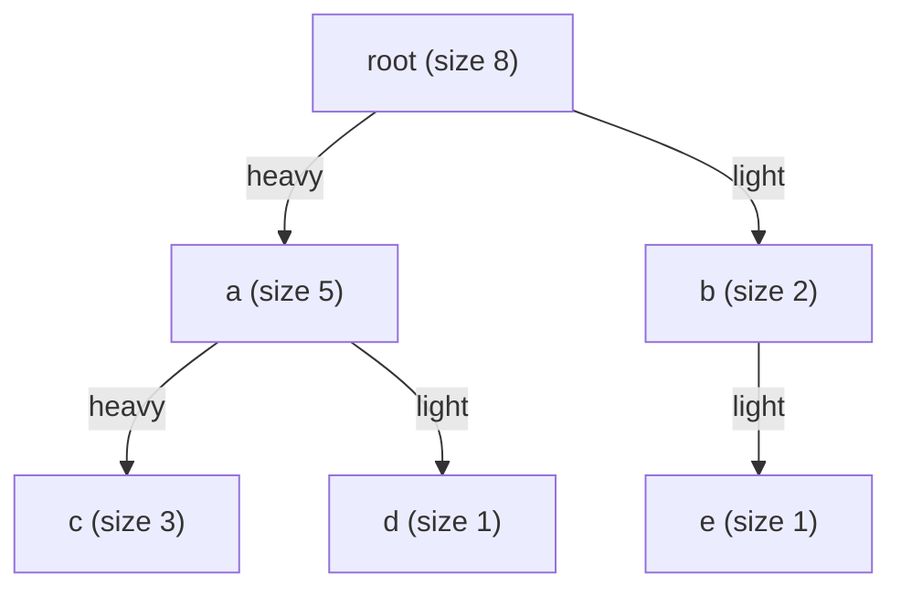
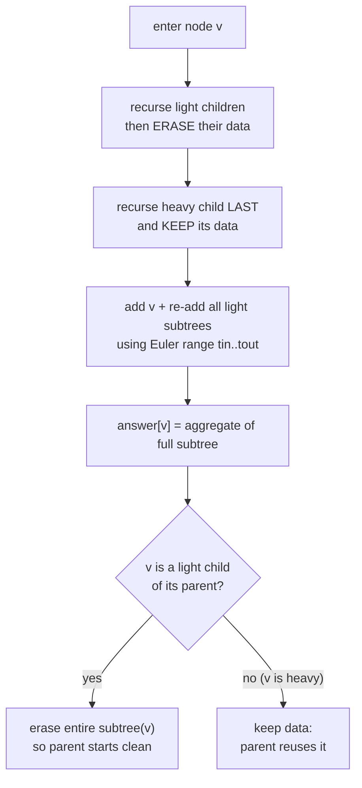
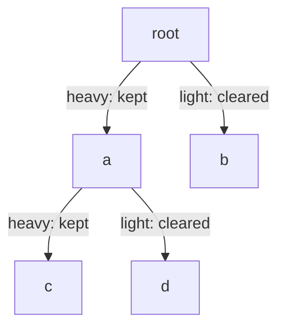

# Small-to-Large Merging & DSU on Tree (Sack)

Many tree problems ask: *for every subtree, answer a question about the **multiset** of values (colors, labels, weights) it contains.* Examples: how many **distinct** colors are in each subtree? what is the **most frequent** color? what is the **sum of the most frequent colors**? Naively rebuilding a frequency table at every node costs $O(n^2)$.

Two closely related techniques bring this down to $O(n \log n)$:

- **Small-to-large merging** — when combining two multisets, always insert the **smaller** one into the **larger** one. Each element then migrates at most $O(\log n)$ times in its lifetime.
- **DSU on tree (the "sack" technique)** — a heavy-path refinement that keeps the **heavy child's** frequency data in place and only recomputes the **light children**, reaching $O(n \log n)$ without ever copying the big set.

Both rely on the same counting argument; DSU on tree just realizes it with a single global frequency array instead of one map per node, which is faster in practice.

---

## Table of Contents

1. [Why Naive Is O(n^2)](#why-naive-is-on2)
2. [The Small-to-Large Merging Principle](#the-small-to-large-merging-principle)
3. [Generic Small-to-Large Set Merging](#generic-small-to-large-set-merging)
4. [Heavy Child Decomposition](#heavy-child-decomposition)
5. [DSU on Tree (Sack) Template](#dsu-on-tree-sack-template)
6. [Template: Answer a Multiset Query per Subtree](#template-answer-a-multiset-query-per-subtree)
7. [Mermaid: Keep Heavy / Clear Light](#mermaid-keep-heavy--clear-light)
8. [Complexity Summary](#complexity-summary)
9. [Common Pitfalls](#common-pitfalls)
10. [Patterns](#patterns)

---

## Why Naive Is O(n^2)

Suppose each node has a color and we want, for every subtree, the number of distinct colors. The obvious recursion returns a `set` (or frequency map) per node and merges children:

$$
\text{cnt}[v] = \{c_v\} \cup \bigcup_{u \in \text{children}(v)} \text{cnt}[u]
$$

If we merge by **copying the child into the parent unconditionally**, a long path (a "bamboo") copies the whole set up the chain $n$ times: $O(n)$ work per level $\times\ n$ levels $= O(n^2)$. We need a smarter merge order.

---

## The Small-to-Large Merging Principle

> **Rule:** when merging two multisets $A$ and $B$, iterate over the **smaller** one and insert its elements into the **larger** one. Then *return / keep* the larger container.

Why this is fast — the **migration argument**: when an element moves from set $A$ into set $B$ because $|A| \le |B|$, the resulting set has size $\ge 2|A|$, so the set containing that element **at least doubles**. A set can double only $\log_2 n$ times before it reaches size $n$. Therefore **each element is moved at most $O(\log n)$ times**, and the total work across all merges is

$$
\sum_{\text{elements}} O(\log n) = O(n \log n).
$$

The crucial implementation detail: you must **swap references** (keep the bigger container) rather than physically copy the bigger one — copying the big side would destroy the bound.

### Generic Small-to-Large Set Merging

Here we compute, for every node, the number of distinct colors in its subtree by merging children's sets into the parent, always small-into-large.

```python
import sys

def distinct_colors_small_to_large(n, parent, color):
    # children adjacency from parent array (1-indexed nodes, root = 1)
    children = [[] for _ in range(n + 1)]
    for v in range(2, n + 1):
        children[parent[v]].append(v)

    sets = [None] * (n + 1)          # sets[v] = set of colors in subtree(v)
    answer = [0] * (n + 1)
    order = []                       # post-order via iterative DFS

    stack = [(1, False)]
    while stack:
        node, processed = stack.pop()
        if processed:
            order.append(node)
        else:
            stack.append((node, True))
            for c in children[node]:
                stack.append((c, False))

    for v in order:                  # children finalized before parent
        big = {color[v]}
        for c in children[v]:
            small = sets[c]
            if len(small) > len(big):
                big, small = small, big   # always keep the larger as 'big'
            big |= small                  # merge smaller into larger
            sets[c] = None                # free child's set
        sets[v] = big
        answer[v] = len(big)
    return answer
```

```cpp
#include <bits/stdc++.h>
using namespace std;

vector<int> distinct_colors_small_to_large(int n, const vector<int>& parent,
                                           const vector<int>& color) {
    // children adjacency from parent array (1-indexed nodes, root = 1)
    vector<vector<int>> children(n + 1);
    for (int v = 2; v <= n; ++v)
        children[parent[v]].push_back(v);

    vector<unordered_set<int>*> sets(n + 1, nullptr); // sets[v] = colors in subtree(v)
    vector<int> answer(n + 1, 0);
    vector<int> order;                                // post-order via iterative DFS

    vector<pair<int,bool>> stk = {{1, false}};
    while (!stk.empty()) {
        auto [node, processed] = stk.back();
        stk.pop_back();
        if (processed) {
            order.push_back(node);
        } else {
            stk.push_back({node, true});
            for (int c : children[node]) stk.push_back({c, false});
        }
    }

    for (int v : order) {                             // children finalized before parent
        auto* big = new unordered_set<int>();
        big->insert(color[v]);
        for (int c : children[v]) {
            auto* small = sets[c];
            if (small->size() > big->size())
                swap(big, small);                     // always keep the larger as 'big'
            for (int x : *small) big->insert(x);      // merge smaller into larger
            delete small;
            sets[c] = nullptr;                        // free child's set
        }
        sets[v] = big;
        answer[v] = (int)big->size();
    }
    return answer;
}
```

This already runs in $O(n \log n)$ time (ignoring hashing constants). DSU on tree achieves the same bound with a *single* global frequency array — usually much faster in practice.

---

## Heavy Child Decomposition

For each node $v$, its **heavy child** is the child whose subtree has the **largest size**; all other children are **light**. An edge to the heavy child is a **heavy edge**; edges to light children are **light edges**.

Key fact (the basis of DSU on tree): on the path from any node down to the root, the number of **light edges** is at most $O(\log n)$. Reason: stepping up a light edge from $v$ to its parent $p$ means $v$ was **not** $p$'s heavy child, so $\text{size}[p] \ge 2 \cdot \text{size}[v]$ — the subtree at least doubles, which can happen only $\log_2 n$ times.

Consequently, a node's color contributes to a "recompute from scratch" pass once per light edge above it: $O(\log n)$ times total. Summed over all nodes that is $O(n \log n)$.



---

## DSU on Tree (Sack) Template

The algorithm processes each node $v$ as follows:

1. Recurse into all **light** children first; after each, **erase** their contribution from the global frequency structure (they are "temporary").
2. Recurse into the **heavy** child **last** and **keep** its contribution (this is the data we reuse).
3. **Add** $v$ itself and re-add every node in each **light** subtree to the global structure.
4. The global structure now describes the **entire subtree of $v$** — record the answer for $v$.
5. If $v$ was reached via a light edge from its parent, the caller will erase everything again afterward.

Because we only keep the heavy child and recompute light subtrees, each node is added $O(\log n)$ times overall.

For $n$ up to $2 \times 10^5$, recursion can blow the stack, so we precompute sizes, heavy children, and an **Euler tour** (entry time `tin` and subtree end `tout`) iteratively. The Euler tour lets us add/remove a whole subtree by scanning the contiguous index range $[\text{tin}[v], \text{tout}[v]]$ without recursion.

```python
import sys

def dsu_on_tree(n, parent, color):
    # Returns answer[v] computed by a user-defined query over subtree multiset.
    children = [[] for _ in range(n + 1)]
    for v in range(2, n + 1):
        children[parent[v]].append(v)

    size = [1] * (n + 1)
    heavy = [0] * (n + 1)        # heavy[v] = heavy child of v (0 if leaf)
    order = []

    # iterative post-order to compute sizes and heavy child
    stack = [(1, False)]
    while stack:
        node, processed = stack.pop()
        if processed:
            order.append(node)
            best = 0
            for c in children[node]:
                size[node] += size[c]
                if size[c] > best:
                    best, heavy[node] = size[c], c
        else:
            stack.append((node, True))
            for c in children[node]:
                stack.append((c, False))

    # Euler tour: tin[v] .. tout[v] is the contiguous range of subtree(v)
    tin = [0] * (n + 1)
    tout = [0] * (n + 1)
    euler = [0] * (n + 1)        # euler[t] = node at tour index t
    timer = 0
    stack = [(1, False)]
    while stack:
        node, processed = stack.pop()
        if processed:
            tout[node] = timer - 1
        else:
            tin[node] = timer
            euler[timer] = node
            timer += 1
            stack.append((node, True))
            # push light children first, heavy child last so heavy is visited last
            light = [c for c in children[node] if c != heavy[node]]
            if heavy[node]:
                stack.append((heavy[node], False))
            for c in light:
                stack.append((c, False))

    cnt = [0] * (n + 1)          # global frequency of each color
    answer = [0] * (n + 1)

    # --- problem-specific accumulators (here: number of distinct colors) ---
    distinct = 0

    def add(node):
        nonlocal distinct
        cnt[color[node]] += 1
        if cnt[color[node]] == 1:
            distinct += 1

    def remove(node):
        nonlocal distinct
        cnt[color[node]] -= 1
        if cnt[color[node]] == 0:
            distinct -= 1
    # ----------------------------------------------------------------------

    # iterative DSU on tree: process nodes in post-order
    for v in order:
        # children were processed already; the heavy child's data is still present,
        # light children's data was erased after they finished (see below).
        # Add v and all LIGHT subtrees; heavy subtree is already in 'cnt'.
        if heavy[v]:
            # add v itself plus every node in light subtrees
            add(v)
            for c in children[v]:
                if c != heavy[v]:
                    for t in range(tin[c], tout[c] + 1):
                        add(euler[t])
        else:
            add(v)               # leaf-only contribution

        answer[v] = distinct     # query the multiset of subtree(v)

        # if v is a LIGHT child of its parent, erase v's whole subtree now
        p = parent[v]
        if p != 0 and heavy[p] != v:
            for t in range(tin[v], tout[v] + 1):
                remove(euler[t])

    return answer
```

```cpp
#include <bits/stdc++.h>
using namespace std;

vector<long long> dsu_on_tree(int n, const vector<int>& parent,
                              const vector<int>& color) {
    // Returns answer[v] computed by a user-defined query over subtree multiset.
    vector<vector<int>> children(n + 1);
    for (int v = 2; v <= n; ++v)
        children[parent[v]].push_back(v);

    vector<int> size(n + 1, 1), heavy(n + 1, 0), order;

    // iterative post-order to compute sizes and heavy child
    vector<pair<int,bool>> stk = {{1, false}};
    while (!stk.empty()) {
        auto [node, processed] = stk.back();
        stk.pop_back();
        if (processed) {
            order.push_back(node);
            long long best = 0;
            for (int c : children[node]) {
                size[node] += size[c];
                if (size[c] > best) { best = size[c]; heavy[node] = c; }
            }
        } else {
            stk.push_back({node, true});
            for (int c : children[node]) stk.push_back({c, false});
        }
    }

    // Euler tour: tin[v] .. tout[v] is the contiguous range of subtree(v)
    vector<int> tin(n + 1), tout(n + 1), euler(n + 1);
    int timer = 0;
    stk = {{1, false}};
    while (!stk.empty()) {
        auto [node, processed] = stk.back();
        stk.pop_back();
        if (processed) {
            tout[node] = timer - 1;
        } else {
            tin[node] = timer;
            euler[timer] = node;
            ++timer;
            stk.push_back({node, true});
            // push light children first, heavy child last so heavy is visited last
            if (heavy[node]) stk.push_back({heavy[node], false});
            for (int c : children[node])
                if (c != heavy[node]) stk.push_back({c, false});
        }
    }

    vector<int> cnt(n + 1, 0);          // global frequency of each color
    vector<long long> answer(n + 1, 0);

    // --- problem-specific accumulator (here: number of distinct colors) ---
    long long distinct = 0;
    auto add = [&](int node) {
        if (++cnt[color[node]] == 1) ++distinct;
    };
    auto remove = [&](int node) {
        if (--cnt[color[node]] == 0) --distinct;
    };
    // ----------------------------------------------------------------------

    // iterative DSU on tree: process nodes in post-order
    for (int v : order) {
        // Add v and all LIGHT subtrees; heavy subtree is already in 'cnt'.
        if (heavy[v]) {
            add(v);
            for (int c : children[v])
                if (c != heavy[v])
                    for (int t = tin[c]; t <= tout[c]; ++t)
                        add(euler[t]);
        } else {
            add(v);               // leaf-only contribution
        }

        answer[v] = distinct;     // query the multiset of subtree(v)

        // if v is a LIGHT child of its parent, erase v's whole subtree now
        int p = parent[v];
        if (p != 0 && heavy[p] != v)
            for (int t = tin[v]; t <= tout[v]; ++t)
                remove(euler[t]);
    }
    return answer;
}
```

---

## Template: Answer a Multiset Query per Subtree

To adapt DSU on tree to a new problem, you only change the **accumulator** and the meaning of `add` / `remove`. The skeleton stays identical:

- a global frequency array `cnt[color]`,
- running aggregate(s) (e.g. `distinct`, or `(maxFreq, sumOfDominant)`),
- `add(node)` updates `cnt` and the aggregate when a color's count goes up,
- `remove(node)` reverses it,
- after light subtrees and `v` are added, read the aggregate as `answer[v]`.

The pattern handles: distinct count, mode/most-frequent value, "sum of colors whose frequency equals the max" (Codeforces 600E), number of colors appearing $\ge k$ times, and similar subtree-multiset questions.

```python
# Replace the accumulator block to solve a different query.
# Example: most frequent value's frequency in each subtree.
maxFreq = 0
freqOfFreq = [0] * (n + 1)   # freqOfFreq[f] = how many colors currently have count f

def add(node):
    global maxFreq
    f = cnt[color[node]]
    freqOfFreq[f] -= 1
    cnt[color[node]] += 1
    freqOfFreq[f + 1] += 1
    if f + 1 > maxFreq:
        maxFreq = f + 1
```

```cpp
// Replace the accumulator block to solve a different query.
// Example: most frequent value's frequency in each subtree.
long long maxFreq = 0;
vector<int> freqOfFreq(n + 1, 0); // freqOfFreq[f] = #colors currently with count f

auto add = [&](int node) {
    int f = cnt[color[node]];
    --freqOfFreq[f];
    ++cnt[color[node]];
    ++freqOfFreq[f + 1];
    if (f + 1 > maxFreq) maxFreq = f + 1;
};
```

---

## Mermaid: Keep Heavy / Clear Light





---

## Complexity Summary

| Quantity | Bound | Reason |
|----------|-------|--------|
| Small-to-large merges | $O(n \log n)$ | each element migrates into a $\ge 2\times$ larger set $\le \log n$ times |
| DSU on tree, total `add`/`remove` calls | $O(n \log n)$ | each node lies under $\le \log n$ light edges |
| Memory (small-to-large) | $O(n)$ amortized | one container per active node; freed after merge |
| Memory (DSU on tree) | $O(n)$ | single global `cnt` array + Euler tour |

The key inequalities, side by side:

$$
\text{(migration)}\quad |A| \le |B| \;\Rightarrow\; |A \cup B| \ge 2|A|
$$

$$
\text{(light edges)}\quad v \text{ light child of } p \;\Rightarrow\; \text{size}[p] \ge 2\,\text{size}[v]
$$

Both yield the same $\log_2 n$ doubling bound, hence the overall $O(n \log n)$.

---

## Common Pitfalls

- **Copying the big side.** If you iterate over the larger set during merge, you lose the bound and fall back to $O(n^2)$. Always swap so you keep the larger container and walk the smaller one.
- **Forgetting to free child containers.** In small-to-large, set merged child sets to `None` / `delete` them; otherwise memory blows up to $O(n \log n)$ or worse.
- **Recursive DFS on $n = 2\times10^5$.** Deep "bamboo" trees overflow the call stack. Use **iterative** DFS for sizes, heavy children, and the Euler tour.
- **Erasing the heavy child's data.** The whole point is to *keep* it. Only erase **light** subtrees and only erase a node's full subtree when that node is a **light** child of its parent.
- **Querying before adding `v` and the light subtrees.** Read the answer only after the global structure reflects the **entire** subtree, not just the heavy part.
- **Aggregate not reversible.** `add`/`remove` must be exact inverses; e.g. when tracking `maxFreq`, recompute or maintain a `freqOfFreq[]` ladder so removals can lower the max correctly.

---

## Patterns

- **"For each subtree, a question about its multiset of values."** This is the signature that triggers small-to-large or DSU on tree: distinct count, mode, dominant-color sum, count of values appearing $\ge k$ times.
- **Offline subtree queries.** If queries are "what about color $c$ in subtree of $v$", batch them at each node and answer while the global structure holds that subtree.
- **Choose DSU on tree when** values are small integers (indexable frequency array) and you want the fastest constant factor.
- **Choose generic small-to-large when** the merged objects are richer (sets, balanced BSTs, even other DSU structures) and a flat frequency array does not fit.
- **Pair with Euler tour** to add/remove a subtree as a contiguous index range, eliminating recursion and enabling the iterative template above.
