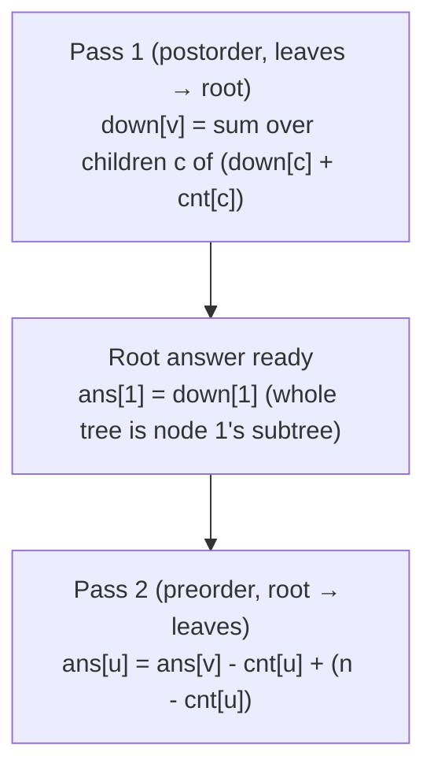
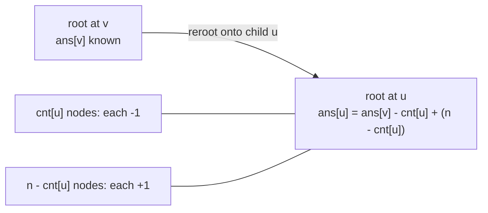

# Rerooting (All-Roots Tree DP)

Many tree problems ask a question of the form: *"if this node were the root, what would the answer
be?"* — and they ask it for **every** node. Examples include the sum of distances from each node to
all others, the maximum distance (eccentricity) from each node, the number of nodes that see a
particular color, or the best path starting anywhere. A naive solution roots the tree at each of the
`n` nodes in turn and runs an $O(n)$ DP, costing $O(n^2)$ overall — far too slow for $n$ up to
$2 \times 10^5$. **Rerooting** (also called *re-rooting technique*, *all-directions tree DP*, or
*DP on trees with re-rooting*) computes all `n` answers in a single $O(n)$ sweep plus one preparatory
$O(n)$ sweep.

The idea is two passes. **Pass 1** roots the tree arbitrarily (say at node `1`) and computes, for
each node, a *downward* DP value summarizing only its own subtree. This is ordinary postorder tree
DP. **Pass 2** walks the tree top-down and *re-roots*: when we move the root from a node `v` to its
child `u`, the answer for `u` is the answer for `v` adjusted so that the part of the tree "above"
`u` (everything except `u`'s subtree) is folded in as a new branch hanging off `u`. The crucial
trick is being able to compute, for each child, the combination of **all the other children plus the
parent side** — i.e. "everything except this child." When the combining operation is invertible
(plain addition) we just subtract the child out; when it is not (max, gcd, custom merges) we use
**prefix and suffix aggregates** of the children so any one child can be excluded in $O(1)$.

This guide develops the technique from first principles: what rerooting buys you over the brute
force, the structure of the down pass and the up pass, a reusable two-pass template that handles
non-invertible merges via prefix/suffix, and the canonical instance — the **sum of distances from
each node**. Every code block appears in paired Python and C++, with iterative DFS so a path-shaped
tree of $2 \times 10^5$ nodes does not overflow the stack.

## Table of Contents
1. [The Problem Rerooting Solves](#the-problem-rerooting-solves)
2. [Pass 1 — Down (Subtree) DP](#pass-1--down-subtree-dp)
3. [Pass 2 — Push the Parent Contribution Down](#pass-2--push-the-parent-contribution-down)
4. [Excluding One Child: Prefix/Suffix Aggregates](#excluding-one-child-prefixsuffix-aggregates)
5. [A Generic Rerooting Template](#a-generic-rerooting-template)
6. [The Classic Instance: Sum of Distances](#the-classic-instance-sum-of-distances)
7. [Mermaid](#mermaid)
8. [Complexity Summary](#complexity-summary)
9. [Common Pitfalls](#common-pitfalls)
10. [Patterns](#patterns)

---

## The Problem Rerooting Solves

Suppose we have a function `solve(root)` that, given a choice of root, computes some aggregate over
the whole tree in $O(n)$ — for instance the sum of distances from `root` to every other node. We
want the value of `solve(r)` for **all** `r = 1..n`.

The brute force calls `solve(r)` once per root:

```python
def all_answers_bruteforce(n, adj):
    # solve(root) computes sum of distances from root to all nodes via one BFS/DFS: O(n).
    # Repeating it for every root is O(n^2) -- too slow for n up to 2e5.
    ans = [0] * (n + 1)
    for root in range(1, n + 1):
        ans[root] = solve_single(n, adj, root)   # each call O(n)
    return ans                                    # total O(n^2)
```

```cpp
#include <bits/stdc++.h>
using namespace std;

vector<long long> all_answers_bruteforce(int n, const vector<vector<int>>& adj) {
    // solve(root) computes sum of distances from root to all nodes via one BFS/DFS: O(n).
    // Repeating it for every root is O(n^2) -- too slow for n up to 2e5.
    vector<long long> ans(n + 1, 0);
    for (int root = 1; root <= n; ++root)
        ans[root] = solve_single(n, adj, root);   // each call O(n)
    return ans;                                    // total O(n^2)
}
```

Rerooting replaces the `n` independent solves with **two** linear sweeps. The key observation is
that adjacent roots `v` and `u` (connected by an edge) share almost all of their structure: moving
the root from `v` to `u` only changes which side of the `v–u` edge is "up." If we know how the
answer transforms across a single edge, we can propagate the root outward from node `1` to every
node, computing each new answer in $O(1)$ amortized from its parent's answer. Total cost: $O(n)$.

---

## Pass 1 — Down (Subtree) DP

Root the tree at node `1`. For every node `v` define a **downward** value `down[v]` that summarizes
*only the subtree of `v`*. This is classic postorder DP: `down[v]` is built from the `down` values
of `v`'s children. Two quantities recur so often that the sum-of-distances instance uses both:

- `cnt[v]` — number of nodes in the subtree of `v` (including `v`).
- `down[v]` — sum of distances from `v` to every node **inside its own subtree**.

For a child `c` of `v`, every node in `c`'s subtree is one edge farther from `v` than it is from
`c`, so it contributes `down[c] + cnt[c]` to `down[v]`:

$$\texttt{down}[v] \;=\; \sum_{c \in \text{children}(v)} \big(\texttt{down}[c] + \texttt{cnt}[c]\big),
\qquad \texttt{cnt}[v] \;=\; 1 + \sum_{c} \texttt{cnt}[c].$$

We compute this with an **iterative** postorder so deep trees are safe:

```python
import sys

def down_pass(n, adj, root=1):
    cnt = [1] * (n + 1)
    down = [0] * (n + 1)
    parent = [0] * (n + 1)
    order = []
    stack = [root]
    parent[root] = -1
    seen = [False] * (n + 1)
    seen[root] = True
    while stack:                     # preorder collection
        v = stack.pop()
        order.append(v)
        for u in adj[v]:
            if not seen[u]:
                seen[u] = True
                parent[u] = v
                stack.append(u)
    for v in reversed(order):        # postorder: children finalized first
        p = parent[v]
        if p != -1:
            cnt[p] += cnt[v]
            down[p] += down[v] + cnt[v]
    return cnt, down, parent, order
```

```cpp
#include <bits/stdc++.h>
using namespace std;

struct DownResult {
    vector<long long> cnt, down;
    vector<int> parent, order;
};

DownResult down_pass(int n, const vector<vector<int>>& adj, int root = 1) {
    vector<long long> cnt(n + 1, 1), down(n + 1, 0);
    vector<int> parent(n + 1, 0), order;
    order.reserve(n);
    vector<char> seen(n + 1, 0);
    vector<int> stack;
    stack.push_back(root);
    parent[root] = -1;
    seen[root] = 1;
    while (!stack.empty()) {                  // preorder collection
        int v = stack.back();
        stack.pop_back();
        order.push_back(v);
        for (int u : adj[v]) {
            if (!seen[u]) {
                seen[u] = 1;
                parent[u] = v;
                stack.push_back(u);
            }
        }
    }
    for (int i = (int)order.size() - 1; i >= 0; --i) {  // postorder
        int v = order[i];
        int p = parent[v];
        if (p != -1) {
            cnt[p] += cnt[v];
            down[p] += down[v] + cnt[v];
        }
    }
    return {cnt, down, parent, order};
}
```

After the down pass, `down[1]` is already the *true* answer for the chosen root `1`, because node
`1`'s subtree is the whole tree. Every other node's `down[v]` is only a partial answer — it omits
all the nodes above `v`. Fixing that is the job of pass 2.

---

## Pass 2 — Push the Parent Contribution Down

Let `ans[v]` be the *full* answer for `v` (rooted at `v`, covering the whole tree). We know
`ans[1] = down[1]`. Now propagate **down** the tree in preorder. Consider an edge from a node `v`
(whose full answer we already know) to a child `u`. When the root moves from `v` to `u`:

- The `cnt[u]` nodes in `u`'s subtree each get **one closer**, losing a total of `cnt[u]`.
- The other `n - cnt[u]` nodes each get **one farther**, gaining `n - cnt[u]`.

So the re-rooting recurrence for sum-of-distances is beautifully simple:

$$\texttt{ans}[u] \;=\; \texttt{ans}[v] \;-\; \texttt{cnt}[u] \;+\; \big(n - \texttt{cnt}[u]\big).$$

The general principle is the same even when the arithmetic is messier: **`ans[u]` is `ans[v]` with
`u`'s subtree subtracted out and the rest re-attached as a branch above `u`.** Concretely, the
contribution flowing *down* into `u` from "everything except `u`'s subtree" is what we add to `u`'s
own down value to complete it. For sum-of-distances we can express that complement in closed form;
for general merges we build it from the parent's complement plus the siblings (next section).

```python
def reroot_sum_of_distances(n, adj):
    cnt, down, parent, order = down_pass(n, adj, root=1)
    ans = [0] * (n + 1)
    ans[1] = down[1]
    for v in order[1:]:              # preorder, skipping the root
        p = parent[v]
        ans[v] = ans[p] - cnt[v] + (n - cnt[v])
    return ans
```

```cpp
vector<long long> reroot_sum_of_distances(int n, const vector<vector<int>>& adj) {
    DownResult d = down_pass(n, adj, 1);
    vector<long long>& cnt = d.cnt;
    vector<long long>& down = d.down;
    vector<int>& parent = d.parent;
    vector<int>& order = d.order;
    vector<long long> ans(n + 1, 0);
    ans[1] = down[1];
    for (size_t i = 1; i < order.size(); ++i) {   // preorder, skip root
        int v = order[i];
        int p = parent[v];
        ans[v] = ans[p] - cnt[v] + ((long long)n - cnt[v]);
    }
    return ans;
}
```

This is the entire rerooting algorithm for sum-of-distances: one postorder pass, one preorder pass,
$O(n)$ total. The reason it works in $O(1)$ per node is that the additive merge is **invertible** —
we can move from parent to child with simple plus/minus.

---

## Excluding One Child: Prefix/Suffix Aggregates

The clean subtract-and-add trick above relies on the merge being a group operation (addition has an
inverse). Many rerooting problems combine children with a **non-invertible** operator: `max` (for
eccentricity / farthest distance), `min`, `gcd`, or a custom tuple merge. There you cannot "subtract
out" one child. Instead, for a node `v` with children `c_1, c_2, …, c_k`, you precompute

- `prefix[i]` = merge of contributions of `c_1 … c_{i-1}`,
- `suffix[i]` = merge of contributions of `c_{i+1} … c_k`,

so the combination of *all children except `c_i`* is `merge(prefix[i], suffix[i])` in $O(1)$. Adding
the contribution from above `v` to that gives exactly the branch that hangs over child `c_i` when we
re-root onto it. Building both arrays is $O(\deg v)$, and the sum of degrees is $2(n-1)$, so the
whole second pass stays $O(n)$.

```python
def children_except_each(contribs, identity, merge):
    # contribs[i] = contribution of child i; returns except[i] = merge of all but i.
    k = len(contribs)
    prefix = [identity] * (k + 1)
    suffix = [identity] * (k + 1)
    for i in range(k):
        prefix[i + 1] = merge(prefix[i], contribs[i])
    for i in range(k - 1, -1, -1):
        suffix[i] = merge(suffix[i + 1], contribs[i])
    return [merge(prefix[i], suffix[i + 1]) for i in range(k)]
```

```cpp
template <class T, class Merge>
vector<T> children_except_each(const vector<T>& contribs, T identity, Merge merge) {
    // contribs[i] = contribution of child i; returns except[i] = merge of all but i.
    int k = (int)contribs.size();
    vector<T> prefix(k + 1, identity), suffix(k + 1, identity);
    for (int i = 0; i < k; ++i)
        prefix[i + 1] = merge(prefix[i], contribs[i]);
    for (int i = k - 1; i >= 0; --i)
        suffix[i] = merge(suffix[i + 1], contribs[i]);
    vector<T> except(k);
    for (int i = 0; i < k; ++i)
        except[i] = merge(prefix[i], suffix[i + 1]);
    return except;
}
```

---

## A Generic Rerooting Template

We can package the whole pattern into a reusable template parameterized by three operations:

- `e()` — the identity element of the merge.
- `merge(a, b)` — associative, commutative combine of two child contributions.
- `lift(child_value, parent, child)` — turn a node's full DP value into the contribution it sends to
  a neighbor across one edge (e.g. for distances, "add the edge and the subtree count").

The template runs the down pass to get `down[v]` (merge of lifted child contributions), then the up
pass: for each node `v` we already know `from_above[v]` (the contribution flowing in from the parent
side). We combine `from_above[v]` with the merge of all children, and to recurse into child `c_i` we
hand it `lift( merge(from_above[v], everything_except c_i), v, c_i )` using the prefix/suffix trick.

```python
def reroot(n, adj, e, merge, lift):
    # full[v] = merged contribution of ALL neighbors of v (the all-roots answer aggregate).
    cnt_children = None
    parent = [0] * (n + 1)
    order = []
    stack = [1]
    parent[1] = -1
    seen = [False] * (n + 1)
    seen[1] = True
    while stack:
        v = stack.pop()
        order.append(v)
        for u in adj[v]:
            if not seen[u]:
                seen[u] = True
                parent[u] = v
                stack.append(u)

    down = [e() for _ in range(n + 1)]      # merge of lifted child contributions
    for v in reversed(order):               # postorder
        acc = e()
        for u in adj[v]:
            if u != parent[v]:
                acc = merge(acc, lift(down[u], v, u))
        down[v] = acc

    full = [e() for _ in range(n + 1)]
    from_above = [e() for _ in range(n + 1)]  # contribution from the parent side
    for v in order:                          # preorder
        kids = [u for u in adj[v] if u != parent[v]]
        contribs = [lift(down[u], v, u) for u in kids]
        # full answer at v merges children plus the parent side:
        acc = from_above[v]
        for c in contribs:
            acc = merge(acc, c)
        full[v] = acc
        # prefix/suffix to exclude one child when descending:
        k = len(kids)
        prefix = [e()] * (k + 1)
        suffix = [e()] * (k + 1)
        for i in range(k):
            prefix[i + 1] = merge(prefix[i], contribs[i])
        for i in range(k - 1, -1, -1):
            suffix[i] = merge(suffix[i + 1], contribs[i])
        for i, u in enumerate(kids):
            without_u = merge(prefix[i], suffix[i + 1])
            up_val = merge(from_above[v], without_u)     # everything except u's subtree
            from_above[u] = lift(up_val, u, v)           # lifted across edge u-v, into u
    return full
```

```cpp
#include <bits/stdc++.h>
using namespace std;

template <class T, class E, class Merge, class Lift>
vector<T> reroot(int n, const vector<vector<int>>& adj, E e, Merge merge, Lift lift) {
    // full[v] = merged contribution of ALL neighbors of v (the all-roots answer aggregate).
    vector<int> parent(n + 1, 0), order;
    order.reserve(n);
    vector<char> seen(n + 1, 0);
    vector<int> stack;
    stack.push_back(1);
    parent[1] = -1;
    seen[1] = 1;
    while (!stack.empty()) {
        int v = stack.back();
        stack.pop_back();
        order.push_back(v);
        for (int u : adj[v]) {
            if (!seen[u]) {
                seen[u] = 1;
                parent[u] = v;
                stack.push_back(u);
            }
        }
    }

    vector<T> down(n + 1, e());                 // merge of lifted child contributions
    for (int i = (int)order.size() - 1; i >= 0; --i) {  // postorder
        int v = order[i];
        T acc = e();
        for (int u : adj[v])
            if (u != parent[v])
                acc = merge(acc, lift(down[u], v, u));
        down[v] = acc;
    }

    vector<T> full(n + 1, e()), from_above(n + 1, e());  // from_above = parent-side contribution
    for (int v : order) {                        // preorder
        vector<int> kids;
        for (int u : adj[v])
            if (u != parent[v]) kids.push_back(u);
        int k = (int)kids.size();
        vector<T> contribs(k);
        for (int i = 0; i < k; ++i)
            contribs[i] = lift(down[kids[i]], v, kids[i]);
        T acc = from_above[v];
        for (int i = 0; i < k; ++i)
            acc = merge(acc, contribs[i]);
        full[v] = acc;
        vector<T> prefix(k + 1, e()), suffix(k + 1, e());
        for (int i = 0; i < k; ++i)
            prefix[i + 1] = merge(prefix[i], contribs[i]);
        for (int i = k - 1; i >= 0; --i)
            suffix[i] = merge(suffix[i + 1], contribs[i]);
        for (int i = 0; i < k; ++i) {
            int u = kids[i];
            T without_u = merge(prefix[i], suffix[i + 1]);
            T up_val = merge(from_above[v], without_u);  // everything except u's subtree
            from_above[u] = lift(up_val, u, v);          // lifted across edge u-v, into u
        }
    }
    return full;
}
```

This template captures every rerooting problem whose merge is associative and commutative. The next
section instantiates it conceptually, but for distances the closed-form subtract/add is simpler, so
we show that directly.

---

## The Classic Instance: Sum of Distances

Putting the pieces together, here is the standalone sum-of-distances solver — the canonical
rerooting exercise (CSES 1133, LeetCode 834). For each node `v`, `ans[v]` is the sum of distances
from `v` to all other nodes.

```python
import sys

def sum_of_distances(n, adj):
    if n == 1:
        return [0, 0]                # node 1 has answer 0
    # ---- Pass 1: down ----
    cnt = [1] * (n + 1)
    down = [0] * (n + 1)
    parent = [0] * (n + 1)
    order = []
    stack = [1]
    parent[1] = -1
    seen = [False] * (n + 1)
    seen[1] = True
    while stack:
        v = stack.pop()
        order.append(v)
        for u in adj[v]:
            if not seen[u]:
                seen[u] = True
                parent[u] = v
                stack.append(u)
    for v in reversed(order):
        p = parent[v]
        if p != -1:
            cnt[p] += cnt[v]
            down[p] += down[v] + cnt[v]
    # ---- Pass 2: reroot ----
    ans = [0] * (n + 1)
    ans[1] = down[1]
    for v in order[1:]:
        p = parent[v]
        ans[v] = ans[p] - cnt[v] + (n - cnt[v])
    return ans
```

```cpp
#include <bits/stdc++.h>
using namespace std;

vector<long long> sum_of_distances(int n, const vector<vector<int>>& adj) {
    if (n == 1) return vector<long long>(2, 0);   // node 1 has answer 0
    // ---- Pass 1: down ----
    vector<long long> cnt(n + 1, 1), down(n + 1, 0);
    vector<int> parent(n + 1, 0), order;
    order.reserve(n);
    vector<char> seen(n + 1, 0);
    vector<int> stack;
    stack.push_back(1);
    parent[1] = -1;
    seen[1] = 1;
    while (!stack.empty()) {
        int v = stack.back();
        stack.pop_back();
        order.push_back(v);
        for (int u : adj[v]) {
            if (!seen[u]) {
                seen[u] = 1;
                parent[u] = v;
                stack.push_back(u);
            }
        }
    }
    for (int i = (int)order.size() - 1; i >= 0; --i) {
        int v = order[i];
        int p = parent[v];
        if (p != -1) {
            cnt[p] += cnt[v];
            down[p] += down[v] + cnt[v];
        }
    }
    // ---- Pass 2: reroot ----
    vector<long long> ans(n + 1, 0);
    ans[1] = down[1];
    for (size_t i = 1; i < order.size(); ++i) {
        int v = order[i];
        int p = parent[v];
        ans[v] = ans[p] - cnt[v] + ((long long)n - cnt[v]);
    }
    return ans;
}
```

---

## Mermaid

The two passes flow in opposite directions: aggregate **up** in postorder, then re-root **down** in
preorder.



Moving the root across one edge `v &rarr; u`: `u`'s subtree gets one step closer, the rest one step
farther.



---

## Complexity Summary

| Task | Method | Time | Space |
|------|--------|------|-------|
| One root's answer | Single BFS/DFS | $O(n)$ | $O(n)$ |
| All roots (brute force) | `solve` per root | $O(n^2)$ | $O(n)$ |
| All roots (rerooting) | Down pass + up pass | $O(n)$ | $O(n)$ |
| Non-invertible merge | + prefix/suffix per node | $O(n)$ | $O(n)$ |

The down pass visits each node once; the up pass visits each node once and spends $O(\deg v)$ on
prefix/suffix, and $\sum_v \deg v = 2(n-1)$. The whole technique is therefore linear.

---

## Common Pitfalls
- **Forgetting the "above" component.** When re-rooting, the nodes *outside* `v`'s subtree number
  `n - cnt[v]`. Omitting that term is the single most common bug.
- **Excluding one child with a non-invertible merge.** You cannot subtract a child out of a `max` or
  `gcd`. Use **prefix/suffix aggregates** so any one child can be left out in $O(1)$.
- **Subtracting from a non-group merge.** The `ans[v] - cnt[u] + (n - cnt[u])` shortcut only works
  because the merge is additive (has an inverse). For `max`/`min`/`gcd`, fall back to the generic
  prefix/suffix template.
- **Recursion depth.** A path of $2\times10^5$ nodes overflows the default recursion stack. Use the
  **iterative** DFS shown here (recursive solutions need an explicit stack or a raised limit).
- **Overflow.** Sums of distances reach $\sim n^2 \approx 4\times10^{10}$; use `long long` and
  `const long long INF = 1e18`, not `int`.
- **Single-node / two-node trees.** Handle `n = 1` explicitly (answer `0`), and make sure leaf nodes
  (no children) feed the identity into the merge.
- **Using the down value as the final answer.** Only the root's `down` equals its true answer; every
  other node needs the up pass to add its "above" part.

---

## Patterns
- **"Compute an aggregate for every node as root"** → rerooting (down pass + up pass).
- **"Sum / count of something over all other nodes, for each node"** → additive merge, subtract/add
  across the edge.
- **"Farthest node / eccentricity from each node"** → `max`-merge → prefix/suffix to exclude a child.
- **"Best value over all directions at each node"** → generic template with custom `merge` + `lift`.
- **"Answer changes by a closed-form delta when the root moves one edge"** → look for an $O(1)$
  reroot recurrence before reaching for prefix/suffix.

See also: [cses-1132-tree-distances-i.md](../problems/cses-1132-tree-distances-i.md),
[cses-1133-tree-distances-ii.md](../problems/cses-1133-tree-distances-ii.md),
[0834-sum-of-distances-in-tree.md](../problems/0834-sum-of-distances-in-tree.md),
[01-subtree-dp-traversal-orders.md](01-subtree-dp-traversal-orders.md),
[02-tree-diameter-centroid.md](02-tree-diameter-centroid.md).
