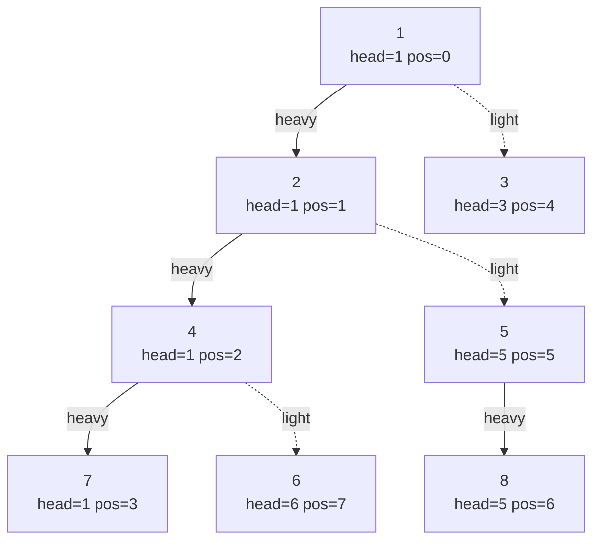
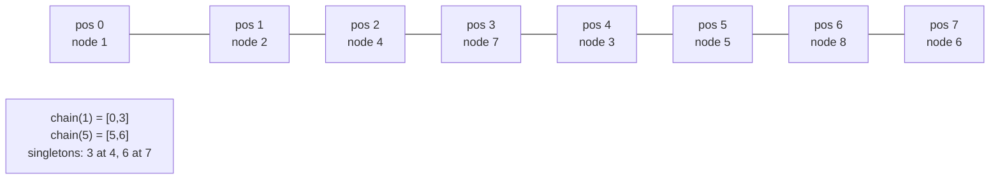

# Heavy-Light Decomposition (HLD)

**Heavy-Light Decomposition** is the technique that turns a **path on a tree** into a *small number
of contiguous array segments*. Once a path is a handful of ranges, every range structure you already
know — a **segment tree**, a **Fenwick/BIT**, a lazy segment tree — answers path queries and path
updates in $O(\log^2 n)$. HLD is the standard answer to "*update/query the values on the path from
`u` to `v`*" when the tree is static but the values change.

The whole idea rests on one classification of edges. For each node, the edge going down to the child
with the **largest subtree** is called **heavy**; all other downward edges are **light**. Strings of
heavy edges glue together into **chains**, and the magic fact — proved below — is that **any
root-to-node path crosses at most $O(\log n)$ light edges**, hence touches at most $O(\log n)$
chains. A path query therefore decomposes into $O(\log n)$ segment-tree queries, each $O(\log n)$.

---

## Table of Contents
1. [Heavy vs Light Edges](#heavy-vs-light-edges)
2. [Chains of Heavy Edges](#chains-of-heavy-edges)
3. [Why Only O(log n) Light Edges on Any Path](#why-only-olog-n-light-edges-on-any-path)
4. [Assigning Positions: pos[v] Makes Each Chain Contiguous](#assigning-positions-posv-makes-each-chain-contiguous)
5. [Decompose: sizes, heavy, head, pos](#decompose-sizes-heavy-head-pos)
6. [The Path-Query Loop](#the-path-query-loop)
7. [Edge Weights vs Vertex Weights](#edge-weights-vs-vertex-weights)
8. [Subtree Queries for Free](#subtree-queries-for-free)
9. [LCA as a By-Product](#lca-as-a-by-product)
10. [Mermaid](#mermaid)
11. [Complexity Summary](#complexity-summary)
12. [Common Pitfalls](#common-pitfalls)
13. [Patterns](#patterns)

---

## Heavy vs Light Edges

Root the tree at any node (say `0`). Compute `size[v]` = number of nodes in the subtree of `v`. For
a node `v` with children `c_1, c_2, \ldots`, the **heavy child** is the child `c` with the **maximum
`size[c]`** (break ties arbitrarily). The edge `v → heavy-child` is a **heavy edge**; every other
edge `v → other-child` is a **light edge**.

$$\text{heavy}(v) = \arg\max_{c \,\in\, \text{children}(v)} size[c], \qquad
  \text{edge } (v,c) \text{ is light} \iff c \neq \text{heavy}(v).$$

The defining inequality of a **light edge** `(v, c)` is

$$size[c] \le \tfrac{1}{2}\, size[v].$$

Why? If `c` is *not* the heavy child, then some other child carries at least as many nodes as `c`,
so `c` cannot own more than half of `v`'s subtree. This "halving" is the seed of the logarithmic
bound.

```python
def heavy_child(adj, size, v, parent):
    best, best_size = -1, 0
    for c in adj[v]:
        if c != parent and size[c] > best_size:
            best, best_size = c, size[c]
    return best  # -1 if v is a leaf
```

```cpp
int heavy_child(const vector<vector<int>>& adj, const vector<int>& size,
                int v, int parent) {
    int best = -1;
    long long best_size = 0;
    for (int c : adj[v]) {
        if (c != parent && (long long)size[c] > best_size) {
            best = c;
            best_size = size[c];
        }
    }
    return best;  // -1 if v is a leaf
}
```

---

## Chains of Heavy Edges

Walk down only along heavy edges and you trace a **heavy chain**: a maximal path
`h → heavy(h) → heavy(heavy(h)) → \cdots`. Every node belongs to **exactly one** chain, and each
chain has a topmost node called its **head**. Light edges are the "bridges" *between* chains: leaving
a chain to enter a child's chain always costs one light edge.

We store, for every node `v`, the field `head[v]` = the topmost node of the chain that `v` lives on.
Two nodes are on the same chain iff they share the same `head`. The head of the root's chain is the
root itself.

```python
# conceptual: every node maps to the head of its heavy chain
def same_chain(head, u, v):
    return head[u] == head[v]
```

```cpp
// conceptual: every node maps to the head of its heavy chain
bool same_chain(const vector<int>& head, int u, int v) {
    return head[u] == head[v];
}
```

---

## Why Only O(log n) Light Edges on Any Path

Consider the path from the **root** down to any node `x`. Each time the path uses a **light** edge
`(v, c)`, the subtree size **at least halves**: `size[c] <= size[v] / 2`. The very first node on the
path (the root) has subtree size `n`. After crossing `k` light edges, the subtree size of the
current node is at most `n / 2^k`. Since a subtree has at least one node, `n / 2^k >= 1`, giving

$$k \le \log_2 n.$$

So **any root-to-node path crosses at most $\lfloor \log_2 n \rfloor$ light edges**, and therefore
enters at most $\log_2 n + 1$ distinct heavy chains. An arbitrary path `u → v` splits at the LCA into
two root-ward paths `u → lca` and `v → lca`, so it touches at most $O(\log n)$ chains in total. Each
chain contributes **one** contiguous segment to a segment tree query — that is the source of the
$O(\log^2 n)$ bound (one $\log$ for the number of chains, one $\log$ per segment-tree operation).

---

## Assigning Positions: pos[v] Makes Each Chain Contiguous

To map chains onto a segment tree, we run a DFS that **always descends into the heavy child first**.
A global counter `timer` stamps `pos[v] = timer++` on entry. Because the heavy child is visited
immediately after its parent, **every node of a chain receives consecutive positions**, head first.
That is exactly what lets a whole chain be a single segment-tree range `[pos[head], pos[tail]]`.

A second consequence of a heavy-first preorder: the subtree of `v` *still* occupies a contiguous
block `[pos[v], pos[v] + size[v] - 1]`, so **subtree queries come for free** alongside path queries
(see below).

```python
# heavy-first DFS assigns pos so each chain is a contiguous run of indices
# pos[head_of_chain] < pos[next] < ... < pos[tail_of_chain]
```

```cpp
// heavy-first DFS assigns pos so each chain is a contiguous run of indices
// pos[head_of_chain] < pos[next] < ... < pos[tail_of_chain]
```

---

## Decompose: sizes, heavy, head, pos

The decomposition is **two passes**, both **iterative** so they survive a bamboo tree of
$n = 2\cdot10^5$ without a recursion-limit crash:

1. **Pass 1 — sizes + heavy child + parent + depth.** A post-order accumulation of `size`, recording
   each node's heavy child along the way.
2. **Pass 2 — head + pos.** A heavy-first preorder. When we step onto the heavy child we keep the
   same `head`; when we step onto a light child we start a new chain whose head is that child.

```python
import sys

def decompose(n: int, adj: list[list[int]], root: int = 0):
    parent = [-1] * n
    depth = [0] * n
    size = [1] * n
    heavy = [-1] * n
    head = [0] * n
    pos = [0] * n

    # ---- Pass 1: iterative DFS for parent, depth, size, heavy child ----
    order = []
    stack = [root]
    seen = [False] * n
    parent[root] = -1
    while stack:
        v = stack.pop()
        if seen[v]:
            continue
        seen[v] = True
        order.append(v)
        for u in adj[v]:
            if u != parent[v]:
                parent[u] = v
                depth[u] = depth[v] + 1
                stack.append(u)
    # process nodes in reverse discovery order = children before parents
    for v in reversed(order):
        best_size = 0
        for u in adj[v]:
            if u != parent[v]:
                size[v] += size[u]
                if size[u] > best_size:
                    best_size = size[u]
                    heavy[v] = u

    # ---- Pass 2: iterative heavy-first preorder for head and pos ----
    timer = 0
    # stack of (node, chain_head)
    stack = [(root, root)]
    while stack:
        v, h = stack.pop()
        # walk the whole heavy chain starting at v, stamping pos in order
        while v != -1:
            head[v] = h
            pos[v] = timer
            timer += 1
            # push light children as new chain heads (processed later)
            for u in adj[v]:
                if u != parent[v] and u != heavy[v]:
                    stack.append((u, u))
            v = heavy[v]  # continue down the heavy edge, same head h
    return parent, depth, size, heavy, head, pos
```

```cpp
#include <bits/stdc++.h>
using namespace std;

struct HLD {
    int n, root;
    vector<int> parent, depth, size, heavy, head, pos;

    HLD(int n_, const vector<vector<int>>& adj, int root_ = 0)
        : n(n_), root(root_), parent(n_, -1), depth(n_, 0),
          size(n_, 1), heavy(n_, -1), head(n_, 0), pos(n_, 0) {
        decompose(adj);
    }

    void decompose(const vector<vector<int>>& adj) {
        // ---- Pass 1: iterative DFS for parent, depth, size, heavy child ----
        vector<int> order;
        order.reserve(n);
        vector<char> seen(n, 0);
        vector<int> stack;
        stack.push_back(root);
        parent[root] = -1;
        while (!stack.empty()) {
            int v = stack.back();
            stack.pop_back();
            if (seen[v]) continue;
            seen[v] = 1;
            order.push_back(v);
            for (int u : adj[v]) {
                if (u != parent[v]) {
                    parent[u] = v;
                    depth[u] = depth[v] + 1;
                    stack.push_back(u);
                }
            }
        }
        // children before parents
        for (int i = (int)order.size() - 1; i >= 0; --i) {
            int v = order[i];
            long long best_size = 0;
            for (int u : adj[v]) {
                if (u != parent[v]) {
                    size[v] += size[u];
                    if ((long long)size[u] > best_size) {
                        best_size = size[u];
                        heavy[v] = u;
                    }
                }
            }
        }

        // ---- Pass 2: iterative heavy-first preorder for head and pos ----
        int timer = 0;
        // stack of (node, chain_head)
        vector<pair<int,int>> st;
        st.push_back({root, root});
        while (!st.empty()) {
            auto [v, h] = st.back();
            st.pop_back();
            while (v != -1) {
                head[v] = h;
                pos[v] = timer++;
                for (int u : adj[v]) {
                    if (u != parent[v] && u != heavy[v]) {
                        st.push_back({u, u});
                    }
                }
                v = heavy[v];  // continue down the heavy edge, same head h
            }
        }
    }
};
```

---

## The Path-Query Loop

To combine the values on the path `u → v`, repeatedly jump **whichever node has the deeper head** up
to its head's parent, accumulating the chain segment `[pos[head[x]], pos[x]]` each time. When both
nodes finally share a chain (`head[u] == head[v]`) the remaining piece is the single segment between
their positions, and the **shallower of the two is the LCA**.

```python
def path_query(seg, head, parent, depth, pos, u, v):
    # combine over all nodes on the path u..v (vertex-weighted)
    res = seg.identity()
    while head[u] != head[v]:
        # bring up the one whose head is deeper
        if depth[head[u]] < depth[head[v]]:
            u, v = v, u
        res = seg.merge(res, seg.query(pos[head[u]], pos[u]))
        u = parent[head[u]]
    # now u and v are on the same chain; include the LCA node itself
    if depth[u] > depth[v]:
        u, v = v, u
    res = seg.merge(res, seg.query(pos[u], pos[v]))
    return res
```

```cpp
#include <bits/stdc++.h>
using namespace std;

// combine over all nodes on the path u..v (vertex-weighted)
long long path_query(SegTree& seg, const vector<int>& head,
                     const vector<int>& parent, const vector<int>& depth,
                     const vector<int>& pos, int u, int v) {
    long long res = seg.identity();
    while (head[u] != head[v]) {
        if (depth[head[u]] < depth[head[v]]) swap(u, v);
        res = seg.merge(res, seg.query(pos[head[u]], pos[u]));
        u = parent[head[u]];
    }
    if (depth[u] > depth[v]) swap(u, v);
    res = seg.merge(res, seg.query(pos[u], pos[v]));
    return res;
}
```

A **path update** is the identical loop with `seg.query` replaced by `seg.update`:

```python
def path_update(seg, head, parent, depth, pos, u, v, val):
    while head[u] != head[v]:
        if depth[head[u]] < depth[head[v]]:
            u, v = v, u
        seg.update(pos[head[u]], pos[u], val)
        u = parent[head[u]]
    if depth[u] > depth[v]:
        u, v = v, u
    seg.update(pos[u], pos[v], val)
```

```cpp
#include <bits/stdc++.h>
using namespace std;

void path_update(SegTree& seg, const vector<int>& head,
                 const vector<int>& parent, const vector<int>& depth,
                 const vector<int>& pos, int u, int v, long long val) {
    while (head[u] != head[v]) {
        if (depth[head[u]] < depth[head[v]]) swap(u, v);
        seg.update(pos[head[u]], pos[u], val);
        u = parent[head[u]];
    }
    if (depth[u] > depth[v]) swap(u, v);
    seg.update(pos[u], pos[v], val);
}
```

---

## Edge Weights vs Vertex Weights

HLD naturally stores a value **per vertex** at index `pos[v]`. To handle **edge weights**, use the
classic **"edge-as-the-deeper-node"** trick: assign each edge's weight to the **child endpoint**
(the deeper of the two nodes). Every edge then owns a unique vertex slot, and the root owns no edge.

The path loop is identical *except* for the final same-chain segment: the LCA node represents an edge
**above** the LCA, which is **not** part of the path. So we must **skip the LCA's slot** by querying
`[pos[u] + 1, pos[v]]` instead of `[pos[u], pos[v]]` for the last piece.

```python
def path_query_edges(seg, head, parent, depth, pos, u, v):
    res = seg.identity()
    while head[u] != head[v]:
        if depth[head[u]] < depth[head[v]]:
            u, v = v, u
        res = seg.merge(res, seg.query(pos[head[u]], pos[u]))
        u = parent[head[u]]
    if depth[u] > depth[v]:
        u, v = v, u
    # skip the LCA node: it carries the edge ABOVE the LCA, not on the path
    if pos[u] + 1 <= pos[v]:
        res = seg.merge(res, seg.query(pos[u] + 1, pos[v]))
    return res
```

```cpp
#include <bits/stdc++.h>
using namespace std;

long long path_query_edges(SegTree& seg, const vector<int>& head,
                           const vector<int>& parent, const vector<int>& depth,
                           const vector<int>& pos, int u, int v) {
    long long res = seg.identity();
    while (head[u] != head[v]) {
        if (depth[head[u]] < depth[head[v]]) swap(u, v);
        res = seg.merge(res, seg.query(pos[head[u]], pos[u]));
        u = parent[head[u]];
    }
    if (depth[u] > depth[v]) swap(u, v);
    // skip the LCA node: it carries the edge ABOVE the LCA, not on the path
    if (pos[u] + 1 <= pos[v]) {
        res = seg.merge(res, seg.query(pos[u] + 1, pos[v]));
    }
    return res;
}
```

---

## Subtree Queries for Free

Because the Pass-2 preorder is heavy-first, it is still a **valid preorder**, so the subtree of `v`
occupies the contiguous block

$$[\,pos[v],\; pos[v] + size[v] - 1\,].$$

The same segment tree that answers path queries also answers **subtree** aggregate queries and
updates with a single range call — no second structure needed.

```python
def subtree_query(seg, size, pos, v):
    return seg.query(pos[v], pos[v] + size[v] - 1)
```

```cpp
#include <bits/stdc++.h>
using namespace std;

long long subtree_query(SegTree& seg, const vector<int>& size,
                        const vector<int>& pos, int v) {
    return seg.query(pos[v], pos[v] + size[v] - 1);
}
```

---

## LCA as a By-Product

The path loop already computes the LCA without any extra structure: keep jumping the deeper-headed
node until both share a chain, then the **shallower node is the LCA**. This is an $O(\log n)$ LCA
that reuses the very `head`, `parent`, and `depth` arrays the decomposition built.

```python
def lca(head, parent, depth, u, v):
    while head[u] != head[v]:
        if depth[head[u]] < depth[head[v]]:
            u, v = v, u
        u = parent[head[u]]
    return u if depth[u] < depth[v] else v
```

```cpp
#include <bits/stdc++.h>
using namespace std;

int lca(const vector<int>& head, const vector<int>& parent,
        const vector<int>& depth, int u, int v) {
    while (head[u] != head[v]) {
        if (depth[head[u]] < depth[head[v]]) swap(u, v);
        u = parent[head[u]];
    }
    return depth[u] < depth[v] ? u : v;
}
```

---

## Mermaid

A tree decomposed into heavy chains. **Solid** arrows are heavy edges (they stay within a chain);
**dotted** arrows are light edges (they bridge to a new chain). Each chain is a contiguous run of
`pos` indices.



The three chains laid out on the segment-tree array (indices 0..7):



A path query `7 → 8` jumps: chain of `7` is `[head=1]`, chain of `8` is `[head=5]`. Since `head[8]=5`
is deeper, take segment `[pos[5], pos[8]] = [5,6]`, hop to `parent[5]=2`; now `2` and `7` share
`head=1`, take `[pos[2]..pos[7]]` — two segments, as the $O(\log n)$ bound promises.

---

## Complexity Summary

| Operation | Time | Notes |
|-----------|------|-------|
| Decompose (two iterative DFS passes) | $O(n)$ | sizes/heavy, then head/pos |
| Build segment tree over `pos` array | $O(n)$ | one structure serves all queries |
| Path query / update `u → v` | $O(\log^2 n)$ | $O(\log n)$ chains $\times\ O(\log n)$ per segment op |
| Subtree query / update | $O(\log n)$ | single range $[pos[v], pos[v]+size[v]-1]$ |
| LCA via head jumping | $O(\log n)$ | reuses head/parent/depth |
| Memory | $O(n)$ | arrays + segment tree |

The $O(\log^2 n)$ path bound is the headline: one $\log$ from the number of chains crossed, one
$\log$ from each segment-tree operation. With a **global BIT** instead of a segment tree, point-style
variants can shave this, but the segment-tree version is the most flexible.

---

## Common Pitfalls

- **Edge vs vertex confusion.** For edge weights, store each edge at its **deeper** endpoint and
  **skip the LCA slot** (`[pos[u]+1, pos[v]]`) on the final same-chain segment. For vertex weights,
  **include** the LCA (`[pos[u], pos[v]]`). Mixing these is the #1 HLD bug.
- **Jumping the wrong node.** Always lift the node whose **head is deeper**
  (`depth[head[u]]` vs `depth[head[v]]`), not the node whose own depth is deeper. Comparing node
  depths instead of head depths silently produces wrong segments.
- **Off-by-one on the LCA node.** After the loop, sort so `u` is the shallower (the LCA); the final
  segment is `[pos[u], pos[v]]` (vertices) or `[pos[u]+1, pos[v]]` (edges). Forgetting the `+1`
  double-counts the edge above the LCA.
- **Recursive DFS overflow.** A bamboo of $2\cdot10^5$ nodes overflows recursion. Use the iterative
  two-pass `decompose` shown here.
- **Heavy child not visited first.** If Pass 2 does **not** descend into `heavy[v]` immediately, a
  chain's positions are no longer contiguous and the whole scheme breaks.
- **`long long` overflow in C++.** Path sums of up to $2\cdot10^5$ values each up to $10^9$ exceed 32
  bits; use `long long`, and `const long long INF = 1e18` for max/min identities.
- **Non-commutative merges.** For order-sensitive aggregates (e.g. matrix products on a path) you
  must keep left/right segment results separate; plain `sum`/`max` are commutative and need no care.

---

## Patterns

- **"Update/query values on the path `u → v`" → HLD + segment tree.** The canonical trigger.
- **Edge weights → edge-as-deeper-node + skip LCA.** Convert to a vertex problem, then drop the LCA
  slot on the final segment.
- **Vertex weights → include LCA.** The plain loop with `[pos[u], pos[v]]` final segment.
- **Path + subtree in one problem → one `pos` array.** Heavy-first preorder gives both contiguous
  paths and contiguous subtrees from a single segment tree.
- **Range-add on a path / max on a path → HLD + lazy segment tree.** Swap the leaf structure; the
  decomposition is unchanged.
- **Need an LCA but no values → just the head-jumping loop.** HLD is a perfectly good $O(\log n)$
  LCA when you already pay for the decomposition.
- **Static tree, changing values.** HLD shines exactly when the tree shape is fixed but node/edge
  values mutate between queries.
