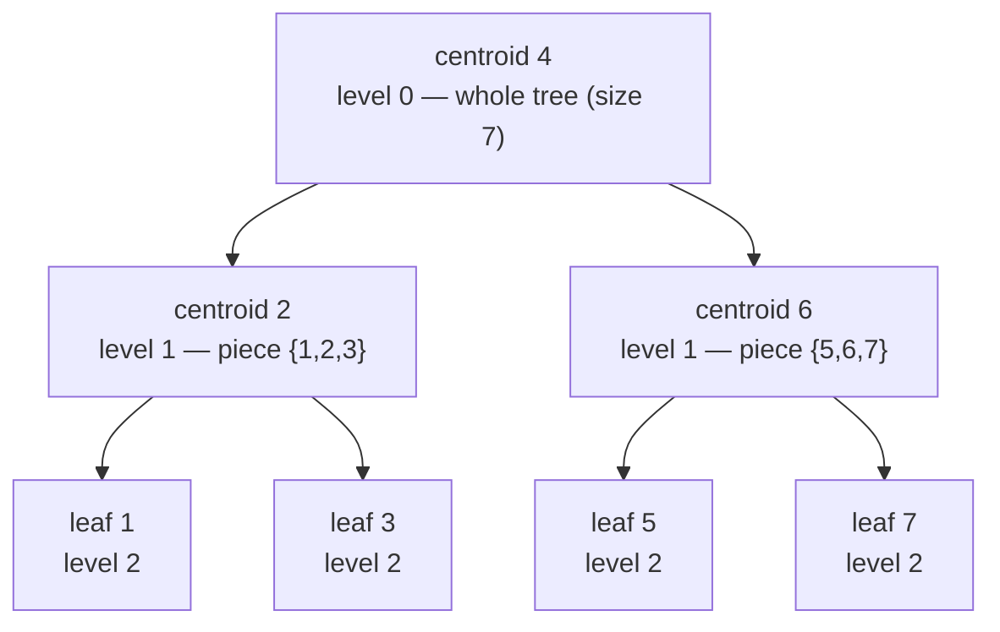
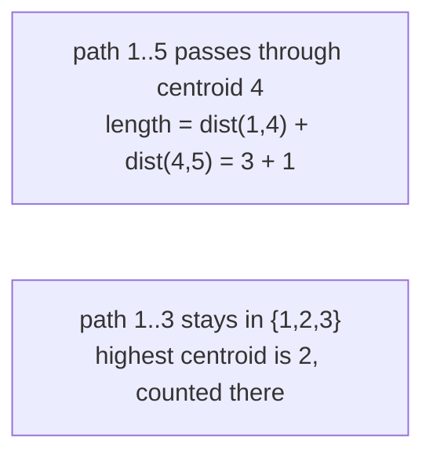

# Centroid Decomposition — Complete Guide

**Centroid decomposition** is a divide-and-conquer technique on trees. We repeatedly find the
*centroid* of a tree (the balancing node whose removal leaves every piece of size at most
$\lfloor n/2 \rfloor$), record it, delete it, and recurse on the resulting pieces. Stacking the
centroids of every level on top of one another produces the **centroid tree**, an auxiliary tree of
height $O(\log n)$ that turns many *path* problems into something we can solve level by level.

This guide builds the technique from scratch with **paired Python and C++** implementations, a proof
of the $O(\log n)$ height bound, the canonical "aggregate over all paths" framework, and the
inclusion–exclusion trick that prevents double counting.

> Prerequisite: the notion of a tree centroid and how to find it via subtree sizes is covered in
> [02-tree-diameter-centroid.md](02-tree-diameter-centroid.md). Here we use it as a building block.

---

## Table of Contents
1. [The Core Idea: Recursively Pick the Centroid](#the-core-idea-recursively-pick-the-centroid)
2. [Why the Centroid Tree Has Height O(log n)](#why-the-centroid-tree-has-height-olog-n)
3. [Building the Centroid Tree](#building-the-centroid-tree)
4. [The "Aggregate Over All Paths" Framework](#the-aggregate-over-all-paths-framework)
5. [Inclusion–Exclusion to Avoid Same-Child Double Counting](#inclusionexclusion-to-avoid-same-child-double-counting)
6. [Path-Counting Application: Pairs at Distance ≤ K](#path-counting-application-pairs-at-distance--k)
7. [Mermaid](#mermaid)
8. [Complexity Summary](#complexity-summary)
9. [Common Pitfalls](#common-pitfalls)
10. [Patterns](#patterns)

---

## The Core Idea: Recursively Pick the Centroid

The whole algorithm is three steps applied recursively to the *current* connected component:

1. **Pick the centroid** $c$ of the current component. A centroid always exists, and removing it
   splits the component into subtrees each of size at most half the component.
2. **Attach $c$ in the centroid tree.** Its parent is the centroid that was removed one level up
   (the component this call was spawned from). The very first centroid is the root.
3. **Recurse on the pieces.** Delete $c$ (mark it `removed`), and for each remaining neighbour, the
   sub-component hanging off that neighbour becomes a child problem.

Because each piece is at most half the size, the recursion bottoms out after $O(\log n)$ levels.
The `removed[]` array is the key: once a node is chosen as a centroid it is logically deleted, so
the next level's traversals "see" only the smaller pieces. **Subtree sizes must be recomputed from
scratch at every level**, because deleting centroids changes the shape of every component.

The centroid tree is *not* a subgraph of the original tree — it is a brand-new tree whose nodes are
the same $n$ vertices but whose edges encode the "was carved out of" relationship.

---

## Why the Centroid Tree Has Height O(log n)

Let $S(v)$ be the size of the component in which $v$ was selected as a centroid. If $u$ is a child of
$v$ in the centroid tree, then $u$ was the centroid of one of the pieces that remained after
deleting $v$ — and by the defining property of a centroid, every such piece has size at most
$\lfloor S(v)/2 \rfloor$. Therefore

$$S(\text{child}) \le \left\lfloor \frac{S(\text{parent})}{2} \right\rfloor .$$

Following any root-to-leaf path in the centroid tree, the component size at least **halves** at every
step. Starting from $S(\text{root}) = n$, after $h$ steps the size is at most $n / 2^h$. Since a
component never has fewer than one node, $n / 2^h \ge 1$, giving $h \le \log_2 n$. Hence the centroid
tree has height $O(\log n)$.

A direct corollary that powers most applications: **every original vertex appears on at most
$O(\log n)$ centroid components** (one per ancestor in the centroid tree). Summing component sizes
over all centroids is therefore $O(n \log n)$, which is the real reason centroid decomposition is
efficient.

---

## Building the Centroid Tree

We compute sizes with an iterative traversal (a component can be a long path, so recursion would
overflow), find the centroid by walking toward the heavy child, then decompose iteratively as well —
the decomposition stack only ever holds $O(\log n)$ frames in spirit, but using an explicit stack
keeps us completely recursion-free for $n$ up to $2 \times 10^5$.

```python
import sys

def centroid_decomposition(n, adj):
    """Returns (cpar, order) where cpar[c] is the centroid-tree parent of c (0 = root)."""
    removed = [False] * (n + 1)
    sz = [0] * (n + 1)
    par = [0] * (n + 1)
    cpar = [0] * (n + 1)

    def find_centroid(root):
        # 1) BFS-order of the current (un-removed) component, recording parents
        order = [root]
        par[root] = 0
        i = 0
        while i < len(order):
            x = order[i]
            i += 1
            for y in adj[x]:
                if not removed[y] and y != par[x]:
                    par[y] = x
                    order.append(y)
        total = len(order)
        # 2) subtree sizes, recomputed from scratch for THIS component
        for x in reversed(order):
            sz[x] = 1
            for y in adj[x]:
                if not removed[y] and y != par[x]:
                    sz[x] += sz[y]
        # 3) walk down to the heavy child until balanced -> the centroid
        c, pc = root, 0
        while True:
            nxt = -1
            for y in adj[c]:
                if not removed[y] and y != pc and sz[y] * 2 > total:
                    nxt = y
                    break
            if nxt == -1:
                return c
            pc, c = c, nxt

    order_out = []
    stack = [(1, 0)]                      # (any node of a component, its centroid-tree parent)
    while stack:
        root, cp = stack.pop()
        c = find_centroid(root)
        cpar[c] = cp
        removed[c] = True
        order_out.append(c)
        for y in adj[c]:
            if not removed[y]:
                stack.append((y, c))      # each remaining neighbour spawns a child component
    return cpar, order_out
```

```cpp
#include <bits/stdc++.h>
using namespace std;

// Returns {cpar, order}; cpar[c] is the centroid-tree parent of c (0 = root).
pair<vector<int>, vector<int>> centroid_decomposition(int n, const vector<vector<int>>& adj) {
    vector<char> removed(n + 1, false);
    vector<int> sz(n + 1, 0), par(n + 1, 0), cpar(n + 1, 0);

    auto find_centroid = [&](int root) -> int {
        // 1) order of the current (un-removed) component, recording parents
        vector<int> order = {root};
        par[root] = 0;
        for (size_t i = 0; i < order.size(); ++i) {
            int x = order[i];
            for (int y : adj[x]) {
                if (!removed[y] && y != par[x]) {
                    par[y] = x;
                    order.push_back(y);
                }
            }
        }
        int total = (int)order.size();
        // 2) subtree sizes, recomputed from scratch for THIS component
        for (int i = total - 1; i >= 0; --i) {
            int x = order[i];
            sz[x] = 1;
            for (int y : adj[x])
                if (!removed[y] && y != par[x])
                    sz[x] += sz[y];
        }
        // 3) walk down to the heavy child until balanced -> the centroid
        int c = root, pc = 0;
        while (true) {
            int nxt = -1;
            for (int y : adj[c]) {
                if (!removed[y] && y != pc && sz[y] * 2 > total) {
                    nxt = y;
                    break;
                }
            }
            if (nxt == -1) return c;
            pc = c;
            c = nxt;
        }
    };

    vector<int> order_out;
    vector<pair<int,int>> stk = {{1, 0}};   // (any node of a component, its centroid-tree parent)
    while (!stk.empty()) {
        auto [root, cp] = stk.back();
        stk.pop_back();
        int c = find_centroid(root);
        cpar[c] = cp;
        removed[c] = true;
        order_out.push_back(c);
        for (int y : adj[c])
            if (!removed[y])
                stk.push_back({y, c});      // each remaining neighbour spawns a child component
    }
    return {cpar, order_out};
}
```

---

## The "Aggregate Over All Paths" Framework

Centroid decomposition shines on problems of the form *"compute something over **all** simple paths
in the tree"* — count them, find the best one, sum a function of their lengths, and so on. The key
structural fact is:

> **Highest-centroid lemma.** For any simple path $u \to v$, consider the centroids in the order they
> were removed. There is a **unique highest** centroid $c$ that lies on the path $u \to v$ and is
> removed before any other centroid on it. At the moment $c$ is removed, both $u$ and $v$ are still in
> $c$'s component, and the path passes **through $c$**, splitting into $u \to c$ and $c \to v$.

*Why unique?* The first centroid removed that touches the path disconnects the path into the two
sides relative to that centroid — so no later centroid can lie on the path while both endpoints share
a component. Equivalently, $c$ is the **lowest common ancestor of $u$ and $v$ in the centroid tree**.

This gives the canonical algorithm skeleton: process each centroid $c$ once, and account for **only
those paths whose highest centroid is $c$** — i.e. paths that pass through $c$ inside $c$'s
component. Every path in the tree is counted at exactly one centroid, so summing over all centroids
covers everything with no omissions. For each centroid we only ever look at the distances from $c$ to
the nodes of its component, and a path through $c$ has length $\text{dist}(u, c) + \text{dist}(c, v)$.

Because each node belongs to $O(\log n)$ components, the total work across all centroids is
$O(n \log n)$ for the traversals, times any per-level cost (e.g. an extra $\log n$ for sorting).

---

## Inclusion–Exclusion to Avoid Same-Child Double Counting

When we "account for paths through $c$" we typically collect the multiset of distances
$D = \{\text{dist}(c, x) : x \text{ in } c\text{'s component}\}$ and combine pairs from it — for
example count pairs summing to $\le K$. But two nodes $u, v$ that lie in the **same** child branch of
$c$ have their real path *not* going through $c$; combining their distances $\text{dist}(c,u)$ and
$\text{dist}(c,v)$ would over-count a path that this level has no business counting (it will be
counted later at a deeper centroid).

The fix is **inclusion–exclusion**:

$$\text{paths through } c = \binom{\text{combine}(D_{\text{all}})}{} \;-\; \sum_{\text{child branch } b} \text{combine}(D_b),$$

where $D_{\text{all}}$ includes $c$ itself (distance $0$) plus every branch, and $D_b$ is the
distances restricted to a single branch. The subtracted term removes exactly the within-branch pairs
that the combined term wrongly included. The distance-$0$ entry for $c$ lives only in $D_{\text{all}}$,
so centroid-to-node paths are counted once and never subtracted.

An equivalent, often faster formulation processes branches **one at a time**: query each branch's
distances against an accumulator holding only the *previous* branches (plus the centroid), then merge
the branch in. Cross-branch pairs are matched exactly once and same-branch pairs are never matched —
no explicit subtraction needed. Both are shown in the applications below and in the problem files.

---

## Path-Counting Application: Pairs at Distance ≤ K

We count unordered pairs $(u, v)$ with $\text{dist}(u, v) \le K$ (unit edge weights). At each centroid
we gather branch distances, subtract within-branch pairs (inclusion–exclusion), and count combined
pairs with a sorted two-pointer sweep.

```python
import sys

def count_pairs_at_most_k(n, adj, K):
    removed = [False] * (n + 1)
    sz = [0] * (n + 1)
    par = [0] * (n + 1)

    def find_centroid(root):
        order = [root]
        par[root] = 0
        i = 0
        while i < len(order):
            x = order[i]
            i += 1
            for y in adj[x]:
                if not removed[y] and y != par[x]:
                    par[y] = x
                    order.append(y)
        total = len(order)
        for x in reversed(order):
            sz[x] = 1
            for y in adj[x]:
                if not removed[y] and y != par[x]:
                    sz[x] += sz[y]
        c, pc = root, 0
        while True:
            nxt = -1
            for y in adj[c]:
                if not removed[y] and y != pc and sz[y] * 2 > total:
                    nxt = y
                    break
            if nxt == -1:
                return c
            pc, c = c, nxt

    def depths_from(start, banned):
        # distances from the centroid into one branch (banned = the centroid)
        res = []
        st = [(start, banned, 1)]
        while st:
            x, p, d = st.pop()
            res.append(d)
            for y in adj[x]:
                if not removed[y] and y != p:
                    st.append((y, x, d + 1))
        return res

    def pairs_leq(ds):
        ds.sort()
        i, j, cnt = 0, len(ds) - 1, 0
        while i < j:
            if ds[i] + ds[j] <= K:
                cnt += j - i        # all of i+1..j pair with i
                i += 1
            else:
                j -= 1
        return cnt

    ans = 0
    stack = [1]
    while stack:
        root = stack.pop()
        c = find_centroid(root)
        removed[c] = True
        all_d = [0]                 # the centroid itself, distance 0
        for y in adj[c]:
            if not removed[y]:
                bd = depths_from(y, c)
                ans -= pairs_leq(bd)        # inclusion-exclusion: drop same-branch pairs
                all_d.extend(bd)
        ans += pairs_leq(all_d)             # all pairs through c (over-counts same-branch)
        for y in adj[c]:
            if not removed[y]:
                stack.append(y)
    return ans
```

```cpp
#include <bits/stdc++.h>
using namespace std;

long long count_pairs_at_most_k(int n, const vector<vector<int>>& adj, long long K) {
    vector<char> removed(n + 1, false);
    vector<int> sz(n + 1, 0), par(n + 1, 0);

    auto find_centroid = [&](int root) -> int {
        vector<int> order = {root};
        par[root] = 0;
        for (size_t i = 0; i < order.size(); ++i) {
            int x = order[i];
            for (int y : adj[x])
                if (!removed[y] && y != par[x]) {
                    par[y] = x;
                    order.push_back(y);
                }
        }
        int total = (int)order.size();
        for (int i = total - 1; i >= 0; --i) {
            int x = order[i];
            sz[x] = 1;
            for (int y : adj[x])
                if (!removed[y] && y != par[x])
                    sz[x] += sz[y];
        }
        int c = root, pc = 0;
        while (true) {
            int nxt = -1;
            for (int y : adj[c])
                if (!removed[y] && y != pc && sz[y] * 2 > total) { nxt = y; break; }
            if (nxt == -1) return c;
            pc = c;
            c = nxt;
        }
    };

    auto depths_from = [&](int start, int banned) {
        vector<long long> res;
        vector<array<long long,3>> st = {{(long long)start, (long long)banned, 1}};
        while (!st.empty()) {
            auto top = st.back();
            st.pop_back();
            int x = (int)top[0], p = (int)top[1];
            long long d = top[2];
            res.push_back(d);
            for (int y : adj[x])
                if (!removed[y] && y != p)
                    st.push_back({(long long)y, (long long)x, d + 1});
        }
        return res;
    };

    auto pairs_leq = [&](vector<long long>& ds) -> long long {
        sort(ds.begin(), ds.end());
        long long cnt = 0;
        int i = 0, j = (int)ds.size() - 1;
        while (i < j) {
            if (ds[i] + ds[j] <= K) { cnt += j - i; ++i; }   // all of i+1..j pair with i
            else --j;
        }
        return cnt;
    };

    long long ans = 0;
    vector<int> stack = {1};
    while (!stack.empty()) {
        int root = stack.back();
        stack.pop_back();
        int c = find_centroid(root);
        removed[c] = true;
        vector<long long> all_d = {0};                 // the centroid itself, distance 0
        for (int y : adj[c]) {
            if (!removed[y]) {
                vector<long long> bd = depths_from(y, c);
                ans -= pairs_leq(bd);                  // inclusion-exclusion: drop same-branch pairs
                all_d.insert(all_d.end(), bd.begin(), bd.end());
            }
        }
        ans += pairs_leq(all_d);                       // all pairs through c (over-counts same-branch)
        for (int y : adj[c])
            if (!removed[y])
                stack.push_back(y);
    }
    return ans;
}
```

---

## Mermaid

A path graph `1 - 2 - 3 - 4 - 5 - 6 - 7` decomposes around its centroid `4`. Removing `4` leaves two
paths `1-2-3` and `5-6-7`, whose centroids are `2` and `6`; removing those exposes the leaves. The
resulting **centroid tree** has height $\lceil \log_2 7 \rceil = 3$:



Every original path crosses exactly one **highest** centroid (its LCA in this tree). For instance the
path `1 - 2 - 3 - 4 - 5` has highest centroid `4`; the path `1 - 2 - 3` has highest centroid `2`:



---

## Complexity Summary

| Phase | Time | Space |
|-------|------|-------|
| One `find_centroid` on a component of size $m$ | $O(m)$ | $O(m)$ |
| All centroids combined (sizes telescope) | $O(n \log n)$ | $O(n)$ |
| Build centroid tree | $O(n \log n)$ | $O(n)$ |
| Path counting with sorting/two-pointer per level | $O(n \log^2 n)$ | $O(n)$ |
| Path counting with $O(\text{depth})$ frequency arrays per level | $O(n \log n)$ | $O(n)$ |

The decisive bound is that each vertex sits in $O(\log n)$ components, so $\sum_c |\text{component}(c)|
= O(n \log n)$. Adding a per-level $\log$ factor (sorting) yields $O(n \log^2 n)$; replacing it with a
linear-scan / bucket-counting merge keeps it at $O(n \log n)$.

---

## Common Pitfalls

- **Forgetting to recompute subtree sizes each level.** After deleting centroids, every component has
  a new shape. Sizes from a previous level are stale and will pick the wrong centroid. Recompute from
  scratch inside `find_centroid`.
- **Not marking `removed[]`.** Traversals must skip already-chosen centroids; otherwise a component
  "leaks" into already-processed territory and sizes/`total` are wrong.
- **Skipping inclusion–exclusion.** Combining all branch distances double-counts pairs that stay
  inside one child branch. Subtract each branch's internal count, or process branches one at a time
  against an accumulator.
- **Using `total` from the wrong scope.** The centroid condition is `2 * sz[child] > total` where
  `total` is the size of the *current* component, not $n$.
- **Recursive traversal blowups.** A component can be a path of length up to $2 \times 10^5$. Use the
  iterative `order`/stack traversals shown above; recursion will overflow.
- **Overflow.** Weighted distances and pair counts (up to $\binom{n}{2} \approx 2 \times 10^{10}$)
  exceed 32 bits — use `long long` in C++.
- **Resetting shared buffers.** Frequency/`best` arrays reused across centroids must be cleared only on
  the indices you touched (clearing the whole array each level destroys the $O(n \log n)$ bound).

---

## Patterns

- **"Over all paths" → centroid decomposition.** Count / optimize / aggregate a quantity over every
  simple path, where each path is handled at its highest centroid.
- **Distance constraints** (`dist == K`, `dist <= K`, sum-of-weights `== K`): collect distances from
  the centroid per branch, combine with a two-pointer (`<= K`) or a frequency array (`== K`), apply
  inclusion–exclusion.
- **Min/optimize on paths** (e.g. fewest edges achieving a target weight): keep a `best[weight]`
  accumulator across branches and query `best[K - w]` before merging the current branch.
- **Online "nearest marked node" / updates** (e.g. *Xenia and Tree*, *QTREE5*): store, at each centroid
  ancestor of a node, the best value reachable; a node has $O(\log n)$ centroid ancestors so updates
  and queries are $O(\log^2 n)$.
- **Build once, query many.** When you need repeated path queries, build the centroid tree once
  (`cpar[]`) and attach per-centroid data structures.
