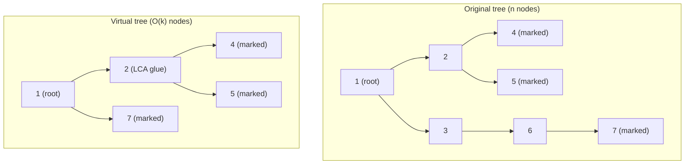

# Virtual Trees / Auxiliary Trees

Many tree problems give you **multiple queries**, each naming a small set of *marked* (important)
nodes, and ask you to run some tree DP that only really depends on those marked nodes and how they
connect. Running a full $O(n)$ DP per query is wasteful when $\sum k$ (the total size of all query
node-sets) is bounded but $n$ is huge — say $n, q$ up to $2 \cdot 10^5$ with $\sum k \le 2 \cdot
10^5$. A per-query $O(n)$ pass would cost $O(nq)$, far too slow.

The **virtual tree** (a.k.a. **auxiliary tree**) fixes this. For one query we build a *compressed*
tree that contains **only the marked nodes plus the pairwise LCAs needed to glue them together**.
This compressed tree has $O(k)$ nodes and faithfully preserves ancestor relationships and path
distances of the original tree. We then run the normal tree DP **on the small tree**, paying
$O(k \log k)$ per query instead of $O(n)$. Summed over all queries the work is
$O\!\left(\big(\sum k\big)\log n\right)$.

The key structural fact: if you take any set $S$ of marked nodes and **close it under pairwise
LCA**, the resulting set has size at most $2|S| - 1$, and connecting consecutive nodes (in Euler/tin
order) through their LCAs reconstructs exactly the minimal subtree (Steiner tree) shape that matters.

---

## Table of Contents
1. [Prerequisite: LCA + tin via Euler Order](#prerequisite-lca--tin-via-euler-order)
2. [The Construction Algorithm](#the-construction-algorithm)
3. [Why the Compressed Tree Has O(k) Nodes](#why-the-compressed-tree-has-ok-nodes)
4. [Running Tree DP on the Virtual Tree](#running-tree-dp-on-the-virtual-tree)
5. [Mermaid — Original vs Compressed](#mermaid--original-vs-compressed)
6. [Complexity Summary](#complexity-summary)
7. [Common Pitfalls](#common-pitfalls)
8. [Patterns](#patterns)

---

## Prerequisite: LCA + tin via Euler Order

A virtual tree needs two pieces of preprocessing on the original tree, both built once in
$O(n \log n)$:

1. **`tin[v]`** — the **entry time** of `v` in a DFS preorder (Euler order). Sorting nodes by `tin`
   puts them in the order a preorder DFS would visit them. Crucially, `u` is an **ancestor** of `v`
   iff $tin[u] \le tin[v] \le tout[u]$, and among any node set the one with the **smallest `tin`**
   that is an ancestor of the rest is the "topmost" node.
2. **`lca(u, v)`** — lowest common ancestor in $O(\log n)$, via binary lifting (see
   [03-lca-binary-lifting.md](03-lca-binary-lifting.md)).

We compute both with a single **iterative** DFS (recursion overflows for $n$ up to $2 \cdot 10^5$),
then fill the binary-lifting table.

```python
import sys

def preprocess(n, adj, root=1):
    """Return (tin, tout, up, depth, LOG) for a 1-indexed tree."""
    LOG = max(1, n.bit_length())
    up = [[root] * (n + 1) for _ in range(LOG)]
    depth = [0] * (n + 1)
    tin = [0] * (n + 1)
    tout = [0] * (n + 1)
    timer = 0

    # iterative Euler DFS: push (v, parent, child_index) frames
    up[0][root] = root
    stack = [(root, root, 0)]
    tin[root] = timer
    timer += 1
    depth[root] = 0
    # We emulate recursion with an explicit index into each node's adj list.
    it = [0] * (n + 1)
    visited = [False] * (n + 1)
    visited[root] = True
    st = [root]
    while st:
        v = st[-1]
        if it[v] < len(adj[v]):
            w = adj[v][it[v]]
            it[v] += 1
            if not visited[w]:
                visited[w] = True
                up[0][w] = v
                depth[w] = depth[v] + 1
                tin[w] = timer
                timer += 1
                st.append(w)
        else:
            tout[v] = timer - 1
            st.pop()

    for k in range(1, LOG):
        upk, upk1 = up[k], up[k - 1]
        for v in range(1, n + 1):
            upk[v] = upk1[upk1[v]]
    return tin, tout, up, depth, LOG


def lca(a, b, up, depth, LOG):
    if depth[a] < depth[b]:
        a, b = b, a
    diff = depth[a] - depth[b]
    for k in range(LOG):
        if diff & (1 << k):
            a = up[k][a]
    if a == b:
        return a
    for k in range(LOG - 1, -1, -1):
        if up[k][a] != up[k][b]:
            a = up[k][a]
            b = up[k][b]
    return up[0][a]
```

```cpp
#include <bits/stdc++.h>
using namespace std;

const long long INF = 1e18;

int LOG;
vector<vector<int>> up;
vector<int> depthv, tin, tout;

// Iterative Euler DFS + binary-lifting table for a 1-indexed tree.
void preprocess(int n, const vector<vector<int>>& adj, int root = 1) {
    LOG = max(1, (int)(32 - __builtin_clz((unsigned)n)));
    up.assign(LOG, vector<int>(n + 1, root));
    depthv.assign(n + 1, 0);
    tin.assign(n + 1, 0);
    tout.assign(n + 1, 0);
    int timer = 0;

    up[0][root] = root;
    vector<int> it(n + 1, 0);
    vector<char> visited(n + 1, false);
    visited[root] = true;
    tin[root] = timer++;
    vector<int> st = {root};
    while (!st.empty()) {
        int v = st.back();
        if (it[v] < (int)adj[v].size()) {
            int w = adj[v][it[v]++];
            if (!visited[w]) {
                visited[w] = true;
                up[0][w] = v;
                depthv[w] = depthv[v] + 1;
                tin[w] = timer++;
                st.push_back(w);
            }
        } else {
            tout[v] = timer - 1;
            st.pop_back();
        }
    }

    for (int k = 1; k < LOG; ++k)
        for (int v = 1; v <= n; ++v)
            up[k][v] = up[k - 1][up[k - 1][v]];
}

int lca(int a, int b) {
    if (depthv[a] < depthv[b]) swap(a, b);
    int diff = depthv[a] - depthv[b];
    for (int k = 0; k < LOG; ++k)
        if (diff & (1 << k)) a = up[k][a];
    if (a == b) return a;
    for (int k = LOG - 1; k >= 0; --k)
        if (up[k][a] != up[k][b]) { a = up[k][a]; b = up[k][b]; }
    return up[0][a];
}
```

---

## The Construction Algorithm

Given a query's marked set $S$, build the virtual tree in four steps:

1. **Sort `S` by `tin`.** This is preorder, the order a DFS visits the nodes.
2. **Add consecutive LCAs.** For each adjacent pair $(s_i, s_{i+1})$ in the sorted order, add
   $\operatorname{lca}(s_i, s_{i+1})$ to the candidate set. A classic lemma says the set of *all*
   pairwise LCAs equals the set of LCAs of *consecutive* nodes in tin order — so we only need
   $k - 1$ LCA calls, not $\binom{k}{2}$.
3. **Sort the combined set by `tin` and dedupe.** Now we have all $O(k)$ vertices of the virtual
   tree in preorder.
4. **Stack sweep to add edges.** Walk the sorted vertices left to right, maintaining a stack that
   holds the current rightmost root-to-node chain. For the next vertex `v`, pop the stack while its
   top is **not an ancestor of `v`** (i.e. `tout[top] < tin[v]`), connecting popped nodes to the new
   top; then push `v`. The remaining ancestor on top becomes `v`'s parent.

The ancestor test uses tin/tout: `u` is an ancestor of `v` iff $tin[u] \le tin[v] \le tout[u]$.

```python
def build_virtual_tree(marked, tin, tout, up, depth, LOG):
    """Return (root_of_vtree, adj_dict) for the compressed tree over `marked`.
    adj_dict maps each virtual-tree node to a list of its children (rooted)."""
    if not marked:
        return None, {}
    nodes = sorted(set(marked), key=lambda v: tin[v])

    # add LCAs of consecutive nodes
    extra = []
    for i in range(len(nodes) - 1):
        extra.append(lca(nodes[i], nodes[i + 1], up, depth, LOG))
    nodes = sorted(set(nodes) | set(extra), key=lambda v: tin[v])

    adj = {v: [] for v in nodes}

    def is_ancestor(u, v):
        return tin[u] <= tin[v] <= tout[u]

    stack = [nodes[0]]
    for v in nodes[1:]:
        # pop nodes that are not ancestors of v
        while not is_ancestor(stack[-1], v):
            stack.pop()
        parent = stack[-1]
        adj[parent].append(v)
        stack.append(v)
    return nodes[0], adj
```

```cpp
// Returns the root of the virtual tree; fills `vadj` (children lists),
// keyed by original node id. `marked` is the query's node set.
int build_virtual_tree(vector<int> marked,
                       unordered_map<int, vector<int>>& vadj) {
    vadj.clear();
    if (marked.empty()) return -1;

    sort(marked.begin(), marked.end(),
         [](int a, int b) { return tin[a] < tin[b]; });
    marked.erase(unique(marked.begin(), marked.end()), marked.end());

    // add LCAs of consecutive nodes
    vector<int> nodes = marked;
    for (size_t i = 0; i + 1 < marked.size(); ++i)
        nodes.push_back(lca(marked[i], marked[i + 1]));
    sort(nodes.begin(), nodes.end(),
         [](int a, int b) { return tin[a] < tin[b]; });
    nodes.erase(unique(nodes.begin(), nodes.end()), nodes.end());

    for (int v : nodes) vadj[v];  // ensure key exists

    auto is_ancestor = [](int u, int v) {
        return tin[u] <= tin[v] && tin[v] <= tout[u];
    };

    vector<int> st = {nodes[0]};
    for (size_t i = 1; i < nodes.size(); ++i) {
        int v = nodes[i];
        while (!is_ancestor(st.back(), v)) st.pop_back();
        vadj[st.back()].push_back(v);
        st.push_back(v);
    }
    return nodes[0];
}
```

---

## Why the Compressed Tree Has O(k) Nodes

Let $|S| = k$. Closing $S$ under pairwise LCA adds at most $k - 1$ new vertices (one per consecutive
pair in tin order), so the virtual tree has at most $2k - 1$ vertices and at most $2k - 2$ edges. The
construction never inspects the other $n - O(k)$ vertices of the original tree, which is exactly why
each query is sublinear in $n$.

Formally, the virtual tree is the unique minimal tree $T'$ such that:

$$
V(T') = S \cup \{\operatorname{lca}(u, v) : u, v \in S\}, \qquad |V(T')| \le 2k - 1
$$

and an edge $(p, c)$ in $T'$ means `p` is the **nearest** virtual-tree ancestor of `c` in the
original tree. The original distance along that compressed edge is
$depth[c] - depth[p]$, which lets DP recover true path lengths.

---

## Running Tree DP on the Virtual Tree

Once `vadj` is built, you run whatever DP the problem needs — but on $O(k)$ nodes, using
**compressed edge weights** $w(p, c) = depth[c] - depth[p]$ where original distances matter. Below is
a generic example: **sum of distances from the virtual root to all marked nodes**, a stand-in for
"any tree DP over the compressed structure."

```python
def dp_on_virtual_tree(root, adj, marked_set, depth):
    """Example DP: return sum over marked nodes of dist(root, node)
    computed via compressed edge weights depth[child]-depth[parent]."""
    total = 0
    # iterative post-order not needed here; a simple DFS accumulating depth diff
    stack = [(root, 0)]   # (node, accumulated distance from root)
    while stack:
        v, dist_from_root = stack.pop()
        if v in marked_set:
            total += dist_from_root
        for c in adj[v]:
            w = depth[c] - depth[v]            # compressed edge weight
            stack.append((c, dist_from_root + w))
    return total
```

```cpp
// Example DP: sum over marked nodes of dist(root, node) using
// compressed edge weights depth[child]-depth[parent].
long long dp_on_virtual_tree(int root,
                             unordered_map<int, vector<int>>& adj,
                             const unordered_set<int>& marked_set) {
    long long total = 0;
    vector<pair<int, long long>> st = {{root, 0LL}};
    while (!st.empty()) {
        auto [v, dist_from_root] = st.back();
        st.pop_back();
        if (marked_set.count(v)) total += dist_from_root;
        for (int c : adj[v]) {
            long long w = depthv[c] - depthv[v];   // compressed edge weight
            st.push_back({c, dist_from_root + w});
        }
    }
    return total;
}
```

The DP recurrence depends on the problem, but the **shape** is always: post-order over the $O(k)$
virtual nodes, combining children, with each compressed edge carrying the original gap
$depth[c] - depth[p]$. Because we touch only $O(k)$ nodes, the per-query DP is $O(k)$ on top of the
$O(k \log k)$ build.

---

## Mermaid — Original vs Compressed

Marked nodes are `4`, `5`, and `7`; their pairwise LCAs pull in `2` (the glue node). The virtual
tree keeps only `{2, 4, 5, 7}` and the root attachment.



Note how the chain `1 &rarr; 3 &rarr; 6 &rarr; 7` collapses into a single compressed edge
`1 &rarr; 7` of weight `3`, and `2` survives only because it is the LCA of `4` and `5`.

---

## Complexity Summary

| Phase | Cost |
|-------|------|
| One-time preprocessing (Euler tour + binary lifting) | $O(n \log n)$ |
| Sort marked set by `tin` | $O(k \log k)$ |
| Consecutive LCAs | $O(k \log n)$ |
| Sort combined set + stack sweep | $O(k \log k)$ |
| DP on virtual tree | $O(k)$ |
| **Per query** | $O(k \log k)$ |
| **All queries** | $O\!\left(n \log n + \big(\sum k\big)\log n\right)$ |

The decisive win: with $\sum k \le 2 \cdot 10^5$ and $n$ up to $2 \cdot 10^5$, the total is near
$O(n \log n)$ rather than $O(nq)$.

---

## Common Pitfalls

- **Forgetting to include the LCAs.** Without the consecutive-LCA glue nodes, marked nodes in
  different subtrees would lose their true meeting point and the DP would be wrong. Always close the
  set under pairwise (consecutive) LCA.
- **Not sorting by `tin`.** The stack sweep and the consecutive-LCA lemma both rely on **preorder**.
  Sorting by node id or depth breaks both. Sort by `tin` every time.
- **Root handling.** If the real root is not part of the set, the topmost virtual node (smallest
  `tin`) is the virtual root; do not force original node `1` in unless a problem needs an anchor.
  When you *do* need everything anchored, add the root explicitly before building.
- **Not clearing structures between queries.** The `vadj` map / adjacency dict and any per-node DP
  arrays must be reset for the touched nodes only (clearing all $n$ entries reintroduces the $O(n)$
  per-query cost you were trying to avoid). Clear lazily: reset just the $O(k)$ nodes you visited.
- **Duplicate nodes.** A marked node can coincide with a computed LCA; dedupe the combined set or the
  stack sweep will create self-loops.

---

## Patterns

- **"Sum over queries of small node-sets is bounded" + tree DP** → virtual tree. The signal is
  $\sum k$ bounded while $n$ is large.
- **Minimal connecting subtree / Steiner tree on a tree** → the virtual tree *is* that subtree
  (after adding LCAs); edge count answers "min edges to connect the marked nodes."
- **Min cut / deletions to separate important nodes** (Codeforces 613D) → greedy DP over the virtual
  tree distinguishing adjacent-important infeasibility.
- **Pairwise distance aggregates** → run a subtree-count DP on the virtual tree with compressed edge
  weights $depth[c] - depth[p]$.
- Always pair the virtual tree with **iterative** Euler DFS and **binary-lifting LCA** so the
  $n \le 2 \cdot 10^5$ preprocessing is safe and fast.
