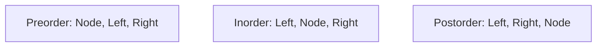

# Trees — Complete Guide (Beginner → Advanced)

> A tree is a hierarchical structure of nodes with no cycles. Binary trees, BSTs, heaps, tries,
> segment trees, and more all stem from this one idea — making trees one of the richest topics
> in data structures.

---

## Table of Contents
1. [Terminology](#1-terminology)
2. [Binary Trees](#2-binary-trees)
3. [Traversals (DFS & BFS)](#3-traversals-dfs--bfs)
4. [Binary Search Trees (BST)](#4-binary-search-trees-bst)
5. [Balanced Trees](#5-balanced-trees)
6. [Tree DP & Recursion Patterns](#6-tree-dp--recursion-patterns)
7. [Specialized Trees](#7-specialized-trees)
8. [Cheat Sheet](#8-cheat-sheet)

---

## 1. Terminology

```
            (A)            <- root (no parent)
           /   \
        (B)     (C)        <- A's children; B,C are siblings
        /  \       \
     (D)   (E)     (F)     <- leaves (no children): D, E, F
```

| Term | Meaning |
|------|---------|
| Root | Top node, no parent |
| Leaf | Node with no children |
| Edge | Link between parent and child |
| Depth of a node | # edges from root to node |
| Height of a node | # edges on longest path to a leaf |
| Subtree | A node plus all its descendants |
| Height of tree | Height of root |

For a tree with `n` nodes there are exactly `n − 1` edges (each non-root node has one parent
edge).

---

## 2. Binary Trees

Each node has at most **two** children (`left`, `right`).

```python
class TreeNode:
    def __init__(self, val=0, left=None, right=None):
        self.val = val
        self.left = left
        self.right = right
```

```cpp
struct TreeNode {
    int val;
    TreeNode* left;
    TreeNode* right;
    TreeNode(int x = 0, TreeNode* l = nullptr, TreeNode* r = nullptr)
        : val(x), left(l), right(r) {}
};
```

Special shapes:
- **Full:** every node has 0 or 2 children.
- **Complete:** all levels full except possibly the last, filled left to right (heaps!).
- **Perfect:** all internal nodes have 2 children and all leaves are at the same depth.
- **Balanced:** height is O(log n).
- **Degenerate:** essentially a linked list (height n).

A perfect binary tree of height `h` has:
$$
2^{h+1} - 1 \text{ nodes}, \qquad 2^h \text{ leaves}
$$
So a balanced tree with `n` nodes has height `≈ log₂ n` — the basis of O(log n) operations.

---

## 3. Traversals (DFS & BFS)

### Depth-First (DFS) — recursion or stack



For the tree:
```
        1
       / \
      2   3
     / \
    4   5
```

| Traversal | Order | Output | Use |
|-----------|-------|--------|-----|
| Preorder | N,L,R | 1 2 4 5 3 | copy/serialize tree |
| Inorder | L,N,R | 4 2 5 1 3 | **sorted order in a BST** |
| Postorder | L,R,N | 4 5 2 3 1 | delete tree, compute sizes/heights |

```python
def inorder(node, out):
    if not node:
        return
    inorder(node.left, out)
    out.append(node.val)        # visit between children
    inorder(node.right, out)
```

```cpp
void inorder(TreeNode* node, vector<int>& out) {
    if (!node)
        return;
    inorder(node->left, out);
    out.push_back(node->val);   // visit between children
    inorder(node->right, out);
}
```

### Breadth-First (BFS) — level order with a queue
Visit level by level using a queue; outputs `1 / 2 3 / 4 5`.

```python
from collections import deque
def level_order(root):
    if not root: return []
    q, res = deque([root]), []
    while q:
        level = []
        for _ in range(len(q)):     # snapshot this level's size
            n = q.popleft()
            level.append(n.val)
            if n.left:  q.append(n.left)
            if n.right: q.append(n.right)
        res.append(level)
    return res
```

```cpp
vector<vector<int>> level_order(TreeNode* root) {
    if (!root) return {};
    queue<TreeNode*> q;
    q.push(root);
    vector<vector<int>> res;
    while (!q.empty()) {
        vector<int> level;
        for (int sz = (int)q.size(); sz > 0; --sz) {   // snapshot this level's size
            TreeNode* n = q.front(); q.pop();
            level.push_back(n->val);
            if (n->left)  q.push(n->left);
            if (n->right) q.push(n->right);
        }
        res.push_back(level);
    }
    return res;
}
```

---

## 4. Binary Search Trees (BST)

A BST maintains the invariant: for every node, **all left-subtree values < node < all
right-subtree values**.

```
        8
       / \
      3   10
     / \    \
    1   6    14
```

Consequences:
- **Inorder traversal yields sorted order.**
- Search/insert/delete are O(h): O(log n) if balanced, O(n) if degenerate.

```python
def bst_search(node, key):
    while node:
        if key == node.val: return node
        node = node.left if key < node.val else node.right
    return None
```

```cpp
TreeNode* bst_search(TreeNode* node, int key) {
    while (node) {
        if (key == node->val) return node;
        node = key < node->val ? node->left : node->right;
    }
    return nullptr;
}
```

### Deletion cases
1. Leaf → just remove.
2. One child → splice child up.
3. Two children → replace with **inorder successor** (smallest in right subtree), then delete it.

---

## 5. Balanced Trees

Unbalanced BSTs degrade to O(n). **Self-balancing** trees keep height O(log n):

| Tree | Balance rule |
|------|--------------|
| **AVL** | heights of two child subtrees differ by ≤ 1; rotations on insert/delete |
| **Red-Black** | color rules guarantee height ≤ 2·log(n+1) (used in C++ `map`, Java `TreeMap`) |
| **B-Tree / B+Tree** | high fan-out, disk-friendly (databases, filesystems) |

Balancing uses **rotations** — local O(1) pointer rewires that reduce height.

---

## 6. Tree DP & Recursion Patterns

Most tree problems follow a **post-order "ask the children, combine" recursion**:

```python
def solve(node):
    if not node:
        return base_case
    left = solve(node.left)
    right = solve(node.right)
    return combine(node, left, right)
```

```cpp
// T is the aggregate type; base_case and combine() are problem-specific
template <typename T>
T solve(TreeNode* node) {
    if (!node)
        return base_case;
    T left = solve(node->left);
    T right = solve(node->right);
    return combine(node, left, right);
}
```

Examples:
- **Height:** `1 + max(left, right)`.
- **Diameter:** track longest path through each node = `leftHeight + rightHeight`.
- **Balanced check:** return height, or a sentinel if unbalanced.
- **Max path sum:** combine best downward paths.
- **Lowest Common Ancestor (LCA):** the node where target subtrees split.

---

## 7. Specialized Trees

| Tree | Purpose | Key op cost |
|------|---------|-------------|
| **Heap** | priority queue | O(log n) push/pop |
| **Trie** | string prefixes | O(len) |
| **Segment Tree** | range query + update | O(log n) |
| **Fenwick (BIT)** | prefix sums + update | O(log n) |
| **Suffix Tree** | substring queries | linear-size |
| **N-ary / general tree** | filesystems, DOM | varies |

---

## 8. Cheat Sheet

```
Traversals:  pre(N,L,R)  in(L,N,R)=sorted in BST  post(L,R,N)  level(BFS)
BST ops:     O(h) -> O(log n) balanced, O(n) degenerate
Balanced:    AVL / Red-Black keep height O(log n) via rotations
Recursion:   solve(node) = combine(node, solve(left), solve(right))
Perfect tree: 2^(h+1)-1 nodes, height ~ log2(n)

Patterns: height, diameter, LCA, path sum, serialize, validate BST
```

> **Mental model:** Think recursively. A tree *is* a root plus two smaller trees. Solve the
> subtrees, then combine at the root — almost every tree algorithm is a variation of this.
