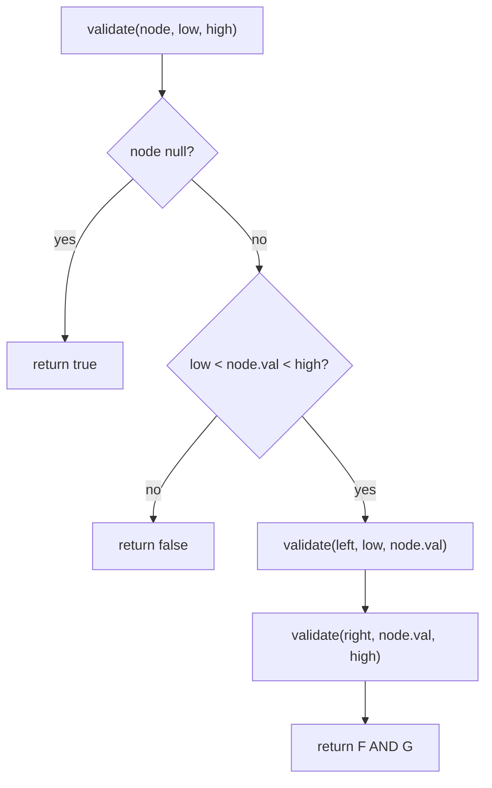

# Validate Binary Search Tree

| Meta | Value |
|------|-------|
| Source | LeetCode #98 |
| Difficulty | Medium |
| Topics | Tree, BST, DFS, Recursion |
| Link | https://leetcode.com/problems/validate-binary-search-tree/ |

---

## Problem Statement
Determine whether a binary tree is a **valid BST**: for every node, all values in its left
subtree are strictly less, and all values in its right subtree are strictly greater.

**Example**
```
     5            VALID            5          INVALID
    / \                          / \
   1   4                        1   4
      / \                          / \
     3   6                        3   6
(4 < 5 is fine? NO: 4 is in 5's right subtree but 4 < 5) -> the right tree is invalid
```

---

## The Subtle Trap

A common wrong solution checks only `node.left < node < node.right` locally. That **fails**
because the BST property is **global**, not local:

```
      5
     / \
    1   4       <- 4 < 5 violates "everything right of 5 must be > 5"
       / \
      3   6     <- 3 < 5 also violates it
```

Node `4` is a valid right child of nothing in isolation, but it's in `5`'s **right subtree**, so
it must be `> 5`. A local-only check misses this.

---

## Correct Approach — Valid Range (Min/Max Bounds)

Pass down an allowed **open interval** `(low, high)` that each node's value must fall within. The
root may be anything `(−∞, +∞)`. Going **left** tightens the upper bound to the parent's value;
going **right** tightens the lower bound.



```python
def is_valid_bst(root):
    def validate(node, low, high):
        if node is None:
            return True
        if not (low < node.val < high):
            return False
        return (validate(node.left,  low, node.val) and
                validate(node.right, node.val, high))
    return validate(root, float('-inf'), float('inf'))
```

```cpp
bool is_valid_bst(TreeNode* root) {
    // use long long bounds so INT_MIN / INT_MAX node values are handled
    function<bool(TreeNode*, long long, long long)> validate =
        [&](TreeNode* node, long long low, long long high) -> bool {
            if (node == nullptr)
                return true;
            if (!(low < node->val && node->val < high))
                return false;
            return validate(node->left,  low, node->val) &&
                   validate(node->right, node->val, high);
        };
    return validate(root, LLONG_MIN, LLONG_MAX);
}
```

---

## Trace — the invalid example

```
      5
     / \
    1   4
       / \
      3   6
```

| node | allowed (low, high) | val in range? |
|------|---------------------|---------------|
| 5 | (−∞, +∞) | 5 ✓ |
| 1 (left of 5) | (−∞, 5) | 1 ✓ |
| 4 (right of 5) | (5, +∞) | 4 ✓? **4 > 5 is false** → **return false** |

The range `(5, +∞)` for node `4` immediately exposes the violation that a local check would
miss. Result: **not a valid BST** ✓.

---

## Alternative — Inorder Traversal Must Be Strictly Increasing

A BST's **inorder traversal** (Left, Node, Right) yields values in **sorted order**. So validate
by checking each value is strictly greater than the previous one.

```python
def is_valid_bst_inorder(root):
    prev = float('-inf')
    stack = []
    node = root
    while stack or node:
        while node:               # go as far left as possible
            stack.append(node)
            node = node.left
        node = stack.pop()
        if node.val <= prev:      # not strictly increasing -> invalid
            return False
        prev = node.val
        node = node.right
    return True
```

```cpp
bool is_valid_bst_inorder(TreeNode* root) {
    long long prev = LLONG_MIN;
    stack<TreeNode*> stk;
    TreeNode* node = root;
    while (!stk.empty() || node) {
        while (node) {                // go as far left as possible
            stk.push(node);
            node = node->left;
        }
        node = stk.top(); stk.pop();
        if (node->val <= prev)        // not strictly increasing -> invalid
            return false;
        prev = node->val;
        node = node->right;
    }
    return true;
}
```

If at any point the current value is `<=` the previously visited value, the BST property is
broken.

---

## Complexity

| Approach | Time | Space |
|----------|------|-------|
| Range bounds (recursion) | O(n) | O(h) stack |
| Inorder (iterative) | O(n) | O(h) stack |

Both visit each node once. Space is the tree height `h` (O(log n) balanced, O(n) skewed).

---

## Edge Cases & Gotchas
- **Equal values:** problem requires *strict* inequality, so duplicates make it invalid (`<=`
  check matters).
- **Integer extremes:** using `±inf` (or `None`-based bounds) avoids issues when node values
  equal `INT_MIN`/`INT_MAX`.
- **Empty tree / single node:** valid by definition.

## Takeaway
BST validity is **global**, enforced cleanly by **propagating min/max bounds downward** or by
checking that **inorder traversal is strictly increasing**. Beware the seductive but wrong
local-only comparison.
