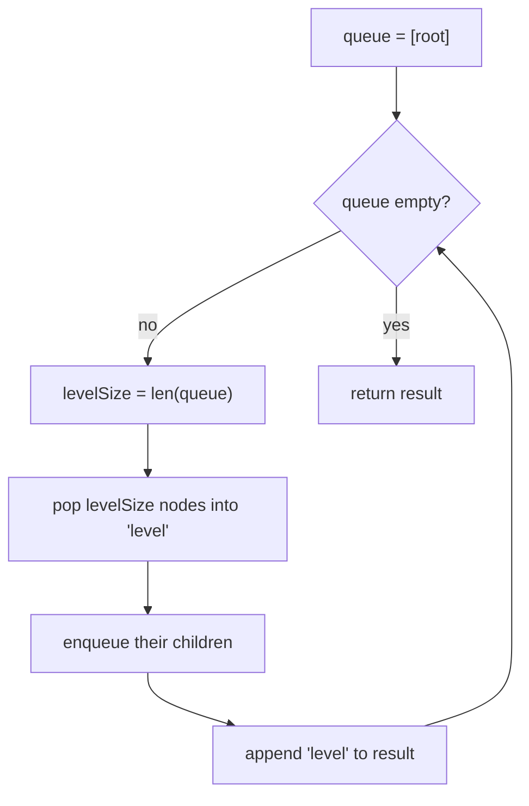

# Binary Tree Level Order Traversal

| Meta | Value |
|------|-------|
| Source | LeetCode #102 |
| Difficulty | Medium |
| Topics | Tree, BFS, Queue |
| Link | https://leetcode.com/problems/binary-tree-level-order-traversal/ |

---

## Problem Statement
Return the values of a binary tree's nodes **level by level**, from left to right, as a list of
lists.

**Example**
```
        3
       / \
      9   20
         /  \
        15   7

Output: [[3], [9, 20], [15, 7]]
```

---

## Why BFS with a Queue?

Levels are explored in **breadth** — all nodes at depth `d` before depth `d+1`. That's exactly
**Breadth-First Search**, powered by a **FIFO queue**: dequeue a node, enqueue its children. The
children naturally appear after all current-level nodes.

The trick to grouping by level: before processing a level, **record the queue's current size**.
That count is precisely the number of nodes on this level; process exactly that many, and every
child you enqueue belongs to the *next* level.



---

## Code

```python
from collections import deque

def level_order(root):
    if not root:
        return []
    result = []
    queue = deque([root])
    while queue:
        level_size = len(queue)        # nodes on the current level
        level = []
        for _ in range(level_size):
            node = queue.popleft()
            level.append(node.val)
            if node.left:
                queue.append(node.left)
            if node.right:
                queue.append(node.right)
        result.append(level)
    return result
```

```cpp
vector<vector<int>> level_order(TreeNode* root) {
    if (!root)
        return {};
    vector<vector<int>> result;
    queue<TreeNode*> queue;
    queue.push(root);
    while (!queue.empty()) {
        int level_size = (int)queue.size();   // nodes on the current level
        vector<int> level;
        for (int i = 0; i < level_size; ++i) {
            TreeNode* node = queue.front(); queue.pop();
            level.push_back(node->val);
            if (node->left)
                queue.push(node->left);
            if (node->right)
                queue.push(node->right);
        }
        result.push_back(level);
    }
    return result;
}
```

---

## Iteration Trace

Tree:
```
        3
       / \
      9   20
         /  \
        15   7
```

| iteration | level_size | nodes popped | children enqueued | queue after | result |
|-----------|-----------|--------------|-------------------|-------------|--------|
| 1 | 1 | 3 | 9, 20 | [9, 20] | [[3]] |
| 2 | 2 | 9, 20 | (9: none), (20: 15, 7) | [15, 7] | [[3],[9,20]] |
| 3 | 2 | 15, 7 | none | [] | [[3],[9,20],[15,7]] |

Queue empties → return `[[3], [9, 20], [15, 7]]` ✓.

The `level_size` snapshot at the start of iteration 2 is **2** (nodes 9 and 20), so we pop
exactly two and everything we enqueue (15, 7) is deferred to iteration 3.

---

## Complexity

| Metric | Value |
|--------|-------|
| Time   | O(n) — each node enqueued and dequeued once |
| Space  | O(n) — queue holds up to a full level; widest level can be n/2 |

---

## Common Variants (same BFS skeleton)
- **Zigzag level order** (103): reverse every other level before appending.
- **Right side view** (199): take the **last** node of each level.
- **Level averages** (637): average each `level` list.
- **Bottom-up level order** (107): reverse the final result.

### DFS alternative
You can also produce level order with DFS by passing a `depth` parameter and indexing into
`result[depth]`. BFS is more natural and avoids deep recursion on skewed trees.

```python
def level_order_dfs(root, depth=0, result=None):
    if result is None:
        result = []
    if not root:
        return result
    if depth == len(result):
        result.append([])
    result[depth].append(root.val)
    level_order_dfs(root.left, depth + 1, result)
    level_order_dfs(root.right, depth + 1, result)
    return result
```

```cpp
void level_order_dfs(TreeNode* root, int depth, vector<vector<int>>& result) {
    if (!root)
        return;
    if (depth == (int)result.size())
        result.push_back({});
    result[depth].push_back(root->val);
    level_order_dfs(root->left, depth + 1, result);
    level_order_dfs(root->right, depth + 1, result);
}
```

## Takeaway
**BFS + level-size snapshot** is the universal template for any "process the tree level by level"
problem. Remember: capture `len(queue)` *before* the inner loop to cleanly separate levels.
