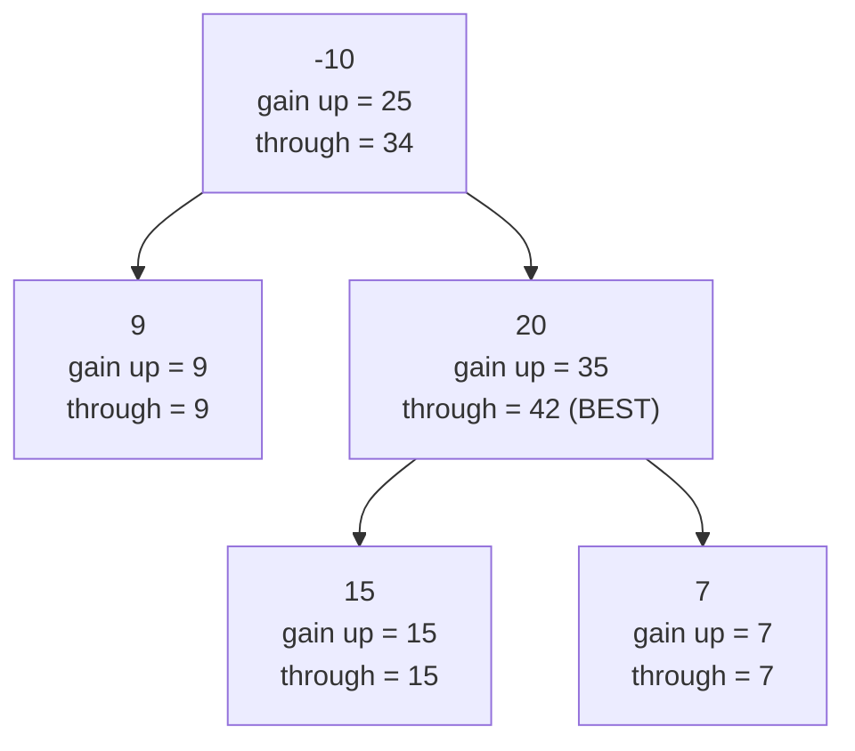

# Binary Tree Maximum Path Sum

| Meta | Detail |
|------|--------|
| **Source** | LeetCode #124 |
| **Difficulty** | Hard |
| **Topics** | Tree, DFS, Dynamic Programming, Recursion |
| **Link** | https://leetcode.com/problems/binary-tree-maximum-path-sum/ |

---

## Problem Statement

A **path** in a binary tree is a sequence of nodes where each adjacent pair is connected by an edge. A node appears **at most once** in the path, and the path **does not need to pass through the root**. The **path sum** is the sum of the node values along the path. Return the maximum path sum of *any* non-empty path in the tree.

```
Input tree:

        -10
        /  \
       9    20
            / \
           15  7

Best path: 15 -> 20 -> 7   (it "turns" at node 20)
Path sum:  15 + 20 + 7 = 42

Answer: 42

Another example:

        1
       / \
      2   3

Best path: 2 -> 1 -> 3  =  6
```

Note the best path turned at `20` and never touched the root `-10`. A valid path can be a single node, a straight line, or a "V" that bends at exactly one node.

---

## Approach — the WHY

The crux: a path that is *allowed to bend* can bend at **exactly one** node — its highest point (the node closest to the root on that path). At that turning node the path may extend **down into the left subtree** and **down into the right subtree**, joining them through the node. But once a path is handed *up* to a parent, it can only continue through **one** child (you cannot pass through a node twice), so a node may contribute only a single downward branch to its parent.

This split — "what I can contribute upward" vs. "the best path that turns here" — is the heart of the tree DP.

### Two quantities per node

For each node we run a **post-order DFS** (children first, then the node) returning the best **downward gain**:

$$
\text{gain}(n) = \text{val}(n) + \max\bigl(0,\; \max(\text{gain}(n.\text{left}),\, \text{gain}(n.\text{right}))\bigr)
$$

We **clamp negative gains to 0** because a subtree that only subtracts from the total is better left out — contributing `0` means "don't extend into this branch."

Meanwhile, the best path that **turns at** node $n$ (and therefore can never go higher) is:

$$
\text{through}(n) = \text{val}(n) + \max(0, \text{gain}(n.\text{left})) + \max(0, \text{gain}(n.\text{right}))
$$

We update a **global best** with every `through(n)`:

$$
\text{best} = \max_{n} \; \text{through}(n)
$$

### Why this is correct
Every path in the tree has a unique highest node. When the DFS visits that node, `through(n)` considers both clamped child gains simultaneously — exactly the bent path. By taking the maximum over *all* nodes, we are guaranteed to evaluate every possible path's turning point exactly once. The value returned upward (`gain`) only allows a single branch, correctly preventing a parent from reusing a node twice.

---

## Solution — Post-order DFS with a global best

```python
class Solution:
    def maxPathSum(self, root):
        self.best = float("-inf")          # global maximum across all turns

        def gain(node):
            if not node:
                return 0                   # empty branch contributes nothing
            # Clamp negative child gains to 0: skip branches that hurt us.
            left_gain  = max(gain(node.left), 0)
            right_gain = max(gain(node.right), 0)

            # Path that TURNS at this node uses both branches + the node.
            through = node.val + left_gain + right_gain
            self.best = max(self.best, through)

            # Returned UP: may extend through only ONE branch.
            return node.val + max(left_gain, right_gain)

        gain(root)
        return self.best
```

```cpp
#include <algorithm>
#include <climits>
using namespace std;

struct TreeNode {
    int val;
    TreeNode* left;
    TreeNode* right;
    TreeNode(int x): val(x), left(nullptr), right(nullptr) {}
};

class Solution {
public:
    int maxPathSum(TreeNode* root) {
        best = INT_MIN;                    // global maximum across all turns
        gain(root);
        return best;
    }

private:
    int best;

    int gain(TreeNode* node) {
        if (!node) return 0;               // empty branch contributes nothing
        // Clamp negative child gains to 0: skip branches that hurt us.
        int left_gain  = max(gain(node->left), 0);
        int right_gain = max(gain(node->right), 0);

        // Path that TURNS at this node uses both branches + the node.
        int through = node->val + left_gain + right_gain;
        best = max(best, through);

        // Returned UP: may extend through only ONE branch.
        return node->val + max(left_gain, right_gain);
    }
};
```

---

## Iteration Trace — gain returned and global best per node

Tree:

```
        -10
        /  \
       9    20
            / \
           15  7
```

Post-order visits children before parents. The order of resolution is: `9`, `15`, `7`, `20`, `-10`.

| Node | left_gain | right_gain | through = val + left + right | gain returned = val + max(left,right) | global best after |
|------|-----------|------------|------------------------------|----------------------------------------|-------------------|
| 9    | 0 (null)  | 0 (null)   | 9 + 0 + 0 = **9**            | 9 + 0 = **9**                          | 9 |
| 15   | 0 (null)  | 0 (null)   | 15 + 0 + 0 = **15**         | 15 + 0 = **15**                        | 15 |
| 7    | 0 (null)  | 0 (null)   | 7 + 0 + 0 = **7**           | 7 + 0 = **7**                          | 15 |
| 20   | 15        | 7          | 20 + 15 + 7 = **42**        | 20 + max(15,7) = **35**                | **42** |
| -10  | 9         | 35         | -10 + 9 + 35 = **34**       | -10 + max(9,35) = **25**               | 42 |

**Final answer: 42** — achieved by the path that turns at node `20` (`15 -> 20 -> 7`). Notice node `20` returns only `35` upward (it can keep just one branch), and the root's `through` of `34` never beats the already-recorded `42`.

---

## Mermaid — gain (upward) vs. through (turning) at each node



The global best is the maximum **through** value seen anywhere: `max(9, 9, 15, 7, 42, 34) = 42`.

---

## Complexity

| Approach | Time | Space |
|----------|------|-------|
| Post-order DFS (tree DP) | $O(n)$ | $O(h)$ recursion stack |

Each node is visited exactly once, so time is linear in the number of nodes $n$. The only extra space is the recursion stack, bounded by the tree height $h$ — up to $O(n)$ for a degenerate/skewed tree and $O(\log n)$ for a balanced one.

---

## Takeaway

- Distinguish the two roles of a node: the **gain it contributes upward** (one branch only) versus the **best path that turns here** (both branches + the node).
- **Clamp negative gains to 0** — a branch that only subtracts is dropped by treating its contribution as nothing.
- Update a **single global best** with `left_gain + node.val + right_gain` at every node; every path's unique turning point is examined exactly once, so the maximum is guaranteed correct.
- This "return one thing, record another" pattern is the signature of **tree DP** and recurs in problems like diameter of a binary tree and longest univalue path.
