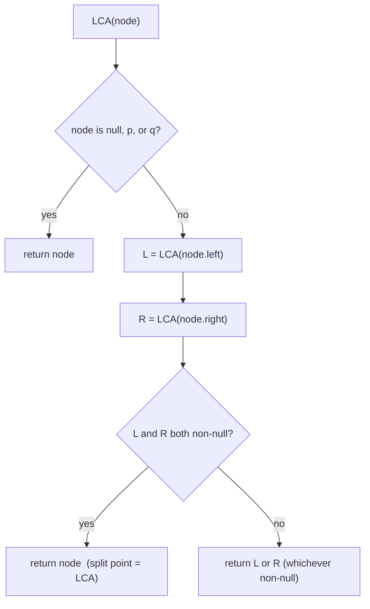

# Lowest Common Ancestor of a Binary Tree

| Meta | Value |
|------|-------|
| Source | LeetCode #236 |
| Difficulty | Medium |
| Topics | Tree, Recursion, DFS |
| Link | https://leetcode.com/problems/lowest-common-ancestor-of-a-binary-tree/ |

---

## Problem Statement
Given a binary tree and two nodes `p` and `q`, find their **lowest common ancestor (LCA)** — the
deepest node that has both `p` and `q` as descendants (a node can be a descendant of itself).

**Example**
```
            3
          /   \
         5     1
        / \   / \
       6   2 0   8
          / \
         7   4

LCA(5, 1) = 3
LCA(5, 4) = 5   (5 is an ancestor of 4)
```

---

## Key Insight — Post-Order "Report Upward"

Recurse to the bottom, then let each node **report** what it found:
- If the current node **is** `p` or `q`, report itself.
- Otherwise, ask both children.
  - If **both** children report a found target, the current node is the **split point** → it's
    the LCA.
  - If only **one** child reports, propagate that report upward.
  - If neither, report `None`.



---

## Code

```python
def lowest_common_ancestor(root, p, q):
    if root is None or root is p or root is q:
        return root                      # found a target (or hit bottom)
    left = lowest_common_ancestor(root.left, p, q)
    right = lowest_common_ancestor(root.right, p, q)
    if left and right:
        return root                      # p and q split here -> LCA
    return left if left else right       # propagate the non-null side
```

```cpp
TreeNode* lowest_common_ancestor(TreeNode* root, TreeNode* p, TreeNode* q) {
    if (root == nullptr || root == p || root == q)
        return root;                     // found a target (or hit bottom)
    TreeNode* left = lowest_common_ancestor(root->left, p, q);
    TreeNode* right = lowest_common_ancestor(root->right, p, q);
    if (left && right)
        return root;                     // p and q split here -> LCA
    return left ? left : right;           // propagate the non-null side
}
```

---

## Recursion Trace — `LCA(5, 1)` on the example tree

The recursion unwinds bottom-up. Showing what each relevant node returns:

| node | left result | right result | returns | reason |
|------|-------------|--------------|---------|--------|
| 6 | None | None | None | leaf, not a target |
| 7 | None | None | None | leaf |
| 4 | None | None | None | leaf |
| 2 | LCA(7)=None | LCA(4)=None | None | neither child found |
| 5 | (is target) | — | **5** | node *is* p |
| 0,8 | — | — | None | not targets |
| 1 | LCA(0)=None | LCA(8)=None | **1** | node *is* q |
| **3** | left=5 | right=1 | **3** | both sides non-null → LCA |

At root `3`: left subtree reported `5` (found p), right subtree reported `1` (found q). Both
non-null → `3` is the split point → **LCA = 3** ✓.

For `LCA(5, 4)`: node `5` *is* `p`, so it returns `5` immediately without descending. Since `4`
lives inside `5`'s subtree, the right side of `5`'s parent never reports `4` separately — `5`
bubbles up as the answer. ✓ (a node is an ancestor of itself.)

---

## Why "Both Children Report" Means LCA

If `p` is found somewhere in the left subtree and `q` in the right subtree (or vice versa), the
**current node is the lowest node whose subtree contains both**. Any node deeper than it can
contain at most one of them. So the first node (going up) that sees both sides report is, by
definition, the *lowest* common ancestor.

---

## Complexity

| Metric | Value |
|--------|-------|
| Time   | O(n) — each node visited once |
| Space  | O(h) — recursion stack; h = tree height (O(n) worst, O(log n) balanced) |

---

## Variant: LCA in a BST (LeetCode 235)
In a **BST**, you can use the ordering: if both `p` and `q` are less than `node`, go left; if
both greater, go right; otherwise `node` is the LCA. That runs in O(h) without exploring both
subtrees:

```python
def lca_bst(root, p, q):
    while root:
        if p.val < root.val and q.val < root.val:
            root = root.left
        elif p.val > root.val and q.val > root.val:
            root = root.right
        else:
            return root
```

```cpp
TreeNode* lca_bst(TreeNode* root, TreeNode* p, TreeNode* q) {
    while (root) {
        if (p->val < root->val && q->val < root->val)
            root = root->left;
        else if (p->val > root->val && q->val > root->val)
            root = root->right;
        else
            return root;
    }
    return nullptr;
}
```

## Takeaway
The **post-order "ask children, combine at parent"** pattern solves LCA and most tree problems.
The LCA is simply *the node where the two search paths diverge*.
