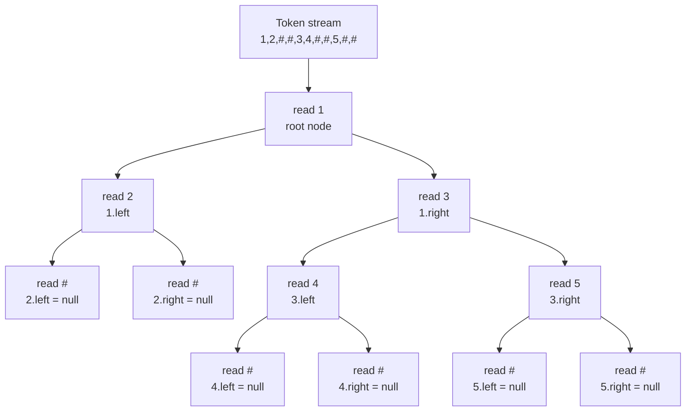

# Serialize and Deserialize Binary Tree

| Meta | Detail |
|------|--------|
| **Source** | LeetCode #297 |
| **Difficulty** | Hard |
| **Topics** | Tree, DFS, BFS, Design, String |
| **Link** | https://leetcode.com/problems/serialize-and-deserialize-binary-tree/ |

---

## Problem Statement

Serialization is the process of converting a data structure into a sequence of bits/characters so it can be stored (in a file or memory buffer) or transmitted across a network, and later reconstructed. Design an algorithm to **serialize** a binary tree into a string and **deserialize** that string back into the *exact same* tree.

There is no restriction on how your serialization/deserialization works — you only need `deserialize(serialize(root)) == root` (structurally and value-wise).

```
Input tree:

        1
       / \
      2   3
         / \
        4   5

serialize(root)   -> "1,2,#,#,3,4,#,#,5,#,#"   (preorder with null markers)
deserialize(str)  -> rebuilds the identical tree above

Edge case:
serialize(None)   -> "#"
deserialize("#")  -> None
```

---

## Approach — the WHY

A binary tree is **not** uniquely determined by a single plain traversal (e.g. preorder `[1,2,3]` could be many shapes). The trick is to make the traversal **lossless** by recording the *structure* too. We do this by emitting an explicit **null marker** (`#`) for every missing child. Once null positions are encoded, a single preorder (or level-order) stream becomes a complete, unambiguous blueprint of the tree.

### Why preorder DFS works
Preorder visits a node **before** its children: `root, left-subtree, right-subtree`. During deserialization we read tokens in the *same order*. The first token is always the current root; we then recursively build the left subtree (which consumes exactly its own slice of tokens), and whatever token comes next begins the right subtree. A shared cursor (a `queue` or an index) guarantees each recursive call consumes precisely the tokens that belong to it — the null markers tell us exactly when to stop descending.

$$
\text{serialize}(n) =
\begin{cases}
\texttt{"\#"} & n = \varnothing \\[4pt]
\text{val}(n) \,\Vert\, \text{serialize}(n.\text{left}) \,\Vert\, \text{serialize}(n.\text{right}) & \text{otherwise}
\end{cases}
$$

where $\Vert$ is concatenation with a delimiter (comma).

### Why BFS / level-order also works
Level-order emits nodes tier by tier, again writing `#` for absent children. On rebuild we keep a queue of "parent nodes awaiting children": pop a parent, read the next two tokens as its left and right child, enqueue any non-null children. This is the encoding LeetCode itself displays in its UI.

Both approaches are $O(n)$ in time and space; the choice is stylistic. Below we give **preorder DFS** as the primary solution and **BFS** as an alternative.

---

## Solution 1 — Preorder DFS with null markers

The cleanest formulation: serialize with recursion, deserialize by consuming tokens from a shared cursor (a `deque` in Python, a `queue<string>` in C++).

```python
from collections import deque

class Codec:
    def serialize(self, root):
        # Preorder: emit value, then '#' for nulls. Build a token list.
        out = []
        def dfs(node):
            if not node:
                out.append("#")          # null marker preserves structure
                return
            out.append(str(node.val))    # visit root first (preorder)
            dfs(node.left)               # then left subtree
            dfs(node.right)              # then right subtree
        dfs(root)
        return ",".join(out)

    def deserialize(self, data):
        # Shared cursor over tokens; each call consumes exactly its slice.
        tokens = deque(data.split(","))
        def build():
            val = tokens.popleft()
            if val == "#":
                return None              # stop: this child does not exist
            node = TreeNode(int(val))
            node.left = build()          # consume left subtree's tokens
            node.right = build()         # consume right subtree's tokens
            return node
        return build()
```

```cpp
#include <string>
#include <sstream>
#include <queue>
using namespace std;

struct TreeNode {
    int val;
    TreeNode* left;
    TreeNode* right;
    TreeNode(int x): val(x), left(nullptr), right(nullptr) {}
};

class Codec {
public:
    string serialize(TreeNode* root) {
        // Preorder: emit value, then '#' for nulls.
        string out;
        function<void(TreeNode*)> dfs = [&](TreeNode* node) {
            if (!node) { out += "#,"; return; }      // null marker
            out += to_string(node->val) + ",";        // visit root first
            dfs(node->left);                           // then left subtree
            dfs(node->right);                          // then right subtree
        };
        dfs(root);
        return out;
    }

    TreeNode* deserialize(string data) {
        // Tokenize on commas into a queue acting as a shared cursor.
        queue<string> tokens;
        stringstream ss(data);
        string item;
        while (getline(ss, item, ',')) {
            if (!item.empty()) tokens.push(item);
        }
        return build(tokens);
    }

private:
    TreeNode* build(queue<string>& tokens) {
        string val = tokens.front(); tokens.pop();
        if (val == "#") return nullptr;                // stop: child absent
        TreeNode* node = new TreeNode(stoi(val));
        node->left  = build(tokens);                   // consume left slice
        node->right = build(tokens);                   // consume right slice
        return node;
    }
};
```

---

## Solution 2 — BFS / Level-order (matches LeetCode's display format)

```python
from collections import deque

class Codec:
    def serialize(self, root):
        if not root:
            return ""
        out, q = [], deque([root])
        while q:
            node = q.popleft()
            if node:
                out.append(str(node.val))
                q.append(node.left)      # enqueue children (may be None)
                q.append(node.right)
            else:
                out.append("#")          # absent node marker
        return ",".join(out)

    def deserialize(self, data):
        if not data:
            return None
        tokens = data.split(",")
        root = TreeNode(int(tokens[0]))
        q, i = deque([root]), 1
        while q:
            node = q.popleft()
            if tokens[i] != "#":          # left child
                node.left = TreeNode(int(tokens[i]))
                q.append(node.left)
            i += 1
            if tokens[i] != "#":          # right child
                node.right = TreeNode(int(tokens[i]))
                q.append(node.right)
            i += 1
        return root
```

```cpp
#include <string>
#include <sstream>
#include <queue>
#include <vector>
using namespace std;

class Codec {
public:
    string serialize(TreeNode* root) {
        if (!root) return "";
        string out;
        queue<TreeNode*> q;
        q.push(root);
        while (!q.empty()) {
            TreeNode* node = q.front(); q.pop();
            if (node) {
                out += to_string(node->val) + ",";
                q.push(node->left);          // enqueue children (may be null)
                q.push(node->right);
            } else {
                out += "#,";                 // absent node marker
            }
        }
        return out;
    }

    TreeNode* deserialize(string data) {
        if (data.empty()) return nullptr;
        // Split into a vector of tokens.
        vector<string> tokens;
        stringstream ss(data);
        string item;
        while (getline(ss, item, ',')) {
            if (!item.empty()) tokens.push_back(item);
        }
        TreeNode* root = new TreeNode(stoi(tokens[0]));
        queue<TreeNode*> q;
        q.push(root);
        size_t i = 1;
        while (!q.empty()) {
            TreeNode* node = q.front(); q.pop();
            if (tokens[i] != "#") {          // left child
                node->left = new TreeNode(stoi(tokens[i]));
                q.push(node->left);
            }
            i++;
            if (tokens[i] != "#") {          // right child
                node->right = new TreeNode(stoi(tokens[i]));
                q.push(node->right);
            }
            i++;
        }
        return root;
    }
};
```

---

## Iteration Trace — Preorder serialization token stream

Tree used:

```
        1
       / \
      2   3
         / \
        4   5
```

The DFS visits nodes in preorder, emitting a value or a `#` marker. The cumulative token stream builds as follows:

| Step | Current node | Action | Emitted token | Stream so far |
|------|--------------|--------|---------------|---------------|
| 1 | 1 | visit root | `1` | `1` |
| 2 | 2 (1.left) | visit | `2` | `1,2` |
| 3 | None (2.left) | null marker | `#` | `1,2,#` |
| 4 | None (2.right) | null marker | `#` | `1,2,#,#` |
| 5 | 3 (1.right) | visit | `3` | `1,2,#,#,3` |
| 6 | 4 (3.left) | visit | `4` | `1,2,#,#,3,4` |
| 7 | None (4.left) | null marker | `#` | `1,2,#,#,3,4,#` |
| 8 | None (4.right) | null marker | `#` | `1,2,#,#,3,4,#,#` |
| 9 | 5 (3.right) | visit | `5` | `1,2,#,#,3,4,#,#,5` |
| 10 | None (5.left) | null marker | `#` | `1,2,#,#,3,4,#,#,5,#` |
| 11 | None (5.right) | null marker | `#` | `1,2,#,#,3,4,#,#,5,#,#` |

**Final serialized string:** `1,2,#,#,3,4,#,#,5,#,#`

During deserialization the cursor reads these tokens left-to-right; each `#` immediately returns `None`, and each value spawns a node that then pulls its left then right subtree tokens.

---

## Mermaid — How the token stream maps back to structure



---

## Complexity

| Approach | Time | Space |
|----------|------|-------|
| Preorder DFS (serialize) | $O(n)$ | $O(n)$ output + $O(h)$ recursion stack |
| Preorder DFS (deserialize) | $O(n)$ | $O(n)$ tokens + $O(h)$ recursion stack |
| BFS / level-order (serialize) | $O(n)$ | $O(n)$ output + $O(w)$ queue |
| BFS / level-order (deserialize) | $O(n)$ | $O(n)$ tokens + $O(w)$ queue |

Here $n$ = number of nodes, $h$ = tree height (recursion depth, up to $n$ when skewed, $\log n$ when balanced), and $w$ = maximum tree width.

---

## Takeaway

- A plain traversal loses shape; **null markers (`#`) make it lossless** so a single traversal fully encodes the tree.
- **Preorder DFS** pairs naturally with a *shared cursor* (queue/index): the recursion structure mirrors the emission order, so each call consumes exactly its own tokens.
- **BFS** gives the human-readable level-order format LeetCode shows; rebuild by keeping a queue of parents awaiting their two child tokens.
- Both are $O(n)$ time and space — pick whichever reads more clearly. The mental model: *serialize writes the recipe, deserialize follows it token by token.*
