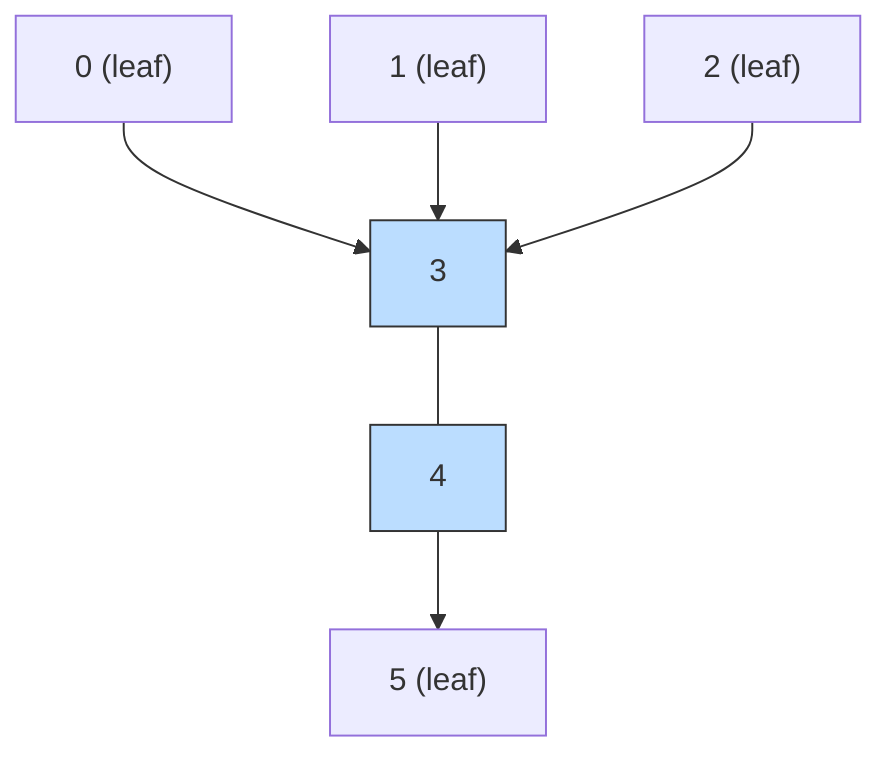

# LeetCode 310 — Minimum Height Trees

| Meta | Value |
|------|-------|
| Source | LeetCode 310 |
| Difficulty | Medium |
| Topics | Trees, BFS, Topological Peeling, Centroid |
| Link | https://leetcode.com/problems/minimum-height-trees/ |

---

## Problem Statement
A tree of `n` nodes labeled `0 .. n-1` is given as a list of `n - 1` undirected `edges`. If we root
the tree at node `r`, its **height** is the number of edges on the longest root-to-leaf path. A root
minimizing this height is a **Minimum Height Tree (MHT)** root. Return **all** such roots.

There are always **one or two** answers — and they are exactly the tree's **centroid(s)**: the MHT
roots minimize eccentricity, which is precisely what the centroid does.

**Example**
```
n = 6
edges = [[3,0],[3,1],[3,2],[3,4],[5,4]]

Tree:
        0   1   2
         \  |  /
            3
            |
            4
            |
            5

Rooting at 3 -> height 3 (3-4-5). Rooting at 4 -> height 2 (4-3-0).
Answer: [3, 4]   (the two centroids)
```

---

## WHY This Works
Peel leaves layer by layer. Leaves are the *worst* possible roots (they are diameter endpoints), so
we discard them. After removing one layer of leaves, the next layer becomes the new "outer rim."
Keep peeling until **1 or 2 nodes** remain — these are the deepest-buried nodes, the centroids, and
therefore the MHT roots.

This is BFS topological peeling on degrees: a node is "removed" once its degree drops to 1. The
survivors are the last 1–2 nodes, mirroring the proof that a tree has 1 or 2 centroids. Each peeling
round shrinks the diameter by 2 (one endpoint from each side), so we stop at the midpoint(s) of the
diameter — exactly the height-minimizing center.

---

## Solution (paired Python + C++)

```python
from collections import deque

class Solution:
    def findMinHeightTrees(self, n, edges):
        if n == 1:
            return [0]
        if n == 2:
            return [edges[0][0], edges[0][1]]

        adj = [set() for _ in range(n)]
        for a, b in edges:
            adj[a].add(b)
            adj[b].add(a)

        leaves = deque(v for v in range(n) if len(adj[v]) == 1)
        remaining = n
        while remaining > 2:
            size = len(leaves)
            remaining -= size
            for _ in range(size):           # peel one full layer of leaves
                leaf = leaves.popleft()
                nb = next(iter(adj[leaf]))
                adj[nb].discard(leaf)
                if len(adj[nb]) == 1:
                    leaves.append(nb)
        return list(leaves)                 # the 1 or 2 centroids
```

```cpp
#include <bits/stdc++.h>
using namespace std;

class Solution {
public:
    vector<int> findMinHeightTrees(int n, vector<vector<int>>& edges) {
        if (n == 1) return {0};
        if (n == 2) return {edges[0][0], edges[0][1]};

        vector<int> deg(n, 0);
        vector<vector<int>> adj(n);
        for (auto& e : edges) {
            adj[e[0]].push_back(e[1]);
            adj[e[1]].push_back(e[0]);
            deg[e[0]]++;
            deg[e[1]]++;
        }

        queue<int> leaves;
        for (int v = 0; v < n; ++v)
            if (deg[v] == 1) leaves.push(v);

        int remaining = n;
        while (remaining > 2) {
            int size = (int)leaves.size();
            remaining -= size;
            for (int i = 0; i < size; ++i) {    // peel one full layer of leaves
                int leaf = leaves.front(); leaves.pop();
                for (int nb : adj[leaf]) {
                    if (--deg[nb] == 1) leaves.push(nb);
                }
            }
        }

        vector<int> res;
        while (!leaves.empty()) { res.push_back(leaves.front()); leaves.pop(); }
        return res;                              // the 1 or 2 centroids
    }
};
```

---

## Trace — `n = 6`, edges `3-0, 3-1, 3-2, 3-4, 5-4`

Degrees: `0:1, 1:1, 2:1, 3:4, 4:2, 5:1`.

| Step | Leaves to peel | After removal | Remaining |
|------|----------------|---------------|-----------|
| init | `0, 1, 2, 5` | — | 6 |
| 1 | peel `0,1,2,5` | deg: `3 -> 1`, `4 -> 1` | 2 |

After layer 1, `remaining = 2`, loop stops. Survivors `{3, 4}` → **answer `[3, 4]`**.

The two survivors are adjacent — the classic "two centroids on an even split" case.

---

## Mermaid



The blue nodes `3` and `4` survive peeling — the minimum-height roots.

---

## Math & Complexity
Each node is enqueued and dequeued at most once, and every edge is examined a constant number of
times, so the total work is

$$
O(n + m) = O(n) \quad \text{since } m = n - 1.
$$

Space is $O(n)$ for the adjacency structure and degree array. The number of surviving roots is
$1$ when the diameter has even edge-length and $2$ when it is odd — matching the centroid count.

---

## Takeaway
**Minimum Height Tree roots = tree centroids.** Find them by **peeling leaves** with multi-source
BFS until 1 or 2 nodes remain. The technique is degree-based topological peeling, $O(n)$, and a
direct cousin of the subtree-size centroid method in
[02-tree-diameter-centroid.md](../guide/02-tree-diameter-centroid.md).
