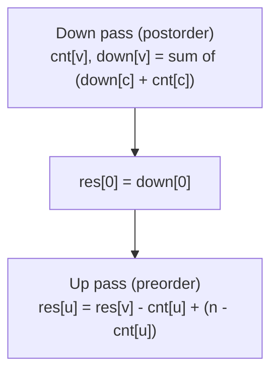
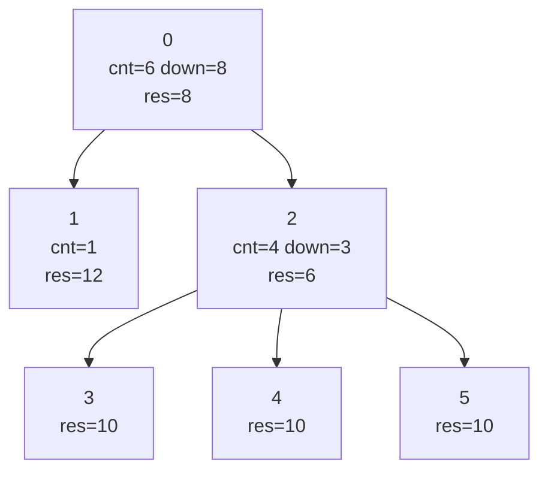

# LeetCode 834 — Sum of Distances in Tree

| Meta | Value |
|------|-------|
| Source | LeetCode (Hard) |
| Difficulty | Hard |
| Topics | Trees, Rerooting / All-Roots DP, Subtree Sizes |
| Technique | Down pass (subtree size + subtree distance sum) + up pass (additive reroot) |
| Link | https://leetcode.com/problems/sum-of-distances-in-tree/ |

---

## Problem Statement

There is an undirected, connected tree with `n` nodes labeled `0 … n-1` and `n-1` edges given as a
list `edges`, where `edges[i] = [a_i, b_i]`. Return an array `res` of length `n`, where `res[i]` is
the **sum of distances** from node `i` to all other nodes in the tree.

Constraints: `1 <= n <= 3 * 10^4`. This is LeetCode's framing of CSES 1133 — note the **0-indexed**
nodes and the function signature `sumOfDistancesInTree(n, edges) -> List[int]`.

**Example**
```
n = 6
edges = [[0,1],[0,2],[2,3],[2,4],[2,5]]

tree:
            0
           / \
          1   2
             /|\
            3 4 5

res[0] = d(0,1)+d(0,2)+d(0,3)+d(0,4)+d(0,5) = 1+1+2+2+2 = 8
res[1] = 2+1? -> 1+2+3+3+3 = 12  (1->0=1, 1->2=2, 1->3/4/5=3 each)
res[2] = 2+1+1+1+1 = 6
res[3] = 3+2+1+2+2 = ... = 10
res[4] = 10
res[5] = 10

output: [8, 12, 6, 10, 10, 10]
```

---

## Why Rerooting?

Computing each `res[i]` with its own BFS is $O(n^2)$ — for `n = 3*10^4` that is ~$10^9$ and risks
TLE. Rerooting gives the whole array in $O(n)$.

The merge is **addition**, so re-rooting across an edge is an $O(1)$ closed-form update. Root the
tree at node `0`:

- **Down pass (postorder):** `cnt[v]` = subtree size; `down[v]` = sum of distances from `v` to nodes
  in its own subtree. A child `c` adds `down[c] + cnt[c]` (each of its `cnt[c]` nodes is one edge
  farther from `v`). After this, `res[0] = down[0]` because node `0`'s subtree is everything.
- **Up pass (preorder):** moving the root from `v` to child `u` brings `cnt[u]` nodes one step closer
  and pushes `n - cnt[u]` nodes one step farther:
  $$\texttt{res}[u] \;=\; \texttt{res}[v] - \texttt{cnt}[u] + \big(n - \texttt{cnt}[u]\big).$$

The only adaptation versus CSES 1133 is the 0-indexed adjacency and the LeetCode method signature.
We use **iterative** DFS so a degenerate path tree does not overflow Python's / C++'s recursion stack.

---

## Solution — Paired Python + C++

```python
from typing import List

class Solution:
    def sumOfDistancesInTree(self, n: int, edges: List[List[int]]) -> List[int]:
        if n == 1:
            return [0]
        adj = [[] for _ in range(n)]
        for a, b in edges:
            adj[a].append(b)
            adj[b].append(a)

        parent = [-1] * n
        order = []
        stack = [0]
        seen = [False] * n
        seen[0] = True
        while stack:
            v = stack.pop()
            order.append(v)
            for u in adj[v]:
                if not seen[u]:
                    seen[u] = True
                    parent[u] = v
                    stack.append(u)

        cnt = [1] * n
        down = [0] * n
        for v in reversed(order):          # postorder
            p = parent[v]
            if p != -1:
                cnt[p] += cnt[v]
                down[p] += down[v] + cnt[v]

        res = [0] * n
        res[0] = down[0]
        for v in order[1:]:                # preorder: additive reroot
            p = parent[v]
            res[v] = res[p] - cnt[v] + (n - cnt[v])
        return res
```

```cpp
#include <bits/stdc++.h>
using namespace std;

class Solution {
public:
    vector<int> sumOfDistancesInTree(int n, vector<vector<int>>& edges) {
        if (n == 1) return vector<int>(1, 0);
        vector<vector<int>> adj(n);
        for (auto& e : edges) {
            adj[e[0]].push_back(e[1]);
            adj[e[1]].push_back(e[0]);
        }

        vector<int> parent(n, -1), order;
        order.reserve(n);
        vector<char> seen(n, 0);
        vector<int> stack;
        stack.push_back(0);
        seen[0] = 1;
        while (!stack.empty()) {
            int v = stack.back();
            stack.pop_back();
            order.push_back(v);
            for (int u : adj[v]) {
                if (!seen[u]) {
                    seen[u] = 1;
                    parent[u] = v;
                    stack.push_back(u);
                }
            }
        }

        vector<long long> cnt(n, 1), down(n, 0);
        for (int i = (int)order.size() - 1; i >= 0; --i) {   // postorder
            int v = order[i];
            int p = parent[v];
            if (p != -1) {
                cnt[p] += cnt[v];
                down[p] += down[v] + cnt[v];
            }
        }

        vector<long long> res64(n, 0);
        res64[0] = down[0];
        for (size_t i = 1; i < order.size(); ++i) {          // preorder
            int v = order[i];
            int p = parent[v];
            res64[v] = res64[p] - cnt[v] + ((long long)n - cnt[v]);
        }

        vector<int> res(n);
        for (int v = 0; v < n; ++v) res[v] = (int)res64[v];   // fits int for n <= 3e4
        return res;
    }
};
```

---

## Trace

Root at `0`. Postorder over the example tree (`0-1`, `0-2`, `2-3`, `2-4`, `2-5`):

| node `v` | children | `cnt[v]` | `down[v]` |
|----------|----------|---------|-----------|
| 1 | — | 1 | 0 |
| 3 | — | 1 | 0 |
| 4 | — | 1 | 0 |
| 5 | — | 1 | 0 |
| 2 | 3, 4, 5 | 4 | (0+1)·3 = 3 |
| 0 | 1, 2 | 6 | (0+1) + (3+4) = 8 |

So `res[0] = down[0] = 8`. Preorder reroot with `res[u] = res[p] - cnt[u] + (n - cnt[u])`, `n = 6`:

- `res[1] = res[0] - 1 + (6 - 1) = 8 - 1 + 5 = 12`.
- `res[2] = res[0] - 4 + (6 - 4) = 8 - 4 + 2 = 6`.
- `res[3] = res[2] - 1 + (6 - 1) = 6 - 1 + 5 = 10`.
- `res[4] = res[2] - 1 + 5 = 10`.
- `res[5] = res[2] - 1 + 5 = 10`.

Output: `[8, 12, 6, 10, 10, 10]`. ✓

---

## Mermaid





---

## Math & Complexity

Down recurrence:
$$\texttt{down}[v] = \sum_{c \in \text{children}(v)} \big(\texttt{down}[c] + \texttt{cnt}[c]\big),
\qquad \texttt{cnt}[v] = 1 + \sum_c \texttt{cnt}[c].$$

Reroot recurrence (additive, $O(1)$ per edge):
$$\texttt{res}[u] = \texttt{res}[v] + \big(n - 2\,\texttt{cnt}[u]\big).$$

| Phase | Work | Time |
|-------|------|------|
| Build adjacency | $n-1$ edges | $O(n)$ |
| Down pass | one postorder | $O(n)$ |
| Up pass | one preorder | $O(n)$ |
| **Total** | | $O(n)$ time, $O(n)$ space |

For `n <= 3*10^4` the maximum sum is below $9 \times 10^8$, which fits a 32-bit `int`; the C++ code
nonetheless accumulates in `long long` and narrows only at the end, a safe habit that generalizes to
the CSES variant where sums reach $\sim 4 \times 10^{10}$.

---

## Key Takeaway

LeetCode 834 is CSES 1133 wearing a 0-indexed, method-signature costume. The rerooting recipe is
identical: one postorder pass for `cnt` and `down`, then one preorder pass applying the additive
`res[u] = res[v] + (n - 2*cnt[u])`. Recognizing "compute an aggregate for every node as root" as a
rerooting problem turns an $O(n^2)$ brute force into a clean two-pass $O(n)$ solution.

See also: [06-rerooting.md](../guide/06-rerooting.md),
[cses-1133-tree-distances-ii.md](cses-1133-tree-distances-ii.md),
[cses-1132-tree-distances-i.md](cses-1132-tree-distances-i.md).
