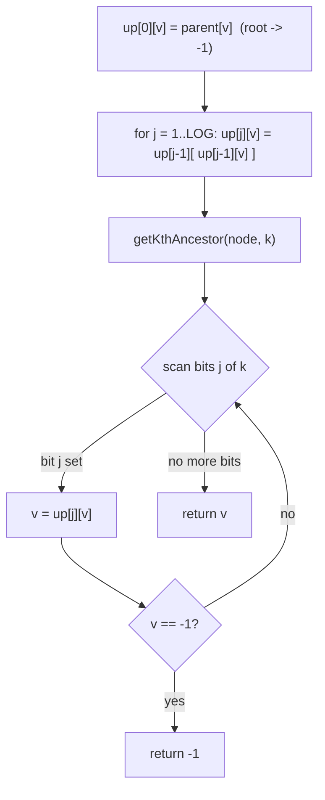

# Kth Ancestor of a Tree Node (LeetCode 1483)

| Meta | Value |
|------|-------|
| Source | LeetCode |
| Difficulty | Hard |
| Topics | Binary Lifting, Tree, Design |
| Link | https://leetcode.com/problems/kth-ancestor-of-a-tree-node/ |

---

## Problem Statement
You are given a tree with `n` nodes numbered `0` to `n - 1`, described by a `parent` array where
`parent[i]` is the parent of node `i` and `parent[0] = -1` (node `0` is the root). Implement a class
`TreeAncestor`:

- `TreeAncestor(int n, int[] parent)` — preprocess the tree.
- `int getKthAncestor(int node, int k)` — return the `k`-th ancestor of `node`, or `-1` if there is
  no such ancestor.

The `k`-th ancestor is reached by following the parent pointer `k` times. With up to `5 \cdot 10^4`
nodes and `5 \cdot 10^4` queries, each query must be **sublinear** — naive `k`-step walking is
`O(k)` and can be `O(nq)` overall.

**Example**
```
n = 7, parent = [-1, 0, 0, 1, 1, 2, 2]

Tree:        0
            / \
           1   2
          /|   |\
         3 4   5 6

getKthAncestor(3, 1) = 1   (parent of 3)
getKthAncestor(5, 2) = 0   (5 -> 2 -> 0)
getKthAncestor(6, 3) = -1  (only two ancestors above 6)
```

---

## Why Binary Lifting

Following the parent pointer `k` times is `O(k)`; across many queries that is too slow. Instead,
precompute `up[j][v]` = the **`2^j`-th ancestor** of `v`. Then a jump of height `k` is assembled from
the **set bits** of `k`: for each bit `j` that is `1` in `k`, jump `up[j]`. This answers each query in
**O(log n)**.

The doubling recurrence builds the table level by level, since a `2^j` jump equals two `2^{j-1}`
jumps:

$$
up[j][v] = up[j-1]\bigl(up[j-1][v]\bigr)
$$

Here nodes are `0`-indexed and the root's "missing" ancestors are represented by a sentinel `-1`; any
jump that reaches `-1` stays at `-1`, so an impossible query naturally returns `-1`.

---

## Solution — `TreeAncestor` with a Jump Table

```python
class TreeAncestor:
    def __init__(self, n: int, parent: list[int]):
        self.LOG = max(1, n.bit_length())
        # up[j][v] = 2^j-th ancestor of v, or -1 if it falls off the root
        self.up = [[-1] * n for _ in range(self.LOG)]
        self.up[0] = parent[:]                 # up[0] = direct parent (root -> -1)
        for j in range(1, self.LOG):
            upj, upj1 = self.up[j], self.up[j - 1]
            for v in range(n):
                mid = upj1[v]
                upj[v] = upj1[mid] if mid != -1 else -1

    def getKthAncestor(self, node: int, k: int) -> int:
        v = node
        for j in range(self.LOG):
            if v == -1:
                break
            if k & (1 << j):
                v = self.up[j][v]
        return v
```

```cpp
#include <bits/stdc++.h>
using namespace std;

class TreeAncestor {
    int LOG;
    vector<vector<int>> up;            // up[j][v] = 2^j-th ancestor of v, or -1
public:
    TreeAncestor(int n, vector<int>& parent) {
        LOG = max(1, (int)(32 - __builtin_clz((unsigned)n)));
        up.assign(LOG, vector<int>(n, -1));
        up[0] = parent;                // up[0] = direct parent (root -> -1)
        for (int j = 1; j < LOG; ++j) {
            for (int v = 0; v < n; ++v) {
                int mid = up[j - 1][v];
                up[j][v] = (mid != -1) ? up[j - 1][mid] : -1;
            }
        }
    }

    int getKthAncestor(int node, int k) {
        long long v = node;
        for (int j = 0; j < LOG; ++j) {
            if (v == -1) break;
            if (k & (1 << j))
                v = up[j][(int)v];
        }
        return (int)v;
    }
};
```

---

## Trace — `getKthAncestor(5, 2)` on the Example

`parent = [-1, 0, 0, 1, 1, 2, 2]`, so `up[0] = [-1, 0, 0, 1, 1, 2, 2]`.

Build `up[1][v] = up[0][up[0][v]]`:
- `up[1][5] = up[0][up[0][5]] = up[0][2] = 0`
- `up[1][6] = up[0][2] = 0`, `up[1][3] = up[0][1] = 0`, `up[1][2] = up[0][0] = -1`, etc.

Now query `node = 5`, `k = 2` (binary `10`, only bit `1` set):
1. `j = 0`: bit `0` of `k` is `0` → no jump, `v = 5`.
2. `j = 1`: bit `1` of `k` is `1` → `v = up[1][5] = 0`.

Return `0`. ✓ (`5 → 2 → 0`).

Check `getKthAncestor(6, 3)`: `k = 3` (binary `11`).
- `j = 0`: bit set → `v = up[0][6] = 2`.
- `j = 1`: bit set → `v = up[1][2] = -1`.
- `v == -1` → break. Return `-1`. ✓

---

## Mermaid — Building and Querying the Table



---

## Math & Complexity

A jump of height `k` decomposes by binary representation, so at most $\lceil \log_2 n \rceil$ jumps
are applied per query:

$$
k = \sum_{j\,:\,\text{bit } j = 1} 2^{j}, \qquad
\text{ancestor}(v, k) = \big(up[j_m] \circ \cdots \circ up[j_1]\big)(v)
$$

| Operation | Time | Space |
|-----------|------|-------|
| Constructor (build table) | $O(n \log n)$ | $O(n \log n)$ |
| `getKthAncestor` | $O(\log n)$ | — |
| `q` queries total | $O((n + q) \log n)$ | $O(n \log n)$ |

For `n = 5 \cdot 10^4`, `LOG \approx 16`, so the table holds under a million ints.

---

## Takeaway
The `k`-th ancestor is **Phase 1 of LCA in isolation**: precompute `2^j`-ancestors and apply the
jumps for the **set bits** of `k`. A `-1` sentinel for the root makes out-of-range queries return
`-1` for free, and the whole structure answers each query in `O(log n)`.
