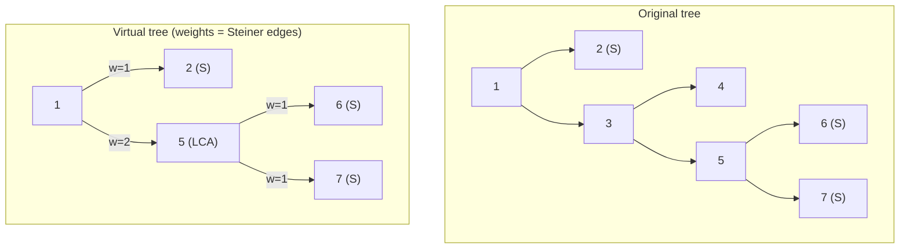

# Auxiliary Tree — Minimal Steiner Subtree Edge Count

| Meta | Value |
|------|-------|
| Source | Self-contained (classic auxiliary-tree exercise) |
| Difficulty | Medium–Hard |
| Topics | Virtual Tree, Steiner Tree on a Tree, LCA, Euler Tour |
| Technique | Compress marked set + LCAs, sum compressed edge weights = Steiner edge count |
| Link | (self-contained — no external judge) |

---

## Problem Statement

You are given an **unweighted** tree of `n` nodes. Answer `q` queries; each gives a set `S` of `k`
marked nodes. Output the number of **edges** in the **minimal connected subtree** that contains all
of `S` — the **Steiner tree** on a tree, which is unique and equals the union of all pairwise paths
between marked nodes. Constraints: `n` up to $2 \cdot 10^5$, $\sum k \le 2 \cdot 10^5$.

On a *general* graph Steiner tree is NP-hard, but on a **tree** the minimal connecting subtree is
exactly the union of marked-node paths, and its edge count is computable in $O(k \log k)$ with a
**virtual / auxiliary tree**.

**Example**
```
n = 7
edges:
  1-2, 1-3, 3-4, 3-5, 5-6, 5-7

tree:
        1
       / \
      2   3
         / \
        4   5
           / \
          6   7

Query: S = {2, 6, 7}, k = 3
  Union of paths:
    path(2,6): 2-1-3-5-6   (edges 2-1,1-3,3-5,5-6)
    path(2,7): adds 5-7
    path(6,7): already covered
  Steiner edges = {2-1, 1-3, 3-5, 5-6, 5-7} -> 5 edges
  Answer = 5

Query: S = {6, 7}, k = 2
  Only path 6-5-7 -> edges {5-6, 5-7} -> Answer = 2
```

---

## Why a Virtual Tree?

The minimal subtree connecting `S` is precisely the virtual tree's underlying original edges. Each
**compressed virtual edge** from parent `p` to child `c` corresponds to a chain of
$depth[c] - depth[p]$ original edges, and every such original edge belongs to the Steiner tree
(because it lies between two virtual nodes that both must be connected). Therefore:

$$
\#\text{Steiner edges} = \sum_{(p,c)\in \text{virtual tree}} \bigl(depth[c] - depth[p]\bigr).
$$

No DP recurrence is even needed — just **sum the compressed edge weights**. The virtual tree gives us
those edges in $O(k)$, so we avoid touching the other $n - O(k)$ nodes.

---

## Solution — Paired Python + C++

Build the virtual tree, then add up `depth[child] - depth[parent]` across its edges.

```python
import sys

def steiner_edge_count(marked, tin, tout, up, depth, LOG):
    nodes = sorted(set(marked), key=lambda v: tin[v])
    if len(nodes) <= 1:
        return 0                               # single (or empty) node: no edges
    extra = []
    for i in range(len(nodes) - 1):
        extra.append(lca(nodes[i], nodes[i + 1], up, depth, LOG))
    nodes = sorted(set(nodes) | set(extra), key=lambda v: tin[v])

    def is_anc(u, v):
        return tin[u] <= tin[v] <= tout[u]

    total = 0
    stack = [nodes[0]]
    for v in nodes[1:]:
        while not is_anc(stack[-1], v):
            stack.pop()
        parent = stack[-1]
        total += depth[v] - depth[parent]      # compressed edge = chain length
        stack.append(v)
    return total
```

```cpp
#include <bits/stdc++.h>
using namespace std;

const long long INF = 1e18;

int LOG;
vector<vector<int>> up;
vector<int> depthv, tin, tout;

int lca(int a, int b) {
    if (depthv[a] < depthv[b]) swap(a, b);
    int diff = depthv[a] - depthv[b];
    for (int k = 0; k < LOG; ++k)
        if (diff & (1 << k)) a = up[k][a];
    if (a == b) return a;
    for (int k = LOG - 1; k >= 0; --k)
        if (up[k][a] != up[k][b]) { a = up[k][a]; b = up[k][b]; }
    return up[0][a];
}

long long steiner_edge_count(vector<int> marked) {
    sort(marked.begin(), marked.end(),
         [](int a, int b) { return tin[a] < tin[b]; });
    marked.erase(unique(marked.begin(), marked.end()), marked.end());
    if (marked.size() <= 1) return 0;          // single/empty: no edges

    vector<int> nodes = marked;
    for (size_t i = 0; i + 1 < marked.size(); ++i)
        nodes.push_back(lca(marked[i], marked[i + 1]));
    sort(nodes.begin(), nodes.end(),
         [](int a, int b) { return tin[a] < tin[b]; });
    nodes.erase(unique(nodes.begin(), nodes.end()), nodes.end());

    auto is_anc = [](int u, int v) {
        return tin[u] <= tin[v] && tin[v] <= tout[u];
    };

    long long total = 0;
    vector<int> st = {nodes[0]};
    for (size_t i = 1; i < nodes.size(); ++i) {
        int v = nodes[i];
        while (!is_anc(st.back(), v)) st.pop_back();
        int parent = st.back();
        total += depthv[v] - depthv[parent];   // compressed edge = chain length
        st.push_back(v);
    }
    return total;
}
```

---

## Trace — Query `{2, 6, 7}`

Root at `1`; preorder tin visits `1,2,3,4,5,6,7`. Depths: `d1=0, d2=1, d3=1, d5=2, d6=3, d7=3`.

1. **Sorted marked:** `[2, 6, 7]`.
2. **Consecutive LCAs:** `lca(2,6)=1`, `lca(6,7)=5`. Combined set `{1,2,5,6,7}` (sorted by tin).
3. **Stack sweep**, accumulating `depth[v] - depth[parent]`:
   - start stack `[1]`.
   - `v=2`: top `1` is ancestor → parent `1`, add `d2-d1 = 1`. stack `[1,2]`. (total=1)
   - `v=5`: top `2` not ancestor (`tout[2] < tin[5]`) → pop. top `1` ancestor → parent `1`,
     add `d5-d1 = 2`. stack `[1,5]`. (total=3)
   - `v=6`: top `5` ancestor → parent `5`, add `d6-d5 = 1`. stack `[1,5,6]`. (total=4)
   - `v=7`: top `6` not ancestor → pop. top `5` ancestor → parent `5`, add `d7-d5 = 1`.
     stack `[1,5,7]`. (total=5)
4. **Answer = 5.** ✔ (matches the brute-force union of paths)

---

## Mermaid — Steiner Subtree as Compressed Edges



The compressed edge `1 &rarr; 5` of weight `2` stands for the original chain `1 &rarr; 3 &rarr; 5`;
node `4` is never visited because it is outside every marked path. Total weight
`1 + 2 + 1 + 1 = 5` equals the Steiner edge count.

---

## Math & Complexity

Because the virtual tree's edges partition exactly the original edges of the Steiner subtree:

$$
\#\text{Steiner edges} = \sum_{(p,c)} \bigl(depth[c] - depth[p]\bigr)
= \Bigl(\sum_{v \in V'} depth[v]\Bigr) - \sum_{(p,c)} depth[p],
$$

and the stack sweep evaluates this telescoping sum in one pass.

| Phase | Cost |
|-------|------|
| Preprocess (Euler + binary lifting) | $O(n \log n)$ |
| Build + sum during sweep | $O(k \log k)$ |
| **Per query** | $O(k \log k)$ |
| **All queries** | $O\!\left(n \log n + \big(\sum k\big)\log n\right)$ |

Edge counts fit comfortably in `long long`; the build dominates at $O(k \log k)$ from the sort and
$k - 1$ LCA calls.

---

## Takeaway

The minimal Steiner subtree on a tree is just the **virtual tree's edge set**, so its edge count is
the **sum of compressed edge weights** $depth[c] - depth[p]$ — no separate DP required. This is the
purest demonstration of why auxiliary trees work: the compression itself already encodes the answer,
and closing under consecutive LCAs guarantees every necessary branch point is present.
