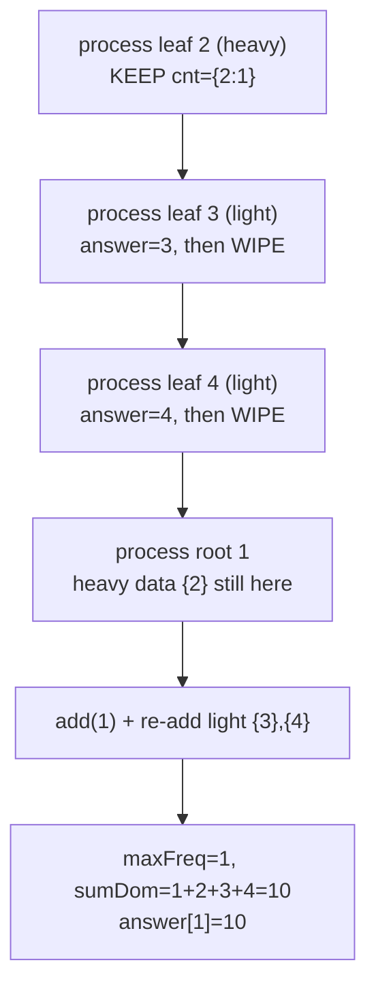
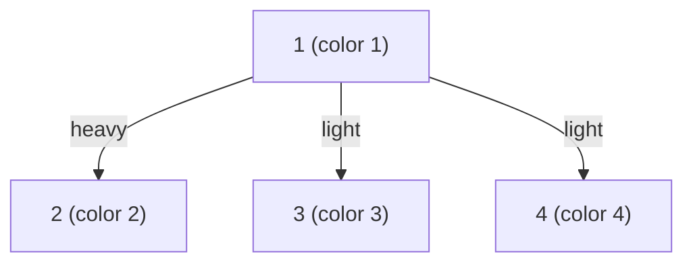

# Lomsat gelral (Codeforces 600E — Sum of Dominating Colors per Subtree)

| Meta | Value |
|------|-------|
| Source | Codeforces Round 333 (Div. 1) — Problem E |
| Difficulty | Hard (the canonical DSU-on-tree problem) |
| Topics | DSU on Tree (sack), Small-to-Large, Subtree Multiset Queries |
| Time / Memory | $O(n \log n)$ / $O(n)$ |
| Link | https://codeforces.com/problemset/problem/600/E |

---

## Problem Statement
You are given a rooted tree of `n` vertices (root = 1). Vertex `v` has color `color[v]`.

For a subtree, a color `c` is **dominating** if no other color appears **more** times than `c` in that subtree (ties allowed — several colors can simultaneously dominate). For every vertex `v`, compute the **sum of all dominating colors** in the subtree of `v`.

**Example**
```
n = 4
colors = [1, 2, 3, 4]      (1-indexed: color[1]=1, color[2]=2, color[3]=3, color[4]=4)
edges  = 1-2, 1-3, 1-4

Subtree of 2 = {2}        -> dominant color 2, sum = 2
Subtree of 3 = {3}        -> dominant color 3, sum = 3
Subtree of 4 = {4}        -> dominant color 4, sum = 4
Subtree of 1 = {1,2,3,4}  -> all appear once, all dominate, sum = 1+2+3+4 = 10

Answer: 10 3 9 ... (per the full example in the statement)
```
Each leaf's own color dominates its singleton subtree; at the root every color appears once so all are dominant and the sum is $1+2+3+4=10$.

---

## Why DSU on Tree Fits

Every query is **"about the multiset of colors in a subtree."** That is exactly the signature of small-to-large / DSU on tree. The aggregate we need per subtree is the **sum of colors whose frequency equals the maximum frequency**.

Maintaining that aggregate incrementally is easy if, alongside `cnt[c]` (current count of color `c`), we track:

- `maxFreq` — the current maximum frequency, and
- `sumDom` — the sum of colors currently achieving `maxFreq`.

When `add` raises `cnt[c]` to a value `f`:
- if `f > maxFreq`: a **new** unique champion → `maxFreq = f`, `sumDom = c`;
- if `f == maxFreq`: `c` **joins** the champions → `sumDom += c`.

Recomputing this from scratch at every node is $O(n^2)$. DSU on tree keeps the **heavy child's** counts and only re-adds the **light** subtrees, so each color is added $O(\log n)$ times → $O(n \log n)$. For $n \le 10^5$ (and to be safe up to $2\times10^5$) we use **iterative** DFS and an Euler tour so deep chains don't overflow the stack.

---

## Implementation

```python
import sys

def lomsat_gelral(n, color, edges):
    # color is 1-indexed length n+1; edges is list of (u, v); root = 1
    adj = [[] for _ in range(n + 1)]
    for u, v in edges:
        adj[u].append(v)
        adj[v].append(u)

    parent = [0] * (n + 1)
    size = [1] * (n + 1)
    heavy = [0] * (n + 1)
    order = []

    # iterative DFS to root the tree, compute sizes & heavy child (post-order)
    stack = [(1, 0, False)]
    while stack:
        node, par, processed = stack.pop()
        if processed:
            order.append(node)
            best = 0
            for c in adj[node]:
                if c == par:
                    continue
                size[node] += size[c]
                if size[c] > best:
                    best, heavy[node] = size[c], c
        else:
            parent[node] = par
            stack.append((node, par, True))
            for c in adj[node]:
                if c != par:
                    stack.append((c, node, False))

    # Euler tour: subtree(v) occupies indices tin[v]..tout[v]
    tin = [0] * (n + 1)
    tout = [0] * (n + 1)
    euler = [0] * (n + 1)
    timer = 0
    stack = [(1, 0, False)]
    while stack:
        node, par, processed = stack.pop()
        if processed:
            tout[node] = timer - 1
        else:
            tin[node] = timer
            euler[timer] = node
            timer += 1
            stack.append((node, par, True))
            light = [c for c in adj[node] if c != par and c != heavy[node]]
            if heavy[node]:
                stack.append((heavy[node], node, False))
            for c in light:
                stack.append((c, node, False))

    cnt = [0] * (n + 1)
    answer = [0] * (n + 1)
    maxFreq = 0
    sumDom = 0

    def add(node):
        nonlocal maxFreq, sumDom
        c = color[node]
        cnt[c] += 1
        f = cnt[c]
        if f > maxFreq:
            maxFreq = f
            sumDom = c
        elif f == maxFreq:
            sumDom += c

    def remove(node):
        cnt[color[node]] -= 1   # only used to clear light subtrees; reset below

    for v in order:
        if heavy[v]:
            add(v)
            for c in adj[v]:
                if c != parent[v] and c != heavy[v]:
                    for t in range(tin[c], tout[c] + 1):
                        add(euler[t])
        else:
            add(v)

        answer[v] = sumDom

        # if v is a light child, wipe its whole subtree from the global state
        p = parent[v]
        if p != 0 and heavy[p] != v:
            for t in range(tin[v], tout[v] + 1):
                cnt[color[euler[t]]] = 0
            maxFreq = 0
            sumDom = 0

    return answer[1:]   # answers for vertices 1..n
```

```cpp
#include <bits/stdc++.h>
using namespace std;

vector<long long> lomsat_gelral(int n, const vector<int>& color,
                                const vector<pair<int,int>>& edges) {
    // color is 1-indexed length n+1; edges is list of (u, v); root = 1
    vector<vector<int>> adj(n + 1);
    for (auto [u, v] : edges) {
        adj[u].push_back(v);
        adj[v].push_back(u);
    }

    vector<int> parent(n + 1, 0), size(n + 1, 1), heavy(n + 1, 0), order;

    // iterative DFS to root the tree, compute sizes & heavy child (post-order)
    vector<tuple<int,int,bool>> stk = {{1, 0, false}};
    while (!stk.empty()) {
        auto [node, par, processed] = stk.back();
        stk.pop_back();
        if (processed) {
            order.push_back(node);
            long long best = 0;
            for (int c : adj[node]) {
                if (c == par) continue;
                size[node] += size[c];
                if (size[c] > best) { best = size[c]; heavy[node] = c; }
            }
        } else {
            parent[node] = par;
            stk.push_back({node, par, true});
            for (int c : adj[node])
                if (c != par) stk.push_back({c, node, false});
        }
    }

    // Euler tour: subtree(v) occupies indices tin[v]..tout[v]
    vector<int> tin(n + 1), tout(n + 1), euler(n + 1);
    int timer = 0;
    stk = {{1, 0, false}};
    while (!stk.empty()) {
        auto [node, par, processed] = stk.back();
        stk.pop_back();
        if (processed) {
            tout[node] = timer - 1;
        } else {
            tin[node] = timer;
            euler[timer] = node;
            ++timer;
            stk.push_back({node, par, true});
            if (heavy[node]) stk.push_back({heavy[node], node, false});
            for (int c : adj[node])
                if (c != par && c != heavy[node]) stk.push_back({c, node, false});
        }
    }

    vector<int> cnt(n + 1, 0);
    vector<long long> answer(n + 1, 0);
    long long maxFreq = 0, sumDom = 0;

    auto add = [&](int node) {
        int c = color[node];
        ++cnt[c];
        int f = cnt[c];
        if (f > maxFreq) { maxFreq = f; sumDom = c; }
        else if (f == maxFreq) { sumDom += c; }
    };

    for (int v : order) {
        if (heavy[v]) {
            add(v);
            for (int c : adj[v])
                if (c != parent[v] && c != heavy[v])
                    for (int t = tin[c]; t <= tout[c]; ++t)
                        add(euler[t]);
        } else {
            add(v);
        }

        answer[v] = sumDom;

        // if v is a light child, wipe its whole subtree from the global state
        int p = parent[v];
        if (p != 0 && heavy[p] != v) {
            for (int t = tin[v]; t <= tout[v]; ++t)
                cnt[color[euler[t]]] = 0;
            maxFreq = 0;
            sumDom = 0;
        }
    }

    vector<long long> result(answer.begin() + 1, answer.end()); // vertices 1..n
    return result;
}
```

---

## Trace (the 4-vertex star above)

Post-order of the star rooted at 1: leaves `2, 3, 4` (in some order) then `1`. Heavy child of `1` is whichever leaf was first by size tie (all size 1) — say `2`.

| Step | Node `v` | Action | `cnt` snapshot | `maxFreq` | `sumDom` | `answer[v]` |
|------|----------|--------|----------------|-----------|----------|-------------|
| 1 | 2 (heavy leaf) | add(2) | {2:1} | 1 | 2 | 2 (kept) |
| 2 | 3 (light leaf) | add(3) | {2:1,3:1} | 1 | 5 | — then wiped → reset |
| 3 | 3 cont. | answer | — | — | — | answer[3]=3 |
| 4 | 4 (light leaf) | add(4) | {4:1} | 1 | 4 | answer[4]=4, wiped |
| 5 | 1 | heavy(2) kept; add(1); re-add light subtrees {3},{4} | {1:1,2:1,3:1,4:1} | 1 | 1+2+3+4=10 | answer[1]=10 |

The heavy leaf `2`'s data survived into the parent; the light leaves `3` and `4` were recomputed and added back. Result: `answer = [10, 2, 3, 4]` for vertices `1..4`.

---

## Mermaid





---

## Math & Complexity

Each vertex is **added** to the global structure once per light edge on its path to the root. The number of light edges above any vertex is at most $\log_2 n$ because crossing a light edge at least doubles the subtree size:

$$
v \text{ is a light child of } p \;\Rightarrow\; \text{size}[p] \ge 2\,\text{size}[v].
$$

Hence total `add` operations $= \sum_v O(\log n) = O(n \log n)$, and clearing light subtrees costs the same. Colors fit in an array, so each `add`/`remove` is $O(1)$.

$$
\textbf{Time } O(n \log n), \qquad \textbf{Memory } O(n).
$$

Colors and their sums can be large, so the answer must use 64-bit integers (`long long`): up to $n$ distinct colors each near $10^9$ gives sums near $10^{14}$.

---

## Takeaway

This is the **textbook** DSU-on-tree problem. The reusable idea: keep the heavy child's frequency table, re-add only light subtrees, and maintain a problem-specific aggregate (`maxFreq`, `sumDom`) that updates in $O(1)$ per element. Swap the aggregate and you solve a whole family of "per-subtree multiset" questions in $O(n \log n)$.
