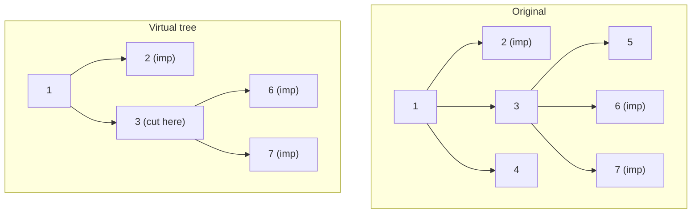

# Codeforces 613D — Kingdom and its Cities

| Meta | Value |
|------|-------|
| Source | Codeforces Round 339 (Div. 1) Problem D |
| Difficulty | Hard (≈ 2800) |
| Topics | Virtual Tree, Tree DP, LCA, Euler Tour |
| Technique | Build auxiliary tree over important cities, greedy DP for min cut |
| Link | https://codeforces.com/problemset/problem/613/D |

---

## Problem Statement

A kingdom is a tree of `n` cities. You are given `q` independent queries. Each query lists `k`
**important** cities. For one query you may **delete** non-important cities (the capital and
important cities themselves can never be deleted). Deleting a city removes it and its incident edges.
Find the **minimum number of deletions** so that **no two important cities remain connected** — or
report `-1` if it is impossible (which happens exactly when two important cities are **adjacent** in
the tree, since you cannot delete either).

The total of all `k` over all queries satisfies $\sum k \le 10^5$, and `n` up to $10^5$. A per-query
$O(n)$ DP would be $O(nq)$ and too slow, so we compress each query onto a **virtual tree** of size
$O(k)$ and run a small DP there.

**Example**
```
n = 7
edges:
  1-2, 1-3, 1-4, 3-5, 3-6, 3-7

tree:
            1
         /  |  \
        2   3   4
           /|\
          5 6 7

Query: important = {2, 6, 7}
  Answer = 1
  Delete city 3. Now 6 and 7 are isolated from each other and from 2.
  (Important cities 2,6,7 are pairwise disconnected with a single deletion.)

Query: important = {5, 6, 7}
  All three hang off city 3. Deleting city 3 (1 deletion) separates all of them. Answer = 1.

Query: important = {1, 3}
  Cities 1 and 3 are adjacent and both important -> cannot delete either -> Answer = -1.
```

---

## Why a Virtual Tree?

The DP only cares about important cities and the **branch points** (LCAs) where their paths split.
Every non-important city on a straight chain between two branch points is interchangeable: deleting
any one of them cuts that chain. So we:

1. Detect the **`-1`** case: two important cities adjacent — equivalently, an important city whose
   **parent is also important** (check via LCA / parent in the original tree).
2. Build the **virtual tree** on the important set (plus consecutive LCAs). Now branch points are
   exactly the non-important virtual nodes, and important cities are the marked leaves/internal
   nodes.
3. Run a **greedy bottom-up DP**: at each virtual node decide whether to cut here (delete the node)
   or push an "important child reaches me" flag upward.

Because the virtual tree has $O(k)$ nodes, each query costs $O(k \log k)$, and the total is
$O\!\left(\big(\sum k\big)\log n\right)$.

---

## Solution — Paired Python + C++

DP state per virtual node `v`:

- `cnt[v]` = number of children subtrees that deliver an **important node directly connected** to
  `v` (no deletion between them).
- If `v` **is important**: any child that delivers an important node forces a deletion on that child
  link (`ans += cnt[v]`), and `v` itself propagates "important reaches parent" upward.
- If `v` **is not important**: if `cnt[v] >= 2`, deleting `v` once separates all those branches
  (`ans += 1`, propagate nothing). If `cnt[v] == 1`, deleting `v` is wasteful — propagate the single
  important reach upward instead.

```python
import sys
from sys import setrecursionlimit

def solve_query(important, tin, tout, up, depth, LOG, is_important_flag):
    # -1 check: two important cities adjacent (parent of one is important)
    for v in important:
        p = up[0][v]
        if p != v and is_important_flag[p]:
            return -1

    # build virtual tree over important + consecutive LCAs
    nodes = sorted(set(important), key=lambda v: tin[v])
    extra = []
    for i in range(len(nodes) - 1):
        extra.append(lca(nodes[i], nodes[i + 1], up, depth, LOG))
    nodes = sorted(set(nodes) | set(extra), key=lambda v: tin[v])

    children = {v: [] for v in nodes}
    def is_anc(u, v):
        return tin[u] <= tin[v] <= tout[u]
    stack = [nodes[0]]
    for v in nodes[1:]:
        while not is_anc(stack[-1], v):
            stack.pop()
        children[stack[-1]].append(v)
        stack.append(v)
    root = nodes[0]

    ans = 0
    # returns 1 if subtree rooted at v leaves an important node "exposed" to parent
    # iterative post-order
    order = []
    st = [root]
    while st:
        v = st.pop()
        order.append(v)
        for c in children[v]:
            st.append(c)
    exposed = {}
    for v in reversed(order):
        cnt = sum(exposed[c] for c in children[v])
        if is_important_flag[v]:
            ans += cnt            # cut every child link that reaches an important node
            exposed[v] = 1        # v itself is important -> exposed upward
        else:
            if cnt >= 2:
                ans += 1          # delete v once to split >=2 branches
                exposed[v] = 0
            else:
                exposed[v] = cnt  # 0 or 1 passes through
    return ans
```

```cpp
#include <bits/stdc++.h>
using namespace std;

const long long INF = 1e18;

int LOG;
vector<vector<int>> up;
vector<int> depthv, tin, tout;
vector<char> is_important_flag;

int lca(int a, int b) {
    if (depthv[a] < depthv[b]) swap(a, b);
    int diff = depthv[a] - depthv[b];
    for (int k = 0; k < LOG; ++k)
        if (diff & (1 << k)) a = up[k][a];
    if (a == b) return a;
    for (int k = LOG - 1; k >= 0; --k)
        if (up[k][a] != up[k][b]) { a = up[k][a]; b = up[k][b]; }
    return up[0][a];
}

long long solve_query(vector<int> important) {
    // -1 check: two important cities adjacent
    for (int v : important) {
        int p = up[0][v];
        if (p != v && is_important_flag[p]) return -1;
    }

    sort(important.begin(), important.end(),
         [](int a, int b) { return tin[a] < tin[b]; });
    important.erase(unique(important.begin(), important.end()), important.end());

    vector<int> nodes = important;
    for (size_t i = 0; i + 1 < important.size(); ++i)
        nodes.push_back(lca(important[i], important[i + 1]));
    sort(nodes.begin(), nodes.end(),
         [](int a, int b) { return tin[a] < tin[b]; });
    nodes.erase(unique(nodes.begin(), nodes.end()), nodes.end());

    unordered_map<int, vector<int>> children;
    for (int v : nodes) children[v];
    auto is_anc = [](int u, int v) {
        return tin[u] <= tin[v] && tin[v] <= tout[u];
    };
    vector<int> st = {nodes[0]};
    for (size_t i = 1; i < nodes.size(); ++i) {
        int v = nodes[i];
        while (!is_anc(st.back(), v)) st.pop_back();
        children[st.back()].push_back(v);
        st.push_back(v);
    }
    int root = nodes[0];

    long long ans = 0;
    // iterative post-order
    vector<int> order;
    vector<int> s2 = {root};
    while (!s2.empty()) {
        int v = s2.back(); s2.pop_back();
        order.push_back(v);
        for (int c : children[v]) s2.push_back(c);
    }
    unordered_map<int, int> exposed;
    for (int i = (int)order.size() - 1; i >= 0; --i) {
        int v = order[i];
        int cnt = 0;
        for (int c : children[v]) cnt += exposed[c];
        if (is_important_flag[v]) {
            ans += cnt;
            exposed[v] = 1;
        } else {
            if (cnt >= 2) { ans += 1; exposed[v] = 0; }
            else exposed[v] = cnt;
        }
    }
    return ans;
}
```

---

## Trace — Query `{2, 6, 7}` on the Example Tree

Original tree rooted at `1`; `tin` preorder visits `1,2,3,5,6,7,4` (one valid order).

1. **`-1` check:** parents are `2→1`, `6→3`, `7→3`; none of `1,3` is important. OK.
2. **Marked sorted by tin:** `[2, 6, 7]`.
3. **Consecutive LCAs:** `lca(2,6)=1`, `lca(6,7)=3`. Combined set `{1,2,3,6,7}`.
4. **Stack sweep** builds children: `1→{2,3}`, `3→{6,7}`.
5. **Post-order DP** (`exposed`, `ans=0`):
   - `6` important → `exposed=1`.
   - `7` important → `exposed=1`.
   - `3` not important, `cnt = exposed[6]+exposed[7] = 2 ≥ 2` → delete `3`, `ans=1`, `exposed=0`.
   - `2` important, `cnt=0` → `exposed=1`.
   - `1` not important, `cnt = exposed[2]+exposed[3] = 1` → `exposed=1`, no deletion.
6. **Answer = 1** (delete city `3`). ✔

---

## Mermaid — Compression for `{2, 6, 7}`



Deleting the single non-important branch point `3` (with `cnt &ge; 2`) disconnects all three
important cities.

---

## Math & Complexity

Let the query have `k` important cities. The virtual tree has at most $2k - 1$ nodes. The DP visits
each once:

$$
\text{per query} = O(k \log k) \;(\text{sort} + \text{LCA}), \qquad
\text{total} = O\!\left(n \log n + \Big(\sum k\Big)\log n\right)
$$

The greedy is optimal because on a tree the minimum vertex cut separating leaves of a branch equals
the number of branch points where $\ge 2$ important reaches meet, and adjacency of two important
cities is the only obstruction (giving $-1$).

---

## Takeaway

Codeforces 613D is the canonical virtual-tree problem: detect the adjacency `-1` case on the original
tree, **compress** the important set into an $O(k)$ auxiliary tree, then run a tiny greedy cut DP.
The pattern — *compress to marked nodes + LCAs, DP on the small tree* — recurs whenever
$\sum k$ is bounded but $n$ is large.
