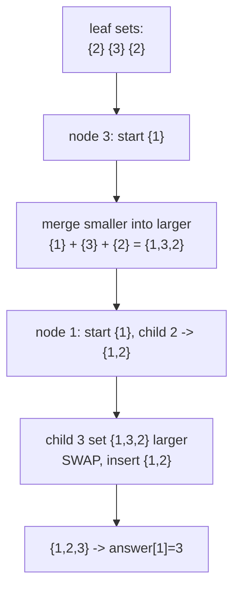
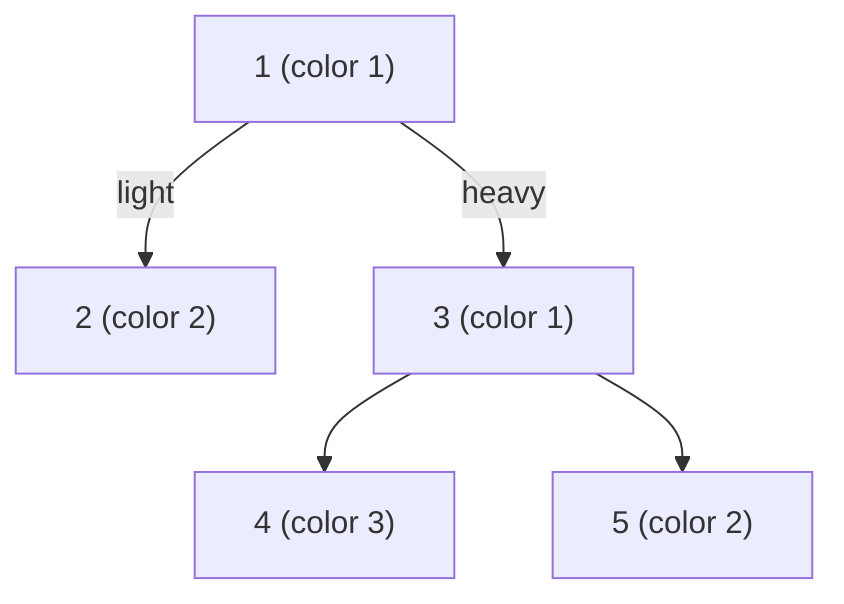

# Distinct Colors in Each Subtree (Small-to-Large)

| Meta | Value |
|------|-------|
| Source | Self-contained classic (CSES "Distinct Colors" style) |
| Difficulty | Medium |
| Topics | Small-to-Large Merging, Subtree Multiset Queries, Tree DFS |
| Time / Memory | $O(n \log n)$ / $O(n)$ |
| Link | https://cses.fi/problemset/task/1139 |

---

## Problem Statement
You are given a rooted tree of `n` vertices (root = 1). Vertex `v` has a color `color[v]`. For **every** vertex `v`, output the number of **distinct** colors that appear in the subtree of `v`.

**Example**
```
n = 5
colors = [_, 1, 2, 1, 3, 2]   (1-indexed: color[1]=1, color[2]=2, ...)
edges  = 1-2, 1-3, 3-4, 3-5

Tree:        1(1)
            /    \
          2(2)   3(1)
                 /   \
               4(3)  5(2)

Subtree of 4 = {3}        -> 1 distinct
Subtree of 5 = {2}        -> 1 distinct
Subtree of 3 = {1,3,2}    -> 3 distinct
Subtree of 2 = {2}        -> 1 distinct
Subtree of 1 = {1,2,1,3,2}-> {1,2,3} = 3 distinct

Answer: 3 1 3 1 1   (for vertices 1..5)
```

---

## Why Small-to-Large

Each query is **"how many distinct values in this subtree?"** — a multiset question, the trigger for small-to-large merging. Keep one `set` of colors per node; build them bottom-up. When merging children into a parent, **iterate the smaller set and insert into the larger**, then keep the larger one. The answer for `v` is the size of its final set.

The naive merge (always copy child into parent) is $O(n^2)$ on a chain. Small-to-large guarantees each color moves into a set at least **twice as large** each time it migrates, so it migrates $O(\log n)$ times → $O(n \log n)$ total. For $n$ up to $2\times10^5$ we build a post-order with **iterative** DFS to avoid stack overflow.

---

## Implementation

```python
import sys

def distinct_colors_per_subtree(n, color, edges):
    # color is 1-indexed length n+1; edges is list of (u, v); root = 1
    adj = [[] for _ in range(n + 1)]
    for u, v in edges:
        adj[u].append(v)
        adj[v].append(u)

    parent = [0] * (n + 1)
    order = []

    # iterative DFS to root the tree and get a post-order
    stack = [(1, 0, False)]
    while stack:
        node, par, processed = stack.pop()
        if processed:
            order.append(node)
        else:
            parent[node] = par
            stack.append((node, par, True))
            for c in adj[node]:
                if c != par:
                    stack.append((c, node, False))

    sets = [None] * (n + 1)        # sets[v] = set of colors in subtree(v)
    answer = [0] * (n + 1)

    for v in order:                # children finalized before parent
        big = {color[v]}
        for c in adj[v]:
            if c == parent[v]:
                continue
            small = sets[c]
            if len(small) > len(big):
                big, small = small, big    # keep the larger container
            big |= small                   # merge smaller into larger
            sets[c] = None                 # free child's set
        sets[v] = big
        answer[v] = len(big)

    return answer[1:]              # vertices 1..n
```

```cpp
#include <bits/stdc++.h>
using namespace std;

vector<int> distinct_colors_per_subtree(int n, const vector<int>& color,
                                        const vector<pair<int,int>>& edges) {
    // color is 1-indexed length n+1; edges is list of (u, v); root = 1
    vector<vector<int>> adj(n + 1);
    for (auto [u, v] : edges) {
        adj[u].push_back(v);
        adj[v].push_back(u);
    }

    vector<int> parent(n + 1, 0), order;

    // iterative DFS to root the tree and get a post-order
    vector<tuple<int,int,bool>> stk = {{1, 0, false}};
    while (!stk.empty()) {
        auto [node, par, processed] = stk.back();
        stk.pop_back();
        if (processed) {
            order.push_back(node);
        } else {
            parent[node] = par;
            stk.push_back({node, par, true});
            for (int c : adj[node])
                if (c != par) stk.push_back({c, node, false});
        }
    }

    vector<unordered_set<int>*> sets(n + 1, nullptr); // colors in subtree(v)
    vector<int> answer(n + 1, 0);

    for (int v : order) {                 // children finalized before parent
        auto* big = new unordered_set<int>();
        big->insert(color[v]);
        for (int c : adj[v]) {
            if (c == parent[v]) continue;
            auto* small = sets[c];
            if (small->size() > big->size())
                swap(big, small);          // keep the larger container
            for (int x : *small) big->insert(x); // merge smaller into larger
            delete small;                  // free child's set
            sets[c] = nullptr;
        }
        sets[v] = big;
        answer[v] = (int)big->size();
    }

    vector<int> result(answer.begin() + 1, answer.end()); // vertices 1..n
    return result;
}
```

---

## Trace (the 5-vertex tree above)

Post-order (one valid order): `2, 4, 5, 3, 1`.

| Node `v` | Start `big` | Merge children | Final set | distinct |
|----------|-------------|----------------|-----------|----------|
| 2 | {2} | (leaf) | {2} | 1 |
| 4 | {3} | (leaf) | {3} | 1 |
| 5 | {2} | (leaf) | {2} | 1 |
| 3 | {1} | merge {3} (from 4), merge {2} (from 5) | {1,3,2} | 3 |
| 1 | {1} | merge {2} (from 2), merge {1,3,2} (from 3, larger → kept) | {1,2,3} | 3 |

At vertex `1`, child `3`'s set `{1,3,2}` is larger than the running `{1,2}`, so we **swap** and insert the smaller `{1,2}` into it — only 2 insertions instead of 3. That swap is exactly what delivers the $O(n \log n)$ bound.

Result: `answer = [3, 1, 3, 1, 1]` for vertices `1..5`.

---

## Mermaid





---

## Math & Complexity

When an element is inserted from the smaller set into the larger, the set it lands in has size at least double the set it came from:

$$
|A| \le |B| \;\Rightarrow\; |A \cup B| \ge 2|A|.
$$

So any single color can be moved at most $\log_2 n$ times before its host set reaches size $n$. Summing over all colors:

$$
\sum_{\text{elements}} O(\log n) = O(n \log n).
$$

Using `set` / `unordered_set`, each insertion is $O(\log n)$ (ordered) or $O(1)$ expected (hashed), giving $O(n \log n)$ or $O(n \log n)$ overall, and $O(n)$ live memory because child sets are freed immediately after merging.

$$
\textbf{Time } O(n \log n), \qquad \textbf{Memory } O(n).
$$

---

## Takeaway

Distinct-count-per-subtree is the gentlest introduction to small-to-large: one set per node, always merge small into large, free the child afterward. The same skeleton — swap to keep the bigger container — underlies DSU on tree; switch to a global frequency array when the values are small integers and you need maximum speed.
