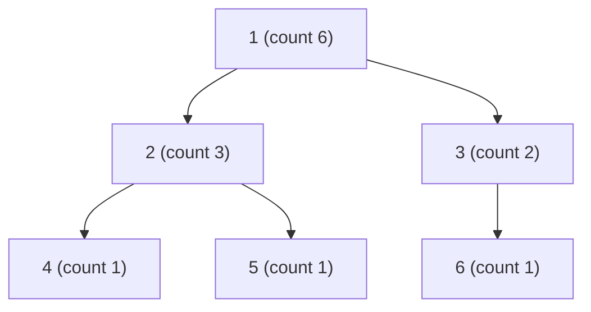

# Count Nodes in Each Subtree (Single Postorder DFS)

| Meta | Value |
|------|-------|
| Source | Classic (self-contained) |
| Difficulty | Easy |
| Topics | Tree DFS, Postorder, Subtree Aggregation |
| Link | — (self-contained) |

---

## Problem Statement
You are given a tree of `n` nodes rooted at node `1`. For **every** node `v`, output the number of
nodes in the subtree rooted at `v` (the count **includes** `v` itself). Solve it with a single
postorder traversal.

```text
Input:
n = 6
edges:
1 2
1 3
2 4
2 5
3 6

Tree:        1
            / \
           2   3
          / \   \
         4   5   6

Output (subtree counts for nodes 1..6):
node:   1  2  3  4  5  6
count:  6  3  2  1  1  1
```

---

## Approach (WHY)

The number of nodes in `v`'s subtree equals `v` itself plus the subtree counts of all its children:

$$
cnt[v] = 1 + \sum_{c \in \text{children}(v)} cnt[c].
$$

This recurrence requires every child's count to be **finalized before** the parent reads it — that
is precisely the guarantee of a **postorder** traversal (visit a node only after all its
descendants are done). We root the undirected tree with an iterative DFS to obtain a preorder list;
reversing that list yields a valid bottom-up order, and a single pass over it accumulates each
count into its parent. Everything is iterative so a chain of up to $n = 2 \times 10^5$ nodes cannot
overflow the recursion stack.

```python
import sys

def subtree_counts(n, edges):
    adj = [[] for _ in range(n + 1)]
    for a, b in edges:
        adj[a].append(b)
        adj[b].append(a)

    parent = [0] * (n + 1)
    order = []
    parent[1] = -1
    seen = [False] * (n + 1)
    seen[1] = True
    stack = [1]
    while stack:                          # iterative rooting -> preorder list
        node = stack.pop()
        order.append(node)
        for nxt in adj[node]:
            if not seen[nxt]:
                seen[nxt] = True
                parent[nxt] = node
                stack.append(nxt)

    cnt = [1] * (n + 1)                    # each node counts itself
    for node in reversed(order):          # postorder: children before parent
        p = parent[node]
        if p != -1:
            cnt[p] += cnt[node]           # add finalized child count up
    return cnt[1:]                         # counts for nodes 1..n
```

```cpp
#include <bits/stdc++.h>
using namespace std;

vector<long long> subtree_counts(int n, const vector<pair<int,int>>& edges) {
    vector<vector<int>> adj(n + 1);
    for (auto [a, b] : edges) {
        adj[a].push_back(b);
        adj[b].push_back(a);
    }

    vector<int> parent(n + 1, 0), order;
    parent[1] = -1;
    vector<char> seen(n + 1, 0);
    seen[1] = 1;
    vector<int> stk = {1};
    while (!stk.empty()) {                 // iterative rooting -> preorder list
        int node = stk.back(); stk.pop_back();
        order.push_back(node);
        for (int nxt : adj[node]) {
            if (!seen[nxt]) {
                seen[nxt] = 1;
                parent[nxt] = node;
                stk.push_back(nxt);
            }
        }
    }

    vector<long long> cnt(n + 1, 1);       // each node counts itself
    for (int i = (int)order.size() - 1; i >= 0; --i) {  // postorder
        int node = order[i];
        int p = parent[node];
        if (p != -1)
            cnt[p] += cnt[node];           // add finalized child count up
    }
    return vector<long long>(cnt.begin() + 1, cnt.end());  // nodes 1..n
}
```

> A reversed preorder list is a ready-made bottom-up order: a parent always precedes its children
> in preorder, hence follows them after reversal. The whole routine is iterative, so deep trees up
> to $2 \times 10^5$ nodes are safe; recursion would risk a stack overflow.

---

## Trace — `n = 6`, edges `{1-2, 1-3, 2-4, 2-5, 3-6}`

Rooted at `1`: children `1→[2,3]`, `2→[4,5]`, `3→[6]`.
A preorder from the stack might be `1, 3, 6, 2, 5, 4`; reversed it is `4, 5, 2, 6, 3, 1`.
Start every `cnt = 1`.

| node processed | parent | action | resulting counts (1..6) |
|----------------|--------|--------|--------------------------|
| 4 | 2 | cnt[2] += 1 → 2 | 1,2,1,1,1,1 |
| 5 | 2 | cnt[2] += 1 → 3 | 1,3,1,1,1,1 |
| 2 | 1 | cnt[1] += 3 → 4 | 4,3,1,1,1,1 |
| 6 | 3 | cnt[3] += 1 → 2 | 4,3,2,1,1,1 |
| 3 | 1 | cnt[1] += 2 → 6 | 6,3,2,1,1,1 |
| 1 | — | root, nothing to add | 6,3,2,1,1,1 |

Final counts: `[6, 3, 2, 1, 1, 1]`. ✓ Leaves stay at 1; each parent absorbs its children's
finalized totals exactly once.

---

## Mermaid

Subtree counts annotated; each non-leaf is `1` plus the sum of the counts directly below it.



Node `2` = `1 + count(4) + count(5) = 1 + 1 + 1 = 3`; the root `1` = `1 + 3 + 2 = 6`.

---

## Math / Complexity

$$
cnt[v] = 1 + \sum_{c \in \text{children}(v)} cnt[c].
$$

| Metric | Value |
|--------|-------|
| Time | $O(n)$ — each node and edge visited once |
| Space | $O(n)$ — adjacency, parent, order, count arrays |

---

## Takeaway
Counting subtree nodes is the simplest **postorder aggregation**: initialize every count to `1`,
process nodes bottom-up (reverse preorder), and push each finalized count into its parent. This one
pattern — children first, then combine — is the foundation every richer tree DP builds on.
