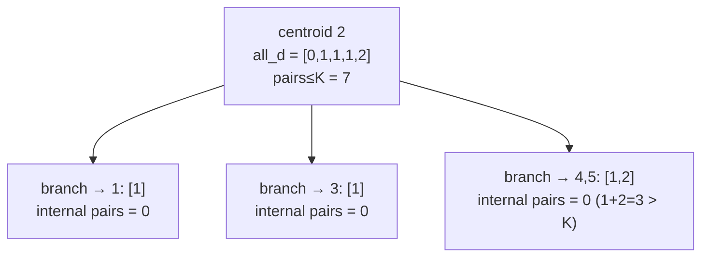
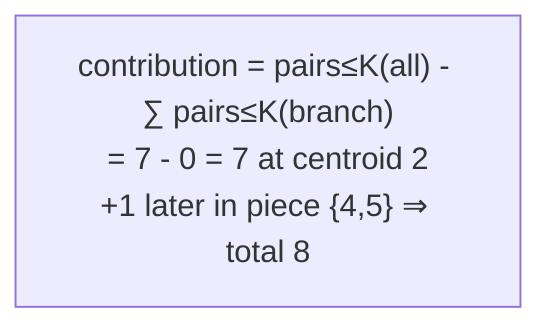

# Count Pairs of Nodes at Distance At Most K (Centroid Decomposition)

| Meta | Value |
|------|-------|
| Source | Self-contained (classic centroid-decomposition exercise) |
| Difficulty | Hard |
| Topics | Trees, Centroid Decomposition, Counting Paths, Two Pointers |
| Technique | per-centroid distance list, two-pointer count of pairs with sum ≤ K, inclusion–exclusion |
| Link | (self-contained — no external judge) |

---

## Problem Statement

You are given a tree with $n$ nodes and $n-1$ **unit-weight** edges, and an integer $K$. Count the
number of **unordered pairs** $\{u, v\}$ (with $u \ne v$) such that the number of edges on the path
between them is **at most $K$**.

Constraints: $n$ up to $2 \times 10^5$, $0 \le K \le n - 1$. The answer can reach
$\binom{n}{2} \approx 2 \times 10^{10}$, so use 64-bit integers.

**Example**
```
n = 5, K = 2
edges:
  1 - 2
  2 - 3
  2 - 4
  4 - 5

tree:
        1
        |
        2
       / \
      3   4
          |
          5

Distances (unordered pairs):
  (1,2)=1  (1,3)=2  (1,4)=2  (1,5)=3
  (2,3)=1  (2,4)=1  (2,5)=2
  (3,4)=2  (3,5)=3
  (4,5)=1

Pairs with distance <= 2:
  (1,2),(1,3),(1,4),(2,3),(2,4),(2,5),(3,4),(4,5)  -> 8 pairs
  (excluded: (1,5)=3 and (3,5)=3)

Answer: 8
```

---

## Why Centroid Decomposition?

Enumerating all $O(n^2)$ pairs is too slow. By the highest-centroid lemma each path is settled at its
highest centroid $c$, splitting into $\text{dist}(u, c) + \text{dist}(c, v) \le K$. So at every
centroid we collect the multiset of distances from $c$ to all component nodes (including $c$ itself at
distance $0$) and count pairs whose distances sum to at most $K$.

Counting pairs with sum $\le K$ in a sorted array is a classic **two-pointer** sweep in linear time
after sorting. But combining all branches together over-counts pairs $\{u, v\}$ that lie in the **same**
child branch (their real path does not pass through $c$). We remove them with **inclusion–exclusion**:

$$\text{pairs through } c = \text{pairs}_{\le K}(D_{\text{all}}) - \sum_{\text{branch } b} \text{pairs}_{\le K}(D_b),$$

where $D_{\text{all}}$ contains the centroid's $0$ plus every branch, and $D_b$ is one branch's
distances. The distance-$0$ entry lives only in $D_{\text{all}}$, so centroid-to-node paths (length
$\le K$) are counted once and never subtracted. The sort per level adds a $\log$ factor, giving
$O(n \log^2 n)$ overall.

---

## Solution — Paired Python + C++

```python
import sys
from sys import stdin

def count_pairs_at_most_k(n, adj, K):
    removed = [False] * (n + 1)
    sz = [0] * (n + 1)
    par = [0] * (n + 1)

    def find_centroid(root):
        order = [root]
        par[root] = 0
        i = 0
        while i < len(order):
            x = order[i]
            i += 1
            for y in adj[x]:
                if not removed[y] and y != par[x]:
                    par[y] = x
                    order.append(y)
        total = len(order)
        for x in reversed(order):
            sz[x] = 1
            for y in adj[x]:
                if not removed[y] and y != par[x]:
                    sz[x] += sz[y]
        c, pc = root, 0
        while True:
            nxt = -1
            for y in adj[c]:
                if not removed[y] and y != pc and sz[y] * 2 > total:
                    nxt = y
                    break
            if nxt == -1:
                return c
            pc, c = c, nxt

    def depths_from(start, banned):
        res = []
        st = [(start, banned, 1)]
        while st:
            x, p, d = st.pop()
            res.append(d)
            for y in adj[x]:
                if not removed[y] and y != p:
                    st.append((y, x, d + 1))
        return res

    def pairs_leq(ds):
        # number of unordered pairs (i < j) with ds[i] + ds[j] <= K
        ds.sort()
        i, j, cnt = 0, len(ds) - 1, 0
        while i < j:
            if ds[i] + ds[j] <= K:
                cnt += j - i            # i pairs with every index in (i, j]
                i += 1
            else:
                j -= 1
        return cnt

    ans = 0
    stack = [1]
    while stack:
        root = stack.pop()
        c = find_centroid(root)
        removed[c] = True
        all_d = [0]                     # centroid itself at distance 0
        for y in adj[c]:
            if not removed[y]:
                bd = depths_from(y, c)
                ans -= pairs_leq(bd)     # inclusion-exclusion: drop same-branch pairs
                all_d.extend(bd)
        ans += pairs_leq(all_d)          # all pairs through c (over-counts same-branch)
        for y in adj[c]:
            if not removed[y]:
                stack.append(y)
    return ans

def main():
    data = stdin.buffer.read().split()
    idx = 0
    n = int(data[idx]); K = int(data[idx + 1]); idx += 2
    adj = [[] for _ in range(n + 1)]
    for _ in range(n - 1):
        a = int(data[idx]); b = int(data[idx + 1]); idx += 2
        adj[a].append(b)
        adj[b].append(a)
    print(count_pairs_at_most_k(n, adj, K))

main()
```

```cpp
#include <bits/stdc++.h>
using namespace std;

long long count_pairs_at_most_k(int n, const vector<vector<int>>& adj, long long K) {
    vector<char> removed(n + 1, false);
    vector<int> sz(n + 1, 0), par(n + 1, 0);

    auto find_centroid = [&](int root) -> int {
        vector<int> order = {root};
        par[root] = 0;
        for (size_t i = 0; i < order.size(); ++i) {
            int x = order[i];
            for (int y : adj[x])
                if (!removed[y] && y != par[x]) {
                    par[y] = x;
                    order.push_back(y);
                }
        }
        int total = (int)order.size();
        for (int i = total - 1; i >= 0; --i) {
            int x = order[i];
            sz[x] = 1;
            for (int y : adj[x])
                if (!removed[y] && y != par[x])
                    sz[x] += sz[y];
        }
        int c = root, pc = 0;
        while (true) {
            int nxt = -1;
            for (int y : adj[c])
                if (!removed[y] && y != pc && sz[y] * 2 > total) { nxt = y; break; }
            if (nxt == -1) return c;
            pc = c;
            c = nxt;
        }
    };

    auto depths_from = [&](int start, int banned) {
        vector<long long> res;
        vector<array<long long,3>> st = {{(long long)start, (long long)banned, 1}};
        while (!st.empty()) {
            auto top = st.back();
            st.pop_back();
            int x = (int)top[0], p = (int)top[1];
            long long d = top[2];
            res.push_back(d);
            for (int y : adj[x])
                if (!removed[y] && y != p)
                    st.push_back({(long long)y, (long long)x, d + 1});
        }
        return res;
    };

    auto pairs_leq = [&](vector<long long>& ds) -> long long {
        // number of unordered pairs (i < j) with ds[i] + ds[j] <= K
        sort(ds.begin(), ds.end());
        long long cnt = 0;
        int i = 0, j = (int)ds.size() - 1;
        while (i < j) {
            if (ds[i] + ds[j] <= K) { cnt += j - i; ++i; }   // i pairs with every index in (i, j]
            else --j;
        }
        return cnt;
    };

    long long ans = 0;
    vector<int> stk = {1};
    while (!stk.empty()) {
        int root = stk.back();
        stk.pop_back();
        int c = find_centroid(root);
        removed[c] = true;
        vector<long long> all_d = {0};                 // centroid itself at distance 0
        for (int y : adj[c]) {
            if (!removed[y]) {
                vector<long long> bd = depths_from(y, c);
                ans -= pairs_leq(bd);                  // inclusion-exclusion: drop same-branch pairs
                all_d.insert(all_d.end(), bd.begin(), bd.end());
            }
        }
        ans += pairs_leq(all_d);                       // all pairs through c (over-counts same-branch)
        for (int y : adj[c])
            if (!removed[y]) stk.push_back(y);
    }
    return ans;
}

int main() {
    int n; long long K;
    scanf("%d %lld", &n, &K);
    vector<vector<int>> adj(n + 1);
    for (int i = 0; i < n - 1; ++i) {
        int a, b;
        scanf("%d %d", &a, &b);
        adj[a].push_back(b);
        adj[b].push_back(a);
    }
    printf("%lld\n", count_pairs_at_most_k(n, adj, K));
    return 0;
}
```

---

## Trace

Example tree, $K = 2$. Total size $5$; the centroid is node `2` (pieces of size $1, 1, 2$ after
removal, all $\le 2$).

Process centroid `2`. Branches and their distance lists:

- toward `1`: `[1]`
- toward `3`: `[1]`
- toward `4`: `[1, 2]` (node 4 at 1, node 5 at 2)

`all_d = [0, 1, 1, 1, 2]` (the `0` is the centroid).

`pairs_leq(all_d)`: sorted `[0,1,1,1,2]`. Pairs with sum $\le 2$:

| pair | sum | counted? |
|------|-----|----------|
| (0,1),(0,1),(0,1),(0,2) | 1,1,1,2 | yes ×4 |
| (1,1) ×3 | 2 | yes ×3 |
| (1,2) ×3 | 3 | no |
| (2,…) | >2 | no |

So `pairs_leq(all_d) = 7`.

Inclusion–exclusion subtracts each branch's internal pairs: branches `[1]`, `[1]` have no pairs;
branch `[1, 2]` has the single pair `(1,2)` with sum $3 > 2$, so `pairs_leq = 0`. Nothing subtracted.

Contribution at centroid `2`: $7 - 0 = 7$. These are: `(2,1),(2,3),(2,4),(2,5)` (the four `0+d` paths
from the centroid) and `(1,3),(1,4),(3,4)` (the three `1+1` cross-branch pairs).

After removing `2`, pieces are `{1}`, `{3}`, `{4,5}`. Only `{4,5}` contributes: distances `[0,1]`
→ pair `(4,5)` sum $1 \le 2$ → `+1`. Total `ans = 7 + 1 = 8`. ✓

---

## Mermaid





---

## Math & Complexity

For a centroid $c$ with combined distance multiset $D_{\text{all}}$ (including $0$) and per-branch
multisets $D_b$, the inclusion–exclusion identity gives the paths whose highest centroid is $c$:

$$\text{contrib}(c) = \text{pairs}_{\le K}(D_{\text{all}}) - \sum_{b} \text{pairs}_{\le K}(D_b),$$

and $\text{pairs}_{\le K}(\cdot)$ is computed by sorting and a two-pointer sweep:

$$\text{pairs}_{\le K}(a) = \#\{(i, j) : i < j,\; a_i + a_j \le K\}.$$

| Phase | Time | Space |
|-------|------|-------|
| One centroid: collect + sort + sweep (size $m$) | $O(m \log m)$ | $O(m)$ |
| All centroids (sizes telescope, height $O(\log n)$) | $O(n \log^2 n)$ | $O(n)$ |

Total $O(n \log^2 n)$ time, $O(n)$ space. Replacing the sort with bucket counting (distances are $\le
n$) and a running prefix would shave it to $O(n \log n)$, but the two-pointer version is shorter and
fast enough for $n = 2 \times 10^5$. The answer can reach $\sim 2 \times 10^{10}$, so accumulate in
`long long`.

---

## Takeaway

"Distance at most $K$" is the two-pointer cousin of the exact-distance count: gather centroid-rooted
distances, count pairs with **sum ≤ K** via a sorted two-pointer sweep, and remove same-branch pairs
with explicit **inclusion–exclusion** (combined count minus each branch's internal count). Keep the
centroid's own distance-$0$ entry only in the combined set so centroid-to-node paths are counted
exactly once.
