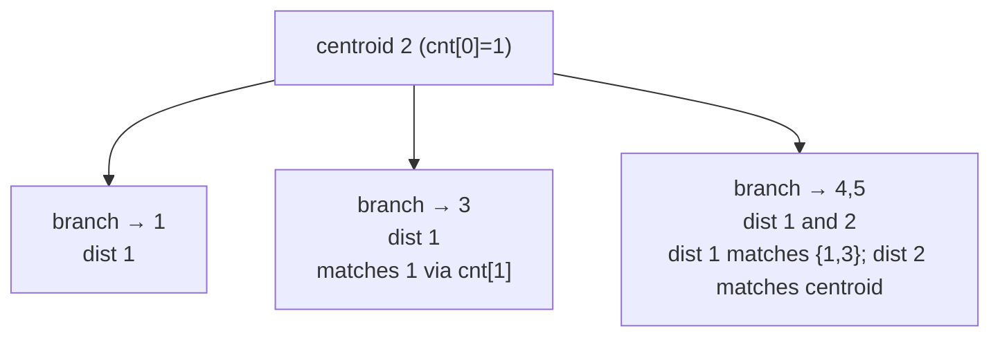
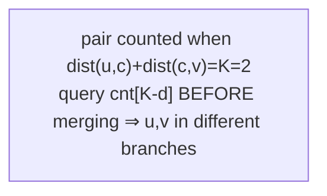

# Count Pairs of Nodes at Distance Exactly K (Centroid Decomposition)

| Meta | Value |
|------|-------|
| Source | Self-contained (classic centroid-decomposition exercise) |
| Difficulty | Hard |
| Topics | Trees, Centroid Decomposition, Counting Paths |
| Technique | per-centroid distance frequency array, query `cnt[K - d]` before merging each branch |
| Link | (self-contained — no external judge) |

---

## Problem Statement

You are given a tree with $n$ nodes and $n-1$ **unit-weight** edges, and an integer $K$. Count the
number of **unordered pairs** $\{u, v\}$ (with $u \ne v$) such that the number of edges on the unique
path between them is **exactly $K$**.

Constraints: $n$ up to $2 \times 10^5$, $1 \le K \le n - 1$. The answer can be as large as
$\binom{n}{2} \approx 2 \times 10^{10}$, so use 64-bit integers.

**Example**
```
n = 5, K = 2
edges:
  1 - 2
  2 - 3
  2 - 4
  4 - 5

tree:
        1
        |
        2
       / \
      3   4
          |
          5

Pairs at distance exactly 2:
  (1,3) : 1-2-3
  (1,4) : 1-2-4
  (3,4) : 3-2-4
  (2,5) : 2-4-5

Answer: 4
```

---

## Why Centroid Decomposition?

There are $O(n^2)$ pairs; we cannot test each one. By the highest-centroid lemma, every path is
handled at exactly one centroid $c$ — the highest centroid lying on it — where it splits into
$\text{dist}(u, c) + \text{dist}(c, v) = K$. So at each centroid we only need the distances from $c$ to
the nodes of its component, and we count how many pairs of distances add up to $K$.

To match each cross-branch pair exactly once we keep a frequency array `cnt[d]` = number of already
-seen nodes at distance `d` from `c`, seeded with `cnt[0] = 1` for the centroid itself. For a new branch
we first **query**: every node at distance `d` contributes `cnt[K - d]` completions from earlier
branches (including the centroid, giving centroid-to-node paths of length $K$). Then we **merge** the
branch into `cnt`. Because we query before merging, two nodes in the same branch are never paired —
that is inclusion–exclusion done implicitly. Resetting only the touched indices keeps each centroid's
work proportional to its component size, for an overall $O(n \log n)$.

---

## Solution — Paired Python + C++

```python
import sys
from sys import stdin

def count_pairs_exact_k(n, adj, K):
    removed = [False] * (n + 1)
    sz = [0] * (n + 1)
    par = [0] * (n + 1)
    cnt = [0] * (n + 1)              # cnt[d] = #seen nodes at distance d from current centroid

    def find_centroid(root):
        order = [root]
        par[root] = 0
        i = 0
        while i < len(order):
            x = order[i]
            i += 1
            for y in adj[x]:
                if not removed[y] and y != par[x]:
                    par[y] = x
                    order.append(y)
        total = len(order)
        for x in reversed(order):
            sz[x] = 1
            for y in adj[x]:
                if not removed[y] and y != par[x]:
                    sz[x] += sz[y]
        c, pc = root, 0
        while True:
            nxt = -1
            for y in adj[c]:
                if not removed[y] and y != pc and sz[y] * 2 > total:
                    nxt = y
                    break
            if nxt == -1:
                return c
            pc, c = c, nxt

    ans = 0
    stack = [1]
    while stack:
        root = stack.pop()
        c = find_centroid(root)
        removed[c] = True
        cnt[0] = 1                   # the centroid contributes distance 0
        touched = [0]
        for y0 in adj[c]:
            if removed[y0]:
                continue
            # collect distances in this branch (pruning d > K)
            branch = []
            st = [(y0, c, 1)]
            while st:
                x, p, d = st.pop()
                if d > K:
                    continue
                branch.append(d)
                for y in adj[x]:
                    if not removed[y] and y != p:
                        st.append((y, x, d + 1))
            # query first: each d pairs with earlier nodes at distance K - d
            for d in branch:
                if 0 <= K - d <= n:
                    ans += cnt[K - d]
            # then merge this branch's distances
            for d in branch:
                cnt[d] += 1
                touched.append(d)
        for d in touched:            # reset only touched buckets
            cnt[d] = 0
        for y in adj[c]:
            if not removed[y]:
                stack.append(y)
    return ans

def main():
    data = stdin.buffer.read().split()
    idx = 0
    n = int(data[idx]); K = int(data[idx + 1]); idx += 2
    adj = [[] for _ in range(n + 1)]
    for _ in range(n - 1):
        a = int(data[idx]); b = int(data[idx + 1]); idx += 2
        adj[a].append(b)
        adj[b].append(a)
    print(count_pairs_exact_k(n, adj, K))

main()
```

```cpp
#include <bits/stdc++.h>
using namespace std;

long long count_pairs_exact_k(int n, const vector<vector<int>>& adj, int K) {
    vector<char> removed(n + 1, false);
    vector<int> sz(n + 1, 0), par(n + 1, 0);
    vector<long long> cnt(n + 1, 0);          // cnt[d] = #seen nodes at distance d from centroid

    auto find_centroid = [&](int root) -> int {
        vector<int> order = {root};
        par[root] = 0;
        for (size_t i = 0; i < order.size(); ++i) {
            int x = order[i];
            for (int y : adj[x])
                if (!removed[y] && y != par[x]) {
                    par[y] = x;
                    order.push_back(y);
                }
        }
        int total = (int)order.size();
        for (int i = total - 1; i >= 0; --i) {
            int x = order[i];
            sz[x] = 1;
            for (int y : adj[x])
                if (!removed[y] && y != par[x])
                    sz[x] += sz[y];
        }
        int c = root, pc = 0;
        while (true) {
            int nxt = -1;
            for (int y : adj[c])
                if (!removed[y] && y != pc && sz[y] * 2 > total) { nxt = y; break; }
            if (nxt == -1) return c;
            pc = c;
            c = nxt;
        }
    };

    long long ans = 0;
    vector<int> stk = {1};
    while (!stk.empty()) {
        int root = stk.back();
        stk.pop_back();
        int c = find_centroid(root);
        removed[c] = true;
        cnt[0] = 1;                            // the centroid contributes distance 0
        vector<int> touched = {0};
        for (int y0 : adj[c]) {
            if (removed[y0]) continue;
            // collect distances in this branch (pruning d > K)
            vector<int> branch;
            // explicit stack of (node, parent, depth)
            vector<array<int,3>> s2 = {{y0, c, 1}};
            while (!s2.empty()) {
                auto top = s2.back();
                s2.pop_back();
                int x = top[0], p = top[1], d = top[2];
                if (d > K) continue;
                branch.push_back(d);
                for (int y : adj[x])
                    if (!removed[y] && y != p)
                        s2.push_back({y, x, d + 1});
            }
            // query first: each d pairs with earlier nodes at distance K - d
            for (int d : branch)
                if (K - d >= 0 && K - d <= n)
                    ans += cnt[K - d];
            // then merge this branch's distances
            for (int d : branch) {
                cnt[d] += 1;
                touched.push_back(d);
            }
        }
        for (int d : touched) cnt[d] = 0;     // reset only touched buckets
        for (int y : adj[c])
            if (!removed[y]) stk.push_back(y);
    }
    return ans;
}

int main() {
    int n, K;
    scanf("%d %d", &n, &K);
    vector<vector<int>> adj(n + 1);
    for (int i = 0; i < n - 1; ++i) {
        int a, b;
        scanf("%d %d", &a, &b);
        adj[a].push_back(b);
        adj[b].push_back(a);
    }
    printf("%lld\n", count_pairs_exact_k(n, adj, K));
    return 0;
}
```

---

## Trace

Example tree, $K = 2$. Total size $5$; the centroid is node `2` (removing it leaves pieces of size
$1, 1, 2$, all $\le 2$).

Process centroid `2`. Seed `cnt[0] = 1`.

| Branch from `2` | distances `d` | query `cnt[K - d]` | running `ans` | merge → `cnt` |
|-----------------|---------------|--------------------|---------------|----------------|
| toward `1` | `[1]` | `cnt[2-1]=cnt[1]=0` | 0 | `cnt[1]=1` |
| toward `3` | `[1]` | `cnt[1]=1` → +1 | 1 | `cnt[1]=2` |
| toward `4` | `[1, 2]` (node 4 at 1, node 5 at 2) | `d=1: cnt[1]=2` (+2); `d=2: cnt[0]=1` (+1) | 4 | `cnt[1]=3, cnt[2]=1` |

The four counted pairs: `(3,1)` and `(4,1)` and `(4,3)` from the `cnt[1]` queries, plus `(5,2)` from
the `cnt[0]` query (the centroid-to-node path `2-4-5` of length 2). Reset touched buckets.

After removing `2`, the remaining pieces are `{1}`, `{3}`, `{4,5}`. None contributes another
distance-2 pair (the piece `{4,5}` only has a distance-1 pair). Final answer **4**.

---

## Mermaid





---

## Math & Complexity

A path of length exactly $K$ through centroid $c$ pairs a node at distance $d$ with a node at distance
$K - d$ in a different branch:

$$\text{pairs at } c = \tfrac{1}{2}\sum_{\text{ordered }(u,v)\text{ diff. branch}} [\, \text{dist}(u,c) + \text{dist}(c,v) = K \,],$$

realized without the factor by the *query-then-merge* order: each unordered cross-branch pair is
counted once, and centroid-to-node paths are caught by `cnt[0]`.

| Phase | Time | Space |
|-------|------|-------|
| One centroid's branch scans (size $m$) | $O(m)$ | $O(m)$ |
| All centroids (sizes telescope, height $O(\log n)$) | $O(n \log n)$ | $O(n)$ |
| `cnt[]` reset (touched buckets only) | amortized $O(n \log n)$ total | — |

Total $O(n \log n)$ time, $O(n)$ space. No sorting is needed because distances are bounded by $n$ and
counted in a bucket array. The count can reach $\sim 2 \times 10^{10}$, so accumulate in `long long`.

---

## Takeaway

Counting paths of an exact length is the cleanest centroid-decomposition template: at each centroid,
**query a distance frequency array at `K - d` before merging each branch**. This gives implicit
inclusion–exclusion (different branches only), catches centroid-rooted paths via `cnt[0]`, avoids
sorting entirely, and runs in $O(n \log n)$ when you reset only the buckets you touched.
