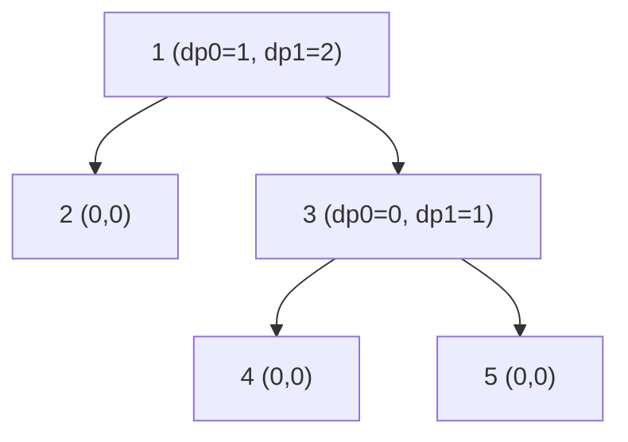

# CSES 1130 — Tree Matching (Maximum Matching via Tree DP)

| Meta | Value |
|------|-------|
| Source | CSES Problem Set — Tree Algorithms |
| Difficulty | Medium |
| Topics | Tree DP, Postorder Aggregation, Matching |
| Link | https://cses.fi/problemset/task/1130 |

---

## Problem Statement
You are given a tree of `n` nodes. A **matching** is a set of edges such that no two chosen edges
share a node. Find the **maximum number of edges** in a matching of the tree.

```text
Input:
n = 5
edges:
1 2
1 3
3 4
3 5

Tree:        1
            / \
           2   3
              / \
             4   5

Answer: 2   (e.g. choose edges {1-2} and {3-4}; node 3 is then used, so 3-5 cannot also be chosen)
```

---

## Approach (WHY)

Root the tree anywhere (say node `1`). For each node `v` we keep **two** DP states describing the
best matching inside `v`'s subtree:

- $dp[v][0]$ — best matching in `v`'s subtree where `v` is **not matched to any of its children**
  (it may still be matched to its parent later).
- $dp[v][1]$ — best matching in `v`'s subtree where `v` **is matched to one of its children**.

Why this split? Whether `v` is still free determines whether the *parent* edge `(parent, v)` can be
used. The parent only needs to know: "what is the best result if `v` stays free?" (that is
$dp[v][0]$) versus "what is the best regardless?" (that is $\max(dp[v][0], dp[v][1])$).

For a node `v` with children $c_1, \dots, c_k$:

- If `v` is **unmatched** to its children, each child is solved independently and contributes its
  own best:
  $$dp[v][0] = \sum_{i} \max\big(dp[c_i][0],\, dp[c_i][1]\big).$$
- If `v` **is matched** to exactly one child `c_j`, that edge adds `1`, and `c_j` must then be free
  (use $dp[c_j][0]$), while the other children keep their best:
  $$dp[v][1] = \max_{j}\Big(1 + dp[c_j][0] + \sum_{i \ne j} \max(dp[c_i][0], dp[c_i][1])\Big).$$

To compute $dp[v][1]$ efficiently, let $base = dp[v][0] = \sum_i \max(\cdot)$. Switching child `c_j`
to the matched form changes its contribution from $\max(dp[c_j][0], dp[c_j][1])$ to
$1 + dp[c_j][0]$, so we pick the child maximizing the *gain*. The answer is
$\max(dp[\text{root}][0], dp[\text{root}][1])$. Because each node combines already-finished
children, this is a **postorder** aggregation, done iteratively to handle deep trees up to
$n = 2 \times 10^5$.

```python
import sys

def tree_matching(n, edges):
    adj = [[] for _ in range(n + 1)]
    for a, b in edges:
        adj[a].append(b)
        adj[b].append(a)

    parent = [0] * (n + 1)
    order = []
    parent[1] = -1
    seen = [False] * (n + 1)
    seen[1] = True
    stack = [1]
    while stack:                         # iterative rooting -> preorder
        node = stack.pop()
        order.append(node)
        for nxt in adj[node]:
            if not seen[nxt]:
                seen[nxt] = True
                parent[nxt] = node
                stack.append(nxt)

    dp0 = [0] * (n + 1)                   # v not matched downward
    dp1 = [0] * (n + 1)                   # v matched to some child
    INF = float("inf")
    for node in reversed(order):          # postorder: children first
        base = 0
        best_gain = -INF                  # best (1 + dp0[c]) - max(dp0[c], dp1[c])
        for nxt in adj[node]:
            if nxt == parent[node]:
                continue
            child_best = dp0[nxt] if dp0[nxt] > dp1[nxt] else dp1[nxt]
            base += child_best
            gain = (1 + dp0[nxt]) - child_best
            if gain > best_gain:
                best_gain = gain
        dp0[node] = base
        dp1[node] = base + best_gain if best_gain != -INF else 0  # leaf -> 0
    return max(dp0[1], dp1[1])
```

```cpp
#include <bits/stdc++.h>
using namespace std;

long long tree_matching(int n, const vector<pair<int,int>>& edges) {
    vector<vector<int>> adj(n + 1);
    for (auto [a, b] : edges) {
        adj[a].push_back(b);
        adj[b].push_back(a);
    }

    vector<int> parent(n + 1, 0), order;
    parent[1] = -1;
    vector<char> seen(n + 1, 0);
    seen[1] = 1;
    vector<int> stk = {1};
    while (!stk.empty()) {                // iterative rooting -> preorder
        int node = stk.back(); stk.pop_back();
        order.push_back(node);
        for (int nxt : adj[node]) {
            if (!seen[nxt]) {
                seen[nxt] = 1;
                parent[nxt] = node;
                stk.push_back(nxt);
            }
        }
    }

    const long long INF = 1e18;
    vector<long long> dp0(n + 1, 0);      // v not matched downward
    vector<long long> dp1(n + 1, 0);      // v matched to some child
    for (int i = (int)order.size() - 1; i >= 0; --i) {  // postorder
        int node = order[i];
        long long base = 0;
        long long best_gain = -INF;       // best (1 + dp0[c]) - max(dp0[c], dp1[c])
        for (int nxt : adj[node]) {
            if (nxt == parent[node]) continue;
            long long child_best = max(dp0[nxt], dp1[nxt]);
            base += child_best;
            long long gain = (1 + dp0[nxt]) - child_best;
            if (gain > best_gain) best_gain = gain;
        }
        dp0[node] = base;
        dp1[node] = (best_gain != -INF) ? base + best_gain : 0;  // leaf -> 0
    }
    return max(dp0[1], dp1[1]);
}
```

> The tree can be a chain of $2 \times 10^5$ nodes, so we root and aggregate with an explicit stack
> (iterative DFS) rather than recursion to avoid stack overflow.

---

## Trace — `n = 5`, edges `{1-2, 1-3, 3-4, 3-5}`

Rooted at `1`: children `1→[2,3]`, `3→[4,5]`. Postorder (reverse preorder): `2, 4, 5, 3, 1`.

| node | children | base = Σ max(dp0,dp1) | best_gain | dp0 | dp1 |
|------|----------|------------------------|-----------|-----|-----|
| 2 | — | 0 | — | 0 | 0 |
| 4 | — | 0 | — | 0 | 0 |
| 5 | — | 0 | — | 0 | 0 |
| 3 | 4,5 | max(0,0)+max(0,0)=0 | (1+0)−0 = 1 | 0 | 1 |
| 1 | 2,3 | max(0,0)+max(0,1)=1 | from child 2: (1+0)−0=1; from child 3: (1+0)−1=0 → best 1 | 1 | 2 |

Answer = $\max(dp0[1], dp1[1]) = \max(1, 2) = 2$. ✓ Matching `{1-2, 3-4}` uses two disjoint edges.

---

## Mermaid

States flow up: leaves report `(dp0=0, dp1=0)`, the matched child contributes the `+1`.



At node `3`, matching edge `3-4` (or `3-5`) sets `dp1=1`. At the root, matching edge `1-2` adds
another, giving `dp1=2`.

---

## Math / Complexity

$$
dp[v][0] = \sum_{c} \max(dp[c][0], dp[c][1]), \qquad
dp[v][1] = dp[v][0] + \max_{c}\big[(1 + dp[c][0]) - \max(dp[c][0], dp[c][1])\big].
$$

| Metric | Value |
|--------|-------|
| Time | $O(n)$ — each node and edge processed once |
| Space | $O(n)$ — adjacency, parent, dp arrays, explicit stack |

---

## Takeaway
Maximum tree matching is a clean **two-state subtree DP**: track "node free" vs "node matched
downward", aggregate children in **postorder**, and at each node pay `+1` to match one still-free
child while keeping the others' best. The free-state value is exactly what the parent needs to
decide its own match.
