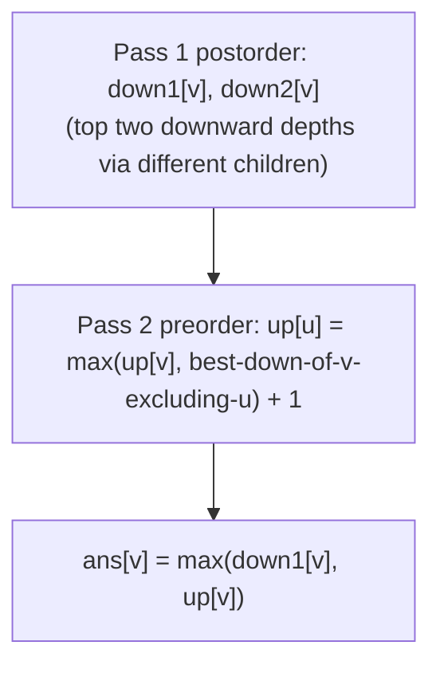
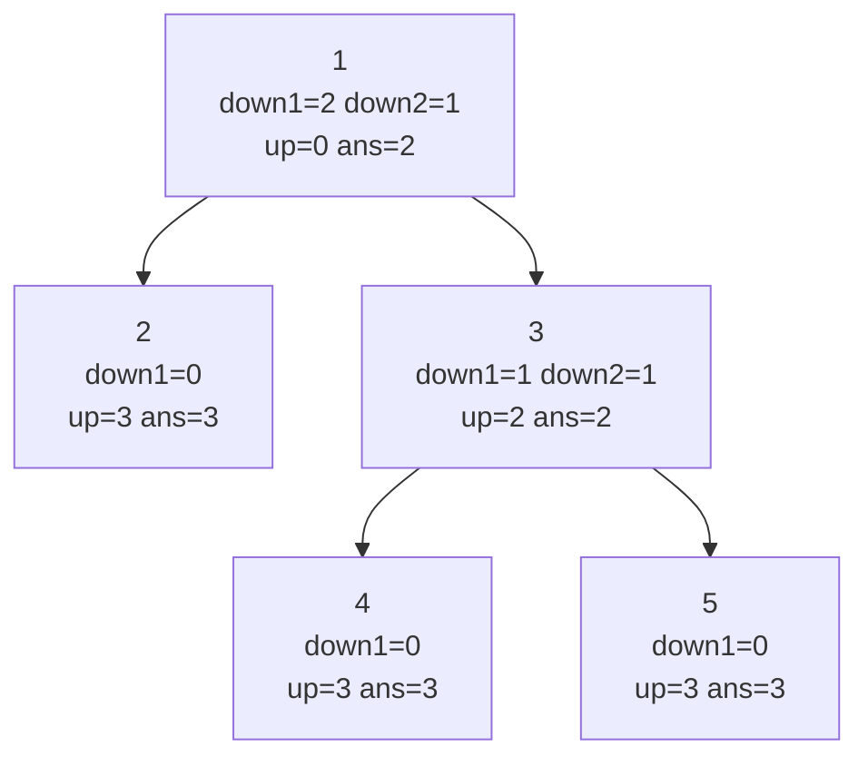

# CSES 1132 — Tree Distances I

| Meta | Value |
|------|-------|
| Source | CSES Problem Set — Tree Algorithms |
| Difficulty | Medium |
| Topics | Trees, Rerooting / All-Roots DP, Tree Diameter |
| Technique | Down pass (top-2 downward depths) + up pass (distance through parent) |
| Link | https://cses.fi/problemset/task/1132 |

---

## Problem Statement

You are given a tree of `n` nodes. For **every** node, output the **maximum distance** (number of
edges) to any other node in the tree. That value is the node's *eccentricity*; the largest of all of
them is the tree's diameter.

Constraints: `n` up to $2 \times 10^5$, so an $O(n)$ or $O(n \log n)$ algorithm is required — solving
each node independently with a BFS would be $O(n^2)$.

**Example**
```
n = 5
edges:
  1 - 2
  1 - 3
  3 - 4
  3 - 5

tree:
        1
       / \
      2   3
         / \
        4   5

answers (max distance from each node):
  node 1 -> 2   (1->3->4 or 1->3->5)
  node 2 -> 3   (2->1->3->4)
  node 3 -> 2   (3->2->1 ... actually 2; 3->1->2 = 2, 3->4 = 1)
  node 4 -> 3   (4->3->1->2)
  node 5 -> 3   (5->3->1->2)

output: 2 3 2 3 3
```

---

## Why Rerooting?

For a single fixed node, the farthest distance is one BFS away. Doing that for all `n` nodes is
$O(n^2)$. Rerooting computes every node's farthest distance in two linear sweeps.

The farthest node from `v` lies in one of two directions: **down** into `v`'s own subtree, or **up**
through `v`'s parent into the rest of the tree.

- The **down** part is the longest root-to-leaf path inside `v`'s subtree. We compute it in a
  postorder pass. Because the up pass needs to *exclude the child that produced the best path*, we
  keep the **top two** distinct-child downward depths, `down1[v]` (best) and `down2[v]` (second).
- The **up** part, `up[v]`, is the longest path from `v` that starts by stepping to its parent `p`.
  From `p` we may continue upward (`up[p]`) or down into a *sibling* branch — but never back into
  `v`. That sibling branch is exactly `down1[p]` unless `v` is the child realizing `down1[p]`, in
  which case we must use `down2[p]`. This is the prefix/suffix "exclude one child" idea, specialized
  to "exclude one and keep the best of the rest" via top-2.

The answer for each node is then `ans[v] = max(down1[v], up[v])`. The merge here is `max`, which is
**not invertible**, which is precisely why we track two best values instead of subtracting.

---

## Solution — Paired Python + C++

We root at node `1`. Postorder fills `down1`/`down2` (and which child achieved `down1`). Preorder
fills `up`. Both passes are iterative to survive `n = 2e5` path-shaped trees.

```python
import sys

def solve():
    data = sys.stdin.buffer.read().split()
    idx = 0
    n = int(data[idx]); idx += 1
    adj = [[] for _ in range(n + 1)]
    for _ in range(n - 1):
        a = int(data[idx]); b = int(data[idx + 1]); idx += 2
        adj[a].append(b)
        adj[b].append(a)

    if n == 1:
        sys.stdout.write("0\n")
        return

    parent = [0] * (n + 1)
    order = []
    stack = [1]
    parent[1] = -1
    seen = [False] * (n + 1)
    seen[1] = True
    while stack:
        v = stack.pop()
        order.append(v)
        for u in adj[v]:
            if not seen[u]:
                seen[u] = True
                parent[u] = v
                stack.append(u)

    down1 = [0] * (n + 1)         # longest downward depth (edges)
    down2 = [0] * (n + 1)         # second longest, via a different child
    best_child = [0] * (n + 1)    # child realizing down1
    for v in reversed(order):     # postorder
        p = parent[v]
        if p != -1:
            cand = down1[v] + 1
            if cand > down1[p]:
                down2[p] = down1[p]
                down1[p] = cand
                best_child[p] = v
            elif cand > down2[p]:
                down2[p] = cand

    up = [0] * (n + 1)
    for v in order:               # preorder
        for u in adj[v]:
            if u == parent[v]:
                continue
            # best downward branch of v that does NOT go through u:
            if best_child[v] == u:
                best_down_excl = down2[v]
            else:
                best_down_excl = down1[v]
            up[u] = max(up[v], best_down_excl) + 1

    ans = [str(max(down1[v], up[v])) for v in range(1, n + 1)]
    sys.stdout.write(" ".join(ans) + "\n")

solve()
```

```cpp
#include <bits/stdc++.h>
using namespace std;

int main() {
    ios::sync_with_stdio(false);
    cin.tie(nullptr);

    int n;
    cin >> n;
    vector<vector<int>> adj(n + 1);
    for (int i = 0; i < n - 1; ++i) {
        int a, b;
        cin >> a >> b;
        adj[a].push_back(b);
        adj[b].push_back(a);
    }

    if (n == 1) {
        cout << 0 << "\n";
        return 0;
    }

    vector<int> parent(n + 1, 0), order;
    order.reserve(n);
    vector<char> seen(n + 1, 0);
    vector<int> stack;
    stack.push_back(1);
    parent[1] = -1;
    seen[1] = 1;
    while (!stack.empty()) {
        int v = stack.back();
        stack.pop_back();
        order.push_back(v);
        for (int u : adj[v]) {
            if (!seen[u]) {
                seen[u] = 1;
                parent[u] = v;
                stack.push_back(u);
            }
        }
    }

    vector<int> down1(n + 1, 0), down2(n + 1, 0), best_child(n + 1, 0);
    for (int i = (int)order.size() - 1; i >= 0; --i) {   // postorder
        int v = order[i];
        int p = parent[v];
        if (p != -1) {
            int cand = down1[v] + 1;
            if (cand > down1[p]) {
                down2[p] = down1[p];
                down1[p] = cand;
                best_child[p] = v;
            } else if (cand > down2[p]) {
                down2[p] = cand;
            }
        }
    }

    vector<int> up(n + 1, 0);
    for (int v : order) {            // preorder
        for (int u : adj[v]) {
            if (u == parent[v]) continue;
            int best_down_excl = (best_child[v] == u) ? down2[v] : down1[v];
            up[u] = max(up[v], best_down_excl) + 1;
        }
    }

    string out;
    for (int v = 1; v <= n; ++v) {
        out += to_string(max(down1[v], up[v]));
        out += (v == n ? '\n' : ' ');
    }
    cout << out;
    return 0;
}
```

---

## Trace

Root at `1`. Postorder over the example tree:

| node `v` | children | `down1[v]` | `down2[v]` | `best_child[v]` |
|----------|----------|-----------|-----------|-----------------|
| 2 | — | 0 | 0 | 0 |
| 4 | — | 0 | 0 | 0 |
| 5 | — | 0 | 0 | 0 |
| 3 | 4, 5 | 1 | 1 | 4 |
| 1 | 2, 3 | 2 (via 3) | 1 (via 2) | 3 |

Preorder fills `up`:

- `up[1] = 0` (root).
- `up[2]`: exclude child `2` from node `1` → best of remaining down is `down1[1] = 2` (child `2`
  is not `best_child[1]=3`). `up[2] = max(up[1], 2) + 1 = 3`.
- `up[3]`: child `3` **is** `best_child[1]`, so use `down2[1] = 1`. `up[3] = max(0, 1) + 1 = 2`.
- `up[4]`: from node `3`, child `4` is `best_child[3]`, use `down2[3] = 1`.
  `up[4] = max(up[3]=2, 1) + 1 = 3`.
- `up[5]`: from node `3`, child `5` is not best, use `down1[3] = 1`.
  `up[5] = max(up[3]=2, 1) + 1 = 3`.

Final `ans[v] = max(down1[v], up[v])`:

| node | 1 | 2 | 3 | 4 | 5 |
|------|---|---|---|---|---|
| down1 | 2 | 0 | 1 | 0 | 0 |
| up | 0 | 3 | 2 | 3 | 3 |
| **ans** | **2** | **3** | **2** | **3** | **3** |

Output: `2 3 2 3 3`. ✓

---

## Mermaid





---

## Math & Complexity

For each node `v` the farthest distance splits as
$$\texttt{ans}[v] \;=\; \max\big(\underbrace{\texttt{down1}[v]}_{\text{into } v\text{'s subtree}},\;
\underbrace{\texttt{up}[v]}_{\text{through the parent}}\big),$$
where the up recurrence, for a child `u` of `v`, is
$$\texttt{up}[u] \;=\; 1 + \max\Big(\texttt{up}[v],\; \max_{c \in \text{children}(v),\, c \ne u}
\big(\texttt{down1}[c] + 1\big)\Big),$$
and the inner max-over-other-children is realized in $O(1)$ by the top-two values `down1[v]`,
`down2[v]` (use `down2` exactly when `u` is the child that produced `down1`).

| Phase | Work | Time |
|-------|------|------|
| Build adjacency | read $n-1$ edges | $O(n)$ |
| Down pass (top-2) | one postorder | $O(n)$ |
| Up pass | one preorder | $O(n)$ |
| **Total** | | $O(n)$ time, $O(n)$ space |

Distances fit comfortably in `int` (at most `n-1`), but the iterative DFS is essential to avoid stack
overflow on a chain of $2\times10^5$ nodes.

---

## Key Takeaway

Tree Distances I is the **`max`-merge** face of rerooting. Because `max` has no inverse, you cannot
subtract a child out — instead you keep the **two best** downward depths so the up pass can exclude
exactly one child in $O(1)$. The same down-then-up skeleton powers every all-roots tree DP; only the
merge and the per-edge transformation change.

See also: [06-rerooting.md](../guide/06-rerooting.md),
[cses-1133-tree-distances-ii.md](cses-1133-tree-distances-ii.md),
[0834-sum-of-distances-in-tree.md](0834-sum-of-distances-in-tree.md).
