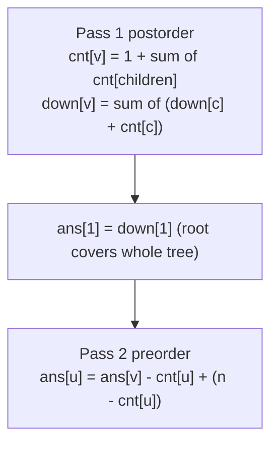
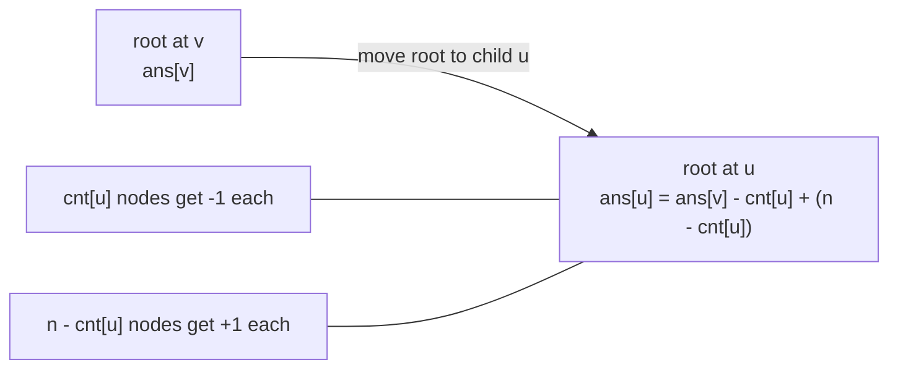

# CSES 1133 — Tree Distances II

| Meta | Value |
|------|-------|
| Source | CSES Problem Set — Tree Algorithms |
| Difficulty | Medium |
| Topics | Trees, Rerooting / All-Roots DP, Subtree Sizes |
| Technique | Down pass (subtree size + subtree distance sum) + up pass (additive reroot) |
| Link | https://cses.fi/problemset/task/1133 |

---

## Problem Statement

You are given a tree of `n` nodes. For **every** node, compute the **sum of distances** from that
node to all other nodes (distance = number of edges). Output all `n` sums.

Constraints: `n` up to $2 \times 10^5$. A per-node BFS would be $O(n^2)$; we need $O(n)$.

**Example**
```
n = 5
edges:
  1 - 2
  1 - 3
  3 - 4
  3 - 5

tree:
        1
       / \
      2   3
         / \
        4   5

distance sums from each node:
  node 1 -> d(1,2)+d(1,3)+d(1,4)+d(1,5) = 1+1+2+2 = 6
  node 2 -> 1+2+3+3 = 9
  node 3 -> 2+1+1+1 = 5
  node 4 -> 3+2+1+2 = 8
  node 5 -> 3+2+2+1 = 8

output: 6 9 5 8 8
```

---

## Why Rerooting?

This is the *canonical* rerooting problem, and unlike Tree Distances I its merge is plain
**addition**, which is invertible — so moving the root across an edge is a one-line $O(1)$ update.

Root the tree at node `1` and run a postorder **down pass**:

- `cnt[v]` — size of `v`'s subtree (number of nodes including `v`).
- `down[v]` — sum of distances from `v` to every node **inside its subtree**.

Each child `c` contributes `down[c] + cnt[c]`, because all `cnt[c]` nodes of `c`'s subtree are one
edge farther from `v` than from `c`. After this pass `down[1]` is already the answer for node `1`,
since node `1`'s subtree is the whole tree.

Now the **up pass** (preorder) re-roots edge by edge. When the root moves from `v` to a child `u`:

- the `cnt[u]` nodes in `u`'s subtree get **one closer** → total drops by `cnt[u]`;
- the other `n - cnt[u]` nodes get **one farther** → total rises by `n - cnt[u]`.

So
$$\texttt{ans}[u] \;=\; \texttt{ans}[v] \;-\; \texttt{cnt}[u] \;+\; \big(n - \texttt{cnt}[u]\big).$$

Because addition is a group operation, no prefix/suffix bookkeeping is needed — the subtract/add does
the "exclude this child" job directly.

---

## Solution — Paired Python + C++

Iterative DFS throughout; sums reach $\sim n^2 \approx 4 \times 10^{10}$, so use 64-bit integers.

```python
import sys

def solve():
    data = sys.stdin.buffer.read().split()
    idx = 0
    n = int(data[idx]); idx += 1
    adj = [[] for _ in range(n + 1)]
    for _ in range(n - 1):
        a = int(data[idx]); b = int(data[idx + 1]); idx += 2
        adj[a].append(b)
        adj[b].append(a)

    if n == 1:
        sys.stdout.write("0\n")
        return

    parent = [0] * (n + 1)
    order = []
    stack = [1]
    parent[1] = -1
    seen = [False] * (n + 1)
    seen[1] = True
    while stack:
        v = stack.pop()
        order.append(v)
        for u in adj[v]:
            if not seen[u]:
                seen[u] = True
                parent[u] = v
                stack.append(u)

    cnt = [1] * (n + 1)
    down = [0] * (n + 1)
    for v in reversed(order):          # postorder: sizes + subtree distance sums
        p = parent[v]
        if p != -1:
            cnt[p] += cnt[v]
            down[p] += down[v] + cnt[v]

    ans = [0] * (n + 1)
    ans[1] = down[1]
    for v in order[1:]:                # preorder: additive reroot
        p = parent[v]
        ans[v] = ans[p] - cnt[v] + (n - cnt[v])

    sys.stdout.write(" ".join(str(ans[v]) for v in range(1, n + 1)) + "\n")

solve()
```

```cpp
#include <bits/stdc++.h>
using namespace std;

int main() {
    ios::sync_with_stdio(false);
    cin.tie(nullptr);

    int n;
    cin >> n;
    vector<vector<int>> adj(n + 1);
    for (int i = 0; i < n - 1; ++i) {
        int a, b;
        cin >> a >> b;
        adj[a].push_back(b);
        adj[b].push_back(a);
    }

    if (n == 1) {
        cout << 0 << "\n";
        return 0;
    }

    vector<int> parent(n + 1, 0), order;
    order.reserve(n);
    vector<char> seen(n + 1, 0);
    vector<int> stack;
    stack.push_back(1);
    parent[1] = -1;
    seen[1] = 1;
    while (!stack.empty()) {
        int v = stack.back();
        stack.pop_back();
        order.push_back(v);
        for (int u : adj[v]) {
            if (!seen[u]) {
                seen[u] = 1;
                parent[u] = v;
                stack.push_back(u);
            }
        }
    }

    vector<long long> cnt(n + 1, 1), down(n + 1, 0);
    for (int i = (int)order.size() - 1; i >= 0; --i) {   // postorder
        int v = order[i];
        int p = parent[v];
        if (p != -1) {
            cnt[p] += cnt[v];
            down[p] += down[v] + cnt[v];
        }
    }

    vector<long long> ans(n + 1, 0);
    ans[1] = down[1];
    for (size_t i = 1; i < order.size(); ++i) {          // preorder
        int v = order[i];
        int p = parent[v];
        ans[v] = ans[p] - cnt[v] + ((long long)n - cnt[v]);
    }

    string out;
    for (int v = 1; v <= n; ++v) {
        out += to_string(ans[v]);
        out += (v == n ? '\n' : ' ');
    }
    cout << out;
    return 0;
}
```

---

## Trace

Root at `1`. Postorder produces sizes and subtree distance sums:

| node `v` | children | `cnt[v]` | `down[v]` = Σ(down[c] + cnt[c]) |
|----------|----------|---------|--------------------------------|
| 2 | — | 1 | 0 |
| 4 | — | 1 | 0 |
| 5 | — | 1 | 0 |
| 3 | 4, 5 | 3 | (0+1) + (0+1) = 2 |
| 1 | 2, 3 | 5 | (0+1) + (2+3) = 6 |

So `ans[1] = down[1] = 6`. Preorder reroot with `ans[u] = ans[p] - cnt[u] + (n - cnt[u])`, `n = 5`:

- `ans[2] = ans[1] - cnt[2] + (5 - cnt[2]) = 6 - 1 + 4 = 9`.
- `ans[3] = ans[1] - cnt[3] + (5 - cnt[3]) = 6 - 3 + 2 = 5`.
- `ans[4] = ans[3] - cnt[4] + (5 - cnt[4]) = 5 - 1 + 4 = 8`.
- `ans[5] = ans[3] - cnt[5] + (5 - cnt[5]) = 5 - 1 + 4 = 8`.

Output: `6 9 5 8 8`. ✓

---

## Mermaid





---

## Math & Complexity

Down recurrence (a node's subtree distance sum from its children):
$$\texttt{down}[v] \;=\; \sum_{c \in \text{children}(v)} \big(\texttt{down}[c] + \texttt{cnt}[c]\big),
\qquad \texttt{cnt}[v] \;=\; 1 + \sum_{c} \texttt{cnt}[c].$$

Reroot recurrence across edge `v – u` (additive, hence $O(1)$):
$$\texttt{ans}[u] \;=\; \texttt{ans}[v] + \big(n - 2\,\texttt{cnt}[u]\big).$$

| Phase | Work | Time |
|-------|------|------|
| Read tree | $n-1$ edges | $O(n)$ |
| Down pass | one postorder | $O(n)$ |
| Up pass | one preorder | $O(n)$ |
| **Total** | | $O(n)$ time, $O(n)$ space |

The maximum sum is on the order of $n^2 \approx 4 \times 10^{10}$, which overflows 32-bit integers —
use `long long` (and `const long long INF = 1e18` if you ever need a sentinel).

---

## Key Takeaway

Tree Distances II is the **additive** archetype of rerooting: the entire re-root step collapses to
`ans[u] = ans[v] + (n - 2*cnt[u])`. When your merge has an inverse, prefer this subtract/add shortcut
over the general prefix/suffix machinery — it is shorter, faster, and harder to get wrong. The only
landmines are the `n - cnt[u]` "above" term and 64-bit overflow.

See also: [06-rerooting.md](../guide/06-rerooting.md),
[cses-1132-tree-distances-i.md](cses-1132-tree-distances-i.md),
[0834-sum-of-distances-in-tree.md](0834-sum-of-distances-in-tree.md).
